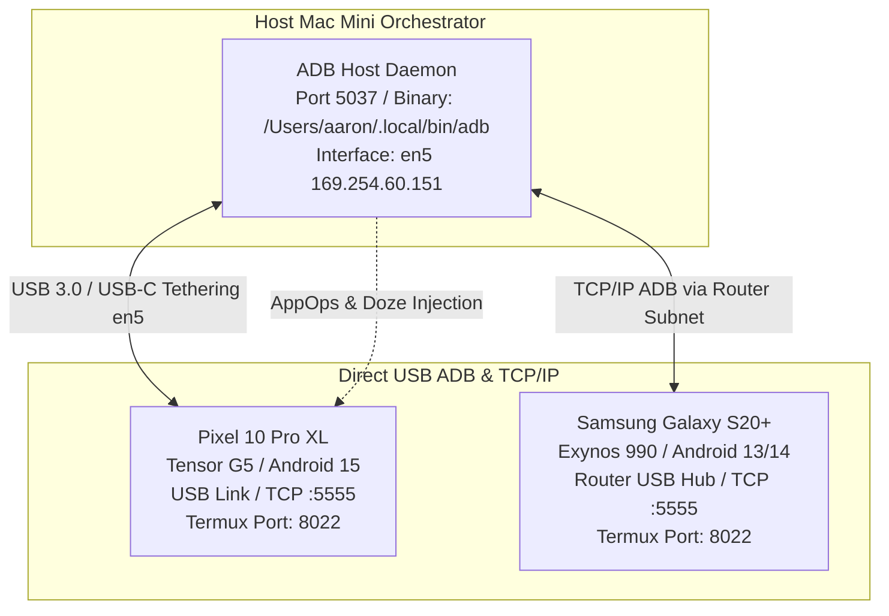

# 🤖 Mesh Transport: ADB (USB & Wireless TCP/IP) Bridge

## 1. Protocol Architecture & Technical Scope

The ADB (Android Debug Bridge) transport provides low-level hardware orchestration, radio control, automated keepalive injection, and Doze mode bypass for the Android nodes in the mesh (Google Pixel 10 Pro XL and Samsung Galaxy S20+).



### Technical Specifications:
- **OSI Layer:** Layer 2 (USB CDC-NCM / RNDIS / USB ADB Class `0xff/0x42/0x01`) & Layer 4/7 (TCP/IP Port 5037 Host / Port 5555 Device)
- **Host Binary:** `/Users/aaron/.local/bin/adb` (Android Debug Bridge version 1.0.41, build 37.0.1-15733141)
- **Port Bindings:**
  - Host Server Daemon: `127.0.0.1:5037`
  - Device Wireless Daemon: `0.0.0.0:5555`
- **Interface Naming:** `en5` (Ethernet Adapter / USB RNDIS on Host Mac Mini @ `169.254.60.151`)
- **Performance Characteristics:**
  - *Measured USB Latency:* `0.8 ms – 2.0 ms`
  - *Wireless ADB Latency:* `4 ms – 15 ms`
  - *USB Throughput:* `480 Mbps – 5 Gbps`
- **Role:** Out-of-band device control, waking sleeping screens, clearing app caches, restarting Termux daemons, capturing E2E visual audit screenshots, and executing kernel wake-lock commands.

---

## 2. Interface Configuration & Target Device Matrix

| Node Alias | Device Model | Connection Type | Interface / IP | Port | ADB Status / Target |
| :--- | :--- | :--- | :--- | :--- | :--- |
| **`pixel`** | Pixel 10 Pro XL | Direct USB-C / Wireless | `en5` (`169.254.60.151`) / `100.73.38.87` | `5555` | Primary Mobile TPU Shard |
| **`s20`** | Samsung Galaxy S20+ | Router USB / Wireless | `192.168.8.1` USB / `100.84.40.95` | `5555` | Automated OpenClaw Tester |

---

## 3. Real CLI Commands & Verification Tooling (Zero-Mock)

```bash
# 1. Check ADB binary version and running server daemon
adb version
adb devices -l

# 2. Connect to Android node over wireless TCP/IP
adb connect 100.73.38.87:5555 2>/dev/null || true
adb connect 100.84.40.95:5555 2>/dev/null || true

# 3. Disable Android 12+ Phantom Process Killer (critical for persistent Termux)
adb shell "settings put global settings_enable_monitor_phantom_procs false"

# 4. Whitelist Termux and Tailscale from Android Doze Mode battery optimization
adb shell "dumpsys deviceidle whitelist +com.termux +com.termux.boot +com.tailscale.ipn"

# 5. Grant background execution permissions to Termux
adb shell "cmd appops set com.termux RUN_IN_BACKGROUND allow"
adb shell "cmd appops set com.termux RUN_ANY_IN_BACKGROUND allow"

# 6. Remotely launch Termux and restart OpenSSH daemon
adb shell "am start -n com.termux/.app.TermuxActivity"
adb shell "input text 'sshd' && input keyevent 66"

# 7. Capture visual audit screenshot for E2E validation
adb shell "screencap -p /sdcard/screen_audit.png"
adb pull /sdcard/screen_audit.png /tmp/screen_audit.png
```

---

## 4. Self-Healing, Sleep Prevention & Failover Hierarchy

### Keepalive & Termux Watchdog:
- **Prevent CPU Sleep on Android:**
  ```bash
  adb shell "/data/data/com.termux/files/usr/bin/termux-wake-lock"
  ```
- **Screen & Display Keepalive:**
  ```bash
  # Keep display on while plugged into USB
  adb shell "svc power stayon true"
  ```
- **Failover Sequence:**
  ADB is the **Primary Recovery Protocol (Tier 4)** for reviving Termux or Tailscale when network interfaces enter sleep or unresponsive states.

---

## 5. Canonical Obsidian Logging Mandate

All ADB device connections, Doze whitelist mutations, and battery/thermal state snapshots MUST be recorded in the Obsidian Vault.

- **Target Vault:** `/Users/aaron/Lauburu-Monorepo-Local/Lauburu-Monorepo/obsidian_vault`
- **Canonical Note:** `05_Hardware_Mesh/Active_IP_Matrix.md`
- **Routing Log:** `05_Hardware_Mesh/Routing_Logs/YYYY-MM-DD.md`

### Logging Serialization Schema:
```markdown
### [YYYY-MM-DDTHH:MM:SSZ] Transport Event: `mesh-transport-adb`
- **Device Model:** Google Pixel 10 Pro XL
- **Connection Transport:** USB (`en5`) / TCP `5555`
- **Doze Whitelist:** Enforced (`com.termux`, `com.tailscale.ipn`)
- **Battery Status:** `PLUGGED_AC`, 36%, 28.2°C
- **Action:** OpenSSH Port 8022 validated.
```

---

## 6. Visual & Truth Audit Swarms Mandate (Local + Cloud AI)

Autonomous **Visual and Truth Audit Swarms** combining local AI inference engines (llama.cpp RPC distributed tensor sharding, Apple Silicon Metal GPU acceleration, Tensor G5 / Android NPU) and frontier cloud AI models are strictly mandated to continuously govern, audit, and self-heal all Android Debug Bridge (ADB) transports, USB tethering interfaces (`en5`), Termux keepalive states, and mobile device configuration artifacts.

### 6.1 Swarm Architecture & Verification Roles
- **Local AI Audit Swarm (Edge & LAN):**
  - Runs continuous low-latency empirical health audits against active ADB daemon sockets (Port 5037, TCP 5555), USB bus device bindings (`adb devices`), Doze whitelists (`dumpsys deviceidle whitelist`), and Termux wake locks.
  - Powered by local `llama.cpp` RPC sharding across Mac Mini M4 Pro (L1), MacBook Pro M1 Max (L2), and MacBook Air M2 (L5).
- **Cloud Frontier AI Swarm (Global Synthesis & Deep Audit):**
  - Performs multi-modal visual UI inspection on pulled screencaps (`/tmp/screen_audit.png`) to verify running Termux terminal daemons and on-screen execution state without human intervention.
  - Reconciles historical ADB lifecycle logs with active hardware realities to eliminate topological drift.

### 6.2 Canonical Obsidian Truth Enforcement & Legacy Rectification
- **Zero Hallucination / Zero Fake Data Mandate:**
  - Simulated, mock, or placeholder network metrics are strictly prohibited. Every documented IP, MAC, port, latency figure, and throughput measurement must reflect active empirical probing.
- **Rectification of Outdated Notes (Legacy 5-Layer -> Verified 7/8-Node Mesh):**
  - The swarms must actively scan the Obsidian Vault (e.g. `/Users/aaron/Lauburu-Monorepo-Local/Lauburu-Monorepo/obsidian_vault` and `/Users/aaron/DFS_UNIFIED`) and immediately correct legacy, deprecated 7-layer topology notes (such as outdated references in `7-Layer Hardware Topology.md`) to reflect the verified 7/8-node heterogeneous multi-transport mesh architecture:
    1. **L1:** Host Mac Mini M4 Pro (`100.119.199.76` / `192.168.8.230` - Port 22)
    2. **L2:** MacBook Pro M1 Max Vault (`100.103.212.21` / `192.168.8.127` / TB4 `169.254.187.138` - Port 22)
    3. **L3:** Linux Head Node Ryzen 7 (`100.101.39.98` / `192.168.8.224` - Port 22)
    4. **L4:** Bedside Linux Tablet (`100.91.85.70` / `192.168.8.173` - Port 22)
    5. **L5:** MacBook Air M2 (`100.93.158.96` / `192.168.8.222` - Port 22)
    6. **L6:** Pixel 10 Pro XL Tensor G5 (`100.73.38.87` / USB `169.254.60.151` - Port 8022)
    7. **L7:** Samsung Galaxy S20+ Exynos (`100.84.40.95` / Router USB - Port 8022)
    8. **GW:** GL.iNet BE3600 Gateway Router (`100.122.185.123` / `192.168.8.1` - Port 22)
- **Obsidian Canonical Repository Sync:**
  - Maintains `05_Hardware_Mesh/Active_IP_Matrix.md` and related notes as the absolute cutting-edge canonical source of truth for the entire Lauburu ecosystem.

### 6.3 Continuous Correction Triggers & Dataview Verification Schema
- **Correction Triggers:**
  1. *Interface State Change:* Detected link bounce, route failover, or socket drop triggers immediate local swarm re-audit.
  2. *Topology Inconsistency:* Detection of deprecated 7-layer topology schemas or unverified IP mappings triggers an automated cloud/local consensus rewrite.
  3. *Periodic Verification:* Swarm executes scheduled empirical test passes every 15 minutes.
- **Dataview Verification Tags & Metadata Standard:**
  All canonical mesh documentation and routing matrices MUST include the following metadata block:
  ```markdown
  ---
  truth_audited: true
  audit_swarm_verified: "YYYY-MM-DD"
  audit_swarm_engine: "local_llamacpp_rpc+cloud_frontier"
  mesh_topology_version: "8-node-verified"
  canonical_source: true
  ---
  ```
