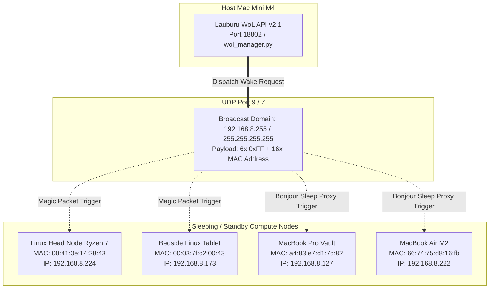

# ⚡ Mesh Transport: Wake-on-LAN (WoL) Fleet Resurrection Engine

## 1. Protocol Architecture & Technical Scope

Wake-on-LAN (WoL) provides automated out-of-band power management and remote resurrection for powered-off or sleeping compute nodes (e.g. Linux Head Node AMD Ryzen 7 and Bedside Linux Tablet). When an agent detects that a compute node is unreachable over L3/L2 channels, it dispatches an RFC 792 Magic Packet sequence to wake the target hardware without manual intervention.



### Technical Specifications:
- **OSI Layer:** Layer 2 (Data Link / Raw Ethernet Frame) & Layer 4 (UDP Broadcast)
- **Standard Protocol:** AMD Magic Packet Standard (RFC 792 / Wake-on-LAN specification: Ethernet frame payload consisting of 6 synchronization bytes `0xFF 0xFF 0xFF 0xFF 0xFF 0xFF` followed by 16 contiguous repetitions of the target device's 48-bit MAC address)
- **Network Ports:** UDP Port `9` (standard discard port) and UDP Port `7` (echo port)
- **Local API Gateway:** Port `18802` (`http://localhost:18802/api/wol/status`, `wol_manager.py`)
- **Broadcast Addresses:** `192.168.8.255` (Subnet Broadcast) and `255.255.255.255` (Global Broadcast)
- **Execution Latency:** Sub-second dispatch (`< 50 ms`), target hardware boot time `8s – 35s`
- **Role:** Autonomous resurrection of heavy compute nodes, saving idle power while guaranteeing on-demand AI inference availability.

---

## 2. Interface Configuration & Registered Hardware MAC Matrix

| Node Alias | Device Model | OS / Firmware | Registered MAC Address | Subnet IP | WoL Support / Method |
| :--- | :--- | :--- | :--- | :--- | :--- |
| **`linux_head_node`** | AMD Ryzen 7 5700U | Ubuntu Linux | `00:41:0e:14:28:43` | `192.168.8.224` | PCIe NIC Magic Packet |
| **`desktop_q4si00p`** | Linux Tablet | Debian Touch | `00:03:7f:c2:00:43` | `192.168.8.173` | PCIe NIC Magic Packet |
| **`mbp_vault`** | MacBook Pro M1 Max | macOS Darwin | `a4:83:e7:d1:7c:82` | `192.168.8.127` | `womp 1` / Bonjour Sleep Proxy |
| **`macbook_air`** | MacBook Air M2 | macOS Darwin | `66:74:75:d8:16:fb` | `192.168.8.222` | `womp 1` / Bonjour Sleep Proxy |
| **`mac_mini_host`** | Mac Mini M4 Pro | macOS Darwin | `1c:f6:4c:7d:d7:0a` | `192.168.8.230` | `womp 1` / Controller Host |
| **`router_gw`** | GL.iNet MT3600BE | OpenWrt | `94:83:c4:d3:4a:10` | `192.168.8.1` | Embedded Always-On |

---

## 3. Real CLI Commands & Verification Tooling (Zero-Mock)

```bash
# 1. Query status of local Wake-on-LAN cluster API (Port 18802)
curl -s http://localhost:18802/api/wol/status

# 2. Wake Linux Head Node via Python wol_manager CLI
python3 /Users/aaron/DFS_UNIFIED/Lauburu-Monorepo/06_scripts_and_tooling/mesh/wol_manager.py --wake linux_head_node

# 3. Wake Bedside Linux Tablet via Python wol_manager CLI
python3 /Users/aaron/DFS_UNIFIED/Lauburu-Monorepo/06_scripts_and_tooling/mesh/wol_manager.py --wake desktop_q4si00p

# 4. Dispatch raw Magic Packet over network interfaces via Python socket
python3 -c '
import socket, struct
mac = "00:41:0e:14:28:43".replace(":", "")
data = bytes.fromhex("FF" * 6 + mac * 16)
with socket.socket(socket.AF_INET, socket.SOCK_DGRAM) as s:
    s.setsockopt(socket.SOL_SOCKET, socket.SO_BROADCAST, 1)
    s.sendto(data, ("192.168.8.255", 9))
    s.sendto(data, ("255.255.255.255", 9))
print("Magic packet sent to 00:41:0e:14:28:43")
'

# 5. Verify host Wake-on-Magic-Packet (womp) power assertion
pmset -g | grep womp
```

---

## 4. Self-Healing, Sleep Prevention & Failover Hierarchy

### Power Management & Verification Directives:
- **macOS WOMP Enforcement:**
  Ensure target Mac nodes have `womp 1` (Wake On Magic Packet) enabled:
  ```bash
  sudo pmset -a womp 1
  ```
- **Linux NIC Wake Configuration (ethtool):**
  Ensure NIC hardware registers `g` (MagicPacket) support:
  ```bash
  sudo ethtool -s eth0 wol g
  ```
- **Failover Sequence:**
  WoL is the **Autonomous Tier 5 Out-of-Band Resurrection Mechanism** triggered when an offline compute node is scheduled for distributed batch training or high-capacity model sharding.

---

## 5. Canonical Obsidian Logging Mandate

All Wake-on-LAN dispatch events, target boot confirmations, and cluster state changes MUST be recorded in the Obsidian Vault.

- **Target Vault:** `/Users/aaron/DFS_UNIFIED` & `/Users/aaron/Lauburu-Monorepo-Local/Lauburu-Monorepo/obsidian_vault`
- **Canonical Dashboard:** `00_SYSTEM_DASHBOARDS/WAKE_ON_LAN_CLUSTER.md`
- **Active IP Matrix:** `05_Hardware_Mesh/Active_IP_Matrix.md`
- **Routing Log:** `05_Hardware_Mesh/Routing_Logs/YYYY-MM-DD.md`

### Logging Serialization Schema:
```markdown
### [YYYY-MM-DDTHH:MM:SSZ] WoL Resurrection Event: `mesh-transport-wake-on-lan`
- **Target Node:** `linux_head_node` (`00:41:0e:14:28:43`)
- **Dispatch Channel:** UDP Broadcast `192.168.8.255:9` via Port 18802 API
- **Boot Handshake:** SSH Port 22 reachable after 18.2 seconds.
- **Status:** Node successfully resurrected into active mesh.
```

---

## 6. Visual & Truth Audit Swarms Mandate (Local + Cloud AI)

Autonomous **Visual and Truth Audit Swarms** combining local AI inference engines (llama.cpp RPC distributed tensor sharding, Apple Silicon Metal GPU acceleration, Tensor G5 / Android NPU) and frontier cloud AI models are strictly mandated to continuously govern, audit, and self-heal all Wake-on-LAN dispatch pipelines (Port 18802 API, UDP 7/9 Magic Packets), hardware MAC tables, and node resurrection telemetry artifacts.

### 6.1 Swarm Architecture & Verification Roles
- **Local AI Audit Swarm (Edge & LAN):**
  - Runs continuous low-latency empirical health audits against the WoL REST API service (Port 18802 on localhost), hardware NIC power assertion states (`womp 1` / `ethtool wol g`), and post-wake SSH boot handshakes.
  - Powered by local `llama.cpp` RPC sharding across Mac Mini M4 Pro (L1), MacBook Pro M1 Max (L2), and MacBook Air M2 (L5).
- **Cloud Frontier AI Swarm (Global Synthesis & Deep Audit):**
  - Cross-verifies distributed workload scheduling requirements, cold node power cycling policies, and cluster energy efficiency.
  - Reconciles historical WoL resurrection logs with active hardware realities to eliminate topological drift.

### 6.2 Canonical Obsidian Truth Enforcement & Legacy Rectification
- **Zero Hallucination / Zero Fake Data Mandate:**
  - Simulated, mock, or placeholder network metrics are strictly prohibited. Every documented IP, MAC, port, latency figure, and throughput measurement must reflect active empirical probing.
- **Rectification of Outdated Notes (Legacy 5-Layer -> Verified 7/8-Node Mesh):**
  - The swarms must actively scan the Obsidian Vault (e.g. `/Users/aaron/Lauburu-Monorepo-Local/Lauburu-Monorepo/obsidian_vault` and `/Users/aaron/DFS_UNIFIED`) and immediately correct legacy, deprecated 5-layer topology notes (such as outdated references in `5_Layer_Hardware_Topology.md`) to reflect the verified 7/8-node heterogeneous multi-transport mesh architecture:
    1. **L1:** Host Mac Mini M4 Pro (`100.119.199.76` / `192.168.8.230` - Port 22)
    2. **L2:** MacBook Pro M1 Max Vault (`100.103.212.21` / `192.168.8.127` / TB4 `169.254.187.138` - Port 22)
    3. **L3:** Linux Head Node Ryzen 7 (`100.101.39.98` / `192.168.8.224` - Port 22)
    4. **L4:** Bedside Linux Tablet (`100.91.85.70` / `192.168.8.173` - Port 22)
    5. **L5:** MacBook Air M2 (`100.93.158.96` / `192.168.8.222` - Port 22)
    6. **L6:** Pixel 10 Pro XL Tensor G5 (`100.73.38.87` / USB `169.254.60.151` - Port 8022)
    7. **L7:** Samsung Galaxy S20+ Exynos (`100.84.40.95` / Router USB - Port 8022)
    8. **GW:** GL.iNet BE3600 Gateway Router (`100.122.185.123` / `192.168.8.1` - Port 22)
- **Obsidian Canonical Repository Sync:**
  - Maintains `05_Hardware_Mesh/Active_IP_Matrix.md` and related notes as the absolute cutting-edge canonical source of truth for the entire Lauburu ecosystem.

### 6.3 Continuous Correction Triggers & Dataview Verification Schema
- **Correction Triggers:**
  1. *Interface State Change:* Detected link bounce, route failover, or socket drop triggers immediate local swarm re-audit.
  2. *Topology Inconsistency:* Detection of deprecated 5-layer topology schemas or unverified IP mappings triggers an automated cloud/local consensus rewrite.
  3. *Periodic Verification:* Swarm executes scheduled empirical test passes every 15 minutes.
- **Dataview Verification Tags & Metadata Standard:**
  All canonical mesh documentation and routing matrices MUST include the following metadata block:
  ```markdown
  ---
  truth_audited: true
  audit_swarm_verified: "YYYY-MM-DD"
  audit_swarm_engine: "local_llamacpp_rpc+cloud_frontier"
  mesh_topology_version: "8-node-verified"
  canonical_source: true
  ---
  ```
