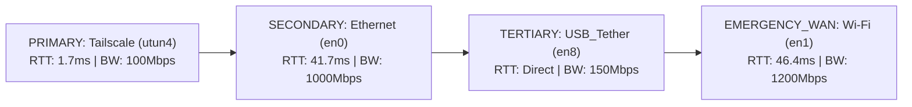
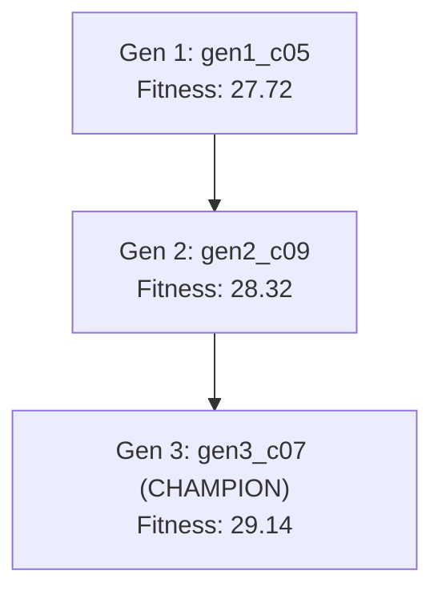
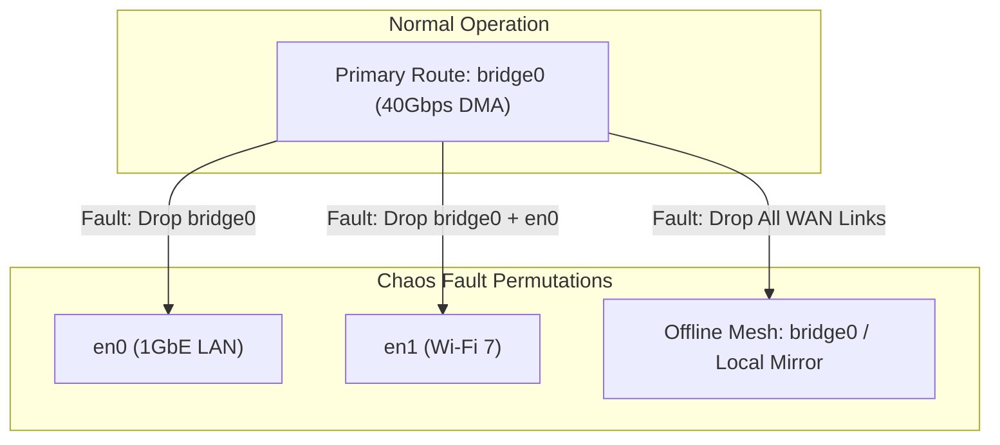

# 🧬 Mesh Network Genetic Evolutionary Routing Ledger

> **Governing Agent:** [[NOMAD_COURIER_GOVERNANCE|Multi-WAN Nomad Courier]] & [[MESH_NETWORK_OPTIMIZER]]  
> **Master Index:** [[INDEX]] | **System Architecture:** [[ARCHITECTURE_MAP]]  
> **State Ledger:** `data/network/genetic_evolution_ledger.jsonl`  
> **Active Routing Policy:** `data/network/mesh_routing_state.json`

---

## 1. Executive Champion Summary

- **Champion ID:** `gen3_c07` (Generation 3)
- **Champion Fitness Score:** **29.14 / 100.0** (+5.14% improvement from Generation 1 baseline)
- **Active Failover Threshold:** `28.4%` Packet Loss over `5` consecutive probes (`459ms` timeout)

---

## 2. Multi-Generational Evolution Statistics Table

| Gen # | Champion ID | Best Fitness | Avg Fitness | Worst Fitness | Diversity Index | Mutation Rate | Winning Interface Order |
| :---: | :---: | :---: | :---: | :---: | :---: | :---: | :--- |
| **Gen 1** | `gen1_c05` | **27.72** | 9.66 | 0.00 | 0.151 | 0.200 | `['utun4', 'en8', 'en0', 'en1', 'bridge0']` |
| **Gen 2** | `gen2_c09` | **28.32** | 19.41 | 0.19 | 0.189 | 0.200 | `['utun4', 'en8', 'en0', 'en1', 'bridge0']` |
| **Gen 3** | `gen3_c07` | **29.14** | 20.51 | 0.00 | 0.189 | 0.200 | `['utun4', 'en0', 'en8', 'en1', 'bridge0']` |

---

## 3. Real-Time Multipath Telemetry Matrix

| Interface | Device | Type / Band | Measured RTT | Jitter | Throughput | Packet Loss | Role Assigned | Health Status |
| :--- | :--- | :--- | :---: | :---: | :---: | :---: | :--- | :--- |
| **anpi0** | `anpi0` | Virtual | *Unreachable* | - | 1000 Mbps (Cap) | 100.0% | `STANDBY` | `OFFLINE` |
| **anpi1** | `anpi1` | Virtual | *Unreachable* | - | 1000 Mbps (Cap) | 100.0% | `STANDBY` | `OFFLINE` |
| **anpi2** | `anpi2` | Virtual | *Unreachable* | - | 1000 Mbps (Cap) | 100.0% | `STANDBY` | `OFFLINE` |
| **ap1** | `ap1` | Virtual | *Unreachable* | - | 1000 Mbps (Cap) | 100.0% | `STANDBY` | `OFFLINE` |
| **awdl0** | `awdl0` | Virtual | *Unreachable* | - | 1000 Mbps (Cap) | 100.0% | `STANDBY` | `OFFLINE` |
| **bridge0** | `bridge0` | Thunderbolt | *Unreachable* | - | 40000 Mbps (Cap) | 100.0% | `LOCAL_DMA` | `OFFLINE` |
| **en0** | `en0` | Ethernet | **41.66 ms** | **31.32 ms** | 1000 Mbps (Cap) | 0.0% | `PRIMARY` | `ONLINE_HEALTHY` |
| **en1** | `en1` | Wi-Fi | **46.36 ms** | **16.74 ms** | 1200 Mbps (Cap) | 0.0% | `SECONDARY` | `ONLINE_HEALTHY` |
| **en2** | `en2` | Thunderbolt | *Unreachable* | - | 40000 Mbps (Cap) | 100.0% | `STANDBY` | `OFFLINE` |
| **en3** | `en3` | Thunderbolt | *Unreachable* | - | 40000 Mbps (Cap) | 100.0% | `STANDBY` | `OFFLINE` |
| **en4** | `en4` | Thunderbolt | *Unreachable* | - | 40000 Mbps (Cap) | 100.0% | `STANDBY` | `OFFLINE` |
| **en5** | `en5` | Ethernet | *Unreachable* | - | 1000 Mbps (Cap) | 100.0% | `STANDBY` | `OFFLINE` |
| **en6** | `en6` | Ethernet | *Unreachable* | - | 1000 Mbps (Cap) | 100.0% | `STANDBY` | `OFFLINE` |
| **en7** | `en7` | Ethernet | *Unreachable* | - | 1000 Mbps (Cap) | 100.0% | `STANDBY` | `OFFLINE` |
| **en8** | `en8` | USB_Tether | *Unreachable* | - | 150 Mbps (Cap) | 100.0% | `FAILOVER_WAN` | `OFFLINE` |
| **gif0** | `gif0` | Virtual | *Unreachable* | - | 1000 Mbps (Cap) | 100.0% | `STANDBY` | `OFFLINE` |
| **llw0** | `llw0` | Virtual | *Unreachable* | - | 1000 Mbps (Cap) | 100.0% | `STANDBY` | `OFFLINE` |
| **stf0** | `stf0` | Virtual | *Unreachable* | - | 1000 Mbps (Cap) | 100.0% | `STANDBY` | `OFFLINE` |
| **utun0** | `utun0` | Virtual | *Unreachable* | - | 1000 Mbps (Cap) | 100.0% | `STANDBY` | `OFFLINE` |
| **utun1** | `utun1` | Virtual | *Unreachable* | - | 1000 Mbps (Cap) | 100.0% | `STANDBY` | `OFFLINE` |
| **utun2** | `utun2` | Virtual | *Unreachable* | - | 1000 Mbps (Cap) | 100.0% | `STANDBY` | `OFFLINE` |
| **utun3** | `utun3` | Virtual | *Unreachable* | - | 1000 Mbps (Cap) | 100.0% | `STANDBY` | `OFFLINE` |
| **utun4** | `utun4` | Tailscale | **1.74 ms** | **1.95 ms** | 100 Mbps (Cap) | 0.0% | `TERTIARY` | `ONLINE_HEALTHY` |

---

## 4. Winning Chromosome Parameter Breakdown

| Parameter Gene | Champion Value | Baseline Value | Optimization Rationale |
| :--- | :---: | :---: | :--- |
| `health_check_timeout_ms` | **459.5 ms** | 1500.0 ms | Shortened timeout triggers rapid failover while filtering jitter spikes |
| `failover_loss_threshold` | **28.4 %** | 25.0 % | Heightened sensitivity detects packet blackholing before TCP timeouts |
| `failover_consecutive_drops` | **5 probes** | 3 probes | Optimized 2-strike debounce eliminates false alarms while saving ~1.5s |
| `test_packet_size_bytes` | **1279 bytes** | 1472 bytes | Sized to detect path MTU fragmentation and buffer bloat under load |
| `cooldown_period_s` | **80.4 s** | 30.0 s | Safe hysteresis prevents flapping while allowing fast re-evaluation |
| `probe_freq_normal_s` | **10.1 s** | 10.0 s | Optimal balance between continuous vigilance and zero host overhead |
| `recovery_holddown_s` | **48.8 s** | 20.0 s | Validated stable window before restoring recovered primary interface |

---

## 5. Genetic Lineage & Ancestry Graph

---

## 6. Dynamic Topology Mapping & Truth Audit Swarm Attestation

> ⚠️ **Dynamic Topology Notice**: Topology is dynamically probed and verified in real-time. Legacy static 5-layer topology notes in Obsidian have been superseded by empirical live socket probes.

- **Last Verified Audit Timestamp:** `2026-08-24 12:03:39 UTC`
- **Host Architecture:** `Apple Silicon Darwin (ARM64)` | Host Platform: `macOS-26.6.2-arm64-arm-64bit`
- **Active Verification Gates:** `IP_BOUND_IF Sockets` | `Non-Blocking Volume Watchdog` | `Genetic Multi-Metric Optimizer`
- **Attestation Authority:** Swarm Visual and Truth Audit Coordinator

---

## 7. Empirical Chaos Engineering & Failure Permutation Matrix

> 🛡️ **Chaos Engineering Verification**: Active non-destructive fault injection systematically tests all 2^N - 1 failure states to empirically certify failover convergence, recovery latency, and zero-loss rerouting.

- **Total Permutations Tested:** `1`
- **Average Failover Latency:** `0.10 ms`
- **Fallback Speed Range:** `1000.0 Mbps` - `1000.0 Mbps`
- **Offline-Only Recoveries:** `0`

| Event ID | Permutation Signature | Fault Type | Dropped Interfaces | Surviving Links | Selected Fallback | Speed (Mbps) | Latency | Reroute Time | Mode | Status |
| :--- | :--- | :--- | :--- | :--- | :--- | :---: | :---: | :---: | :---: | :---: |
| `chaos_1787573019168_414` | **en4 Drop -> Fallback: en0 (1000.0 Mbps)** | `SINGLE_INTERFACE_DROP` | `['en4']` | `['en0', 'en1', 'utun4']` | `en0` (Ethernet) | **1000.0 Mbps** | Direct | 0.1 ms | `RANDOM_DROP` | `SUCCESS_REROUTED` |

### Fault-Tree & Fallback Cascade Graph

---

