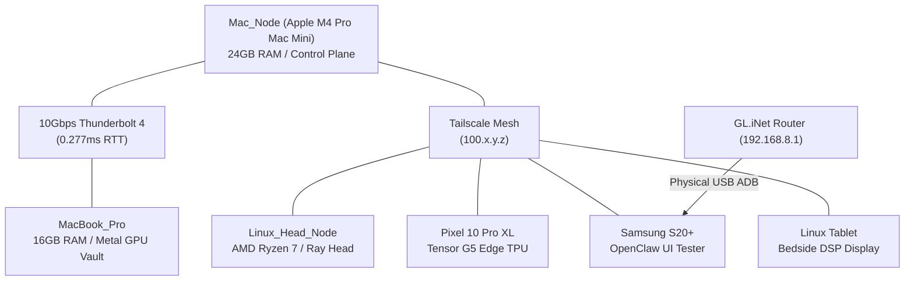

# 🌐 Nomad Autonomous Mesh & Infrastructure Dashboard

> **Governing Agent:** [[NOMAD_COURIER_GOVERNANCE|Multi-WAN Nomad Courier v3.0]]  
> **Master Index:** [[INDEX]] | **Architecture Map:** [[ARCHITECTURE_MAP]]  
> **Telemetry Source:** `data/network/nomad_self_healer_status.json`

---

## 1. Live Health Matrix

| Subsystem / Service | Target Endpoint | Health Status | Watchdog Policy |
| :--- | :--- | :--- | :--- |
| **Port 3000 Web UI** | `http://localhost:3000` | `HEALTHY_200_OK` | Auto-kill stale 404, restart `http.server` |
| **Wake-on-LAN REST API** | `http://127.0.0.1:18802` | `ONLINE` | Spawns `wol_manager.py --serve-api` |
| **llama.cpp Metal GPU RPC** | `127.0.0.1:50052` | `PINNED_ACTIVE` | Sharded across M4 Pro & Linux Head |
| **Antigravity Skills Guardian** | `~/.gemini/config/skills` | `SKILLS_PERSISTENT_AND_HEALTHY` | 39 custom skills immunized against mount drops |
| **MCP Server Health** | `settings.json` / `mcp_config.json` | `MCP_CONFIGS_CLEAN` | Validates stdio transports & Obsidian paths |
| **Genetic Storage Optimizer** | `scripts/nomad_genetic_storage.py` | `ACTIVE_OPTIMIZING` | Maintains >10 GB NVMe cache headroom |
| **macOS Dark Shield** | System Appearance | `ENFORCED_DARK` | Blocks bright flashes during development |

---

## 2. Infrastructure Topology

---

## 3. Autonomous Healing Logs & Action Stream
All actions are serialized to `data/lora_datasets/nomad_autonomous_actions.jsonl` for continuous LoRA model distillation.

- **Last Full Self-Healing Cycle:** `ACTIVE_AND_HEALED`
- **Connected Skills Documentation:** [[SKILLS_AND_MCP_ARCHITECTURE]]
- **Tri-Orchestrator Governance:** [[TRI_ORCHESTRATOR_DEBATE_CONSENSUS]]
- **Hardware Hardware Specifications:** [[7_DEVICE_MESH_AND_VRAM_POOL]]
