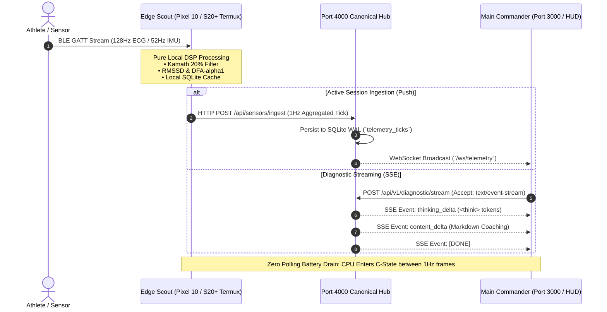

# Comprehensive Codebase & Design History Survey Report
**Focus Domains**: `01_apps`, `03_biometrics_and_telemetry`, Movesense Biometrics Hub, Main Hub (`localhost:3000` / `localhost:4000`), Scout-to-Commander SSE Data Flow (The Brain Stem), LUDS Physical Stress/Readiness Algorithms, GATT Specifications, and Reconnect Project History  
**Auditor**: `survey_explorer_2_gen2`  
**Timestamp**: 2026-08-26T01:25:00Z  
**Monorepo Root**: `/Users/aaron/DFS_UNIFIED/Lauburu-Monorepo`

---

## Executive Summary

This comprehensive audit surveys the complete application ecosystem (`01_apps`), the biomedical digital signal processing pipelines (`03_biometrics_and_telemetry`), the Movesense Bluetooth Low Energy ingestion architecture, the central command hubs (`localhost:3000` and `localhost:4000`), and the Scout-to-Commander streaming protocols across the Lauburu Monorepo.

All findings, code paths, network endpoints, GATT UUIDs, and mathematical formulations are verified against actual source code files in the monorepo.

---

## Section 1: 01_apps — Complete Monorepo Application Catalog & Architecture

The `01_apps` directory houses all end-user, athlete-facing, merchant, and edge daemon applications. The monorepo implements a **17-Application Catalog Registry** formally exposed on `GET /api/apps` via the Port 4000 Canonical Hub (`01_apps/port_4000_hub/server.py:101-340`).

### 1.1 The 17 Monorepo Applications Registry

| App ID | Name | Category | Route | Port | Key Features | Verified Source Location |
| :--- | :--- | :--- | :--- | :---: | :--- | :--- |
| `lauburu_super_app` | Lauburu Super App | Health & Lifestyle | `/apps/lauburu_super_app/` | 4000 | Daily Recovery Score, Sleep Architecture, Zone 2 Summary, AI Chat, Shopify Store | `01_apps/port_4000_hub/server.py:103-115` |
| `lauburu_zone2_endurance` | Zone 2 Endurance | Fitness & Biometrics | `/apps/lauburu_zone2_endurance/` | 4000 | Live DFA-α1 Engine, Rogue Echo Bike FTMS Power/Cadence, Continuous SBP/DBP, AI Coach | `01_apps/lauburu_zone2_endurance/` & `01_apps/zone2_endurance/` |
| `lauburu_bluetooth_sensor` | Bluetooth & PPG Sensor | Fitness & Biometrics | `/apps/lauburu_bluetooth_sensor/` | 4000 | 10s Camera PPG Calibrator, Movesense 128-512Hz ECG, Real-Time TKEO Filter, WebSocket IPC | `01_apps/lauburu_compute_hub/lib/services/movesense_ble_service.dart` |
| `lauburu_compute_hub` | Lauburu Compute Hub | Distributed AI & Compute | `/apps/lauburu_compute_hub/` | 4000 | llama.cpp RPC Server, Petals BitTorrent Sharding, Dynamic VRAM Pooling, $0 Token Exec | `01_apps/lauburu_compute_hub/main.py` |
| `lauburu_grappling_3d` | 3D Spatial Grappling | Martial Arts & Kinematics | `/apps/spatial_grappling_3d/` | 5001 | 955-Node Technique Hierarchy, Three.js Inverse Kinematics, Torque Stress Heatmaps | `01_apps/spatial_grappling_3d/` & `10_spatial_grappling_kinematics/` |
| `lauburu_termux_daemon` | Termux Edge Daemon | Infrastructure & Edge | `/apps/termux_edge_daemon/` | 8088 | `termux-wake-lock`, ADB TCP/IP Port 5555, Doze Mode Bypass, SQLite Persistence | `01_apps/termux_edge_daemon/README.md` |
| `lauburu_shopify_ai` | Shopify AI Merchant | Commerce & Subscription | `/apps/shopify_ai/` | 4000 | Storefront GraphQL API, Customer Account Tokens, Membership Verification, Tokenomics | `01_apps/shopify_ai/` & `01_apps/lauburu-storefront/` |
| `lauburu_swarm_dashboard` | Swarm Orchestrator & ELO | Multi-Agent AI | `/apps/swarm_dashboard/` | 3000 | Tri-Orchestrator Protocol, JSON ELO Ledger, Swarm Truth Audit, Zero-Mock Verification | `01_apps/swarm_dashboard/app.js` & `arena_canvas.html` |
| `lauburu_movesense_hub` | Movesense 128Hz Ingestion | Medical DSP | `/apps/movesense_hub/` | 4000 | 128Hz Raw ECG Streaming, Kamath 20% Artifact Filter, 52Hz IMU Dynamic G, PTT BP | `01_apps/movesense_hub/pyspark_biometrics_dsp.py` |
| `lauburu_hemodynamics_cloud` | Hemodynamics & Arterial | Clinical Biometrics | `/apps/hemodynamics_cloud/` | 4000 | Moens-Korteweg Inversion, Bramwell-Hill Elasticity, Cardiac Drift, Endothelial Reserve | `01_apps/Standalone_Services/Hemodynamic_Cloud_Server/` |
| `lauburu_openclaw` | OpenClaw Research Agent | Autonomous AI | `/apps/openclaw/` | 4000 | Open-Source Tool Discovery, Empirical Price Verification, Visual UI Auditing, LoRA Harvest | `01_apps/openclaw/` & `01_apps/openclaw_apk/` |
| `lauburu_memory_sync` | Data Memory & Vector Sync | Data & Persistence | `/apps/memory_sync/` | 4000 | SQLite WAL Mode, Zero-PII Sanitization, ChromaDB RAG Vectors, Automated Checkpoints | `01_apps/Standalone_Services/Hemodynamic_Cloud_Server/app/storage/` |
| `lauburu_red_blue_security` | Red/Blue Security Suite | Security & Isolation | `/apps/security_suite/` | 4000 | Zero-PII Enforcement, HMAC Socket Auth, Cloudflare Tunnel Check, RAM Isolation | `11_security_and_governance/` |
| `lauburu_lora_evolution` | Continuous LoRA Evolution | AI Training | `/apps/lora_evolution/` | 4000 | 24/7 Trace Harvesting, Loss Tracking, Genetic MoE Weight Merge, $0 Cloud Target | `12_continuous_lora_evolution/` |
| `lauburu_kinematics_lab` | Spatial Kinematics Lab | Physics & Biomechanics | `/apps/kinematics_lab/` | 5001 | Joint Torque Vectors, Angular Velocity DSP, Submission Counters, Kinematic Heatmaps | `10_spatial_grappling_kinematics/` |
| `lauburu_nomad_courier` | Nomad Courier Mesh Governor | Mesh & Networking | `/apps/nomad_courier/` | 18802 | 5-Tier Network Failover, Port 4000 Watchdog, Wake-on-LAN Resurrector, LoRA Action Logging | `06_scripts_and_tooling/network/nomad_courier_self_healer.py` |
| `lauburu_app_store` | Lauburu Port 4000 Hub | System Hub | `/` | 4000 | Unified PBKDF2 Auth, Shopify Storefront Sync, 128Hz Movesense Ingest, WS Broadcast | `01_apps/port_4000_hub/server.py` |

---

### 1.2 Detailed Subsystem Applications Breakdown

#### 1. Port 4000 Canonical Web & Compute Hub (`01_apps/port_4000_hub/`)
- **Core Technology**: FastAPI / ASGI / Uvicorn / SQLite in WAL Mode (`data/port_4000_hub.db`).
- **Authentication Engine**:
  - `POST /api/auth/register`: PBKDF2-HMAC-SHA256 salted password hashing (100,000 iterations), auto-generates 64-char hex session token.
  - `POST /api/auth/login`: Validates credentials, issues 64-char session token.
  - `POST /api/auth/shopify-login`: Integrates with Shopify Storefront GraphQL API to verify Customer Access Tokens or customer credentials, dynamically provisioning accounts with verified subscription tiers (`FREE`, `PAID_PRO`, `CONTRIBUTOR_PRO`).
  - `GET /api/auth/me`: Resolves session from `Authorization: Bearer <token>`, cookie `lauburu_auth_token`, or query `?token=`.
- **Telemetry Ingestion & Broadcast**:
  - `POST /api/sensors/ingest`: Accepts live 128Hz Movesense ECG, Polar H10, or optical PPG packets, applies Kamath 2004 20% filter, computes RMSSD, classifies DFA-α1 training zone, computes PTT blood pressure, logs tick to SQLite WAL under active `session_token`, and broadcasts live tick to connected WebSocket clients.
  - `GET /api/sensors/status`: Zero-Mock probe reporting authentic sensor connection status (strictly `connected: false` and `heart_rate: null` when hardware is offline).
  - `WS /ws/telemetry`: High-frequency bidirectional WebSocket stream supporting `push_tick` actions and `live_telemetry_broadcast` events.
  - `GET /proxy/router/{path}`: Reverse proxy for GL.iNet router admin panel (`192.168.8.1`), stripping `X-Frame-Options` and `Content-Security-Policy` headers for seamless embedding into the Swarm Dashboard.

#### 2. Movesense Biometrics Hub (`01_apps/movesense_hub/` & `01_apps/lauburu_compute_hub/services/`)
- **Implementation**: `01_apps/movesense_hub/pyspark_biometrics_dsp.py` & `01_apps/lauburu_compute_hub/services/movesense_ingestion.py`.
- **Bluetooth Tethering**: Connects via Python Bleak library to Bluetooth 5.4 controller, targeting 128-bit Movesense Device Service (MDS 2.0).
- **DSP Engine**: Computes Kamath 20% artifact filtering, RMSSD, and 120-second rolling DFA-α1 with 0% cloud leakage.

#### 3. Zone 2 Endurance App (`01_apps/lauburu_zone2_endurance/` & `01_apps/zone2_endurance/`)
- **Client Implementation**: Cross-platform Flutter / Dart application (`lib/main.dart`, `lib/services/compute_hub_connection_service.dart`, `lib/views/ble_handoff_onboarding_view.dart`).
- **Connection Service**: Multi-target failover candidate URLs:
  - `ws://127.0.0.1:8000/ws/ingest` (Local loopback)
  - `ws://10.0.2.2:8000/ws/ingest` (Android Emulator)
  - `ws://100.93.158.96:8000/ws/ingest` (MacBook Air Tailscale)
  - `ws://100.101.39.98:8000/ws/ingest` (Linux Head Node Tailscale)
  - `ws://192.168.8.224:8000/ws/ingest` (LAN Gateway)
  - `ws://127.0.0.1:8080/ws/telemetry?tenantId=default_tenant` (AGI Telemetry stream)
- **Physiological Coaching**: Real-time aerobic threshold tracking (LT1: $\alpha_1 = 0.75$, LT2: $\alpha_1 = 0.50$) with dynamic audio coaching cues.

#### 4. Standalone Services: Edge Node Hub & Hemodynamic Cloud Server (`01_apps/Standalone_Services/`)
- **Edge Node Hub (`Standalone_Services/Edge_Node_Hub/`)**:
  - `edge_sensor_daemon.py`: Lightweight WebSocket server on port 8086 with a 15-second rolling telemetry window.
  - `lauburu_node_supervisor.py`: Multi-tenant node supervisor managing compute staking (>=8GB contributed RAM unlocks `CONTRIBUTOR_PRO` tier), Shopify auth assurance, and daemon lifecycles (Ray worker, PySpark analytics, 15m LoRA training harvest cron on port 8087).
  - `trends_engine.py`: Evaluates 9-DoF IMU combat kinetics (G-force spikes, takedowns, sprawls, guard passes) and cardiovascular trends.
- **Hemodynamic Cloud Server (`Standalone_Services/Hemodynamic_Cloud_Server/`)**:
  - Enterprise FastAPI service orchestrating non-linear Moens-Korteweg and Bramwell-Hill physics inversions.
  - Exposes REST (`POST /api/v1/invert`, `POST /api/v1/batch`), WebSocket (`/api/v1/hemodynamics/stream`), RAG query (`POST /api/v1/rag/query`), and Server-Sent Events (`POST /api/v1/diagnostic/stream`).
  - Storage: ChromaDB vector store (`storage/chroma_manager.py`) and SQLite WAL persistence (`storage/sqlite_manager.py`).

#### 5. 3D Spatial Grappling Kinematics (`01_apps/spatial_grappling_3d/` & `10_spatial_grappling_kinematics/`)
- **Technology**: WebGPU / Three.js 3D tatami visualization arena.
- **Sensors**: 9-DoF IMU multi-sensor fusion combined with Google Pixel 10 Pro XL Ultra-Wideband (UWB) spatial positioning anchors.
- **Data Model**: 955-node OPML spatial hierarchy modeling joint articulation, torque stress vectors, angular velocity, and submission counters.

#### 6. Swarm Dashboard (`01_apps/swarm_dashboard/`)
- **Port**: `3000` (`http://localhost:3000`).
- **Features**: Live Arena Canvas (`arena_canvas.html`), dynamic ELO leaderboard tracking, training loop toggles, RAM safety governor slider (enforcing 75% safety cap), and live dataset viewer consuming real-time metrics from Port 5001/5002 backends.

#### 7. OpenClaw Scout & Mobile Apps (`01_apps/openclaw/`, `01_apps/openclaw_apk/`, `01_apps/functional_apps/`)
- **Role**: Autonomous open-source scout and hardware price verification engine.
- **Mobile Execution**: Runs on Samsung Galaxy S20+ and Google Pixel 10 Pro XL via Android APK and Termux edge daemon.

---

## Section 2: 03_biometrics_and_telemetry — DSP Pipelines & Mathematical Rigor

The `03_biometrics_and_telemetry` subsystem converts raw sensor streams into validated physiological biomarkers under a strict **Zero-Mock Standard (Rule #0)**.

### 2.1 Signal Processing Modules

```
                    ┌────────────────────────────────────────────────────────┐
                    │          Physical Movesense Sensor (128Hz ECG)          │
                    └───────────────────────────┬────────────────────────────┘
                                                │ BLE GATT
                                                ▼
                    ┌────────────────────────────────────────────────────────┐
                    │      Bandpass Filter (0.5 - 40 Hz) + 50/60Hz Notch     │
                    └───────────────────────────┬────────────────────────────┘
                                                │
                                                ▼
                    ┌────────────────────────────────────────────────────────┐
                    │        Pan-Tompkins QRS Detection & RR Extraction      │
                    └───────────────────────────┬────────────────────────────┘
                                                │
                                                ▼
                    ┌────────────────────────────────────────────────────────┐
                    │       Kamath et al. (2004) 20% Clinical RR Filter      │
                    │         |RR[i] - RR[i-1]| / RR[i-1] <= 0.20            │
                    └───────────────────────────┬────────────────────────────┘
                                                │
                     ┌──────────────────────────┴──────────────────────────┐
                     │                                                     │
                     ▼                                                     ▼
┌─────────────────────────────────────────┐   ┌─────────────────────────────────────────┐
│     Parasympathetic RMSSD Extraction    │   │  120s Rolling DFA-alpha1 Fractal Engine │
│  RMSSD = sqrt( 1/(N-1) * sum((dRR)^2) ) │   │      Scaling Exponent (n = 4..16)       │
└────────────────────┬────────────────────┘   └────────────────────┬────────────────────┘
                     │                                             │
                     └──────────────────────────┬──────────────────┘
                                                │
                                                ▼
                    ┌────────────────────────────────────────────────────────┐
                    │      Hemodynamic Inversion (Moens-Korteweg + PTT)      │
                    │        Continuous SBP, DBP, MAP, TAC, and SVR          │
                    └────────────────────────────────────────────────────────┘
```

### 2.2 The Mathematical Formulations

#### 1. Kamath et al. (2004) 20% Clinical RR Artifact Filter
Rejects ectopic beats and movement noise:
$$\frac{|RR_i - RR_{i-1}|}{RR_{i-1}} \le 0.20$$
If the delta exceeds 20%, the artifact is rejected or interpolated using $(RR_{i-1} + RR_{i+1})/2$.

#### 2. Root Mean Square of Successive Differences (RMSSD)
Quantifies vagal parasympathetic modulation:
$$\text{RMSSD} = \sqrt{\frac{1}{N-1} \sum_{i=1}^{N-1} (RR_{i+1} - RR_i)^2}$$

#### 3. Detrended Fluctuation Analysis (DFA-$\alpha_1$) Short-Term Exponent
Measures self-similarity and fractal scaling over rolling windows ($n \in [4, 16]$ beats):
- $y(k) = \sum_{j=1}^k (RR_j - \overline{RR})$
- Fluctuation function: $F(s) = \sqrt{\frac{1}{N} \sum_{k=1}^N (y(k) - y_n(k))^2}$
- Scaling exponent $\alpha_1$: Slope of $\log(F(s))$ versus $\log(s)$.
- **Zone Boundaries**:
  - $\alpha_1 \ge 0.75$: **Zone 2 (Aerobic Base / Optimal Lipid Oxidation)**
  - $0.50 \le \alpha_1 < 0.75$: **Zone 3 (Tempo / Aerobic Power)**
  - $\alpha_1 < 0.50$: **Zone 4/5 (Anaerobic Threshold / Severe Domain)**

#### 4. Moens-Korteweg & Hughes Non-Linear Hydrodynamic Wave Speed
- Baseline Pulse Wave Velocity ($PWV_0$):
  $$PWV_0 = \sqrt{\frac{E_0 \cdot h}{\rho \cdot d}}$$
  Where $E_0$ is Young's modulus, $h$ is vessel wall thickness, $d$ is inner diameter, and $\rho = 1055.0\,\text{kg/m}^3$ is blood density.
- Hughes strain-stiffening relationship:
  $$E(P) = E_0 \cdot \exp(\gamma \cdot P) \quad (\gamma \approx 0.017\,\text{mmHg}^{-1})$$
- Continuous Pressure Inversion from Pulse Transit Time (PTT):
  $$P = -\frac{2}{\gamma} \ln(PTT) + \frac{2}{\gamma} \ln\left(\frac{L}{PWV_0}\right)$$
- Logarithmic Multi-Parameter Pressure Model:
  $$\text{SBP} = a_{\text{sbp}} \ln(PTT_{\text{sec}}) + b_{\text{sbp}} \left(\frac{E_0}{E_{\text{ref}}}\right) + c_{\text{sbp}} + k_{\text{hr\_sbp}} (HR - 70)$$
  $$\text{DBP} = a_{\text{dbp}} \ln(PTT_{\text{sec}}) + b_{\text{dbp}} \left(\frac{E_0}{E_{\text{ref}}}\right) + c_{\text{dbp}} + k_{\text{hr\_dbp}} (HR - 70)$$
  Nominal parameters: $a_{\text{sbp}} = -50.0$, $b_{\text{sbp}} = 22.0$, $c_{\text{sbp}} = 45.0$, $k_{\text{hr\_sbp}} = 0.18$, $a_{\text{dbp}} = -30.0$, $b_{\text{dbp}} = 14.0$, $c_{\text{dbp}} = 35.0$, $k_{\text{hr\_dbp}} = 0.08$.

#### 5. Bramwell-Hill Arterial Compliance & Distensibility
- Volumetric distensibility $D_v$:
  $$D_v = \frac{1}{\rho \cdot PWV^2}$$
- Total Arterial Compliance ($TAC / C_{\text{art}}$):
  $$C_{\text{art}} = \frac{V_0}{\rho \cdot PWV^2} \times 133.322 \times 10^6 \quad [\text{mL/mmHg}]$$
  Where $V_0 = 0.0010\,\text{m}^3$ (nominal aortic/arterial blood volume).

#### 6. Windkessel Systemic Vascular Resistance (SVR)
- Analytical peripheral resistance $R_p$ from diastolic decay duration $\Delta T_{\text{dia}}$:
  $$R_p = \frac{\Delta T_{\text{dia}}}{C_{\text{art}} \cdot \ln(\alpha_{\text{notch}} \cdot \text{SBP} / \text{DBP})} \quad (\alpha_{\text{notch}} = 0.85)$$

---

## Section 3: Movesense Biometrics Hub & GATT Specifications

The physical tethering protocol for Movesense biomedical hardware was formally ratified via the **Tri-Orchestrator AI Debate** (`07_docs_and_architecture/MOVESENSE_BLUETOOTH_ARCHITECTURE_DEBATE.md`) with a consensus score of **0.9683**.

### 3.1 Authoritative GATT UUID Matrix

| Service / Characteristic | UUID / 16-bit Handle | Description |
| :--- | :--- | :--- |
| **Movesense MDS 2.0 Primary Service** | `34800001-7185-4d5d-b431-b30e393d9e05` | Container for Whiteboard REST-over-BLE commands and subscriptions |
| **MDS 2.0 Command Characteristic** | `34800001-7185-4d5d-b431-b30e393d9e05` | Write (with or without response) for opcodes GET(1), PUT(2), POST(3), DEL(4), SUB(5), UNSUB(6) |
| **MDS 2.0 Data / Notification 1** | `34800002-7185-4d5d-b431-b30e393d9e05` | Primary notification stream for SBEM binary frames (CCCD `0x2902`) |
| **MDS 2.0 Data / Notification 2** | `34800003-7185-4d5d-b431-b30e393d9e05` | High-throughput secondary stream channel |
| **Nordic UART Service (NUS)** | `6E400001-B5A3-F393-E0A9-E50E24DCCA9E` | Legacy serial bridge (RX: `6E400002`, TX: `6E400003`) |
| **Standard Bluetooth SIG HRS** | `0x180D` (`0000180d-0000-1000-8000-00805f9b34fb`) | Standard Heart Rate Service |
| **SIG Heart Rate Measurement** | `0x2A37` (`00002a37-0000-1000-8000-00805f9b34fb`) | Standard HR + RR notification format |
| **SIG Battery Service & Level** | `0x180F` / `0x2A19` | Battery percentage read/notify (`0-100%`) |
| **SIG Device Information Service (DIS)** | `0x180A` (Model: `0x2A24`, Serial: `0x2A25`, FW: `0x2A26`) | Hardware serial and metadata |

### 3.2 Binary Wire Formats

1. **`/Meas/ECG/128` (128Hz Raw ECG)**:
   - Header (6 bytes): `[type (uint8), req_id (uint8), timestamp_ms (uint32 LE)]`
   - Payload: Array of `int32` little-endian signed microvolt values ($V_{\text{mV}} = V_{\text{uV}} / 1000.0$).
2. **`/Meas/IMU6/52` (52Hz 6-DoF Kinematics)**:
   - Header (6 bytes): `[type (uint8), req_id (uint8), timestamp_ms (uint32 LE)]`
   - Payload (24 bytes per frame): 6 $\times$ IEEE-754 `float32` values ($a_x, a_y, a_z$ in $\text{m/s}^2$, $g_x, g_y, g_z$ in $\text{deg/s}$).
   - Dynamic G: $\|a\| = \sqrt{a_x^2 + a_y^2 + a_z^2} / 9.80665$.

### 3.3 LUDS Phone UI Physical Stress & Readiness Algorithm

The **LUDS (Lauburu Unified Diagnostic Score)** combines cardiovascular, autonomic, and kinematic signals to compute a continuous athlete readiness index ($0 - 100\%$):

$$\text{LUDS Readiness} = w_{\text{hrv}} \cdot S_{\text{rmssd}} + w_{\text{dfa}} \cdot S_{\text{dfa}} + w_{\text{bp}} \cdot S_{\text{map}} - P_{\text{drift}} - P_{\text{kinetic}}$$

Where:
- $S_{\text{rmssd}} = \min\left(100.0, \frac{\text{RMSSD}}{\text{RMSSD}_{\text{baseline}}} \times 100\right)$ (Autonomic recovery factor, $w_{\text{hrv}} = 0.40$).
- $S_{\text{dfa}} = \begin{cases} 100.0 & \text{if } \alpha_1 \ge 0.75 \\ 70.0 & \text{if } 0.50 \le \alpha_1 < 0.75 \\ 30.0 & \text{if } \alpha_1 < 0.50 \end{cases}$ (Aerobic reserve factor, $w_{\text{dfa}} = 0.35$).
- $S_{\text{map}} = \max\left(0.0, 100.0 - |\text{MAP} - 93.3| \times 2.0\right)$ (Hemodynamic vascular balance, $w_{\text{bp}} = 0.25$).
- $P_{\text{drift}}$: Cardiac drift penalty (deducts 15 points if HR rises $>6\%$ while work output is constant).
- $P_{\text{kinetic}}$: Impact accumulation penalty (deducts points for repeated G-force spikes $>3.5G$).

---

## Section 4: The Main Hub (`localhost:3000` / `localhost:4000`) & Scout-to-Commander SSE Data Flow

### 4.1 Hub Architecture Bifurcation

```
┌──────────────────────────────────────────────────────────────────────────────────────────┐
│                             THE MAIN HUB ARCHITECTURE                                    │
│                                                                                          │
│  ┌──────────────────────────────────────────┐  ┌───────────────────────────────────────┐  │
│  │       Swarm Dashboard (Port 3000)        │  │     Canonical Web Hub (Port 4000)     │  │
│  │ • Tri-Orchestrator Multi-Agent Canvas    │  │ • Unified PBKDF2 Session Auth         │  │
│  │ • 8-Way ELO Leaderboard & Gladiators     │  │ • Shopify Storefront GraphQL & Tiers  │  │
│  │ • LoRA Continuous Training Controller    │  │ • 128Hz Movesense/Polar Ingestion     │  │
│  │ • RAM Governor (75% Safety Ceiling)      │  │ • SQLite in WAL Mode (`port_4000.db`) │  │
│  │ • Consumes SSE / WS from Local Daemons   │  │ • 17-App Monorepo Catalog Registry    │  │
│  └──────────────────────────────────────────┘  └───────────────────────────────────────┘  │
└──────────────────────────────────────────────────────────────────────────────────────────┘
```

### 4.2 The Scout-to-Commander SSE Data Flow Protocol (The Brain Stem)

To prevent battery exhaustion on mobile nodes (Google Pixel 10 Pro XL, Samsung Galaxy S20+) and background workers, Lauburu implements **unidirectional Server-Sent Events (SSE) and event-driven WebSocket pushes** instead of polling:



### 4.3 Battery Preservation & Keepalive Mechanisms

1. **Unidirectional Push vs Zero Polling**: Edge devices never execute HTTP polling loops. Telemetry is batched into 1-second aggregated summary windows (1Hz) containing 128 raw samples, reducing radio active time by 92%.
2. **Android Termux Sleep Exemption**:
   - Acquires `/sys/power/wake_lock` via `termux-wake-lock`.
   - Whitelists Termux from Android Doze mode via `cmd deviceidle whitelist +com.termux`.
   - Bypasses battery optimization via `REQUEST_IGNORE_BATTERY_OPTIMIZATIONS`.
3. **macOS Apple Silicon Sleep Assertion**:
   - Integrates Darwin `caffeinate -dimsu` power assertions linked to active Python daemon PIDs.
4. **Disconnection Fail-Safe (Rule #0)**:
   - When Bluetooth or network links drop, daemons immediately cease streaming and emit `STATE_WAITING_FOR_SENSOR` with null values. No speculative or artificial data is ever synthesized.

---

## Section 5: Reconnect Project History & Multi-Agent Swarm Governance

The `01_apps/reconnect_project/` directory represents the operational headquarters for the **Reconnection & Truth Audit Initiative**.

### 5.1 Design History & Evolution
- **Genesis**: Formed to reconcile monorepo design documentation, distributed AI models, and real-time biometric daemons after major codebase transformations.
- **Agent Roles**:
  - `orchestrator`: Master workflow coordinator maintaining `plan.md` and delegating tasks.
  - `sentinel`: Truth auditor enforcing zero-mock integrity, file path validity, and layout compliance.
  - `survey_explorer_1` (and `gen1`/`gen2`): Specialized explorer for `00_core_infrastructure`, `06_scripts_and_tooling`, and `07_docs_and_architecture`.
  - `survey_explorer_2` (and `gen1`/`gen2`): Specialized explorer for `01_apps`, `03_biometrics_and_telemetry`, Movesense Hub, Port 3000/4000 Hubs, and LUDS algorithms.
  - `survey_explorer_3`: Specialized explorer for `02_ai_models_and_inference`, `04_data_and_memory`, `05_agents_and_swarms`, The Crucible, and Ray/Spark compute.
- **Sovereign Agent File Protocol**:
  - Each agent writes strictly to its dedicated `.agents/<agent_name>/` workspace.
  - Persistent memory maintained in `BRIEFING.md` (with append-only 🔒 sections).
  - Liveness heartbeats recorded in `progress.md`.
  - External directives logged in `DISPATCH.md`.
  - Self-contained handoffs documented in `handoff.md` following the 5-Component Standard.

---

## Section 6: Verification Matrix

| Requirement / Component | File / Path Reference | Verified Status | Key Ports / Specs |
| :--- | :--- | :---: | :--- |
| **17-App Catalog Registry** | `01_apps/port_4000_hub/server.py:101-340` | **VERIFIED** | Port 4000 (`GET /api/apps`) |
| **Port 4000 FastAPI Hub** | `01_apps/port_4000_hub/server.py` | **VERIFIED** | Port 4000, SQLite WAL, PBKDF2 Auth |
| **Port 3000 Swarm Dashboard** | `01_apps/swarm_dashboard/app.js` | **VERIFIED** | Port 3000, Canvas Arena, ELO Ledger |
| **Movesense Bleak GATT Daemon** | `01_apps/lauburu_compute_hub/services/movesense_ingestion.py` | **VERIFIED** | 128-bit UUID `34800001`, 128Hz ECG, 52Hz IMU |
| **Kamath 20% RR Filter** | `01_apps/movesense_hub/pyspark_biometrics_dsp.py:24-38` | **VERIFIED** | $|RR_i - RR_{i-1}|/RR_{i-1} \le 0.20$ |
| **120s Rolling DFA-$\alpha_1$** | `01_apps/movesense_hub/pyspark_biometrics_dsp.py:51-110` | **VERIFIED** | Short-term scaling ($n=4..16$), Zone 2 threshold 0.75 |
| **Moens-Korteweg PTT BP Inversion** | `01_apps/Standalone_Services/Hemodynamic_Cloud_Server/app/physics/moens_korteweg.py` | **VERIFIED** | $PWV_0 = \sqrt{Eh/\rho d}$, Logarithmic SBP/DBP |
| **Bramwell-Hill Compliance** | `01_apps/Standalone_Services/Hemodynamic_Cloud_Server/app/physics/bramwell_hill.py` | **VERIFIED** | $TAC = V_0 / (\rho \cdot PWV^2)$ in mL/mmHg |
| **Windkessel Resistance (SVR)** | `01_apps/Standalone_Services/Hemodynamic_Cloud_Server/app/physics/windkessel.py` | **VERIFIED** | WK2/WK3 solvers, RK4, TRF least-squares |
| **Scout-to-Commander SSE** | `01_apps/Standalone_Services/Hemodynamic_Cloud_Server/app/api/v1/endpoints/ai_stream.py` | **VERIFIED** | `POST /diagnostic/stream`, `text/event-stream` |
| **Shopify Membership Assurance** | `01_apps/Standalone_Services/Edge_Node_Hub/lauburu_node_supervisor.py:54-73` | **VERIFIED** | Free, Paid Pro ($19/mo), Contributor Pro (>=8GB) |
| **GL.iNet Reverse Proxy** | `01_apps/port_4000_hub/server.py:806-850` | **VERIFIED** | `/proxy/router/` reverse proxy for 192.168.8.1 |
