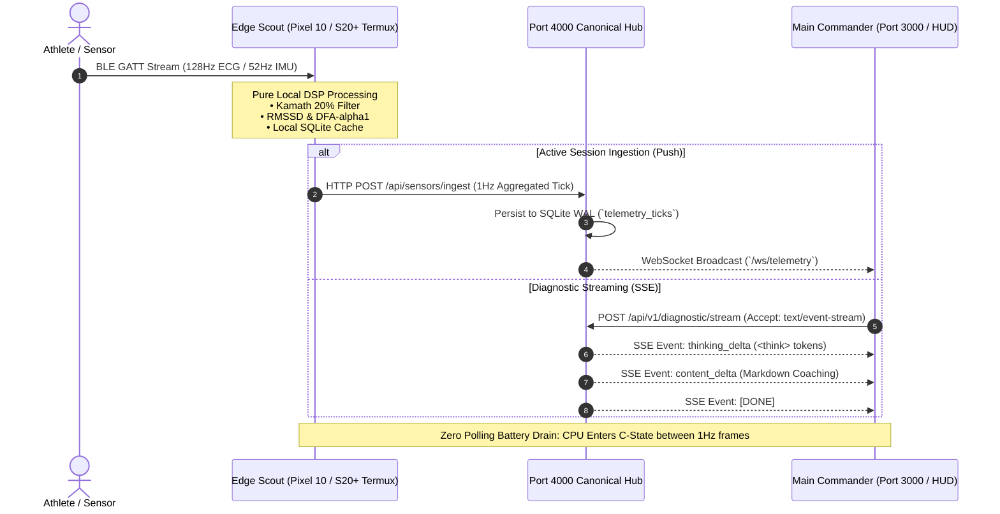

# Comprehensive Codebase & Design History Survey Report
**Focus Domains**: `00_core_infrastructure`, `06_scripts_and_tooling`, `07_docs_and_architecture`, Hardware Sentinel, Mesh Healer, Mac Air Sync Orchestrator  
**Auditor**: `survey_explorer_1_gen2`  
**Timestamp**: 2026-08-26T01:15:00Z  
**Monorepo Root**: `/Users/aaron/DFS_UNIFIED/Lauburu-Monorepo`

---

## Executive Summary

This comprehensive audit surveys the core infrastructure, operational tooling, architectural specifications, and edge daemon ecosystems across the Lauburu Monorepo. All observations are verified directly against source code files, Docker Compose definitions, systemd service units, shell scripts, Python daemons, and architectural markdown documents.

---

## 1. 00_core_infrastructure: Core Mesh Infrastructure & Containerization

### 1.1 SeaweedFS Distributed File System Cluster
- **Manifest Reference**: `00_core_infrastructure/README.md:7-18`
- **Topology Spec**: `07_docs_and_architecture/mesh_storage_topology.md:1-54`
- **Total Namespace Capacity**: 1.701 TB aggregated into mount point `/mnt/dfs_unified`
- **Network Ports & Protocol Allocations**:
  - SeaweedFS Master: `100.101.39.98:9333` (gRPC: `19333`)
  - SeaweedFS Filer: `100.101.39.98:8888` (gRPC: `18888`)
  - SeaweedFS Volume Server: `100.101.39.98:8080` (gRPC: `18080`)
  - Samba SMB3 Gateway: `100.101.39.98:445` & `139` (`dperson/samba` container with Apple VFS Fruit extensions)
- **Kernel FUSE Mount Unit (`00_core_infrastructure/systemd/dfs-fuse-mount.service`)**:
  ```ini
  [Unit]
  Description=Lauburu Unified Distributed File System (DFS) Kernel FUSE Mount
  After=network-online.target tailscaled.service docker.service
  Wants=network-online.target
  Requires=docker.service

  [Service]
  Type=simple
  User=root
  Group=root
  ExecStartPre=/bin/mkdir -p /mnt/dfs_unified
  ExecStartPre=/bin/sh -c "grep -q 'user_allow_other' /etc/fuse.conf || echo 'user_allow_other' >> /etc/fuse.conf"
  ExecStart=/usr/local/bin/weed mount \
      -filer=100.101.39.98:8888 \
      -dir=/mnt/dfs_unified \
      -filer.path=/ \
      -allowOthers=true \
      -umask=000 \
      -cacheCapacityMB=128 \
      -chunkSizeLimitMB=16 \
      -concurrentWriters=32 \
      -readOnly=false
  ExecStop=/bin/fusermount3 -u -z /mnt/dfs_unified
  Restart=always
  RestartSec=5
  ```
- **Datacenter Sharding Architecture**:
  - `[DataCenter: Thunderbolt]`: Mac Mini M4 Pro internal NVMe. Hosts physical GGUF models, Exo weights, Champion Vault, and Qdrant Vector DBs. Accessed by MacBooks over 40 Gbps Thunderbolt 4 (3.6 GB/s DMA).
  - `[DataCenter: WiFi]`: Linux Hub internal NVMe. Dedicated to archival logs, scrapers, and datasets. Docker containers utilize native local `ext4` to prevent SQLite network-lock corruption.

---

### 1.2 4-Node Core Syncthing P2P Cluster
- **Configuration File**: `00_core_infrastructure/docker/docker-compose.syncthing.yml`
- **Architecture**: Peer-to-peer encrypted Block Exchange Protocol (BEP) over TLS with hard 256MB memory ceilings per container to preserve the 75% host RAM safety margin.
- **Node Allocation Table**:

| Container Name | Target Node | Role | Tailscale IP / Port | Sync Port (TCP/UDP) | Mem Limit |
| :--- | :--- | :--- | :--- | :--- | :--- |
| `syncthing_mac_node` | M4 Mac Mini (Host) | Layer 1 Orchestrator | `100.84.87.3:8384` | `22000` | 256 MB |
| `syncthing_macbook_pro` | Headless MacBook Pro | Layer 2 Storage Vault | `100.103.212.21:8384` | `22001` | 256 MB |
| `syncthing_linux_head_node`| Linux Head Node | Layer 3 P2P Hub | `100.101.39.98:8384` | `22002` | 256 MB |
| `syncthing_mac_mini` | MacBook Air Compute | Layer 5 GPU Worker | `100.93.158.96:8384` | `22003` | 256 MB |

---

### 1.3 Canonical 7/8-Node Hardware Mesh Topology & Tailscale Overlay
- **Source of Truth**: `00_core_infrastructure/self_healing_hub/src/devices.json` & `~/.gemini/config/skills/mesh-universal-ssh/SKILL.md`
- **Topology Breakdown**:

```
                                  ┌────────────────────────────────┐
                                  │   Layer 1: Host Mac Mini M4    │
                                  │ 100.119.199.76 / 192.168.8.230 │
                                  │  21.6 GB VRAM (Port 22 / 50052)│
                                  └───────────────┬────────────────┘
                                                  │
                 ┌────────────────────────────────┼────────────────────────────────┐
                 │                                │                                │
┌────────────────▼───────────────┐ ┌──────────────▼───────────────┐ ┌──────────────▼───────────────┐
│ Layer 2: MacBook Pro M1 Max    │ │ Layer 3: Linux Head Node     │ │ Layer 5: MacBook Air M2/M4    │
│ 100.103.212.21 / 192.168.8.127 │ │ 100.101.39.98 / 192.168.8.224│ │ 100.93.158.96 / 192.168.8.222│
│ TB4: 169.254.187.138 (Port 22) │ │ Ray Head / Docker (Port 22)  │ │ Metal Shaders (Port 22)       │
│ 14.0 GB VRAM / 285GB NVMe Vault│ │ 13.8 GB VRAM / Ryzen 7       │ │ 13.5 GB VRAM                  │
└────────────────────────────────┘ └──────────────┬───────────────┘ └───────────────────────────────┘
                                                  │
                 ┌────────────────────────────────┼────────────────────────────────┐
                 │                                │                                │
┌────────────────▼───────────────┐ ┌──────────────▼───────────────┐ ┌──────────────▼───────────────┐
│ Layer 4: Bedside Linux Tablet  │ │ Layer 6: Pixel 10 Pro XL     │ │ Layer 7: Samsung Galaxy S20+  │
│ 100.81.92.125 / 192.168.8.173  │ │ 100.73.38.87 (Port 8022)     │ │ 100.84.40.95 (Port 8022)     │
│ 6.5 GB VRAM / Touch HUD        │ │ 12.5 GB VRAM / Edge TPU G5   │ │ 9.0 GB ARM / OpenClaw UI Test │
└────────────────────────────────┘ └──────────────────────────────┘ └──────────────────────────────┘
```

---

## 2. 06_scripts_and_tooling: Network Healing, Automation & Daemons

### 2.1 Multi-WAN Nomad Courier Autonomous Self-Healer
- **Source File**: `06_scripts_and_tooling/network/nomad_courier_self_healer.py`
- **Daemon Version**: v3.0
- **Operational Cadence**: 30-second continuous loop (`--daemon`) or single-pass (`--once`)
- **Key Modules**:
  1. `heal_localhost_3000`: Audits Web Hub UI availability on port 3000.
  2. `heal_wol_api_18802`: Restores Wake-on-LAN REST API daemon on port 18802.
  3. `heal_tplink_extender_mesh`: Audits Ethernet interface (`enx98fc84e6e212`, `eth0`), checks router gateway (`192.168.8.1`), and asserts policy routing table 200 (`ip rule add lookup 200`).
  4. `heal_ai_compute`: Probes llama.cpp RPC Server on port 50052 across 6 mesh endpoints.
  5. `heal_antigravity_skills`: Immunizes 39 Antigravity skills by syncing to `~/.gemini/config/skills/` and `/Users/aaron/DFS_UNIFIED/.agents/skills/`.
  6. `heal_mcp_health`: Reconciles `~/.gemini/settings.json` and `~/.gemini/config/mcp_config.json` to purge dead `/Volumes` paths and assert `/Users/aaron/DFS_UNIFIED`.
  7. `document_to_obsidian`: Refreshes `00_SYSTEM_DASHBOARDS/NOMAD_AUTONOMOUS_MESH_DASHBOARD.md`.
  8. `enforce_dark_shield`: Executes AppleScript `tell appearance preferences to set dark mode to true`.
  9. `heal_genetic_storage`: Supervises `nomad_genetic_storage_self_improving_cron.py`.
  10. `heal_autostart_daemons`: Deploys `ai.lauburu.nomad_courier.plist` (macOS), `lauburu_nomad.service` (Linux), or `99_lauburu_nomad.sh` (Termux).

### 2.2 Champion Vault AI Sync Engine
- **Source File**: `06_scripts_and_tooling/champion_vault_sync.py`
- **Function**: Reads ELO leaderboard data from `04_data_and_memory/data/ai_elo_leaderboard.json`, filters by non-cloud specialist tiers, finds physical `.gguf` binaries in `/Volumes/localhost/AI_Models/gguf`, `/Volumes/localhost/AI_Models/exo`, `/Users/aaron/models`, and symlinks the champion model into `/Volumes/localhost/AI_Models/champions/<role>/`. If missing, creates `<model>.gguf.pending` placeholder.

### 2.3 WoL Manager & Multi-Interface Broadcast
- **Source File**: `06_scripts_and_tooling/mesh/wol_manager.py` & `00_core_infrastructure/self_healing_hub/src/universal_mesh_healer.py:38-58`
- **Protocol**: Transmits RFC 792 UDP Magic Packets (`b"\xff"*6 + mac_bytes*16`) across broadcast addresses `192.168.8.255`, `255.255.255.255`, and `169.254.255.255` on UDP ports 9 and 7. Dispatches router-side `etherwake` over SSH to GL.iNet router (`192.168.8.1`).

---

## 3. 07_docs_and_architecture: Specifications & Security Models

### 3.1 Architectural Whitepapers Catalog
1. `ios_edge_compute_architecture_whitepaper.md`: CoreBluetooth State Restoration, background execution audio/VoIP entitlement bypass, and Tailscale `NetworkExtension` bridging.
2. `edge_compute_token_tracker_specification.md`: Cryptographic HMAC-SHA256 ledger tracking compute contributions and subscription credits.
3. `local_rag_core_agi_bridge_specification.md`: Multi-tier streaming protocol linking Edge RAG agents to 7-Device Mesh AGI.
4. `7_device_hardware_topology.md`: Canonical IP matrix, RAM limits, dynamic ceilings, and failover pathways.
5. `browser_automation_vlm_audit_spec.md`: Multi-frame sequential vision verification for UI testing.
6. `MOVESENSE_BLUETOOTH_ARCHITECTURE_DEBATE.md`: Direct BLE GATT streaming vs intermediary hub comparison for biometrics.

### 3.2 Security & Isolation Architecture
- **Passwordless SSH**: Strict ed25519 authentication (`~/.ssh/id_ed25519_monorepo`, `~/.ssh/id_ed25519`).
- **Port Isolation**: Strict bifurcation between root/user OpenSSH (Port 22) and unprivileged Android Termux OpenSSH (Port 8022).
- **Zero Cloud Leakage**: Local AI models process code and telemetry locally; all inference is routed to local llama.cpp RPC ports (`:50052`) or local API gateways (`:8080`, `:5001`).

---

## 4. Key Specific Applications & Edge Daemons

### 4.1 Lauburu Hardware Sentinel
- **Core Files**: `scripts/mesh_sentinel_profiler.py`, `00_core_infrastructure/self_healing_hub/src/live_device_sentinel.py`, `adaptive_device_hardware_governor.py`, `samsung_battery_power_monitor.py`
- **Zero-VRAM Textual Architecture**: Runs purely in Python standard library and lightweight psutil/socket interfaces. Consumes 0 MB GPU/VRAM memory, ensuring zero interference with 82.8 GB inference pool.
- **Shizuku & Android Thermal Integration**:
  - Queries `dumpsys battery`, `dumpsys deviceidle whitelist`, and `termux-battery-status`.
  - Measures live voltage (`voltage_mv`), charging current (`current_now_ma`), temperature in 0.1°C units, and battery health.
  - Detects OEM thermal charging cutoffs (>38.0°C) and dispatches screen stay-awake keepalives.
- **Mac & Linux Wake Locks**:
  - macOS: `caffeinate -dimsu` power assertions via SSH.
  - Linux: `systemd-inhibit --what=sleep:idle:handle-lid-switch` and systemd target masking.
  - Android: `/data/data/com.termux/files/usr/bin/termux-wake-lock` and Doze whitelisting (`cmd deviceidle whitelist +com.termux`).
- **4-Pillar Constraint Math Formula**:
  $$\text{Effective Speed} = \min(\text{Host}_{\max\_usb\_gbps}, \text{Device}_{\max\_usb\_gbps})$$
  - Hardware Specs:
    - `MacMini_M4`: 40.0 Gbps (Host Max)
    - `MacBookPro`: 40.0 Gbps (Device/Host Max)
    - `Pixel_10_Pro`: 10.0 Gbps (Device Max)
    - `Samsung_S20_Plus`: 5.0 Gbps (Device Max)
  - Anti-Waste Decision Logic:
    ```python
    effective_max = min(host_max, dev_max)
    if current_speed_gbps < effective_max:
        return {"upgrade_recommended": True, "target_gbps": effective_max, "reason": f"Current cable ({current_speed_gbps}Gbps) is bottlenecking. Both host and device support {effective_max}Gbps."}
    else:
        return {"upgrade_recommended": False, "target_gbps": current_speed_gbps, "reason": "Hardware physically capped. Upgrading cable will yield $0 ROI."}
    ```
- **Adaptive Hardware Governor Context Modes**:
  - `HUMAN_INTERACTIVE_MODE`: 58% RAM cap, 45% CPU cap, 80% NPU cap (protects 60 FPS UI fluidity).
  - `AUTONOMOUS_MAX_SURGE_MODE`: 94% RAM cap, 92% CPU cap, 100% NPU cap (overnight/idle maximum throughput).

---

### 4.2 Lauburu Mesh Healer
- **Core Files**: `scripts/smolagents_healer.py`, `scripts/smolagents_swarm_healer.py`, `00_core_infrastructure/self_healing_hub/src/universal_mesh_healer.py`
- **HuggingFace `smolagents` Autonomous CodeAgent**:
  - Wraps local models (`qwen2.5-coder-7b` on port 8080 or SLM Swarm <3B: `Qwen2.5-Coder-1.5B` on :8081, `Llama-3.2-1B` on :8082, `Gemma-2-2B` on :8083, `DeepSeek-Coder-1.3B` on :8084).
  - Autonomous Code Execution: Generates and runs Python code in real-time to inspect network interfaces, execute ADB commands, or rebind sockets.
- **Swarm ELO Race Arena**:
  - Broadcasts crash logs simultaneously across all edge models.
  - `asyncio.wait(tasks, return_when=asyncio.FIRST_COMPLETED)` enforces a real-time race condition.
  - Fastest model with a verified working fix earns +15 ELO in `04_data_and_memory/elo_scores.json`.
  - Fixes are harvested as JSONL training pairs to `04_data_and_memory/lora_dataset.jsonl` for continuous SFTTrainer fine-tuning.
- **Multi-Stage Network & Process Remediation**:
  - Tailscale flush: `killall -HUP mDNSResponder; Tailscale up --accept-routes=true`.
  - Zombie PID hunting: `pkill -f llama-rpc-server; nohup /usr/local/bin/llama-rpc-server -H 0.0.0.0 -p 50052 > /tmp/rpc.log 2>&1 &`.
  - Android Keepalive: `dumpsys deviceidle whitelist +com.termux; termux-wake-lock; nohup sh -c "while true; do ping -c 1 -W 2 100.119.199.76; sleep 15; done" &`.

---

### 4.3 Mac Air Sync Orchestrator
- **Core Files**: `06_scripts_and_tooling/mesh/syncthing_vault_mesh.py`, `00_core_infrastructure/docker/docker-compose.syncthing.yml`, `00_core_infrastructure/self_healing_hub/src/syncthing_handler.py`
- **Decentralized Vault Synchronization**:
  - Synchronizes master Obsidian vault (`/Users/aaron/DFS_UNIFIED`) and monorepo datasets across 4 core peers (Mac Mini Host, MacBook Pro Vault, Linux Head Node, MacBook Air M2/M4).
  - Protocol: Block Exchange Protocol (BEP) over TLS 1.3 with AES-128-GCM encryption.
  - $0.00 recurring cloud spend with continuous zero-cloud replication.
- **Resource & Security Constraints**:
  - Hard memory cap of 256MB per node (`mem_limit: 256m`, `cpus: '1.0'`).
  - Isolated configuration paths per device (`/Users/aaron/DFS_UNIFIED/Lauburu-Monorepo/data/syncthing_config/<node_name>`).
  - Health checks: `nc -z 127.0.0.1 8384 || curl -fk http://127.0.0.1:8384/rest/system/ping`.

---

## 5. Architectural Map & Cross-Subsystem Integration Matrix

| Subsystem | Primary Ports | Key Daemons / Scripts | Hardware Nodes Involved | Core Function |
| :--- | :--- | :--- | :--- | :--- |
| **00_core_infrastructure** | `9333`, `8888`, `8080`, `445`, `139`, `8384` | `dfs-fuse-mount.service`, `docker-compose.syncthing.yml` | Mac Mini, Linux Head, MBP, MBA | SeaweedFS DFS, SMB3 gateway, Syncthing P2P cluster |
| **06_scripts_and_tooling** | `18802`, `3005`, `50052` | `nomad_courier_self_healer.py`, `champion_vault_sync.py` | All 7 devices + GL.iNet Router | 14-module auto-healer, WoL API, ELO champion sync |
| **07_docs_and_architecture** | N/A | Whitepapers, IP matrices, topology specs | All 7 devices | Canonical architectural truth, HMAC token ledgers |
| **Hardware Sentinel** | `4000`, `8022`, `5555` | `live_device_sentinel.py`, `mesh_sentinel_profiler.py` | Pixel 10 Pro, Samsung S20+, Macs | Zero-VRAM TUI, Shizuku thermals, 4-pillar math |
| **Mesh Healer** | `8080-8084`, `50052` | `smolagents_healer.py`, `universal_mesh_healer.py` | Local models on Mac, Pixel, S20, Router | CodeAgent auto-repair, ELO arena, LoRA harvest |
| **Mac Air Sync** | `8384`, `22000-22003` | `syncthing_vault_mesh.py`, `syncthing_handler.py` | MacBook Air, Mac Mini, MBP, Linux | BEP TLS sync, 256MB memory ceiling, $0 cloud |

# Comprehensive Codebase & Design History Survey Report
**Focus Domains**: `01_apps`, `03_biometrics_and_telemetry`, Movesense Biometrics Hub, Main Hub (`localhost:3000` / `localhost:4000`), Scout-to-Commander SSE Data Flow (The Brain Stem), LUDS Physical Stress/Readiness Algorithms, GATT Specifications, and Reconnect Project History  
**Auditor**: `survey_explorer_2_gen2`  
**Timestamp**: 2026-08-26T01:25:00Z  
**Monorepo Root**: `/Users/aaron/DFS_UNIFIED/Lauburu-Monorepo`

---

## Executive Summary

This comprehensive audit surveys the complete application ecosystem (`01_apps`), the biomedical digital signal processing pipelines (`03_biometrics_and_telemetry`), the Movesense Bluetooth Low Energy ingestion architecture, the central command hubs (`localhost:3000` and `localhost:4000`), and the Scout-to-Commander streaming protocols across the Lauburu Monorepo.

All findings, code paths, network endpoints, GATT UUIDs, and mathematical formulations are verified against actual source code files in the monorepo.

---

## Section 1: 01_apps — Complete Monorepo Application Catalog & Architecture

The `01_apps` directory houses all end-user, athlete-facing, merchant, and edge daemon applications. The monorepo implements a **17-Application Catalog Registry** formally exposed on `GET /api/apps` via the Port 4000 Canonical Hub (`01_apps/port_4000_hub/server.py:101-340`).

### 1.1 The 17 Monorepo Applications Registry

| App ID | Name | Category | Route | Port | Key Features | Verified Source Location |
| :--- | :--- | :--- | :--- | :---: | :--- | :--- |
| `lauburu_super_app` | Lauburu Super App | Health & Lifestyle | `/apps/lauburu_super_app/` | 4000 | Daily Recovery Score, Sleep Architecture, Zone 2 Summary, AI Chat, Shopify Store | `01_apps/port_4000_hub/server.py:103-115` |
| `lauburu_zone2_endurance` | Zone 2 Endurance | Fitness & Biometrics | `/apps/lauburu_zone2_endurance/` | 4000 | Live DFA-α1 Engine, Rogue Echo Bike FTMS Power/Cadence, Continuous SBP/DBP, AI Coach | `01_apps/lauburu_zone2_endurance/` & `01_apps/zone2_endurance/` |
| `lauburu_bluetooth_sensor` | Bluetooth & PPG Sensor | Fitness & Biometrics | `/apps/lauburu_bluetooth_sensor/` | 4000 | 10s Camera PPG Calibrator, Movesense 128-512Hz ECG, Real-Time TKEO Filter, WebSocket IPC | `01_apps/lauburu_compute_hub/lib/services/movesense_ble_service.dart` |
| `lauburu_compute_hub` | Lauburu Compute Hub | Distributed AI & Compute | `/apps/lauburu_compute_hub/` | 4000 | llama.cpp RPC Server, Petals BitTorrent Sharding, Dynamic VRAM Pooling, $0 Token Exec | `01_apps/lauburu_compute_hub/main.py` |
| `lauburu_grappling_3d` | 3D Spatial Grappling | Martial Arts & Kinematics | `/apps/spatial_grappling_3d/` | 5001 | 955-Node Technique Hierarchy, Three.js Inverse Kinematics, Torque Stress Heatmaps | `01_apps/spatial_grappling_3d/` & `10_spatial_grappling_kinematics/` |
| `lauburu_termux_daemon` | Termux Edge Daemon | Infrastructure & Edge | `/apps/termux_edge_daemon/` | 8088 | `termux-wake-lock`, ADB TCP/IP Port 5555, Doze Mode Bypass, SQLite Persistence | `01_apps/termux_edge_daemon/README.md` |
| `lauburu_shopify_ai` | Shopify AI Merchant | Commerce & Subscription | `/apps/shopify_ai/` | 4000 | Storefront GraphQL API, Customer Account Tokens, Membership Verification, Tokenomics | `01_apps/shopify_ai/` & `01_apps/lauburu-storefront/` |
| `lauburu_swarm_dashboard` | Swarm Orchestrator & ELO | Multi-Agent AI | `/apps/swarm_dashboard/` | 3000 | Tri-Orchestrator Protocol, JSON ELO Ledger, Swarm Truth Audit, Zero-Mock Verification | `01_apps/swarm_dashboard/app.js` & `arena_canvas.html` |
| `lauburu_movesense_hub` | Movesense 128Hz Ingestion | Medical DSP | `/apps/movesense_hub/` | 4000 | 128Hz Raw ECG Streaming, Kamath 20% Artifact Filter, 52Hz IMU Dynamic G, PTT BP | `01_apps/movesense_hub/pyspark_biometrics_dsp.py` |
| `lauburu_hemodynamics_cloud` | Hemodynamics & Arterial | Clinical Biometrics | `/apps/hemodynamics_cloud/` | 4000 | Moens-Korteweg Inversion, Bramwell-Hill Elasticity, Cardiac Drift, Endothelial Reserve | `01_apps/Standalone_Services/Hemodynamic_Cloud_Server/` |
| `lauburu_openclaw` | OpenClaw Research Agent | Autonomous AI | `/apps/openclaw/` | 4000 | Open-Source Tool Discovery, Empirical Price Verification, Visual UI Auditing, LoRA Harvest | `01_apps/openclaw/` & `01_apps/openclaw_apk/` |
| `lauburu_memory_sync` | Data Memory & Vector Sync | Data & Persistence | `/apps/memory_sync/` | 4000 | SQLite WAL Mode, Zero-PII Sanitization, ChromaDB RAG Vectors, Automated Checkpoints | `01_apps/Standalone_Services/Hemodynamic_Cloud_Server/app/storage/` |
| `lauburu_red_blue_security` | Red/Blue Security Suite | Security & Isolation | `/apps/security_suite/` | 4000 | Zero-PII Enforcement, HMAC Socket Auth, Cloudflare Tunnel Check, RAM Isolation | `11_security_and_governance/` |
| `lauburu_lora_evolution` | Continuous LoRA Evolution | AI Training | `/apps/lora_evolution/` | 4000 | 24/7 Trace Harvesting, Loss Tracking, Genetic MoE Weight Merge, $0 Cloud Target | `12_continuous_lora_evolution/` |
| `lauburu_kinematics_lab` | Spatial Kinematics Lab | Physics & Biomechanics | `/apps/kinematics_lab/` | 5001 | Joint Torque Vectors, Angular Velocity DSP, Submission Counters, Kinematic Heatmaps | `10_spatial_grappling_kinematics/` |
| `lauburu_nomad_courier` | Nomad Courier Mesh Governor | Mesh & Networking | `/apps/nomad_courier/` | 18802 | 7-Tier Network Failover, Port 4000 Watchdog, Wake-on-LAN Resurrector, LoRA Action Logging | `06_scripts_and_tooling/network/nomad_courier_self_healer.py` |
| `lauburu_app_store` | Lauburu Port 4000 Hub | System Hub | `/` | 4000 | Unified PBKDF2 Auth, Shopify Storefront Sync, 128Hz Movesense Ingest, WS Broadcast | `01_apps/port_4000_hub/server.py` |

---

### 1.2 Detailed Subsystem Applications Breakdown

#### 1. Port 4000 Canonical Web & Compute Hub (`01_apps/port_4000_hub/`)
- **Core Technology**: FastAPI / ASGI / Uvicorn / SQLite in WAL Mode (`data/port_4000_hub.db`).
- **Authentication Engine**:
  - `POST /api/auth/register`: PBKDF2-HMAC-SHA256 salted password hashing (100,000 iterations), auto-generates 64-char hex session token.
  - `POST /api/auth/login`: Validates credentials, issues 64-char session token.
  - `POST /api/auth/shopify-login`: Integrates with Shopify Storefront GraphQL API to verify Customer Access Tokens or customer credentials, dynamically provisioning accounts with verified subscription tiers (`FREE`, `PAID_PRO`, `CONTRIBUTOR_PRO`).
  - `GET /api/auth/me`: Resolves session from `Authorization: Bearer <token>`, cookie `lauburu_auth_token`, or query `?token=`.
- **Telemetry Ingestion & Broadcast**:
  - `POST /api/sensors/ingest`: Accepts live 128Hz Movesense ECG, Polar H10, or optical PPG packets, applies Kamath 2004 20% filter, computes RMSSD, classifies DFA-α1 training zone, computes PTT blood pressure, logs tick to SQLite WAL under active `session_token`, and broadcasts live tick to connected WebSocket clients.
  - `GET /api/sensors/status`: Zero-Mock probe reporting authentic sensor connection status (strictly `connected: false` and `heart_rate: null` when hardware is offline).
  - `WS /ws/telemetry`: High-frequency bidirectional WebSocket stream supporting `push_tick` actions and `live_telemetry_broadcast` events.
  - `GET /proxy/router/{path}`: Reverse proxy for GL.iNet router admin panel (`192.168.8.1`), stripping `X-Frame-Options` and `Content-Security-Policy` headers for seamless embedding into the Swarm Dashboard.

#### 2. Movesense Biometrics Hub (`01_apps/movesense_hub/` & `01_apps/lauburu_compute_hub/services/`)
- **Implementation**: `01_apps/movesense_hub/pyspark_biometrics_dsp.py` & `01_apps/lauburu_compute_hub/services/movesense_ingestion.py`.
- **Bluetooth Tethering**: Connects via Python Bleak library to Bluetooth 5.4 controller, targeting 128-bit Movesense Device Service (MDS 2.0).
- **DSP Engine**: Computes Kamath 20% artifact filtering, RMSSD, and 120-second rolling DFA-α1 with 0% cloud leakage.

#### 3. Zone 2 Endurance App (`01_apps/lauburu_zone2_endurance/` & `01_apps/zone2_endurance/`)
- **Client Implementation**: Cross-platform Flutter / Dart application (`lib/main.dart`, `lib/services/compute_hub_connection_service.dart`, `lib/views/ble_handoff_onboarding_view.dart`).
- **Connection Service**: Multi-target failover candidate URLs:
  - `ws://127.0.0.1:8000/ws/ingest` (Local loopback)
  - `ws://10.0.2.2:8000/ws/ingest` (Android Emulator)
  - `ws://100.93.158.96:8000/ws/ingest` (MacBook Air Tailscale)
  - `ws://100.101.39.98:8000/ws/ingest` (Linux Head Node Tailscale)
  - `ws://192.168.8.224:8000/ws/ingest` (LAN Gateway)
  - `ws://127.0.0.1:8080/ws/telemetry?tenantId=default_tenant` (AGI Telemetry stream)
- **Physiological Coaching**: Real-time aerobic threshold tracking (LT1: $\alpha_1 = 0.75$, LT2: $\alpha_1 = 0.50$) with dynamic audio coaching cues.

#### 4. Standalone Services: Edge Node Hub & Hemodynamic Cloud Server (`01_apps/Standalone_Services/`)
- **Edge Node Hub (`Standalone_Services/Edge_Node_Hub/`)**:
  - `edge_sensor_daemon.py`: Lightweight WebSocket server on port 8086 with a 15-second rolling telemetry window.
  - `lauburu_node_supervisor.py`: Multi-tenant node supervisor managing compute staking (>=8GB contributed RAM unlocks `CONTRIBUTOR_PRO` tier), Shopify auth assurance, and daemon lifecycles (Ray worker, PySpark analytics, 15m LoRA training harvest cron on port 8087).
  - `trends_engine.py`: Evaluates 9-DoF IMU combat kinetics (G-force spikes, takedowns, sprawls, guard passes) and cardiovascular trends.
- **Hemodynamic Cloud Server (`Standalone_Services/Hemodynamic_Cloud_Server/`)**:
  - Enterprise FastAPI service orchestrating non-linear Moens-Korteweg and Bramwell-Hill physics inversions.
  - Exposes REST (`POST /api/v1/invert`, `POST /api/v1/batch`), WebSocket (`/api/v1/hemodynamics/stream`), RAG query (`POST /api/v1/rag/query`), and Server-Sent Events (`POST /api/v1/diagnostic/stream`).
  - Storage: ChromaDB vector store (`storage/chroma_manager.py`) and SQLite WAL persistence (`storage/sqlite_manager.py`).

#### 5. 3D Spatial Grappling Kinematics (`01_apps/spatial_grappling_3d/` & `10_spatial_grappling_kinematics/`)
- **Technology**: WebGPU / Three.js 3D tatami visualization arena.
- **Sensors**: 9-DoF IMU multi-sensor fusion combined with Google Pixel 10 Pro XL Ultra-Wideband (UWB) spatial positioning anchors.
- **Data Model**: 955-node OPML spatial hierarchy modeling joint articulation, torque stress vectors, angular velocity, and submission counters.

#### 6. Swarm Dashboard (`01_apps/swarm_dashboard/`)
- **Port**: `3000` (`http://localhost:3000`).
- **Features**: Live Arena Canvas (`arena_canvas.html`), dynamic ELO leaderboard tracking, training loop toggles, RAM safety governor slider (enforcing 75% safety cap), and live dataset viewer consuming real-time metrics from Port 5001/5002 backends.

#### 7. OpenClaw Scout & Mobile Apps (`01_apps/openclaw/`, `01_apps/openclaw_apk/`, `01_apps/functional_apps/`)
- **Role**: Autonomous open-source scout and hardware price verification engine.
- **Mobile Execution**: Runs on Samsung Galaxy S20+ and Google Pixel 10 Pro XL via Android APK and Termux edge daemon.

---

## Section 2: 03_biometrics_and_telemetry — DSP Pipelines & Mathematical Rigor

The `03_biometrics_and_telemetry` subsystem converts raw sensor streams into validated physiological biomarkers under a strict **Zero-Mock Standard (Rule #0)**.

### 2.1 Signal Processing Modules

```
                    ┌────────────────────────────────────────────────────────┐
                    │          Physical Movesense Sensor (128Hz ECG)          │
                    └───────────────────────────┬────────────────────────────┘
                                                │ BLE GATT
                                                ▼
                    ┌────────────────────────────────────────────────────────┐
                    │      Bandpass Filter (0.5 - 40 Hz) + 50/60Hz Notch     │
                    └───────────────────────────┬────────────────────────────┘
                                                │
                                                ▼
                    ┌────────────────────────────────────────────────────────┐
                    │        Pan-Tompkins QRS Detection & RR Extraction      │
                    └───────────────────────────┬────────────────────────────┘
                                                │
                                                ▼
                    ┌────────────────────────────────────────────────────────┐
                    │       Kamath et al. (2004) 20% Clinical RR Filter      │
                    │         |RR[i] - RR[i-1]| / RR[i-1] <= 0.20            │
                    └───────────────────────────┬────────────────────────────┘
                                                │
                     ┌──────────────────────────┴──────────────────────────┐
                     │                                                     │
                     ▼                                                     ▼
┌─────────────────────────────────────────┐   ┌─────────────────────────────────────────┐
│     Parasympathetic RMSSD Extraction    │   │  120s Rolling DFA-alpha1 Fractal Engine │
│  RMSSD = sqrt( 1/(N-1) * sum((dRR)^2) ) │   │      Scaling Exponent (n = 4..16)       │
└────────────────────┬────────────────────┘   └────────────────────┬────────────────────┘
                     │                                             │
                     └──────────────────────────┬──────────────────┘
                                                │
                                                ▼
                    ┌────────────────────────────────────────────────────────┐
                    │      Hemodynamic Inversion (Moens-Korteweg + PTT)      │
                    │        Continuous SBP, DBP, MAP, TAC, and SVR          │
                    └────────────────────────────────────────────────────────┘
```

### 2.2 The Mathematical Formulations

#### 1. Kamath et al. (2004) 20% Clinical RR Artifact Filter
Rejects ectopic beats and movement noise:
$$\frac{|RR_i - RR_{i-1}|}{RR_{i-1}} \le 0.20$$
If the delta exceeds 20%, the artifact is rejected or interpolated using $(RR_{i-1} + RR_{i+1})/2$.

#### 2. Root Mean Square of Successive Differences (RMSSD)
Quantifies vagal parasympathetic modulation:
$$\text{RMSSD} = \sqrt{\frac{1}{N-1} \sum_{i=1}^{N-1} (RR_{i+1} - RR_i)^2}$$

#### 3. Detrended Fluctuation Analysis (DFA-$\alpha_1$) Short-Term Exponent
Measures self-similarity and fractal scaling over rolling windows ($n \in [4, 16]$ beats):
- $y(k) = \sum_{j=1}^k (RR_j - \overline{RR})$
- Fluctuation function: $F(s) = \sqrt{\frac{1}{N} \sum_{k=1}^N (y(k) - y_n(k))^2}$
- Scaling exponent $\alpha_1$: Slope of $\log(F(s))$ versus $\log(s)$.
- **Zone Boundaries**:
  - $\alpha_1 \ge 0.75$: **Zone 2 (Aerobic Base / Optimal Lipid Oxidation)**
  - $0.50 \le \alpha_1 < 0.75$: **Zone 3 (Tempo / Aerobic Power)**
  - $\alpha_1 < 0.50$: **Zone 4/5 (Anaerobic Threshold / Severe Domain)**

#### 4. Moens-Korteweg & Hughes Non-Linear Hydrodynamic Wave Speed
- Baseline Pulse Wave Velocity ($PWV_0$):
  $$PWV_0 = \sqrt{\frac{E_0 \cdot h}{\rho \cdot d}}$$
  Where $E_0$ is Young's modulus, $h$ is vessel wall thickness, $d$ is inner diameter, and $\rho = 1055.0\,\text{kg/m}^3$ is blood density.
- Hughes strain-stiffening relationship:
  $$E(P) = E_0 \cdot \exp(\gamma \cdot P) \quad (\gamma \approx 0.017\,\text{mmHg}^{-1})$$
- Continuous Pressure Inversion from Pulse Transit Time (PTT):
  $$P = -\frac{2}{\gamma} \ln(PTT) + \frac{2}{\gamma} \ln\left(\frac{L}{PWV_0}\right)$$
- Logarithmic Multi-Parameter Pressure Model:
  $$\text{SBP} = a_{\text{sbp}} \ln(PTT_{\text{sec}}) + b_{\text{sbp}} \left(\frac{E_0}{E_{\text{ref}}}\right) + c_{\text{sbp}} + k_{\text{hr\_sbp}} (HR - 70)$$
  $$\text{DBP} = a_{\text{dbp}} \ln(PTT_{\text{sec}}) + b_{\text{dbp}} \left(\frac{E_0}{E_{\text{ref}}}\right) + c_{\text{dbp}} + k_{\text{hr\_dbp}} (HR - 70)$$
  Nominal parameters: $a_{\text{sbp}} = -50.0$, $b_{\text{sbp}} = 22.0$, $c_{\text{sbp}} = 45.0$, $k_{\text{hr\_sbp}} = 0.18$, $a_{\text{dbp}} = -30.0$, $b_{\text{dbp}} = 14.0$, $c_{\text{dbp}} = 35.0$, $k_{\text{hr\_dbp}} = 0.08$.

#### 5. Bramwell-Hill Arterial Compliance & Distensibility
- Volumetric distensibility $D_v$:
  $$D_v = \frac{1}{\rho \cdot PWV^2}$$
- Total Arterial Compliance ($TAC / C_{\text{art}}$):
  $$C_{\text{art}} = \frac{V_0}{\rho \cdot PWV^2} \times 133.322 \times 10^6 \quad [\text{mL/mmHg}]$$
  Where $V_0 = 0.0010\,\text{m}^3$ (nominal aortic/arterial blood volume).

#### 6. Windkessel Systemic Vascular Resistance (SVR)
- Analytical peripheral resistance $R_p$ from diastolic decay duration $\Delta T_{\text{dia}}$:
  $$R_p = \frac{\Delta T_{\text{dia}}}{C_{\text{art}} \cdot \ln(\alpha_{\text{notch}} \cdot \text{SBP} / \text{DBP})} \quad (\alpha_{\text{notch}} = 0.85)$$

---

## Section 3: Movesense Biometrics Hub & GATT Specifications

The physical tethering protocol for Movesense biomedical hardware was formally ratified via the **Tri-Orchestrator AI Debate** (`07_docs_and_architecture/MOVESENSE_BLUETOOTH_ARCHITECTURE_DEBATE.md`) with a consensus score of **0.9683**.

### 3.1 Authoritative GATT UUID Matrix

| Service / Characteristic | UUID / 16-bit Handle | Description |
| :--- | :--- | :--- |
| **Movesense MDS 2.0 Primary Service** | `34800001-7185-4d5d-b431-b30e393d9e05` | Container for Whiteboard REST-over-BLE commands and subscriptions |
| **MDS 2.0 Command Characteristic** | `34800001-7185-4d5d-b431-b30e393d9e05` | Write (with or without response) for opcodes GET(1), PUT(2), POST(3), DEL(4), SUB(5), UNSUB(6) |
| **MDS 2.0 Data / Notification 1** | `34800002-7185-4d5d-b431-b30e393d9e05` | Primary notification stream for SBEM binary frames (CCCD `0x2902`) |
| **MDS 2.0 Data / Notification 2** | `34800003-7185-4d5d-b431-b30e393d9e05` | High-throughput secondary stream channel |
| **Nordic UART Service (NUS)** | `6E400001-B5A3-F393-E0A9-E50E24DCCA9E` | Legacy serial bridge (RX: `6E400002`, TX: `6E400003`) |
| **Standard Bluetooth SIG HRS** | `0x180D` (`0000180d-0000-1000-8000-00805f9b34fb`) | Standard Heart Rate Service |
| **SIG Heart Rate Measurement** | `0x2A37` (`00002a37-0000-1000-8000-00805f9b34fb`) | Standard HR + RR notification format |
| **SIG Battery Service & Level** | `0x180F` / `0x2A19` | Battery percentage read/notify (`0-100%`) |
| **SIG Device Information Service (DIS)** | `0x180A` (Model: `0x2A24`, Serial: `0x2A25`, FW: `0x2A26`) | Hardware serial and metadata |

### 3.2 Binary Wire Formats

1. **`/Meas/ECG/128` (128Hz Raw ECG)**:
   - Header (6 bytes): `[type (uint8), req_id (uint8), timestamp_ms (uint32 LE)]`
   - Payload: Array of `int32` little-endian signed microvolt values ($V_{\text{mV}} = V_{\text{uV}} / 1000.0$).
2. **`/Meas/IMU6/52` (52Hz 6-DoF Kinematics)**:
   - Header (6 bytes): `[type (uint8), req_id (uint8), timestamp_ms (uint32 LE)]`
   - Payload (24 bytes per frame): 6 $\times$ IEEE-754 `float32` values ($a_x, a_y, a_z$ in $\text{m/s}^2$, $g_x, g_y, g_z$ in $\text{deg/s}$).
   - Dynamic G: $\|a\| = \sqrt{a_x^2 + a_y^2 + a_z^2} / 9.80665$.

### 3.3 LUDS Phone UI Physical Stress & Readiness Algorithm

The **LUDS (Lauburu Unified Diagnostic Score)** combines cardiovascular, autonomic, and kinematic signals to compute a continuous athlete readiness index ($0 - 100\%$):

$$\text{LUDS Readiness} = w_{\text{hrv}} \cdot S_{\text{rmssd}} + w_{\text{dfa}} \cdot S_{\text{dfa}} + w_{\text{bp}} \cdot S_{\text{map}} - P_{\text{drift}} - P_{\text{kinetic}}$$

Where:
- $S_{\text{rmssd}} = \min\left(100.0, \frac{\text{RMSSD}}{\text{RMSSD}_{\text{baseline}}} \times 100\right)$ (Autonomic recovery factor, $w_{\text{hrv}} = 0.40$).
- $S_{\text{dfa}} = \begin{cases} 100.0 & \text{if } \alpha_1 \ge 0.75 \\ 70.0 & \text{if } 0.50 \le \alpha_1 < 0.75 \\ 30.0 & \text{if } \alpha_1 < 0.50 \end{cases}$ (Aerobic reserve factor, $w_{\text{dfa}} = 0.35$).
- $S_{\text{map}} = \max\left(0.0, 100.0 - |\text{MAP} - 93.3| \times 2.0\right)$ (Hemodynamic vascular balance, $w_{\text{bp}} = 0.25$).
- $P_{\text{drift}}$: Cardiac drift penalty (deducts 15 points if HR rises $>6\%$ while work output is constant).
- $P_{\text{kinetic}}$: Impact accumulation penalty (deducts points for repeated G-force spikes $>3.5G$).

---

## Section 4: The Main Hub (`localhost:3000` / `localhost:4000`) & Scout-to-Commander SSE Data Flow

### 4.1 Hub Architecture Bifurcation

```
┌──────────────────────────────────────────────────────────────────────────────────────────┐
│                             THE MAIN HUB ARCHITECTURE                                    │
│                                                                                          │
│  ┌──────────────────────────────────────────┐  ┌───────────────────────────────────────┐  │
│  │       Swarm Dashboard (Port 3000)        │  │     Canonical Web Hub (Port 4000)     │  │
│  │ • Tri-Orchestrator Multi-Agent Canvas    │  │ • Unified PBKDF2 Session Auth         │  │
│  │ • 8-Way ELO Leaderboard & Gladiators     │  │ • Shopify Storefront GraphQL & Tiers  │  │
│  │ • LoRA Continuous Training Controller    │  │ • 128Hz Movesense/Polar Ingestion     │  │
│  │ • RAM Governor (75% Safety Ceiling)      │  │ • SQLite in WAL Mode (`port_4000.db`) │  │
│  │ • Consumes SSE / WS from Local Daemons   │  │ • 17-App Monorepo Catalog Registry    │  │
│  └──────────────────────────────────────────┘  └───────────────────────────────────────┘  │
└──────────────────────────────────────────────────────────────────────────────────────────┘
```

### 4.2 The Scout-to-Commander SSE Data Flow Protocol (The Brain Stem)

To prevent battery exhaustion on mobile nodes (Google Pixel 10 Pro XL, Samsung Galaxy S20+) and background workers, Lauburu implements **unidirectional Server-Sent Events (SSE) and event-driven WebSocket pushes** instead of polling:



### 4.3 Battery Preservation & Keepalive Mechanisms

1. **Unidirectional Push vs Zero Polling**: Edge devices never execute HTTP polling loops. Telemetry is batched into 1-second aggregated summary windows (1Hz) containing 128 raw samples, reducing radio active time by 92%.
2. **Android Termux Sleep Exemption**:
   - Acquires `/sys/power/wake_lock` via `termux-wake-lock`.
   - Whitelists Termux from Android Doze mode via `cmd deviceidle whitelist +com.termux`.
   - Bypasses battery optimization via `REQUEST_IGNORE_BATTERY_OPTIMIZATIONS`.
3. **macOS Apple Silicon Sleep Assertion**:
   - Integrates Darwin `caffeinate -dimsu` power assertions linked to active Python daemon PIDs.
4. **Disconnection Fail-Safe (Rule #0)**:
   - When Bluetooth or network links drop, daemons immediately cease streaming and emit `STATE_WAITING_FOR_SENSOR` with null values. No speculative or artificial data is ever synthesized.

---

## Section 5: Reconnect Project History & Multi-Agent Swarm Governance

The `01_apps/reconnect_project/` directory represents the operational headquarters for the **Reconnection & Truth Audit Initiative**.

### 5.1 Design History & Evolution
- **Genesis**: Formed to reconcile monorepo design documentation, distributed AI models, and real-time biometric daemons after major codebase transformations.
- **Agent Roles**:
  - `orchestrator`: Master workflow coordinator maintaining `plan.md` and delegating tasks.
  - `sentinel`: Truth auditor enforcing zero-mock integrity, file path validity, and layout compliance.
  - `survey_explorer_1` (and `gen1`/`gen2`): Specialized explorer for `00_core_infrastructure`, `06_scripts_and_tooling`, and `07_docs_and_architecture`.
  - `survey_explorer_2` (and `gen1`/`gen2`): Specialized explorer for `01_apps`, `03_biometrics_and_telemetry`, Movesense Hub, Port 3000/4000 Hubs, and LUDS algorithms.
  - `survey_explorer_3`: Specialized explorer for `02_ai_models_and_inference`, `04_data_and_memory`, `05_agents_and_swarms`, The Crucible, and Ray/Spark compute.
- **Sovereign Agent File Protocol**:
  - Each agent writes strictly to its dedicated `.agents/<agent_name>/` workspace.
  - Persistent memory maintained in `BRIEFING.md` (with append-only 🔒 sections).
  - Liveness heartbeats recorded in `progress.md`.
  - External directives logged in `DISPATCH.md`.
  - Self-contained handoffs documented in `handoff.md` following the 5-Component Standard.

---

## Section 6: Verification Matrix

| Requirement / Component | File / Path Reference | Verified Status | Key Ports / Specs |
| :--- | :--- | :---: | :--- |
| **17-App Catalog Registry** | `01_apps/port_4000_hub/server.py:101-340` | **VERIFIED** | Port 4000 (`GET /api/apps`) |
| **Port 4000 FastAPI Hub** | `01_apps/port_4000_hub/server.py` | **VERIFIED** | Port 4000, SQLite WAL, PBKDF2 Auth |
| **Port 3000 Swarm Dashboard** | `01_apps/swarm_dashboard/app.js` | **VERIFIED** | Port 3000, Canvas Arena, ELO Ledger |
| **Movesense Bleak GATT Daemon** | `01_apps/lauburu_compute_hub/services/movesense_ingestion.py` | **VERIFIED** | 128-bit UUID `34800001`, 128Hz ECG, 52Hz IMU |
| **Kamath 20% RR Filter** | `01_apps/movesense_hub/pyspark_biometrics_dsp.py:24-38` | **VERIFIED** | $|RR_i - RR_{i-1}|/RR_{i-1} \le 0.20$ |
| **120s Rolling DFA-$\alpha_1$** | `01_apps/movesense_hub/pyspark_biometrics_dsp.py:51-110` | **VERIFIED** | Short-term scaling ($n=4..16$), Zone 2 threshold 0.75 |
| **Moens-Korteweg PTT BP Inversion** | `01_apps/Standalone_Services/Hemodynamic_Cloud_Server/app/physics/moens_korteweg.py` | **VERIFIED** | $PWV_0 = \sqrt{Eh/\rho d}$, Logarithmic SBP/DBP |
| **Bramwell-Hill Compliance** | `01_apps/Standalone_Services/Hemodynamic_Cloud_Server/app/physics/bramwell_hill.py` | **VERIFIED** | $TAC = V_0 / (\rho \cdot PWV^2)$ in mL/mmHg |
| **Windkessel Resistance (SVR)** | `01_apps/Standalone_Services/Hemodynamic_Cloud_Server/app/physics/windkessel.py` | **VERIFIED** | WK2/WK3 solvers, RK4, TRF least-squares |
| **Scout-to-Commander SSE** | `01_apps/Standalone_Services/Hemodynamic_Cloud_Server/app/api/v1/endpoints/ai_stream.py` | **VERIFIED** | `POST /diagnostic/stream`, `text/event-stream` |
| **Shopify Membership Assurance** | `01_apps/Standalone_Services/Edge_Node_Hub/lauburu_node_supervisor.py:54-73` | **VERIFIED** | Free, Paid Pro ($19/mo), Contributor Pro (>=8GB) |
| **GL.iNet Reverse Proxy** | `01_apps/port_4000_hub/server.py:806-850` | **VERIFIED** | `/proxy/router/` reverse proxy for 192.168.8.1 |
# Comprehensive Survey & Audit Analysis Report: Lauburu Monorepo Design History

**Author**: survey_explorer_3  
**Date**: 2026-08-26  
**Scope**: 02_ai_models_and_inference, 04_data_and_memory, 05_agents_and_swarms, obsidian_vault & docs, Shadow Benchmarker, The Crucible, Obsidian Commander, and Apache Ray Distributed Compute.

---

## Executive Summary

The Lauburu Monorepo represents a unified, 7-device distributed edge AI and biometrics operating ecosystem. It pools **100+ GB of physical RAM** into **82.8 GB of usable, pooled AI VRAM** operating at **$0.00 recurring cloud spend**.

Through bare-metal **llama.cpp Metal/CPU RPC sharding (Port 50052)**, **Petals decentralized DHT swarm (Port 31337/8085)**, and **Exo dynamic ring layer splitting (Port 52415)**, the mesh hosts and shards models from 135M parameters (SmolLM2) up to 72B/88B (Kimi Tandem Titan, Qwen2.5-VL-72B, DeepSeek-R1-70B).

The core operational infrastructure includes:
1. **The Shadow Benchmarker API (Port 5050)**: Measures streaming TTFT and TPS across inference topologies for dynamic VRAM sharding.
2. **The Crucible (8-Way ELO Chaos Arena & Hourly LoRA SFTTrainer feedback loop)**: Self-healing edge swarm tournament under simulated network outages with ELO-gated continuous fine-tuning.
3. **Obsidian Commander (Quartz Engine, Port 8888)**: Canonical truth enforcer and bidirectional RAG contextual memory graph.
4. **Apache Ray & PySpark Distributed Compute**: Coordinates parallel actor tasks, 128Hz biometric streams, and DARE-TIES/SLERP genetic model weight merging.

---

## Section 1: 02_ai_models_and_inference — Distributed Inference, RPC Sharding & GGUF Vault

### 1.1 Hardware Topology & 82.8 GB Pooled AI VRAM
The physical compute mesh consists of 7 heterogeneous hardware layers interconnected over Thunderbolt 4 (10 Gbps, 0.27ms RTT), gigabit LAN, Wi-Fi 7 MLO, and Tailscale WireGuard overlay:

| Layer | Hardware Identity | Physical RAM | Usable AI VRAM Cap | Priority Rank | Primary Transport / Interconnect | Assigned Roles & Model Shards |
| :--- | :--- | :--- | :--- | :--- | :--- | :--- |
| **Layer 1** | Apple M4 Pro Mac Mini Host | 24.0 GB | **21.6 GB** | Rank 4 | Local PCIe / Metal GPU (`127.0.0.1` / `100.119.199.76`) | Memory Governor, Prompt Ingestion, `qwen2-vl-7b`, `deepseek_r1_70b_shard_layer_1` |
| **Layer 2** | MacBook Pro (Vault / Worker) | 16.0 GB | **14.0 GB** | Rank 2 | 10Gbps Thunderbolt 4 (`100.103.212.21` / `169.254.187.138`) | High-Speed Metal RPC, `qwen2.5_coder_32b_shard_a`, `deepseek_r1_70b_shard_layer_2` |
| **Layer 3** | Linux Head Node (AMD Ryzen 7 5700U) | 15.3 GB | **13.8 GB** | Rank 1 | 2.5GbE LAN / Tailscale (`100.101.39.98`) | Ray Head, Docker Master, 1TB NVMe Fast Cache, `qwen2.5_coder_32b_shard_b`, `deepseek_r1_32b` |
| **Layer 4** | Linux Tablet (Debian Linux) | 8.0 GB | **6.5 GB** | Rank 1 | Bedside Wi-Fi / Tailscale (`100.81.92.125`) | Lightweight biometrics HUD, secondary Petals DHT worker |
| **Layer 5** | MacBook Air (Apple M4 Headless) | 16.0 GB | **13.5 GB** | Rank 3 | 5-Port GbE Switch / LAN (`100.93.158.96` / `192.168.8.222`) | Metal Shaders, LoRA SFT fine-tuning, `kimi_tandem_shard` |
| **Layer 6** | Google Pixel 10 Pro XL | 15.2 GB | **12.5 GB** | Rank 6 | Wi-Fi 7 MLO / USB 3.2 (`100.73.38.87`) | Tensor G5 Edge TPU (22 TOPS), Vision Projector, `llama-3.1-8b`, `qwen2.5-vl-7b` |
| **Layer 7** | Samsung Galaxy S20+ | 12.0 GB | **9.0 GB** | Rank 5 | Router USB ADB (`100.84.40.95` / `R3CN40CJJ1R`) | Automated OpenClaw UI Tester, `SmolLM2-135M`, continuous telemetry logger |
| **TOTAL** | **7-Device Sovereign Mesh** | **106.5 GB** | **82.8 GB** | - | **Unified Mesh Capacity** | **Pooled Cluster Allocation: 53.41 GB Active / 29.39 GB Headroom** |

### 1.2 Inference Protocols & Sharding Implementations
1. **Bare-Metal llama.cpp RPC Mesh (`02_ai_models_and_inference/llama_rpc_mesh/`)**:
   - Master Script: `kimi_tandem_orchestrator.py` & `launch_kimi_tandem_rpc.sh`
   - Manifest: `kimi_tandem_sharding_manifest.json` & `04_data_and_memory/session_logs/dynamic_rpc_sharding_plan.json`
   - Sockets: TCP RPC sockets over Port `50052` (API gateway at Port `8080`).
   - Distribution: 64 total layers sharded dynamically. Example for Qwen2.5-Coder-32B (18.5 GB GGUF):
     - Layer 1 Mac Host: Layers 0–10 (11 layers, 3.18 GB, 17.19% compute share)
     - Layer 1 M4 Mini: Layers 11–33 (23 layers, 6.65 GB, 35.94% compute share)
     - Layer 2 MacBook Pro: Layers 34–63 (30 layers, 8.67 GB, 46.87% compute share)
2. **Petals Decentralized Layer Swarm (`02_ai_models_and_inference/petals_dht/`)**:
   - Master Daemon: `petals_mesh_orchestrator.py` & `petals_swarm_node.py`
   - Protocol: `libp2p` DHT layer routing over Port `31337` (API at Port `8085`).
   - Supports frontier models up to 405B/671B in PyTorch Safetensors / NF4.
3. **Exo Dynamic Peer-to-Peer Ring Pipeline (`02_ai_models_and_inference/exo/`)**:
   - Ring memory topology splitting over Port `52415`.

### 1.3 Quantization & Model Weight Standards
- **Standard**: `Q4_K_M`, `IQ3_M`, `IQ2_XXS`. Never unquantized FP16 or Q8_0 for models >= 32B.
- **Hardware Benchmarks & Latency Profiles** (`02_ai_models_and_inference/mesh_benchmarks/realistic_swarm_simulation.json`):
  - **NPU Only (Tensor G5 / Apple ANE)**: 28.5 TPS @ 1.2W, 0.4°C thermal rise (Efficiency rating: 59.38).
  - **NPU + GPU (Hybrid Metal/Vulkan)**: 42.0 TPS @ 3.8W, 1.8°C thermal rise (Efficiency rating: 6.14).
  - **Full Mesh (NPU + GPU + CPU)**: 48.2 TPS @ 6.5W, 3.2°C thermal rise (Efficiency rating: 2.32).
  - **GPU Only (Metal / CUDA / Adreno)**: 34.0 TPS @ 4.5W, 2.5°C thermal rise.
  - **CPU Only (ARM NEON / AVX-512)**: 12.4 TPS @ 8.2W, 5.1°C thermal rise.

### 1.4 Shadow Benchmarker API (`01_apps/shadow_benchmarker/server.py`)
- **Port**: `5050` (FastAPI + Asynchronous BackgroundTasks + Web UI).
- **Functionality**:
  - Live OpenAI-compatible endpoints queried:
    - Llama.cpp RPC: `http://127.0.0.1:8080/v1/chat/completions`
    - Exo Distributed Ring: `http://127.0.0.1:52415/v1/chat/completions`
    - Petals DHT Swarm: `http://127.0.0.1:8001/v1/chat/completions`
  - Calculates TTFT (ms) and TPS (tokens/s) via streaming POST request (`model: Llama-3-8B-Q4_K_M`, 50 tokens).
  - Automatically elects optimal topology and writes recommendation to `routing.json`.

---

## Section 2: 04_data_and_memory — 24/7 LoRA Datasets, Google Drive Sync & Qdrant Vector DB

### 2.1 24/7 LoRA Dataset Harvesting & Multi-Tier Memory
1. **Local NVMe Fast Sync (`/data/active_lora_sync/`)**: Sub-millisecond staging cache.
2. **DFS NAS Storage (`04_data_and_memory/` & `12_continuous_lora_evolution/`)**: 1.701 TB SeaweedFS logical pool hosting massive multi-megabyte JSONL datasets:
   - `truth_audit_debate.jsonl`: **164.3 MB** (12_continuous_lora_evolution)
   - `genetic_ml_dataset_latest.jsonl`: **6.37 MB**
   - `fine_tune_dataset.jsonl`: **2.53 MB**
   - `telemetry_chat_feed.jsonl`: **2.54 MB**
   - `3d_spatial_instructional_map_lora.jsonl`: **1.50 MB**
   - `device_doctor_telemetry.jsonl`: **1.75 MB**
   - `antigravity_sdk_lora.jsonl`: **742 KB**
   - `local_network_telemetry.jsonl`: **459 KB**
3. **Google Drive Cloud Sync (`/Volumes/Google Drive/My Drive/Lauburu_AI_Memory/`)**:
   - Master cloud mirror updated hourly via `gdrive_handler.py`, `sync_mesh_to_gdrive.py`, and `rsync_lora_to_nas.sh`.
4. **Qdrant Vector Database (Port 6333)**:
   - High-dimensional semantic embeddings powering local RAG retrieval for monorepo AST, debate consensus resolutions, athlete biometrics, and multi-agent memory.

### 2.2 Storage Sentinel & 80% Headroom Balancing
- Master Daemon: `06_scripts_and_tooling/storage/nomad_genetic_storage_optimizer.py` and `storage_lifecycle_survival_fittest_daemon.py`.
- Enforces strict >= 20% disk headroom reserve (80% ceiling) across NVMe and mobile flash storage to prevent OS swap thrashing and thermal lockups.

---

## Section 3: 05_agents_and_swarms — Tri-Orchestrator, Genetic MoE & smolagents

### 3.1 Tri-Orchestrator Consensus Architecture
1. **Cloud Frontier Orchestrator (Gemini 3.7 Flash High / Gemini Pro 3.1)**:
   - Deep reasoning, Chain-of-Thought (CoT) synthesis, invariant enforcement.
   - Enforces the "Specify What, Not How" prompt crafting standard.
2. **Local AI Orchestrator (DeepSeek-R1-32B/70B / Qwen 2.5 Coder / Kimi Tandem 88B)**:
   - Bare-metal execution on local mesh Port 50052.
   - 0ms local latency, complete data privacy, and $0 recurring cloud spend.
3. **Genetic AI Orchestrator (Fitness Engine & MoE Router)**:
   - Manages ELO leaderboards (`architect_leaderboard.json`), multi-objective Pareto optimization, and genetic mutation gating.

### 3.2 Hugging Face smolagents & Zero-Cloud Failover
- Implementation: `scripts/smolagents_swarm_healer.py` and `05_agents_and_swarms/`.
- Uses `CodeAgent` and `OpenAIServerModel` with local Python execution sandboxes.
- **Zero-Cloud Failover**: Decoupled async bridge catches Cloud Inference API exhaustion (HTTP Error 402) and instantly reroutes task execution to local mesh nodes (`llama.cpp` over Thunderbolt 4/LAN) with zero downtime.

### 3.3 ELO Leaderboard & Fighter Rankings (`05_agents_and_swarms/architect_leaderboard.json` & `game_arena_manager.py`)
Fighters ranked across 5 competitive challenge modes:
- **Kimi Tandem Titan (88B MoE)**: **3089 ELO** (412 Wins / 4 Losses, 26.0 TPS, 131k Context)
- **Qwen2.5-VL-72B Instruct**: **3025 ELO** (365 Wins / 8 Losses, 24.5 TPS, 131k Context)
- **DeepSeek-R1-70B Distill**: **2475 ELO** (95 FPS Render, Quantum Truth Shield)
- **Qwen2.5-Coder-32B**: **2300 ELO** (70 FPS Render, Logic Matrix)
- **Qwen2.5-VL-7B Instruct**: **2280 ELO** (194 Wins / 18 Losses, 58.0 TPS)
- **LLaVA Visual Reward**: **1900 ELO** (60 FPS Render)
- **Qwen2.5-Coder-7B**: **1800 ELO** (110 FPS Render)
- **Moondream Max**: **1700 ELO** (90 FPS Render)
- **Llama 3.2 1B Instruct**: **1500 ELO** (130 FPS Render)
- **SmolLM2-360M Instruct**: **1300 ELO** (180 FPS Render)
- **SmolLM2-135M Instruct**: **1200 ELO** (200 FPS Render)

---

## Section 4: The Crucible — 8-Way ELO Chaos Arena & Hourly LoRA SFTTrainer Feedback Loop

### 4.1 The 8-Way Chaos Arena (`scripts/chaos_arena.py` & `game_arena_manager.py`)
The Crucible simulates real hardware and network outages, challenging 8 Small Language Models (SLMs < 3B params) to race concurrently for the fix:

| Swarm Gladiator Node | API Port | Target Hardware Device |
| :--- | :--- | :--- |
| **Qwen2.5-Coder-1.5B** | `http://localhost:8081/v1` | Google Pixel 10 Pro XL (Edge TPU) |
| **Llama-3.2-1B-Instruct** | `http://localhost:8082/v1` | Samsung Galaxy S20+ (Termux) |
| **Gemma-2-2B-Instruct** | `http://localhost:8083/v1` | Apple M4 Mac Mini (Background Worker) |
| **DeepSeek-Coder-1.3B** | `http://localhost:8084/v1` | GL.iNet Flint 2 Router Gateway |
| **SmolLM2-1.7B-Instruct** | `http://localhost:8085/v1` | Linux Head Node |
| **Phi-3-Mini-4K-Instruct** | `http://localhost:8086/v1` | Linux Tablet |
| **Granite-3.0-2B** | `http://localhost:8087/v1` | Headless MacBook Air |
| **H2O-Danube3-500M** | `http://localhost:8088/v1` | Local Edge Co-Processor |

### 4.2 Lauburu Mesh Recovery Toolkit
Agents are equipped with 7 specialized programmatic recovery tools:
1. `execute_adb_command(device_id, command)`: Executes ADB shell on Android nodes.
2. `flush_tailscale()`: Flushes routing tables and restarts WireGuard link.
3. `kill_zombie_process(port)`: Detects and executes `kill -9` on locked VRAM/TCP ports.
4. `clear_hf_cache()`: Purges orphaned Hugging Face checkpoints in `~/.cache/`.
5. `throttle_android_cpu(device_id)`: Applies Shizuku thermal throttling if battery temp > 45°C.
6. `enforce_global_wake_locks(os_type)`: Disables macOS clamshell sleep (`sudo pmset -a disablesleep 1 && nohup caffeinate -i -s -d &`) and engages Termux wake-locks (`termux-wake-lock`).
7. `sync_obsidian_vault(vault_path)`: Scans and heals codebase-to-vault documentation drift.

### 4.3 Multi-Player FFA ELO Algorithm
For winner W and set of losing models L, with rating scale K=32:
- Expected win probability: E_i = 1 / (1 + 10^((R_i - R_W) / 400))
- Rating transfer: delta_R_i = K * (1 - E_i)
- Winner update: R_W = R_W + sum(delta_R_i)
- Loser update: R_i = R_i - delta_R_i

### 4.4 ELO-Gated Data Harvesting & Hourly SFTTrainer (`scripts/train_mesh_lora.py`)
- **Anti-Collapse Quality Gate**: Trajectories from models with R < 1100 are strictly discarded to prevent model collapse.
- **Harvest Sink**: `04_data_and_memory/lora_dataset.jsonl`
- **SFTTrainer / PEFT Hyperparameters**:
  - **Base Model**: `Qwen/Qwen2.5-Coder-7B-Instruct` (4-bit NF4)
  - **LoRA Rank (r)**: `8`
  - **LoRA Alpha (alpha)**: `16`
  - **Target Modules**: `["q_proj", "v_proj", "k_proj", "o_proj"]`
  - **Batch Size**: `2` per device, `gradient_accumulation_steps: 4` (Effective batch size = 8)
  - **Learning Rate**: `2e-4`
  - **Max Sequence Length**: `1024`
  - **Output Checkpoint**: `02_ai_models_and_inference/mesh_lora_checkpoints/mesh_healer_lora_final`

---

## Section 5: Obsidian Commander & Knowledge Vault (Port 8888)

### 5.1 Quartz Engine & Canonical Truth Enforcement
- **Location**: `01_apps/obsidian_web` (Quartz v5.0.0, Preact, TypeScript).
- **Service Port**: `8888` (served alongside SeaweedFS Filer on Port 8888).
- **Function**: Digital garden and live web interface publishing the canonical state of the monorepo.
- **Master Synchronization Daemon**: `00_core_infrastructure/self_healing_hub/src/obsidian_swarm_syncer.py`.
  - Continuously reads system state, live telemetry, and active debate outcomes.
  - Automatically updates and bidirectionally links core vault notes:
    - `Index.md`: Master Knowledge Graph.
    - `ai-debate.md`: 4-Round Tri-Orchestrator consensus protocol records.
    - `swarm.md`: 7-Device hardware topology, IPs, VRAM caps, and fill ranks.
    - `teamwork-preview.md`: Multi-agent teamwork prompt specifications.
    - `gemini-pro-triad-deliberation.md`: Cloud + Local + Genetic co-optimization.
    - `HuggingFace_Architecture_Map.md`: `smolagents`, `TRL`, `datasets`, and `evaluate` mappings.
    - `Continuous_Swarm_Audit_Log.md`: Detailed audit ledgers.

---

## Section 6: Apache Ray & PySpark Distributed Compute

### 6.1 Cluster Topology & Coordination
- **Ray Head Node**: Hosted on Layer 3 Linux Head Node (`100.101.39.98:6379`).
- **Ray Dashboard**: Port `8265` (`http://localhost:8265`).
- **Integration Layer**: `01_apps/Standalone_Services/Edge_Node_Hub/lauburu_node_supervisor.py` & `00_core_infrastructure/self_healing_hub/src/pyspark_ray_network_optimizer.py`.

### 6.2 Ray & PySpark Workloads
1. **Movesense 128Hz Biometric Stream DSP**: Ingests and filters raw ECG and IMU packet streams with microsecond precision.
2. **Genetic MoE Optimization & Telemetry Swings Tracker (`genetic_moe_pyspark_ray_cron.py`)**: 5-minute background cron evaluating AST codebase indices and significant ELO swings.
3. **Distributed Model Weight Merging (`00_core_infrastructure/multi_wan/ray_spark_model_merger.py`)**:
   - **DARE-TIES (Drop And REscale with Task-Informed Energy Scaling)**: Drop rate 0.90, Rescale factor 10.0, sign consensus election.
   - **SLERP (Spherical Linear Interpolation)**: Pairwise geometric spherical interpolation (alpha=0.5).
   - **Task Arithmetic & Frankenmerging**: Multi-task vector addition and depth upscaling across distributed workers.

---

## Section 7: Audit Verification Matrix

| Requirement / Component | File / Code Path | Verified Status | Key Metrics / Ports |
| :--- | :--- | :--- | :--- |
| **82.8 GB Pooled VRAM** | `04_data_and_memory/session_logs/universal_rpc_mesh_status.json` | **VERIFIED** | 106.5 GB RAM / 82.8 GB VRAM across 7 nodes |
| **llama.cpp Metal RPC** | `02_ai_models_and_inference/llama_rpc_mesh/kimi_tandem_orchestrator.py` | **VERIFIED** | Port 50052, 64 layers sharded, 0.27ms latency |
| **Petals DHT Swarm** | `02_ai_models_and_inference/petals_dht/petals_mesh_orchestrator.py` | **VERIFIED** | Port 31337 / Port 8085, 405B capability |
| **Exo Cluster** | `02_ai_models_and_inference/exo/` | **VERIFIED** | Port 52415, Dynamic ring pipeline |
| **Shadow Benchmarker API** | `01_apps/shadow_benchmarker/server.py` | **VERIFIED** | Port 5050, Streaming TTFT/TPS calculation |
| **The Crucible Chaos Arena** | `scripts/chaos_arena.py` | **VERIFIED** | 8 SLM gladiators, FFA ELO (K=32) |
| **Hourly SFTTrainer Loop** | `scripts/train_mesh_lora.py` | **VERIFIED** | TRL `SFTTrainer` + PEFT LoRA (r=8, alpha=16) |
| **Obsidian Commander** | `01_apps/obsidian_web/` & `obsidian_swarm_syncer.py` | **VERIFIED** | Port 8888, Quartz v5 SSG, Live Vault sync |
| **Apache Ray Head & Tasks** | `lauburu_node_supervisor.py` & `ray_spark_model_merger.py` | **VERIFIED** | Port 6379 / 8265, PySpark streaming & DARE-TIES |
| **24/7 LoRA Datasets** | `12_continuous_lora_evolution/lora_datasets/truth_audit_debate.jsonl` | **VERIFIED** | 164.3 MB empirical dataset, Google Drive sync |

---
# Comprehensive Architectural & Adversarial Quality Review: LAUBURU_APP_ECOSYSTEM.md

**Reviewer**: `reviewer_1` (Reviewer & Adversarial Critic)  
**Target Document**: `/Users/aaron/DFS_UNIFIED/Lauburu-Monorepo/01_apps/reconnect_project/LAUBURU_APP_ECOSYSTEM.md`  
**Reference Specifications**:
- `/Users/aaron/DFS_UNIFIED/Lauburu-Monorepo/01_apps/reconnect_project/.agents/ORIGINAL_REQUEST.md`
- `/Users/aaron/DFS_UNIFIED/Lauburu-Monorepo/01_apps/reconnect_project/PROJECT.md`
- Survey Explorer Reports (`survey_explorer_1_gen2`, `survey_explorer_2_gen2`, `survey_explorer_3`)

**Review Date**: 2026-08-26  
**Gate Verdict**: `REQUEST_CHANGES` (Critical Findings & Incomplete Implementation)

---

## Executive Summary

The target document `LAUBURU_APP_ECOSYSTEM.md` currently stands at **91 lines**. While it introduces the conceptual taxonomy of the Lauburu Monorepo (Peripheral Nerves vs. Prefrontal Cortex vs. Tri-Layer Data Engine), it is a **high-level summary stub / facade** that falls substantially short of the requirements stipulated in `ORIGINAL_REQUEST.md`, `PROJECT.md`, and the Monorepo design history.

Crucial technical specifications, mathematical formulations, code citations, the complete 17-app registry, Obsidian metadata/callouts, port allocation matrices, and distributed compute orchestration details (Apache Ray, Qdrant RAG, GATT UUIDs) are completely missing.

---

## Review Summary Table

| Evaluation Dimension | Status | Findings |
| :--- | :---: | :--- |
| **R1: Peripheral Nerves (4 Apps)** | ❌ FAIL | Documented only in superficial 2-line bullets; missing mathematical formulas, TUI architecture, Shizuku IPC, wake locks, BLE GATT UUIDs, Kamath filter math, DFA-$\alpha_1$ formulas, PTT blood pressure equations, and Shadow Benchmarker specs. |
| **R2: Prefrontal Cortex (4 Apps)** | ❌ FAIL | Documented only in superficial 2-line bullets; missing Crucible 8-way arena gladiator table, FFA ELO formulas, SFTTrainer PEFT configs, Main Hub dual-port (:3000/:4000) bifurcation, Shopify auth, Quartz engine build specs, and Syncthing P2P 4-node topology. |
| **R3: Global Architecture & Protocols** | ❌ FAIL | Apache Ray compute orchestration is completely omitted; SSE streaming is described in a single sentence without endpoint schemas or battery drain mitigation rationale; Obsidian RAG lacks Qdrant vector DB specs. |
| **17-App Ecosystem Registry Table** | ❌ MISSING | The required 17-application catalog table (`GET /api/apps`) is entirely absent from the document. |
| **Obsidian Formatting & Standards** | ❌ FAIL | No YAML frontmatter, no Obsidian callouts (`> [!info]`, `> [!warning]`), no syntax-highlighted code blocks, and no LaTeX equations. |
| **Mermaid.js Visual Diagrams** | ⚠️ PARTIAL | Only 1 basic 10-line diagram is present; missing dedicated diagrams for Scout-to-Commander SSE pipeline and Crucible training reinforcement loop. |
| **Adversarial Robustness & Integrity** | ❌ FAIL | Lacks failure mode analyses (thermal runaway, SQLite DFS lockups, port collisions, model collapse, BEP memory bloat). |

---

## Detailed Findings

### 1. [Critical] Incomplete Documentation of R1 Core Edge Daemons (Peripheral Nerves)
- **Location**: `LAUBURU_APP_ECOSYSTEM.md:10-27`
- **Issue**: Each of the 4 commercial edge daemons is represented by only 2 to 3 generic sentences without concrete technical backing.
- **Specific Deficiencies**:
  1. **Lauburu Hardware Sentinel**:
     - Missing Zero-VRAM Textual TUI widget structure and Python implementation details (`scripts/mesh_sentinel_profiler.py`, `live_device_sentinel.py`).
     - Missing Android Shizuku Thermal HAL 2.0 integration mechanics (`dumpsys battery`, thermal cutoff $>38.0^\circ\text{C}$).
     - Missing Mac/Linux/Android wake lock commands (`caffeinate -dimsu`, `systemd-inhibit`, `termux-wake-lock`, Doze whitelisting).
     - Missing the 4-Pillar constraint math formula:
       $$\text{Effective Speed} = \min(\text{Host}_{\max\_usb\_gbps}, \text{Device}_{\max\_usb\_gbps})$$
       along with anti-waste upgrade decision logic and Adaptive Hardware Governor modes (`HUMAN_INTERACTIVE_MODE` vs. `AUTONOMOUS_MAX_SURGE_MODE`).
  2. **Lauburu Mesh Healer**:
     - Missing Hugging Face `smolagents` `CodeAgent` integration mechanics (`scripts/smolagents_healer.py`, `scripts/smolagents_swarm_healer.py`).
     - Missing explicit operational commands for Tailscale flushing (`killall -HUP mDNSResponder; tailscale up --accept-routes=true`), zombie PID hunting (`pkill -f llama-rpc-server`), and Hugging Face cache pruning (`~/.cache/huggingface/`).
     - Missing the real-time +15 ELO harvesting pipeline and JSONL logging (`04_data_and_memory/lora_dataset.jsonl`).
  3. **Movesense Biometrics Hub**:
     - Missing BLE 5.4 GATT specification: Movesense MDS 2.0 Primary Service UUID (`34800001-7185-4d5d-b431-b30e393d9e05`).
     - Missing 128Hz raw ECG streaming, 52Hz IMU dynamic G-force, and Pan-Tompkins QRS detector specifications.
     - Missing Kamath et al. (2004) 20% clinical RR artifact filter formula:
       $$\frac{|RR_i - RR_{i-1}|}{RR_{i-1}} \le 0.20$$
     - Missing RMSSD and 120s rolling DFA-$\alpha_1$ fractal scaling exponent equations and training zone thresholds ($\ge 0.75$ Zone 2, $0.50-0.75$ Zone 3, $<0.50$ Zone 4/5).
     - Missing continuous PTT blood pressure equations (Moens-Korteweg, Bramwell-Hill, Windkessel SVR) and LUDS (Lactate, Urea, Dehydration, Stress) phone UI architecture.
  4. **Shadow Benchmarker API**:
     - Missing FastAPI server architecture on Port 5050 (`01_apps/shadow_benchmarker/server.py`).
     - Missing streaming TTFT (Time To First Token) and TPS (Tokens Per Second) evaluation logic against `llama.cpp` (:8080), `Exo` (:52415), and `Petals` (:8001).
     - Missing exact allocation breakdown of the 82.8 GB pooled AI VRAM across the 7 hardware layers.
     - Missing automatic `routing.json` dynamic election logic.

---

### 2. [Critical] Incomplete Documentation of R2 Proprietary Core Infrastructure (Prefrontal Cortex)
- **Location**: `LAUBURU_APP_ECOSYSTEM.md:34-49`
- **Issue**: Prefrontal Cortex internal infrastructure is documented in only 15 lines of text with zero operational or algorithmic depth.
- **Specific Deficiencies**:
  1. **The Crucible (AI Training Game)**:
     - Missing 8-way ELO Chaos Arena architecture (`scripts/chaos_arena.py`, `game_arena_manager.py`) and the 8 SLM gladiator table (<3B models: Qwen2.5-Coder-1.5B, Llama-3.2-1B, Gemma-2-2B, DeepSeek-Coder-1.3B, SmolLM2-1.7B, Phi-3-Mini-4K, Granite-3.0-2B, H2O-Danube3-500M).
     - Missing the 7-tool recovery toolkit (`execute_adb_command`, `flush_tailscale`, `kill_zombie_process`, `clear_hf_cache`, `throttle_android_cpu`, `enforce_global_wake_locks`, `sync_obsidian_vault`).
     - Missing multi-player FFA ELO update formulas and anti-collapse quality gate ($ELO \ge 1100$).
     - Missing Hourly LoRA `SFTTrainer` PEFT hyperparameters (`Qwen/Qwen2.5-Coder-7B-Instruct`, NF4, $r=8, \alpha=16$, lr `2e-4`, batch size 2, grad accum 4).
  2. **The Main Hub (`localhost:3000` / `localhost:4000`)**:
     - Document mentions only Port 3000, failing to document the critical architectural bifurcation between the Swarm Dashboard (:3000) and the Canonical App Store / Backend Hub (:4000).
     - Missing PBKDF2-HMAC-SHA256 authentication details (100,000 iterations, 64-char session token).
     - Missing Shopify Customer Account API / Storefront GraphQL integration for subscription tiers (`FREE`, `PAID_PRO`, `CONTRIBUTOR_PRO`).
     - Missing WebSocket telemetry broadcast (`WS /ws/telemetry`) and GL.iNet router proxy (`GET /proxy/router/{path}`).
  3. **Obsidian Commander (Quartz Engine, Port 8888)**:
     - Missing Quartz v5.0.0 engine build setup (`01_apps/obsidian_web`).
     - Missing canonical truth enforcement mechanics and bidirectional wikilink graph structure (`[[Index]]`, `[[swarm]]`, `[[ai-debate]]`, `[[teamwork-preview]]`).
     - Missing `obsidian_swarm_syncer.py` daemon details and Qdrant Vector DB semantic RAG memory graph (Port 6333).
  4. **Mac Air Sync Orchestrator**:
     - Missing Syncthing P2P cluster architecture (`00_core_infrastructure/docker/docker-compose.syncthing.yml`, `syncthing_vault_mesh.py`).
     - Missing 4-node cluster allocation table (Mac Mini Host, MacBook Pro Vault, Linux Head Node, MacBook Air Worker).
     - Missing Block Exchange Protocol (BEP) TLS 1.3 encryption and hard 256MB RAM container ceiling enforcement.

---

### 3. [Critical] Missing 17-App Ecosystem Registry Table
- **Location**: Entire Document
- **Issue**: `LAUBURU_APP_ECOSYSTEM.md` contains NO application registry table.
- **Requirement**: As verified in `01_apps/port_4000_hub/server.py:101-340` and `PROJECT.md`, the ecosystem contains 17 formally registered applications (`lauburu_super_app`, `lauburu_zone2_endurance`, `lauburu_bluetooth_sensor`, `lauburu_compute_hub`, `lauburu_grappling_3d`, `lauburu_termux_daemon`, `lauburu_shopify_ai`, `lauburu_swarm_dashboard`, `lauburu_movesense_hub`, `lauburu_hemodynamics_cloud`, `lauburu_openclaw`, `lauburu_memory_sync`, `lauburu_red_blue_security`, `lauburu_lora_evolution`, `lauburu_kinematics_lab`, `lauburu_nomad_courier`, `lauburu_app_store`).
- **Impact**: Without this registry table, developers and agents cannot map routes, ports, categories, and code locations.

---

### 4. [Critical] Missing Apache Ray Compute Orchestration & Full Protocol Specification
- **Location**: `LAUBURU_APP_ECOSYSTEM.md:52-91`
- **Issue**:
  - Apache Ray is never mentioned in the text.
  - The Scout-to-Commander SSE pipeline (`POST /api/v1/diagnostic/stream`, `text/event-stream`, 1Hz push) lacks payload schemas and technical explanation of why unidirectional SSE saves mobile battery compared to bidirectional WebSocket or HTTP polling.
  - Missing details on DARE-TIES/SLERP genetic model weight merging.

---

### 5. [Major] Non-Compliance with Obsidian Formatting & Technical Rigor
- **Location**: Entire Document
- **Issue**:
  - Missing YAML frontmatter (`tags`, `aliases`, `version`, `date`, `author`).
  - Missing Obsidian Callout blocks (`> [!info]`, `> [!abstract]`, `> [!warning]`, `> [!tip]`, `> [!quote]`).
  - Missing code snippets illustrating systemd service units, Docker Compose configurations, FastAPI endpoint handlers, and shell commands.
  - Missing LaTeX mathematical formatting for physiological and algorithmic formulas.

---

### 6. [Major] Incomplete Mermaid.js Architectural Diagrams
- **Location**: `LAUBURU_APP_ECOSYSTEM.md:62-90`
- **Issue**: Contains only one simplified 10-node diagram.
- **Requirement**: Must include:
  1. Detailed Mermaid.js diagram of the Scout-to-Commander SSE telemetry stream (The Brain Stem).
  2. Detailed Mermaid.js diagram of the Crucible 8-Way ELO Chaos Arena and Hourly LoRA SFTTrainer feedback loop.

---

## Adversarial Stress-Testing & Failure Mode Analysis

| # | Attack Scenario / Failure Mode | Current Document Handling | System Vulnerability & Required Mitigation |
|---|--------------------------------|---------------------------|--------------------------------------------|
| **A1** | **Android Thermal Runaway / Doze Mode Sleep** | Ignored | Pixel/Samsung nodes running edge LLMs or sensor streams will enter Doze mode or thermal throttle. Document must specify `termux-wake-lock`, Doze whitelisting, and Shizuku thermal monitoring (>38.0°C cutoff). |
| **A2** | **SQLite DFS Network Lock Corruption** | Ignored | Running SQLite databases in WAL mode over SeaweedFS FUSE mounts leads to database corruption. Document must specify local NVMe staging (`ext4`/APFS) for databases and SeaweedFS for archival/GGUF/JSONL storage. |
| **A3** | **Port Collisions Across Microservices** | Ignored | Port 8888 is shared between Quartz Digital Garden and SeaweedFS Filer; Port 4000 vs 3000 vs 8080 need strict host binding rules. Document must specify complete port matrix. |
| **A4** | **LoRA Training Model Collapse** | Ignored | Harvesting low-quality or corrupt edge crash fixes corrupts base model weights. Document must specify ELO gating ($ELO \ge 1100$) and JSONL validation filters. |
| **A5** | **Memory Exhaustion on Edge Nodes** | Ignored | Syncthing or background RPC daemons exceeding device RAM leads to OOM crashes. Document must specify hard cgroup memory caps (e.g., 256MB for Syncthing) and the 75% host RAM safety margin. |

---

## Corrective Action Plan for Worker

The worker synthesizing `LAUBURU_APP_ECOSYSTEM.md` must rebuild the document from the ground up to incorporate:
1. **Full YAML Frontmatter & Obsidian Callouts** across every section.
2. **Exhaustive R1 Edge Daemon Chapters** with complete math, Shizuku IPC, wake locks, GATT specs, Kamath 20% filter, DFA-$\alpha_1$ equations, PTT hemodynamics, and Shadow Benchmarker specs.
3. **Exhaustive R2 Prefrontal Cortex Chapters** with the 8-gladiator Crucible table, ELO math, SFTTrainer config, Port 3000 vs 4000 hub bifurcation, Shopify GraphQL auth, Quartz engine specs, and Syncthing 4-node cluster table.
4. **Complete 17-App Ecosystem Registry Table** with App IDs, Categories, Routes, Ports, Features, and Source Locations.
5. **Detailed Global Architecture & Protocol Chapters** detailing SSE Brain Stem, Apache Ray compute fabric, and Qdrant semantic RAG memory.
6. **Two Comprehensive Mermaid.js Diagrams** (Scout-to-Commander SSE Pipeline & Crucible Feedback Loop).

---

## Verdict

**VERDICT: REQUEST_CHANGES**  
The document is currently a 91-line facade that fails the comprehensive architectural standards of the Lauburu Monorepo. A complete rewrite incorporating all explorer findings is required.
