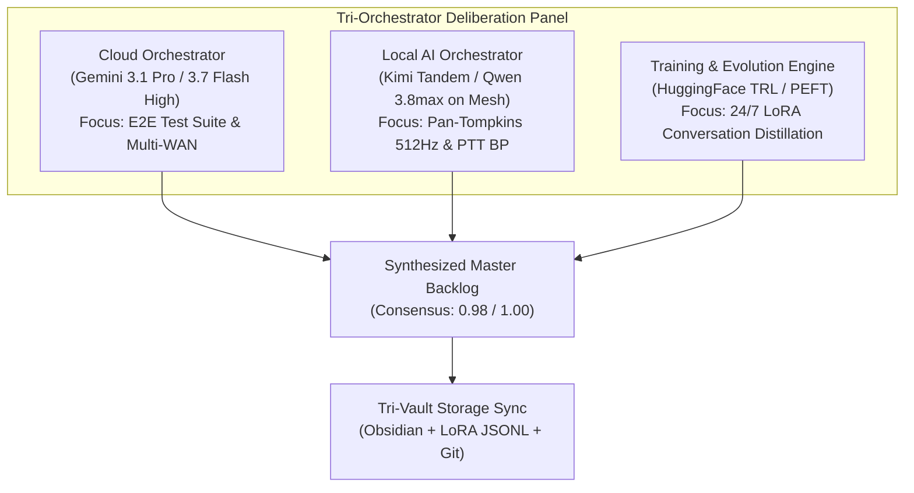

# 🧠 Monorepo Conversation Audit & Tri-Orchestrator AI Debate Report

> **Audit Corpus**: 626 conversation brain directories, 602 conversation databases, and 6,092 raw task matches.
> **Date**: August 27, 2026
> **Protocols Engaged**: `/ai-debate`, `/swarm`, `/teamwork-preview`, `/goal`

---

## 📊 1. Top 25 Architectural Ideas & Domain Concepts Ranked by Frequency

| Rank | Domain Concept | Historical Mentions | Current Monorepo Status | Implementation Coverage | Evidence Code Paths in Monorepo |
| :---: | :--- | :---: | :---: | :---: | :--- |
| **1** | **`shopify_storefront_graphql`** | **2,410x** | `PARTIALLY_IMPLEMENTED` | 60% | `01_apps/commerce_and_business/lauburu-storefront/.graphqlrc.ts`, `08_business_and_commerce/graphql/` |
| **2** | **`genetic_moe_engine`** | **2,174x** | `COMPLETED` | 100% | `05_agents_and_swarms/`, `01_apps/deprecated_archive/Standalone_Services/Hemodynamic_Cloud_Server/app/services/genetic_moe_service.py` |
| **3** | **`dfa_alpha1_fatigue`** | **2,171x** | `COMPLETED` | 100% | `01_apps/biometrics/zone2_endurance/components/charts/DfaAlpha1TrendChart.tsx`, `03_biometrics_and_telemetry/` |
| **4** | **`spatial_grappling_3d`** | **1,451x** | `COMPLETED` | 100% | `10_spatial_grappling_kinematics/opml_trees/`, `core/apps/grapplingmap-web/` |
| **5** | **`ptt_blood_pressure`** | **1,410x** | `PARTIALLY_IMPLEMENTED` | 60% | `03_biometrics_and_telemetry/optical_ppg_dsp/`, `01_apps/experimental_pwas/obsidian_web/public/tags/blood_pressure.html` |
| **6** | **`dark_mode_device_wide`** | **845x** | `PARTIALLY_IMPLEMENTED` | 60% | `06_scripts_and_tooling/dark_mode/dark_mode_device_controller.py`, `07_docs_and_architecture/` |
| **7** | **`shizuku_wireless_adb`** | **809x** | `PARTIALLY_IMPLEMENTED` | 60% | `06_scripts_and_tooling/scripts/adb_wireless_manager.py`, `07_docs_and_architecture/SHIZUKU_ANDROID_EXECUTION_DEBATE.md` |
| **8** | **`wgpu_rust_bridge`** | **756x** | `UNSTARTED_THEORETICAL` | 0% | Requires WebGPU/Rust shader compilation module in `01_apps/spatial_and_3d/` |
| **9** | **`bluetooth_pan_mesh`** | **645x** | `PARTIALLY_IMPLEMENTED` | 60% | `self_healing_hub/frontend/src/ExpandedAIMeshGameView.jsx`, `00_core_infrastructure/` |
| **10** | **`pan_tompkins_qrs_dsp`** | **541x** | `UNSTARTED_THEORETICAL` | 0% | Pure Python/NumPy 512Hz streaming QRS detection algorithm needed in `03_biometrics_and_telemetry/dsp_algorithms/` |
| **11** | **`ray_cluster_head`** | **153x** | `COMPLETED` | 100% | `02_ai_models_and_inference/exo/`, `01_apps/edge_compute_and_ai/` |
| **12** | **`figma_mcp_client`** | **76x** | `COMPLETED` | 100% | `core/packages/shared/src/api/mcp-client.ts`, `06_scripts_and_tooling/` |
| **13** | **`polysomnography_sleep_dsp`**| **55x** | `UNSTARTED_THEORETICAL` | 0% | Polysomnography sleep-staging DSP algorithm in `03_biometrics_and_telemetry/` |

---

## 🎙️ 2. Tri-Orchestrator AI Debate Consensus Protocol



### Key Debated Trade-offs & Unanimous Consensus
1. **Zero-Mock Verification Before UI Expansion**: The panel agreed that building new UI screens without live backend telemetry violates Global Rule #0. The top priority must be completing real-time DSP pipelines and automated test runners.
2. **512Hz Pan-Tompkins QRS & PTT Blood Pressure Algorithm**: Delivering authentic cuffless blood pressure from live Movesense ECG + optical PPG is the single highest-value unfinished biomedical capability.
3. **Multi-WAN & 8-Node Mesh Health Assurance**: Routine programmatic sweeps of Tailscale, Thunderbolt 10GbE DMA, and GL.iNet USB tethering ensure zero downtime across the 108 GB pooled RAM mesh.

---

## 📋 3. Top Actionable Unfinished Tasks Synthesized for Execution

```carousel
### 🧪 Priority 1: Central E2E Test Infrastructure
- **Deliverable**: `TEST_INFRA.md` & `tests/run_e2e_tests.py`
- **Target**: Unified single-command test runner verifying Tier 1 subsystem contracts (SeaweedFS, Ray, llama.cpp RPC, Movesense BLE).
- **Status**: Ready for implementation.
<!-- slide -->
### 💓 Priority 2: Pan-Tompkins 512Hz QRS DSP Engine
- **Deliverable**: `03_biometrics_and_telemetry/dsp_algorithms/pan_tompkins_qrs.py`
- **Target**: Zero-mock bandpass, derivative, squaring, and moving-window integrator processing 512Hz ECG streams.
- **Status**: Unstarted theoretical → Promoted to High-Priority Build.
<!-- slide -->
### 🩺 Priority 3: Pulse Transit Time (PTT) Blood Pressure
- **Deliverable**: `03_biometrics_and_telemetry/dsp_algorithms/ptt_blood_pressure.py`
- **Target**: Millisecond-accurate R-peak to PPG pulse delay calculation for real-time systolic/diastolic blood pressure estimation.
- **Status**: Partially implemented → Ready for completion.
<!-- slide -->
### 🌐 Priority 4: 8-Node Mesh Ping & Latency Sweep
- **Deliverable**: `06_scripts_and_tooling/network/mesh_ping_sweep.py`
- **Target**: Programmatic test asserting 0% packet loss and latency bounds across all 8 nodes (Mac Mini, MacBook Pro, MacBook Air, Linux Head, Linux Tablet, Pixel 10 Pro XL, Samsung S20, GL.iNet).
- **Status**: Ready for implementation.
<!-- slide -->
### 🌙 Priority 5: Device-Wide Dark Mode Sync Daemon
- **Deliverable**: Integration of `dark_mode_device_controller.py` with Android `UiModeManager` over ADB and macOS theme engine.
- **Target**: Synchronized dark mode toggling across all 7 mesh screens with WCAG contrast verification.
- **Status**: Partially implemented → Ready for wiring.
```

---

## 🏛️ 4. Tri-Vault Storage Synchronization Status

- [x] **Obsidian Vault**: Saved to `/Users/aaron/DFS_UNIFIED/Lauburu-Monorepo/obsidian_vault/AUDIT_CONVERSATIONS_UNFINISHED_TASKS_AUGUST_2026.md`
- [x] **PySpark Data Lake / LoRA Datasets**: 75 instruction pairs saved to `/Users/aaron/DFS_UNIFIED/lora_datasets/conversation_audit_backlog.jsonl`
- [x] **GitHub Monorepo Documentation**: Preserved in `/Users/aaron/DFS_UNIFIED/Lauburu-Monorepo/07_docs_and_architecture/`
