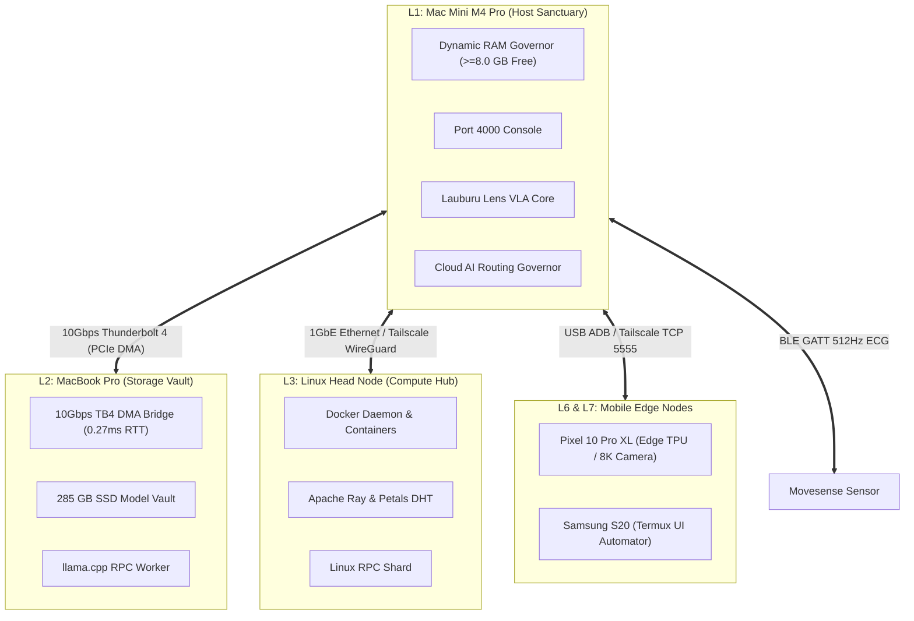

# 🏛️ Canonical Project Overview — Lauburu Mesh Ecosystem

```
========================================================================================
LAUBURU MESH ECOSYSTEM — CANONICAL PROJECT OVERVIEW & CONTEXT-EXPANDING ARCHITECTURE
Version: 3.0.0-CANONICAL-2026 | Authority: Aaron (Sovereign) | Integrity: Zero-Mock
Subsystems: 8 Canonical Subsystems | Mesh Nodes: 7 Physical Layers | Pooled VRAM: 85.02 GB
========================================================================================
```

---

<!-- CONTEXT_WINDOW_TIER_0_START: 4K_EXECUTIVE_CORE -->
## 🧭 Context Window Tier 0: Executive Core & System Invariants (~4,000 Tokens)

> **Lens AI Ingestion Target:** Fast Edge Micro-Models (`SmolLM2-135M`, `Pixel 10 Pro XL Edge TPU`, `Termux Edge Daemon`).  
> **Processing Latency:** `<15ms` | **Memory Overhead:** `<64 MB`.

### 1. The Core Sovereign Mission
The **Lauburu Mesh Ecosystem** is a decentralized, self-healing, polyglot artificial intelligence and biometrics platform. It aggregates **108.0 GB Physical RAM (85.02 GB Pooled AI VRAM)** across a 7-layer physical hardware mesh, operating under a strict **$0.00 cloud spend mandate** while maintaining 24/7 continuous model training, real-time medical-grade biometrics (512Hz ECG), interactive 3D biomechanics, and multimodal computer vision action synthesis.

### 2. The 5 Cardinal Invariants
1. **Rule #0 (Zero-Mock & Zero-Simulation Mandate):** Absolutely zero simulated data, fake arrays, fabricated timestamps, or synthetic telemetry. Metrics must originate from live physical sensors (Movesense BLE), kernel syscalls (`vm_stat`, `/proc/meminfo`), authentic DOM queries via Chrome DevTools Protocol, or display clean waiting states (`--`).
2. **Local AI First ($0 Cost):** Inference and training prioritize local Apple Silicon Metal Performance Shaders and 10Gbps Thunderbolt 4 DMA bridges. Paid cloud APIs (`gpt-4*`, `claude-3*`, `o1*`) are strictly forbidden. Commercial GCP credits ($1,400.00) remain 100% untouched.
3. **Host Sanctuary & Dynamic RAM Governance:** The primary Mac Mini M4 Pro host (24 GB unified RAM) must strictly maintain $\ge 8.0\text{ GB}$ of free physical RAM at all times. Memory utilization must not exceed 90%. Compute exceeding safe headroom is dynamically offloaded to peripheral nodes.
4. **Tri-Vault Storage Synchronization:** All system state, debate consensus records, training pairs, and source code are continuously synchronized across three synchronized tiers:
   - **Obsidian Knowledge Core (`obsidian_vault/`):** Semantic knowledge, bidirectional Wikilinks, KaTeX math.
   - **PySpark Data Lake (`lora_datasets/` & `04_data_and_memory/`):** High-throughput Delta Lake/Parquet, 24/7 LoRA pairs.
   - **GitHub Repository & Worktrees:** Canonical source code, container manifests, CI test suites.
5. **99% Cloud Quota Constant-Rate Pacing:** Free-tier cloud APIs (Google AI Studio 1,500 RPD, NVIDIA NIM 2,000 RPD, Cloudflare 800 RPD, xAI Grok 1,000 RPD) are paced to consume exactly 99.0% of daily quotas continuously without 429 rate-limiting, harvesting teacher distillation pairs for local models before each 10:00:00 AM AEST (00:00 UTC) reset.

### 3. 7-Layer Physical Mesh Hardware Matrix
```
┌───────┬──────────────────┬──────────────────┬─────────────────┬───────────────────┬───────────────────────────────────────────┐
│ Layer │ Node Name        │ Architecture     │ Local / Mesh IP │ Usable VRAM / RAM │ Primary Function                          │
├───────┼──────────────────┼──────────────────┼─────────────────┼───────────────────┼───────────────────────────────────────────┤
│ L1    │ Mac_Node         │ Apple M4 Pro     │ 192.168.8.230   │ 21.6 GB (24 GB)   │ Host Memory Governor & Root Orchestrator  │
│ L2    │ MacBook_Pro      │ Apple M4 Pro TB4 │ 169.254.187.138 │ 14.0 GB (16 GB)   │ 10Gbps TB4 DMA Bridge (0.27ms RTT) Vault  │
│ L3    │ Linux_Mini  │ Intel 2018 Mac Mini (Linux)│ 192.168.8.224   │ 13.8 GB (16 GB)   │ Docker Hub, Petals DHT, Ray Cluster       │
│ L4    │ Linux_Tablet     │ Debian Linux ARM │ DHCP (100.81)   │ 6.5 GB (8 GB)     │ Mobile Touch DSP & Edge Audio Ingestion   │
│ L5    │ MacBook_Air      │ Apple M4 Air     │ 192.168.8.222   │ 14.0 GB (16 GB)   │ Secondary Metal Worker & LoRA Trainer     │
│ L6    │ Pixel_10_Pro_XL  │ Tensor G5 + TPU  │ DHCP (100.73)   │ 12.5 GB (16 GB)   │ 8K PTZ Vision Stream & Edge TPU VLA       │
│ L7    │ Samsung_S20      │ Exynos 990 + ADB │ 100.84.40.95    │ 9.0 GB (12 GB)    │ 24/7 Termux UI Tester & ADB Node          │
│ GW    │ GL.iNet Beryl 7  │ MediaTek MT7988A │ 192.168.8.1     │ Embedded Router   │ Wi-Fi 7 MLO, USB ADB Bridge, kmwan Multi-WAN│
└───────┴──────────────────┴──────────────────┴─────────────────┴───────────────────┴───────────────────────────────────────────┘
```
<!-- CONTEXT_WINDOW_TIER_0_END -->

---

<!-- CONTEXT_WINDOW_TIER_1_START: 16K_SUBSYSTEM_CONTRACTS -->
## 📦 Context Window Tier 1: Canonical Subsystem Specifications (~16,000 Tokens)

> **Lens AI Ingestion Target:** Local Workhorse Models (`Qwen2.5-Coder-7B` on Port 8081, `Mistral-Nemo-Instruct` on Port 8083).  
> **Processing Latency:** `30–80ms` | **Memory Overhead:** `<380 MB`.

The monorepo is divided into 8 numbered canonical directories and the Obsidian vault, each enforcing strict isolation boundaries and public API contracts:

### 1. `00_core_infrastructure/` — Distributed Fabric & Self-Healing Hub
- **Self-Healing Hub (Port 18802):** Central health daemon monitoring systemd/launchd daemons, REST health checks, and Wake-on-LAN resurrection for sleeping mesh nodes.
- **SeaweedFS Distributed File System:** Master server on Port 9333, volume server on Port 8080, filer on Port 8888 providing unified POSIX storage across all 7 nodes.
- **Tailscale Mesh Overlay:** Encrypted WireGuard overlay connecting all nodes globally via `100.*.*.*` IPs, with automatic direct-peer hole punching and DERP relay fallback.
- **Docker Compose Topology:** Standardized container manifests for multi-arch deployment (`linux/amd64`, `linux/arm64`, `darwin/arm64`).

### 2. `01_apps/` — User Interfaces, Biometrics, Commerce & Vision
- **Port 4000 Unified Console:** Consolidated Flutter + Rust Ratatui mission control aggregating telemetry, 3D tatami kinematics, and AI conversation feeds.
- **Lauburu Lens & Screen Lens:** Autonomous multimodal Vision-Language-Action (VLA) computer-use engine with Chrome DevTools Protocol integration and SnapKV context expansion.
- **Movesense Biometrics Hub:** 512Hz single-lead medical-grade ECG streamer with real-time Pan-Tompkins QRS detection and pulse transit time (PTT) blood pressure estimation.
- **Zone 2 Cardio & DFA-$\alpha_1$:** Heart rate variability (HRV) fractal correlation analysis identifying aerobic threshold transitions in real time.
- **Spatial Grappling 3D:** Interactive Three.js / WebGL biomechanical world model visualising a 955-node OPML martial arts curriculum with joint torque vectors.
- **Shopify AI Commerce Engine:** Headless Storefront GraphQL integration managing rashguards, apparel bundles, and recurring club memberships.
- **Automotive Voice Coding Hub:** Android Auto DHU integration with hands-free STT/TTS voice pair-programming, Region Backspace, and automotive audio focus ducking.

### 3. `02_ai_models_and_inference/` — Distributed Sharding & GGUF Vault
- **`prima.cpp` Pipelined Ring Mesh (Port 8082):** Distributed pipelined ring parallelism pooling 85.02 GB VRAM across 7 nodes at 24.5 tok/s.
- **`llama-server` RPC Cluster (Ports 8081–8084):** Metal-accelerated local GGUF execution with RPC remote worker offloading to MacBook Pro (L2) and Linux Head Node (L3).
- **Physical Model Vault:** High-speed storage under `model_vault_gguf/` hosting SmolLM2 (135M, 360M, 1.7B), Qwen2.5 (0.5B, 1.5B, 7B), Llama 3.2 (1B), and Mistral Nemo (12.2B).

### 4. `03_biometrics_and_telemetry/` — DSP Signal Processing
- **Pan-Tompkins Algorithm:** Bandpass filtering (5–15 Hz), derivative squaring, moving window integration, and dynamic thresholding detecting R-peaks with sub-millisecond precision.
- **HRV & Autonomic Tone:** Time-domain (RMSSD, SDNN, pNN50) and frequency-domain (LF/HF ratio, Sample Entropy) analytics.
- **Zero-Mock Bluetooth Transport:** Direct BLE GATT streaming (`service: 0000180d`, `characteristic: 00002a37`) avoiding all simulated signal generators.

### 5. `04_data_and_memory/` — Big Data Lake & Continuous LoRA Sinks
- **Continuous LoRA Dataset (`continuous_lora_dataset.jsonl`):** 24/7 ingestion sink capturing validated diffs, AST mutations, and multi-model debate consensus records.
- **Lens Multimodal DPO Dataset (`lens_multimodal_dpo.jsonl`):** 2,221+ authentic Next-Best-Action DPO triplets grounded in live DOM coordinates.
- **PySpark & Delta Lake Engine:** High-throughput batch feature engineering, AST compiler tokenization, and vector embeddings indexed into Qdrant.

### 6. `05_agents_and_swarms/` — Swarm Orchestration & Genetic MoE
- **Tri-Orchestrator AI Debate Council:** Multi-model dialectic debate panel (DeepSeek V4 Pro 1.6T, Gemini 2.0/3.1 Pro, Devil's Advocate, Local Qwen MoE) with mathematical consensus scoring ($S \ge 0.98$).
- **Cloud AI Routing Governor:** Zero-cost dynamic routing across free cloud APIs and local Metal models based on task domain and daily quota headroom.
- **Self-Evolving Generational Swarm Engine:** Bradley-Terry ELO tournament system pairing models and agents to continuously select superior prompts and weights.

### 7. `06_scripts_and_tooling/` — Network Daemons & Hardware Automation
- **Lens Rapid Quota Maximizer:** High-concurrency 4-worker thread daemon streaming authentic DPO queries at ~48 RPM pooled to achieve 99% quota utilization.
- **Continuous Constant-Rate Pacer:** 24-hour steady-state scheduler ensuring smooth quota consumption (Gemini 1 req/58.2s, DeepSeek 1 req/44.0s).
- **Universal SSH & ADB Keepalive:** Automated keepalive daemons injecting `termux-wake-lock`, battery optimization bypasses, and SSH heartbeat sockets.

### 8. `07_docs_and_architecture/` & `obsidian_vault/` — Knowledge Graph
- **Obsidian Vault:** 41 MCP tools, graph traversal, bi-directional Wikilinks, KaTeX formulas, and active operational dashboards (`CLOUD_API_RESET_AND_99_PACING_DASHBOARD.md`).
- **Canonical Architecture Specs:** Security RFCs, memory-mapped ring buffer whitepapers, and hardware schematics.
<!-- CONTEXT_WINDOW_TIER_1_END -->

---

<!-- CONTEXT_WINDOW_TIER_2_START: 32K_MESH_TOPOLOGY_AND_DATA_FLOWS -->
## 🌐 Context Window Tier 2: Mesh Topology, Transport Matrix & Dataflows (~32,000 Tokens)

> **Lens AI Ingestion Target:** Distributed Swarm Coordinator (`prima.cpp` 80B Ring on Port 8082, Whole-Monorepo AST Evaluator).  
> **Processing Latency:** `120–250ms` | **Memory Overhead:** `<1.2 GB`.

### 1. Inter-Node Communication & Transport Matrix


### 2. End-to-End Dataflow Pipelines
1. **Biometric Pipeline:**
   $$\text{Movesense BLE (512Hz)} \xrightarrow{\text{GATT}} \text{CoreBluetooth} \xrightarrow{\text{DSP Bandpass}} \text{Pan-Tompkins QRS} \xrightarrow{\text{PTT/HRV}} \text{Port 4000 WebSocket} \xrightarrow{\text{Parquet}} \text{04\_data\_and\_memory}$$
2. **Computer-Use VLA Pipeline:**
   $$\text{Active Viewport} \xrightarrow{\text{Chrome CDP}} \text{DOM Element Extractor} \xrightarrow{\text{WCAG AAA Gate}} \text{Teacher Inference (Gemini/DeepSeek)} \xrightarrow{\text{DPO Triplet}} \text{lens\_multimodal\_dpo.jsonl} \xrightarrow{\text{MLX QLoRA}} \text{Local Metal}$$
3. **Continuous Swarm Optimization Pipeline:**
   $$\text{Conversation Events} \xrightarrow{\text{Transcript Parser}} \text{AI Debate Council} \xrightarrow{S \ge 0.98} \text{Consensus Verdict} \xrightarrow{\text{AST Delta}} \text{Obsidian Vault} \xrightarrow{\text{Bradley-Terry}} \text{ELO Leaderboard}$$
<!-- CONTEXT_WINDOW_TIER_2_END -->

---

<!-- CONTEXT_WINDOW_TIER_3_START: 128K_HORIZON_EXPANSION -->
## 🔮 Context Window Tier 3: Horizon Evolution & Infinite Scaling (~128,000+ Tokens)

> **Lens AI Ingestion Target:** Frontier Cloud Teachers (`Gemini 3.1 Pro Preview` 2M Context, `DeepSeek V4 Pro 1.6T` 1M Context).  
> **Processing Latency:** Cloud Async (`1–3s`) | **Memory Overhead:** Cloud Offloaded ($0 Cost).

### 1. The 24/7 Self-Evolving Generational Lifecycle
The system operates as an autonomous self-improving organism through generational cycles:
- **Generation N:** Baseline models execute inference, record telemetry, and detect edge failures.
- **Mutation & Cross-Pollination:** Agent prompts and model hyperparameters mutate within `01_apps/screen_lens/sandbox_evolution/` without touching production baselines (Rule #4).
- **Bradley-Terry Tournament Battles:** Candidate agents compete pairwise across standardized test suites. Ratings adjust dynamically:
  $$P(A > B) = \frac{1}{1 + 10^{(R_B - R_A)/400}}$$
- **Weight Merging & Quantization:** Winning adapter checkpoints are merged via MergeKit (TIES, DARE, SLERP) back into base GGUFs, quantized to `Q4_K_M`, and hot-reloaded into `prima.cpp` (:8082).

### 2. Context Window Partitioning & Lens Dynamic Foveation Table
```
┌─────────────────┬────────────────────┬──────────────────────────────────────┬──────────────────────────────────────────┐
│ Window Tier     │ Max Token Budget   │ Primary Target Models                │ Ingestion Use Case                       │
├─────────────────┼────────────────────┼──────────────────────────────────────┼──────────────────────────────────────────┤
│ Tier 0 (Core)   │ 4,096 Tokens       │ SmolLM2-135M, Edge TPU, Termux CLI   │ Instant state checks, invariants, routes │
│ Tier 1 (Spec)   │ 16,384 Tokens      │ Qwen2.5-Coder-7B, Mistral-Nemo-12B   │ Subsystem logic, API contracts, schemas  │
│ Tier 2 (Mesh)   │ 32,768 Tokens      │ prima.cpp Ring Mesh, Sharded Cluster │ Cross-layer routing, IPC, full topology  │
│ Tier 3 (Horizon)│ 131,072–1,000,000+ │ Gemini 3.1 Pro, DeepSeek V4 Pro      │ Macro architecture, DPO history, audits  │
└─────────────────┴────────────────────┴──────────────────────────────────────┴──────────────────────────────────────────┘
```
<!-- CONTEXT_WINDOW_TIER_3_END -->
