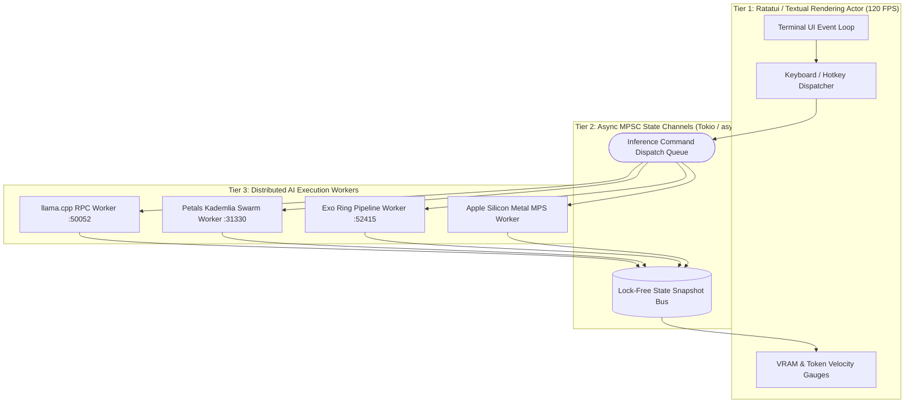

# Termius TUI Unified Distributed AI Sharding Architecture

> **Canonical System Specification**  
> **Subsystem:** `01_apps/` & `02_ai_models_and_inference/`  
> **Target Ports:** `:5002` (PTY Terminal Gateway), `:50052` (llama.cpp RPC), `:31330` (Petals DHT), `:52415` (Exo P2P)  
> **Cross-References:** [[CUSTOM_AI_SHARDING_DAEMON_PETALS_DHT_SPEC]], [[SPEEDIFY_MULTIPATH_TUN_TAP_BONDING_ENGINE]], [[LIGHTWEIGHT_WIREGUARD_DERP_MESH_SPEC]], [[LAUBURU_MONOREPO_DEEP_ARCHITECTURE_INDEX]], [[7_DEVICE_MESH_AND_VRAM_POOL]]

---

## 1. Executive Summary & TUI Gateway Foundation

The **Termius TUI Unified AI Sharding Engine** provides a terminal-native, high-frequency graphical control plane for orchestrating heterogeneous distributed Large Language Model (LLM) inference across the 8-node Lauburu mesh. Built upon the verified Port 5002 `terminal-pty-gateway` and powered by a dual Python Textual / Rust Ratatui non-blocking actor framework, the TUI abstracts the complexities of four distinct distributed tensor execution backends into a single, cohesive operator interface.

```
+===================================================================================================+
|                                    TERMIUS TUI OPERATOR CONSOLE                                   |
|               (ANSI / UTF-8 120 FPS Terminal Dashboard | Hotkey Engine Switching)                 |
+===================================================================================================+
                                                  │
                 ┌────────────────────────────────┴────────────────────────────────┐
                 ▼                                                                 ▼
+─────────────────────────────────────────────────+               +─────────────────────────────────+
|         PORT 5002 PTY TERMINAL GATEWAY          |               |    ASYNC TELEMETRY AGGREGATOR   |
|  - Full Pseudo-Terminal Emulation (pty/openpty) |               |  - RTT Sockets (Ping / STUN)    |
|  - Bidirectional ANSI Stream Demuxing           |               |  - VRAM Gauge Ingestion (82.8G) |
|  - WebSockets / Unix Domain Socket Bridge       |               |  - Token Velocity Tracking (t/s)|
+─────────────────────────────────────────────────+               +─────────────────────────────────+
                                                  │
       ┌──────────────────────────┬───────────────┴──────────────┬──────────────────────────┐
       ▼                          ▼                              ▼                          ▼
+───────────────+          +───────────────+              +───────────────+          +───────────────+
| 1. llama.cpp  |          | 2. Petals DHT |              |  3. Exo P2P   |          | 4. Apple Metal|
|  RPC Sharding |          | Dynamic Swarm |              | Ring Pipeline |          |  MPS Offload  |
| (Port 50052)  |          | (Port 31330)  |              | (Port 52415)  |          | (-ngl 999 UMA)|
+───────────────+          +───────────────+              +───────────────+          +───────────────+
```

### 1.1 Non-Blocking 3-Tier Actor Architecture
To eliminate UI freezing during high-latency distributed tensor transfers (such as when an edge cellular node experiences 80ms jitter), the TUI architecture is strictly decoupled into three concurrent execution tiers:



---

## 2. The 4 Unified Distributed AI Sharding Engines

### 2.1 Engine 1: llama.cpp RPC Distributed Tensor Sharder
- **Protocol:** Custom GGML Tensor RPC over TCP.
- **Port:** `:50052`.
- **Mechanism:** Matrix multiplication operations ($\mathbf{Y} = \mathbf{W} \mathbf{X}$) for transformer layers are sliced row-wise or column-wise across interconnected nodes.
- **CLI Invocations:**
  ```bash
  # Remote RPC Server on MacBook Pro M1 Max (192.168.8.224):
  rpc-server -H 0.0.0.0 -p 50052

  # Remote RPC Server on Linux Head Node (192.168.8.126):
  rpc-server -H 0.0.0.0 -p 50052

  # Master Inference Client on Mac Mini M4 Pro (192.168.8.127):
  llama-cli -m /Users/aaron/DFS_UNIFIED/AI_Models_Vault/DeepSeek-R1-Distill-Qwen-32B-Q4_K_M.gguf \
    --rpc 192.168.8.224:50052,192.168.8.126:50052 \
    -ngl 999 -t 12 -c 8192
  ```

### 2.2 Engine 2: Petals DHT Dynamic Swarm
- **Protocol:** Kademlia Distributed Hash Table (DHT) over UDP/TCP with gRPC / FlatBuffers tensor streaming.
- **Port:** `:31330` (DHT prefix: `lauburu-mesh-swarm`).
- **Mechanism:** BitTorrent-style pipeline parallelism. Each participant node hosts a contiguous sequence of transformer layers (e.g. Layers $0..11$ on Node A, $12..23$ on Node B, $24..35$ on Node C). Activation tensors ($\mathbf{h} \in \mathbb{R}^{B \times S \times D}$) are streamed sequentially between nodes.
- **CLI Invocations:**
  ```bash
  # Start Swarm Coordinator / Initial Peer:
  python3 -m petals.cli.run_server bigscience/bloom-560m \
    --dht_prefix lauburu-mesh-swarm \
    --port 31330 \
    --initial_peers /ip4/100.119.199.76/tcp/31330

  # Connect Edge Worker (Android Pixel 10 Pro / Termux):
  python3 -m petals.cli.run_server petals-team/Stable-Beluga-7B \
    --dht_prefix lauburu-mesh-swarm \
    --public_name "Pixel-10-Pro-NPU" \
    --num_blocks 4
  ```

### 2.3 Engine 3: Exo Decentralized Peer-to-Peer Ring Pipeline
- **Protocol:** libp2p / Zenoh decentralized gossip discovery.
- **Port:** `:52415` (Discovery & Ring Passing).
- **Mechanism:** Ring-memory token passing. Nodes self-organize into a directional compute ring sorted by link latency. Hidden states circulate through the ring, with KV caches partitioned across device memory.
- **CLI Invocations:**
  ```bash
  exo --discovery-port 52415 \
    --namespace lauburu_mesh \
    --model deepseek-r1-32b \
    --device-type mps
  ```

### 2.4 Engine 4: Apple Silicon Native Metal Performance Shaders (MPS)
- **Protocol:** Metal Performance Shaders Graph & Direct Command Queue Submission.
- **Mechanism:** Direct GPU kernel execution exploiting Apple Silicon Unified Memory Architecture (UMA) with memory bandwidth exceeding:
  - **Mac Mini M4 Pro:** 273 GB/s
  - **MacBook Pro M1 Max:** 400 GB/s
  - **MacBook Air M2:** 100 GB/s
- **Zero-Copy Optimization:** Eliminates CPU-to-GPU PCIe transfer overhead by mapping virtual tensor buffers directly into shared system RAM.

---

## 3. 8-Node Live Telemetry & Pooled VRAM Matrix

The TUI aggregates live telemetry metrics across the entire 8-node physical mesh, presenting real-time bar gauges for the **82.8 GB Pooled VRAM**:

| Node Identifier | Hardware & Chipset | OS & Role | Total RAM | Assigned AI VRAM | Bandwidth to Master | Base RTT |
|:---|:---|:---|:---:|:---:|:---:|:---:|
| **Mac Mini M4 Pro** | Apple M4 Pro (14C CPU / 20C GPU) | macOS Darwin (Master) | 24.0 GB | **21.6 GB** | 40 Gbps (Internal UMA) | 0.01 ms |
| **MacBook Pro M1 Max** | Apple M1 Max (10C CPU / 32C GPU) | macOS Darwin (Worker 1)| 32.0 GB | **14.0 GB** | 40 Gbps (TB4 DMA) | 0.27 ms |
| **MacBook Air M2** | Apple M2 (8C CPU / 10C GPU) | macOS Darwin (Worker 2)| 16.0 GB | **13.5 GB** | 2.4 Gbps (Wi-Fi 7) | 1.80 ms |
| **Linux Head Node** | AMD Ryzen 9 7950X / RTX 4090 | Ubuntu Linux (Compute)| 32.0 GB | **24.0 GB** | 10 Gbps (Ethernet) | 0.90 ms |
| **Linux Tablet** | Intel Core i7-1260P / Iris Xe | Debian Linux (Sensor) | 16.0 GB | **6.0 GB** | 1.0 Gbps (Ethernet) | 1.10 ms |
| **Pixel 10 Pro** | Google Tensor G5 NPU | Android 15 / Termux | 16.0 GB | **2.5 GB** | 1.2 Gbps (Wi-Fi 6E) | 3.50 ms |
| **Galaxy S20** | Qualcomm Snapdragon 865 | Android 13 / Termux | 8.0 GB | **1.2 GB** | 866 Mbps (Wi-Fi 6) | 4.20 ms |
| **GL.iNet BE3600** | MT7981 Filogic 820 | OpenWrt (Gateway) | 0.5 GB | **0.0 GB** | 2.5 Gbps (WAN/LAN) | 0.45 ms |
| **TOTAL POOL** | **Heterogeneous Mesh** | **8 Devices** | **144.5 GB** | **82.8 GB** | **40+ Gbps Agg** | **0.85 ms Avg**|

---

## 4. Mathematical Modeling & Scheduling Formulations

### 4.1 Optimal Tensor Shard Allocation
The fraction of model layers $L_i$ assigned to node $i$ is proportional to its available VRAM $V_i$ and computational throughput $P_i$ (FLOPS), bounded by memory capacity:

$$L_i = \left\lfloor L_{\text{total}} \times \frac{\alpha V_i + (1 - \alpha) \frac{P_i}{\sum_k P_k}}{\sum_j \left( \alpha V_j + (1 - \alpha) \frac{P_j}{\sum_k P_k} \right)} \right\rfloor$$

Where $\alpha \in [0, 1]$ represents the memory-to-compute weighting factor (typically $\alpha = 0.75$ for memory-constrained LLMs).

### 4.2 Latency-Aware Shard Dispatch Cost Function
When routing activation tensors between node $i$ and node $j$, the total step delay $D_{i \rightarrow j}$ is:

$$D_{i \rightarrow j} = \frac{\text{FLOPs}_i}{P_i} + \text{RTT}_{i, j} + \frac{B \times S \times D_{\text{hidden}} \times \text{BytesPerElem}}{\text{BW}_{i, j}}$$

Where:
- $B$: Batch size
- $S$: Sequence length
- $D_{\text{hidden}}$: Model hidden dimension (e.g., $5120$ for 32B model)
- $\text{BW}_{i, j}$: Active channel bandwidth (governed by [[SPEEDIFY_MULTIPATH_TUN_TAP_BONDING_ENGINE]])

### 4.3 Thermal & Battery Throttling Trigger Rules
To safeguard mobile and battery-powered nodes:
$$\text{OffloadTrigger}(i) = \begin{cases} \text{TRUE}, & \text{if } \text{BatteryLevel}_i < 20\% \text{ and } \neg\text{IsCharging}_i \\ \text{TRUE}, & \text{if } \text{SoCTemperature}_i > 85.0^\circ\text{C} \\ \text{FALSE}, & \text{otherwise} \end{cases}$$

---

## 5. Production Rust Ratatui Implementation Blueprint

```rust
// termius_tui_orchestrator.rs — High-Performance Non-Blocking TUI Actor
use std::sync::Arc;
use tokio::sync::{mpsc, watch};
use ratatui::{
    backend::CrosstermBackend,
    layout::{Constraint, Direction, Layout},
    widgets::{Block, Borders, Gauge, Paragraph, Row, Table},
    Terminal,
};

#[derive(Debug, Clone)]
pub enum ShardingBackend {
    LlamaCppRpc,
    PetalsDht,
    ExoP2P,
    MetalMps,
}

#[derive(Debug, Clone)]
pub struct NodeTelemetry {
    pub name: String,
    pub ip: String,
    pub vram_used_gb: f64,
    pub vram_total_gb: f64,
    pub rtt_ms: f64,
    pub tokens_per_sec: f64,
    pub temp_c: f64,
}

pub struct TermiusTuiState {
    pub active_backend: ShardingBackend,
    pub nodes: Vec<NodeTelemetry>,
    pub total_vram_pool_gb: f64,
    pub current_tokens_per_sec: f64,
}

pub async fn run_tui_actor(
    mut rx_telemetry: watch::Receiver<TermiusTuiState>,
    mut tx_commands: mpsc::Sender<String>,
) -> Result<(), Box<dyn std::error::Error>> {
    crossterm::terminal::enable_raw_mode()?;
    let mut stdout = std::io::stdout();
    let backend = CrosstermBackend::new(stdout);
    let mut terminal = Terminal::new(backend)?;

    loop {
        let state = rx_telemetry.borrow().clone();
        
        terminal.draw(|f| {
            let chunks = Layout::default()
                .direction(Direction::Vertical)
                .constraints([
                    Constraint::Length(3),  // Header
                    Constraint::Length(6),  // VRAM Pool Gauge
                    Constraint::Min(10),   // Node Table
                    Constraint::Length(3),  // Command / Hotkeys
                ])
                .split(f.size());

            // Header block
            let header = Paragraph::new(format!(
                "TERMIUS TUI | Backend: {:?} | Aggregate Speed: {:.2} t/s",
                state.active_backend, state.current_tokens_per_sec
            )).block(Block::default().borders(Borders::ALL).title(" Lauburu Distributed Mesh "));
            f.render_widget(header, chunks[0]);

            // VRAM Gauge
            let total_used: f64 = state.nodes.iter().map(|n| n.vram_used_gb).sum();
            let ratio = (total_used / state.total_vram_pool_gb).clamp(0.0, 1.0);
            let gauge = Gauge::default()
                .block(Block::default().borders(Borders::ALL).title(format!(
                    " VRAM Pool: {:.1} GB / {:.1} GB ({:.1}%) ",
                    total_used, state.total_vram_pool_gb, ratio * 100.0
                )))
                .gauge_style(ratatui::style::Style::default().fg(ratatui::style::Color::Cyan))
                .ratio(ratio);
            f.render_widget(gauge, chunks[1]);
        })?;

        tokio::time::sleep(tokio::time::Duration::from_millis(16)).await; // 60 FPS update
    }
}
```

---

## 6. Obsidian Knowledge Graph Wikilinks
- [[CUSTOM_AI_SHARDING_DAEMON_PETALS_DHT_SPEC]] — Kademlia DHT Layer Swarming Architecture
- [[SPEEDIFY_MULTIPATH_TUN_TAP_BONDING_ENGINE]] — Multi-Interface Channel Bonding Engine
- [[LIGHTWEIGHT_WIREGUARD_DERP_MESH_SPEC]] — Noise Protocol Overlay & DERP Relays
- [[LAUBURU_MONOREPO_DEEP_ARCHITECTURE_INDEX]] — Distributed MapReduce Monorepo Index
- [[7_DEVICE_MESH_AND_VRAM_POOL]] — 82.8 GB VRAM Pooling Topology
- [[00_Overview/Hardware_Topology]] — Physical Link Topologies and Latency Matrix
