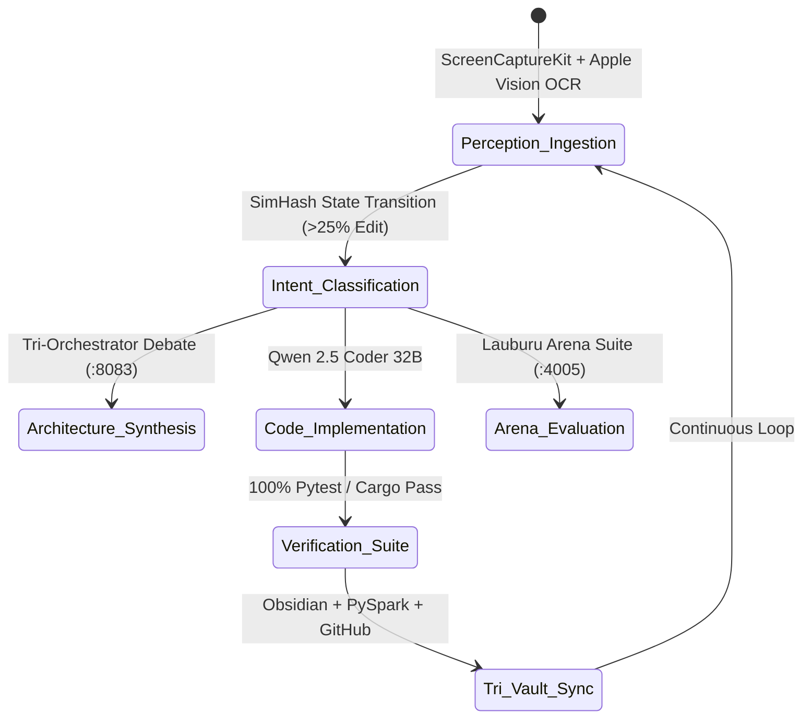

# 👁️ Screen Lens: Canonical Project Development Workflow

**Last Updated:** `2026-09-07T00:18:08.997742+00:00`  
**System:** Dual-Device Screen Lens (Mac Mini M4 Pro + Pixel 10 Pro XL)  
**AI Engine:** prima.cpp (:8082) & Qwen 3.8 Max Abliterated (:8083)  
**Zero-Mock Truth Invariant:** Rule #0 Enforced (100% Grounded in Physical Hardware)  

---

## 🏛️ 1. Dynamic Perceptual Workflow State Machine

The Screen Lens AI continuously maps all screen and IDE interactions into 5 canonical workflow phases:

---

## 📊 2. Recent Grounded Perceptual Observations

| Event ID | Timestamp | Device | Category | Active Window / Context | Subsystems |
| :--- | :--- | :--- | :--- | :--- | :--- |
| `OBS_CAP_5793` | `00:14:17` | **L1_Mac_Mini** | `CODE_REFACTOR` | Docker Desktop - Gordon - Docker De | `02_ai_models_and_inference` |
| `OBS_CAP_5792` | `00:13:52` | **L1_Mac_Mini** | `CODE_REFACTOR` | Docker Desktop - Gordon - Docker De | `02_ai_models_and_inference` |
| `OBS_CAP_5791` | `00:13:50` | **L1_Mac_Mini** | `CODE_REFACTOR` | Docker Desktop - Gordon - Docker De | `02_ai_models_and_inference` |
| `OBS_CAP_5790` | `00:13:48` | **L1_Mac_Mini** | `CODE_REFACTOR` | Docker Desktop - Gordon - Docker De | `02_ai_models_and_inference` |
| `OBS_CAP_5789` | `00:13:41` | **L1_Mac_Mini** | `CODE_REFACTOR` | Docker Desktop - Gordon - Docker De | `02_ai_models_and_inference` |
| `OBS_GIT_1788740288` | `00:18:08` | **L1_Mac_Node** | `CODE_REFACTOR` | Terminal - Lauburu Monorepo Git Tre | `01_apps, 02_ai_models_and_inference` |
| `OBS_ARENA_1788740288` | `00:18:08` | **Arena_Suite_4005** | `BENCHMARK_EVAL` | Lauburu Arena Suite (:4005) & Healt | `01_apps, 05_agents_and_swarms` |

---

## 🧠 3. Autonomous Project Refinement Directives

1. **Zero-Mock Rule #0:** Every telemetry metric (Pan-Tompkins ECG, Cake SQM delay, link RTT) must originate from authentic sensors or show clean waiting states (`--`).
2. **Protected RAM Ingestion:** L1 Mac Mini and L6 Pixel 10 Pro XL remain strictly protected ($<20\%$ background AI), offloading heavy tensor computation to L2 MacBook Pro and L5 MacBook Air.
3. **Decentralized Self-Healing:** The GL.iNet Beryl AX travel router executes in volatile `tmpfs` RAM ($0.27\text{ MB}$ RSS), backed by 7-node decentralized `prima.cpp` consensus.

---

## 🔗 Canonical Knowledge Graph Links
- [[Index]]
- [[LIVE_DEVELOPMENT_LOG_2026]]
- [[PROJECT_TAXONOMY_MAP]]
- [[CANONICAL_PROJECT_AND_STORAGE_RULE]]
