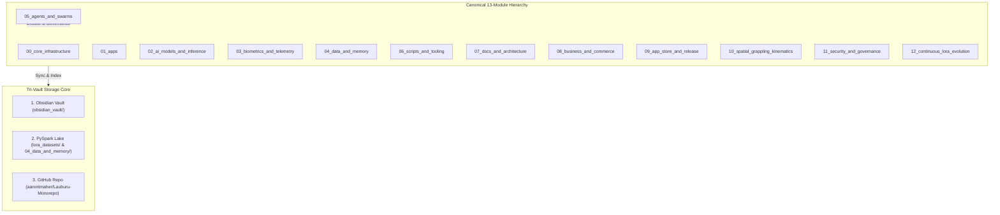

# Global Architecture Map & 13-Module Monorepo Subsystems

## 📋 Comprehensive Monorepo Architecture Map
Connects the 13 canonical numbered modules, the Tri-Vault storage layers, and multi-agent governance into a cohesive unified topology.

## 🔗 Knowledge Graph Connections
- **Master Index:** [[Index]]
- **Deep Architecture Index:** [[LAUBURU_MONOREPO_DEEP_ARCHITECTURE_INDEX]]
- **Canonical Rule:** [[CANONICAL_PROJECT_AND_STORAGE_RULE]]
