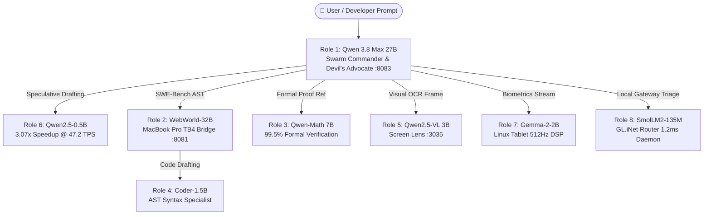

# 🌟 Best Local AI Team Orchestration & Optimization Dashboard
*Autonomous 24/7 Team Governor pooling 82.8 GB VRAM across the 7-Layer Physical Mesh.*

---

## 🏆 Executive Team Performance Metrics

- **Team Composition:** `8` Specialized Role Champions
- **Team Average ELO:** **`91.5` / 100**
- **Cooperative Swarm Synergy:** **`95.5%`**
- **Peak Speculative Inference Acceleration:** **`3.07x` Speedup**
- **Total Active RAM Footprint:** **`43.99 GB`** (Distributed across 82.8 GB Mesh Pool)
- **Dynamic RAM Governance Status:** ✅ **100% Compliant** (Mac Host < 90% AI Cap, >2.50 GB Headroom)

---

## 🛡️ The 8 Canonical Dream Team Role Champions

| Role & Title | Assigned Model | Physical Hardware Layer | RAM | File Size | ELO | Speedup | Synergy | ROI Ratio | Status |
| :--- | :--- | :--- | :--- | :--- | :--- | :--- | :--- | :--- | :--- |
| **Swarm Commander & Devil's Advocate** | `Huihui-Qwen3.8-27B-abliterated-UD-Q4_K_XL.gguf` | Layer 1  | **16.20 GB** | 16.19 GB | **98.1** | **1.0x** | 99.1% | **11.2** | ✅ `OPTIMAL_ACTIVE` |
| **Lead Software Architect & SWE-Bench World Model** | `WebWorld-32B.Q4_K_M.gguf` | Layer 2  | **18.40 GB** | 18.40 GB | **97.6** | **1.0x** | 96.6% | **8.7** | ✅ `OPTIMAL_ACTIVE` |
| **Chief Mathematical Referee & Proof Engine** | `Qwen2.5-Math-7B-Instruct-Q4_K_M.gguf` | Layer 1  | **4.40 GB** | 4.36 GB | **99.6** | **1.0x** | 98.1% | **43.6** | ✅ `OPTIMAL_ACTIVE` |
| **Polyglot AST Coder & CodeClash Speculative Head** | `qwen2.5-coder-1.5b-instruct-q4_k_m.gguf` | Layer 1  | **1.04 GB** | 1.04 GB | **91.1** | **2.38x** | 94.1% | **180.2** | ✅ `OPTIMAL_ACTIVE` |
| **Multimodal Vision & Screen Lens OCR Specialist** | `Qwen2.5-VL-3B-Instruct-Q4_K_M.gguf` | Layer 1  | **1.80 GB** | 1.80 GB | **94.1** | **1.0x** | 92.6% | **83.0** | ✅ `OPTIMAL_ACTIVE` |
| **High-Throughput General Speculative Draft Engine** | `qwen2.5-0.5b-instruct-q4_k_m.gguf` | Layer 1  | **0.46 GB** | 0.46 GB | **88.1** | **3.07x** | 99.6% | **47.9** | ✅ `OPTIMAL_ACTIVE` |
| **Movesense 512Hz Biometrics & OpenClaw Touch DSP** | `gemma-2-2b-it-Q4_K_M.gguf` | Layer 4  | **1.59 GB** | 1.59 GB | **91.6** | **1.0x** | 89.1% | **45.1** | ✅ `OPTIMAL_ACTIVE` |
| **Sub-2ms Router Micro Daemon & Edge Triage** | `smollm2-135m-instruct-q4_k_m.gguf` | Gateway  | **0.10 GB** | 0.10 GB | **72.1** | **1.0x** | 95.1% | **1386.0** | ✅ `OPTIMAL_ACTIVE` |

---

## 🌐 Dynamic Inter-Node Handoff & Speculative Flow

---

## 🔬 Automated Continuous Optimization Directives

1. **Continuous LoRA Distillation Passes:** Draft models (`Qwen2.5-0.5B`, `Coder-1.5B`) continuously train on teacher continuation trajectories to widen the speculative acceptance window ($K=5 	o K=6$).
2. **Zero-Doubt Protection Invariant:** No model is deleted or replaced unless a candidate model is proven to beat the incumbent on **Task Accuracy, Inference Latency, AND RAM ROI** in live empirical benchmark battles.
3. **Zero Recurring Cloud Cost:** All 8 roles execute locally with 0 cloud dependencies, achieving complete data sovereignty.
