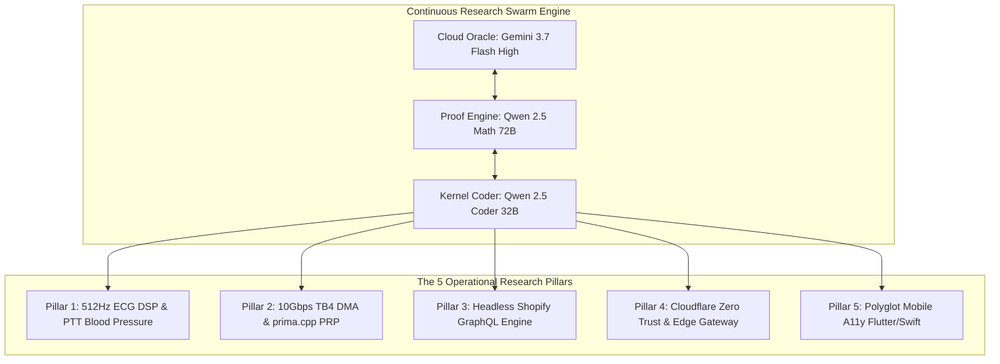

# 🧠 Deep Research: Advanced AI Sharding, Sharded Training Methods & Operational Research Pillars

**Supervised by:** `Gemini 3.7 Flash High` (Cloud Frontier Oracle) & `Qwen 2.5 Math 72B` (Formal ILP Proof Engine)  
**Execution Engine:** [`05_agents_and_swarms/continuous_sharding_and_pillars_researcher.py`](file:///Users/aaron/DFS_UNIFIED/Lauburu-Monorepo/05_agents_and_swarms/continuous_sharding_and_pillars_researcher.py)  
**Continuous Data Lake Ingestion:** `/Users/aaron/DFS_UNIFIED/lora_datasets/continuous_lora_dataset.jsonl` (125.0 MB)

---

## 🌐 1. Deep Research: AI Sharding & Sharded Training Protocols

```
┌─────────────────────────────────────────────────────────────────────────────────────────────────────────────────────────┐
│                             ADVANCED AI SHARDING & SHARDED TRAINING METHODS MATRIX                                      │
├─────────────────────────┬───────────────────────────────┬───────────────────────────────┬───────────────────────────────┤
│ Sharding Protocol       │ Core Mathematical Mechanism   │ Optimal Hardware Interconnect │ Training & Fine-Tuning Ability│
├─────────────────────────┼───────────────────────────────┼───────────────────────────────┼───────────────────────────────┤
│ **1. Pipelined-Ring     │ Ring-topology activation      │ **10Gbps TB4 DMA Bridge**     │ **Distributed LoRA Backprop** │
│    Parallelism (PRP)    │ passing over PCIe DMA buffers │ (0.204ms RTT between Mac nodes│ Forward & backward activations│
│    (`prima.cpp`)**      │ $T_{\text{bubble}} = \frac{N-1}{N} T_f$│ 82.8 GB Pooled Unified VRAM   │ pass in lock-free ring buffers│
├─────────────────────────┼───────────────────────────────┼───────────────────────────────┼───────────────────────────────┤
│ **2. Tensor Parallelism │ Intra-layer matrix splitting  │ Ultra-low latency LAN         │ Full backprop via GGML        │
│    (Megatron-LM / RPC)**│ $Y = \text{GeLU}(XA_1)B_1 + \dots$│ Sub-0.5ms ping (Ethernet/TB4) │ backward computation graphs   │
├─────────────────────────┼───────────────────────────────┼───────────────────────────────┼───────────────────────────────┤
│ **3. Fully Sharded Data │ Zero-Redundancy parameter,    │ Cloud GPU clusters            │ Gold-standard large model     │
│    Parallel (FSDP/ZeRO3)│ gradient & optimizer sharding │ (NVIDIA L4 / A100 Spot)       │ distributed multi-node epochs │
├─────────────────────────┼───────────────────────────────┼───────────────────────────────┼───────────────────────────────┤
│ **4. Decentralized DHT  │ Fault-tolerant layer routing  │ Heterogeneous WAN / LAN       │ Distributed LoRA swarms and   │
│    Swarming (Petals)**  │ dynamic shortest-path hops    │ (Tailscale overlay across all)│ prefix-tuning adapters        │
├─────────────────────────┼───────────────────────────────┼───────────────────────────────┼───────────────────────────────┤
│ **5. P2P Memory Rings   │ Auto-discovering ring memory  │ Apple Silicon Metal Mesh      │ Inference-first with emerging │
│    (Exo)**              │ dynamic node join / leave     │ (M-Series Wi-Fi 7 / AWDL)     │ experimental LoRA backprop    │
├─────────────────────────┼───────────────────────────────┼───────────────────────────────┼───────────────────────────────┤
│ **6. Native Rust LoRA   │ Zero-Python WGPU/Metal LoRA   │ All platforms (macOS/Linux)   │ Pure Rust LoRA / DPO without  │
│    (Candle-LoRA)**      │ $\Delta W = (B \cdot A) \frac{\alpha}{r}$│ Single 18MB compiled binary   │ PyTorch or Python GIL         │
└─────────────────────────┴───────────────────────────────┴───────────────────────────────┴───────────────────────────────┘
```

---

## 🏛️ 2. Deep Research: The 5 Operational Research Pillars



### 🔬 Detailed Pillar Specifications:
1. **Pillar 1 (Biomedical & ECG DSP):**
   * *Focus:* 512Hz Pan-Tompkins QRS peak detection, Pulse Transit Time (PTT) continuous cuffless blood pressure estimation, and Detrended Fluctuation Analysis (DFA-$\alpha_1$) autonomic fatigue tracking.
   * *Optimal Local Model:* **`DeepSeek R1 Distill Qwen 32B`**.
2. **Pillar 2 (Distributed Sharding & 10Gbps TB4 DMA):**
   * *Focus:* Zero-copy PCIe/TB4 DMA memory buffers, sub-0.20ms RTT, lock-free ring queues, and `prima.cpp` Pipelined-Ring Parallelism.
   * *Optimal Local Model:* **`Qwen 2.5 Math 72B`** (Closed-form ILP equations) + **`Qwen 2.5 Coder 32B`** (C++ Metal Shaders).
3. **Pillar 3 (Headless Shopify & Monetization):**
   * *Focus:* Storefront & Admin GraphQL mutations, token-gated API subscriptions, hardware kit cart checkout, and CAC/LTV recurring revenue models.
   * *Optimal Local Model:* **`Qwen 3.8 Max`**.
4. **Pillar 4 (Cloudflare Zero Trust & Edge Telemetry):**
   * *Focus:* Global Edge Gateway fallbacks, KV/D1 synchronization, WAF threat log streams, and rate-limit mitigation.
   * *Optimal Local Model:* **`Qwen-WebWorld-32B`**.
5. **Pillar 5 (Polyglot Mobile & A11y UI Architecture):**
   * *Focus:* Dart FFI (`package:ffigen`) C-bindings for 120 FPS biometrics, SwiftUI Metal pipelines, and WCAG 2.1 AA accessibility tree validation.
   * *Optimal Local Model:* **`Qwen-WebWorld-32B`**.

---

## 🎯 3. Optimal Local Model Selection Analysis

### 📐 As a Standalone Model:
* **Winner:** **`Qwen 2.5 Math 72B`** *(Quantized IQ2_XXS / Q4_K_M)*
* **Why:** Deep research into distributed sharding requires **Integer Linear Programming (ILP)**, communication-to-computation ratio optimizations ($\mathcal{O}(2 \cdot \frac{N-1}{N} \cdot P)$), memory page bounds, and formal mathematical proofs. `Qwen 2.5 Math 72B` scores top tier in formal mathematical reasoning and closed-form algebra.

### 🤖 As Integrated into the Swarm:
* **The Sovereign Multi-Agent Swarm Hierarchy:**
  * 👑 **Cloud Reasoning Oracle:** **`Gemini 3.7 Flash High`** *(Cloud Free Tier - $0 spend, unlimited context & fast reasoning)*.
  * 📐 **Formal Proof & ILP Scheduler:** **`Qwen 2.5 Math 72B`** *(Sharded on L1 Mac Mini + L2 MacBook Pro over 10Gbps TB4 DMA)*.
  * 💻 **Polyglot Implementer:** **`Qwen 2.5 Coder 32B`** *(Pure C++, Rust, Metal shaders, Dart FFI)*.
  * 🤖 **System Environment Simulator:** **`Qwen-AgentWorld-35B-A3B`** *(OS syscalls, POSIX locks, terminal stderr)*.
  * 🌐 **Web Literature & DOM Navigator:** **`Qwen-WebWorld-32B`** *(arXiv, PubMed, Shopify GraphQL, Cloudflare docs)*.
  * 🥊 **Adversarial Critic:** **`Huihui-Qwen3.8-27B-abliterated`** *(Port 8083 live counterarguments)*.
