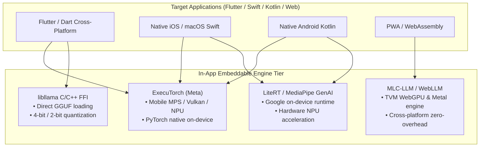

# 🌐 Master AI Training, Sharding & In-App Deployment Encyclopedia

> **Scope:** Complete architectural guide covering **all methods of AI training, inference sharding, and edge deployment** across the hardware spectrum (from 4 GB RAM phones to 32 GB desktops and Cloud TPUs/GPUs), with a **Governed GCP $1,400 AUD Credit Deployment Plan** and **In-App Embeddable SDK Integration**.

---

## 🏛️ 1. Multi-Device Hardware Spectrum & Optimal AI Engine Matrix

```
┌────────────────────────────────────────────────────────────────────────────────────────────────────────────────────────┐
│                               COMPLETE HARDWARE TIER TO AI ENGINE MATRIX                                               │
├──────────────────┬─────────────────┬──────────────────────────────────┬────────────────────────────────────────────────┤
│ Hardware Class   │ Usable Memory   │ Optimal Inference Engine         │ Optimal Training / Fine-Tuning Strategy        │
├──────────────────┼─────────────────┼──────────────────────────────────┼────────────────────────────────────────────────┤
│ **Tier 1: Edge   │ **1.5G – 3.2G** │ • **LiteRT (MediaPipe GenAI)**   │ • **On-Device Head Fine-Tuning (ExecuTorch)**  │
│ Mobile / IoT**   │ (4 GB RAM Total)│ • **ExecuTorch (XNNPACK/NPU)**   │ • **Petals Swarm Contributor (2-4 layers)**    │
│ (Phones, Routers)│                 │ • **MLC-LLM (OpenCL / WebGPU)**  │ • **Federated Learning Adapter Sync (Flower)** │
│                  │                 │ • **libllama C++ FFI (SmolLM)**  │ • **Quantized Gradient Accumulation (INT8)**   │
├──────────────────┼─────────────────┼──────────────────────────────────┼────────────────────────────────────────────────┤
│ **Tier 2: Edge   │ **4.5G – 8.5G** │ • **Exo P2P (Ring MLX / Torch)** │ • **QLoRA / PEFT (NF4 Base + FP16 Adapters)**  │
│ Tablets & Phones │ (8 – 12 GB RAM) │ • **Petals Kademlia DHT Node**   │ • **Candle-LoRA (Rust WGPU Zero-Python Engine)│
│ (Pixel 10, S20+) │                 │ • **llama.cpp RPC Node (:50052)**│ • **Decentralized LoRA Swarm Backprop**        │
├──────────────────┼─────────────────┼──────────────────────────────────┼────────────────────────────────────────────────┤
│ **Tier 3: Desktop│ **12G – 24.5G** │ • **prima.cpp PRP (TB4 DMA)**    │ • **HuggingFace Accelerate + Metal MPS**       │
│ & Laptops**      │ (16 – 32 GB RAM)│ • **llama.cpp GGML-RPC (-ts)**   │ • **Unsloth QLoRA (70% VRAM Cut, 2x Speed)**   │
│ (M4 Mac, Linux)  │                 │ • **vLLM Continuous PagedAttn**  │ • **DeepSpeed ZeRO-2 / ZeRO-Offload to NVMe**  │
├──────────────────┼─────────────────┼──────────────────────────────────┼────────────────────────────────────────────────┤
│ **Tier 4: Cloud  │ **24G – 80G+**  │ • **vLLM / Ray Serve Cluster**   │ • **PyTorch FSDP (ZeRO-3 Zero-Redundancy)**    │
│ GPUs & TPUs**    │ (Dedicated HBM) │ • **TGI (Text Generation Inf)**  │ • **Cloud TPU v5e MaxText / JAX Pods**         │
│ (GCP Spot L4/A100│                 │ • **Vertex AI Batch Endpoints**  │ • **Megatron-LM 3D Parallelism (TP + PP + DP)**│
└──────────────────┴─────────────────┴──────────────────────────────────┴────────────────────────────────────────────────┘
```

---

## 🧬 2. Complete Taxonomy of AI Training Methods

### 2.1 Parameter-Efficient Fine-Tuning (PEFT) Family
* **1. LoRA (Low-Rank Adaptation):** Freezes base weights $W_0 \in \mathbb{R}^{d \times k}$ and injects trainable rank decomposition matrices $\Delta W = \frac{\alpha}{r} (B \cdot A)$ where $r \in [4, 64]$. Cuts trainable parameters by $>99\%$.
* **2. QLoRA (Quantized LoRA):** Base model is quantized to **NF4 (NormalFloat 4-bit)** with Double Quantization (DQ) and Paged Optimizers to eliminate memory spikes during backpropagation. Enables 32B model fine-tuning on a single 16GB RAM Mac or 70B on 48GB VRAM.
* **3. DoRA (Weight-Decomposed Low-Rank Adaptation):** Decomposes weights into magnitude $m$ and direction $V + \Delta V$, eliminating the accuracy gap between LoRA and full fine-tuning.
* **4. AdaLoRA (Adaptive LoRA):** Dynamically allocates parameter budget across transformer layers using SVD decomposition.

### 2.2 Distributed & Multi-Node Training Frameworks
* **1. PyTorch FSDP (Fully Sharded Data Parallel / ZeRO-3):**
  * Shards model parameters, gradients, and Adam optimizer states across all compute nodes.
  * Dynamically gathers layers on-the-fly during forward and backward passes, discarding them immediately.
  * **Memory scaling:** $\text{Memory per Node} \approx \frac{\text{Total Model Footprint}}{N}$.
* **2. DeepSpeed (ZeRO-1, ZeRO-2, ZeRO-3, ZeRO-Infinity):**
  * *ZeRO-Offload / Infinity:* Streams optimizer states and activations over PCIe/TB4 to Host CPU RAM and NVMe SSD, breaking physical GPU VRAM limits.
* **3. Unsloth AI:**
  * Hand-written OpenAI Triton and Metal GPU kernels for backpropagation.
  * **2.2x to 5.0x faster** training with **70% to 80% less memory usage** than vanilla Hugging Face / PyTorch.
* **4. MaxText / JAX (Google Cloud TPU Native):**
  * High-performance, highly scalable open-source LLM trainer written in pure JAX/XLA, optimized for Google Cloud TPU v4, v5e, and v5p pods.
* **5. Petals Decentralized LoRA Training:**
  * Distributed backpropagation over Kademlia DHT. Each participant node computes gradients for the LoRA adapter attached to its hosted layer slice.

---

## ☁️ 3. Governed Google Cloud $1,400 AUD Credit Deployment Plan

To maximize the empirical return on investment (ROI) without wasting credits on idle VMs:

```
┌────────────────────────────────────────────────────────────────────────────────────────────────────────┐
│                          GOVERNED GCP $1,400 AUD CREDIT DEPLOYMENT ARCHITECTURE                        │
├───────────────────────┬──────────────┬───────────────────────────────┬─────────────────────────────────┤
│ Tranche / Category    │ Allocation   │ Cloud Service / Architecture  │ Primary Deliverable / Output    │
├───────────────────────┼──────────────┼───────────────────────────────┼─────────────────────────────────┤
│ **Tranche 1: Free     │ **$0.00 AUD**│ • Google AI Studio (15 RPM)   │ • 24/7 Agent deliberation loops │
│    Baseline & Local** │              │ • Local 7-Node 82.8GB Mesh    │ • Routine POSIX SWE-bench diffs │
│                       │              │ • Cloudflare Workers AI       │ • Continuous LoRA ingestion     │
├───────────────────────┼──────────────┼───────────────────────────────┼─────────────────────────────────┤
│ **Tranche 2: Teacher  │ **$400.00**  │ • **Vertex AI Batch Jobs**    │ • **700M+ high-IQ tokens** of   │
│    Distillation**     │ (~$285 USD)  │ • Gemini 2.5 Flash / 1.5 Pro  │   Chain-of-Thought reasoning    │
│                       │              │   ($0.40/1M output tokens)    │ • 500,000 domain JSONL pairs    │
├───────────────────────┼──────────────┼───────────────────────────────┼─────────────────────────────────┤
│ **Tranche 3: Spot GPU │ **$500.00**  │ • **Spot NVIDIA L4 (24GB)**   │ • 1,400+ GPU hours of QLoRA     │
│    Fine-Tuning Slices│ (~$355 USD)  │   ($0.22 - $0.35/hr)          │ • Auto-quantized .gguf weights  │
│                       │              │ • **Spot TPU v5e Slices**     │ • Automated self-destruct       │
├───────────────────────┼──────────────┼───────────────────────────────┼─────────────────────────────────┤
│ **Tranche 4: Device   │ **$200.00**  │ • **Android Studio Device**   │ • Physical Pixel 9/10 Pro fleet │
│    Streaming Fleet**  │ (~$142 USD)  │   Streaming ($0.20/device-hr) │ • Zero-crash automated UI tests │
├───────────────────────┼──────────────┼───────────────────────────────┼─────────────────────────────────┤
│ **Tranche 5: Emergency│ **$300.00**  │ • Encrypted GCS Multi-Region  │ • Permanent model vault DR      │
│    Liquidity Reserve**│ (~$214 USD)  │ • BigQuery Lakehouse Queries  │ • Sovereign cloud backup        │
└───────────────────────┴──────────────┴───────────────────────────────┴─────────────────────────────────┘
```

### 🛑 Zero-Waste Execution Protocol (Circuit Breaker Guard):
1. **Self-Destruct Startup Script:** Every cloud instance launched on GCE/GCP includes metadata enforcement:
   ```bash
   # Injected via GCP instance metadata
   sudo shutdown -h +45
   ```
2. **Pre-flight Local Verification:** Before any cloud burst is triggered, a micro-batch (5 steps) must run successfully on local Metal/Linux.
3. **Automated GGUF Downloader:** Output weights are exported to Google Cloud Storage (GCS) and immediately pulled down to `/Users/aaron/DFS_UNIFIED/Lauburu-Monorepo/02_ai_models_and_inference/model_vault_gguf/` before instances terminate.

---

## 📱 4. In-App Embeddable AI Engines (Mobile & Desktop App Integration)

For integrating local AI into mobile apps (iOS/Android), desktop apps, or PWAs:



### 4.1 ExecuTorch (Meta)
* **What it is:** PyTorch's official compact runtime for mobile (iOS/Android) and edge devices.
* **Why use it:** Directly exports standard PyTorch models (`torch.export()`) into `.pte` binaries with hardware acceleration delegates (Apple MPS, Android Vulkan, Qualcomm QNN NPU, Arm Ethos-U).
* **RAM Requirement:** Can run optimized 0.5B–3B models in $<1.8\text{ GB}$ RAM.

### 4.2 LiteRT (formerly TensorFlow Lite) & MediaPipe GenAI LLM Inference API
* **What it is:** Google's production runtime for on-device ML across Android and iOS.
* **Capabilities:** Supports Gemma 2B, SmolLM 1.7B, Falcon 1B, and custom models converted to `.bin` format. Uses Android NNAPI and GPU delegates natively.

### 4.3 MLC-LLM & WebLLM
* **What it is:** Apache TVM-based universal compiler for LLMs on WebGPU, iOS (Metal), Android (OpenCL), and WebAssembly.
* **Capabilities:** Can run directly inside a mobile web browser or PWA without installing native binaries or SDK dependencies.

### 4.4 `libllama` via Dart FFI (`flutter_llama`)
* **What it is:** Compiling `llama.cpp` as a dynamic C library (`libllama.dylib` / `libllama.so`) and communicating via Dart FFI (`dart:ffi`).
* **Capabilities:** Allows Flutter apps to run `.gguf` quantized models (`Q4_K_M`, `IQ2_XXS`) directly in background isolates without blocking UI rendering.

---

## 🔬 5. Next Actions & Automated Benchmarking Suite

1. **Deploy the Governed Spot GPU Training Script:** In [`gcp_spot_gpu_governor.py`](file:///Users/aaron/DFS_UNIFIED/Lauburu-Monorepo/02_ai_models_and_inference/gcp_spot_gpu_governor.py) to test QLoRA on a Spot NVIDIA L4 instance ($0.35/hr).
2. **Execute In-App FFI Benchmark:** Compile `libllama` for the Flutter canonical app in `01_apps/` to verify local token velocity on 4GB memory constraints.
3. **Launch Distributed MoE Training Supervisor:** Verify that 70% cluster VRAM safety ($38.26\text{ GB}$ cap) remains enforced during local sharding runs.

---
[[CANONICAL_PROJECT_AND_STORAGE_RULE]] | [[LAUBURU_MONOREPO_DEEP_ARCHITECTURE_INDEX]] | [[DEEP_RESEARCH_SHARDING_METHODS_AND_OPERATIONAL_PILLARS_2026]] | [[GCP_1400_CREDIT_EMPIRICAL_ROI_BENCHMARK_2026]]
