# 🗺️ Neo: Canonical Project App Graph (TUIs, Localhost Apps & Notebooks)
*Autonomous Master Graph generated by Neo mapping all active application planes, terminal interfaces, interactive notebooks, and biometrics dataflows across the 7-layer Lauburu Mesh.*

---

## 🌐 1. Master System Topology Graph (Mermaid)

```mermaid
graph TD
    subgraph SENSORS ["📡 Physical Layer & Wearables"]
        MS["💓 Movesense Medical Sensor<br/>(512Hz ECG / BLE GATT / Accel)"]
        MAC_MINI["🖥️ L1 Mac Mini M4 Pro<br/>(Primary Host / Memory Governor)"]
        MBP["💻 L2 MacBook Pro M4<br/>(10Gbps TB4 DMA Bridge / Model Vault)"]
        LINUX["🐧 L3 Linux Head Node<br/>(Gateway Ingress & Ray Cluster)"]
        ANDROID["📱 L6/L7 Pixel & Samsung<br/>(ADB 5555 / 8K Vision / Termux)"]
    end

    subgraph TELEMETRY ["🩺 Telemetry & DSP Pipeline"]
        DSP["⚡ Pan-Tompkins QRS & DFA-α1<br/>(movesense_readiness_suite.py)"]
        LIVE_JSON["📄 movesense_readiness_live.json<br/>(Rule 0 Zero-Mock State)"]
        PARQUET["📦 PySpark Delta Lake<br/>(Parquet 512Hz ECG Stream)"]
    end

    subgraph LOCALHOST_APPS ["🌐 Localhost Application Hubs"]
        P4000["🌐 Port 4000: Canonical Web Hub<br/>(Flutter/Rust Web Console)"]
        P4001["💻 Port 4001: Omniterminal PTY<br/>(Virtual PTY TCP Multiplexer)"]
        P4002["📊 Port 4002: Marimo Approval<br/>(Interactive Reactive Notebooks)"]
        P4003["👁️ Port 4003: Screen Lens MJPEG<br/>(10-15 FPS Live Screen Stream)"]
        P4004["📡 Port 4004: Movesense WebSocket<br/>(Raw BLE Telemetry Stream)"]
        P18802["🛡️ Port 18802: Self-Healing Hub<br/>(WoL REST & Hardware Daemons)"]
    end

    subgraph LOCAL_AI_MESH ["🧠 Distributed AI Inference Mesh"]
        P8081["🤖 Port 8081: Qwen 2.5 Coder 7B<br/>(Normal Orchestration Plane)"]
        P8082["🧬 Port 8082: prima.cpp 80B MoE<br/>(Pipelined Ring Parallelism)"]
        P8083["🔥 Port 8083: Huihui Qwen 27B<br/>(Adversarial Red Team Plane)"]
        CLOUD["☁️ Cloud Free Tier Gateway<br/>(Gemini 3.8 Flash High / NIM / xAI)"]
    end

    subgraph TUIS ["🖥️ Terminal TUIs"]
        TUI_CONSOLE["💻 Unified Console TUI<br/>(Ratatui / Python Terminal)"]
        TUI_MOVESENSE["💓 Movesense Readiness TUI<br/>(Textual Live Rhythm Strip)"]
        TUI_SWARM["⚔️ Dual-Plane TUI Swarm Arena<br/>(Rich 60 FPS Component Lab)"]
        TUI_COREWAR["🥊 CodeClash Core War / pMARS<br/>(8000-Cell Memory Grid)"]
        TUI_BATTLECODE["🦆 CodeClash Battlecode 2024<br/>(MIT Breadwars Minimap)"]
    end

    subgraph NOTEBOOKS ["📓 Interactive Notebook Consoles"]
        NB_MOVESENSE["📓 04_movesense_biometrics_and_dsp.ipynb"]
        NB_OMNITERMINAL["📓 omniterminal_master_console.ipynb"]
        NB_COREWAR["📓 14_codeclash_corewar_master_arena.ipynb"]
        NB_SWE_BENCH["📓 agentworld_webworld_flight_simulator.ipynb"]
    end

    %% Dataflow Connections
    MS -->|BLE GATT 512Hz| DSP
    DSP --> LIVE_JSON
    DSP --> PARQUET
    LIVE_JSON --> P4000
    LIVE_JSON --> P4004
    LIVE_JSON --> TUI_MOVESENSE
    LIVE_JSON --> TUI_CONSOLE

    MAC_MINI -->|PTY Ring Buffer| P4001
    P4001 --> TUI_CONSOLE
    P4003 --> TUI_CONSOLE

    P8081 & P8083 & CLOUD -->|Genetic MoE Router| TUI_CONSOLE
    LIVE_JSON --> NB_MOVESENSE
    P4001 --> NB_OMNITERMINAL
```

---

## 📋 2. Localhost Application Services Matrix

| Port | Service Name | Subsystem / Entrypoint | Protocol / Transport | Primary Role & Invariants |
| :--- | :--- | :--- | :--- | :--- |
| **4000** | **Canonical Web Hub** | `01_apps/port_4000_flutter_rust/` | HTTP / WebSocket | Unified multi-platform user portal, telemetry ingress, and device management. |
| **4001** | **Omniterminal PTY Daemon** | `teamwork_projects/.../src/omniterminal/` | TCP / Unix Domain Socket | High-throughput zero-allocation VT100/ANSI PTY multiplexer across mesh nodes. |
| **4002** | **Marimo Approval Banner** | `04_data_and_memory/marimo/` | HTTP / Reactive Kernel | Stage 4 Human Sovereign Gate for model promotions, weight merges, and live data science. |
| **4003** | **Screen Lens Live Stream** | `01_apps/screen_lens/src/` | HTTP Multipart MJPEG | 10–15 FPS continuous live screen monitor for VLA agents with Sequoia guard. |
| **4004** | **Movesense BLE Bridge** | `03_biometrics_and_telemetry/` | WebSocket / REST | Subscribes to 512Hz MECG GATT packets and distributes parsed QRS intervals. |
| **8081** | **llama.cpp Normal Plane** | `02_ai_models_and_inference/` | HTTP REST (`/v1/chat`) | Qwen 2.5 Coder 7B Dense unabliterated developer and local orchestration model. |
| **8082** | **prima.cpp Ring Parallel** | `02_ai_models_and_inference/` | PRP Ring Protocol | Distributed 80B MoE sharded across 10Gbps Thunderbolt 4 cluster (56 GB unified RAM). |
| **8083** | **llama.cpp Red Team Plane**| `02_ai_models_and_inference/` | HTTP REST (`/v1/chat`) | Huihui Qwen 27B Abliterated model for unrestricted security audits and debate. |
| **18802**| **Self-Healing Hub** | `00_core_infrastructure/self_healing_hub/`| HTTP REST | 24/7 background node resurrection, Wake-on-LAN Magic Packets, and storage crons. |
| **50052**| **Metal GPU RPC Daemon** | `02_ai_models_and_inference/` | TCP RPC | Remote tensor offloading target on L2 MacBook Pro (0.27ms RTT via TB4). |
| **5555** | **Android ADB Wireless Bridge**| USB / TCP | ADB Protocol | Direct device actuation, Termux keepalive, and UI test automation for L6/L7 phones. |

---

## 🖥️ 3. Canonical Terminal TUIs Matrix

| TUI Application | Framework / Language | Location | Primary Purpose | Live Verification |
| :--- | :--- | :--- | :--- | :--- |
| **Sovereign IDE Console** | Python + Ratatui (Rust) | `teamwork_projects/.../src/console/` | Master IDE, Omniterminal PTY, Sentinel HUD, Movesense 512Hz Tab 4. | `omniterminal --tui` |
| **Movesense Readiness TUI** | Python (Textual / Rich) | `01_apps/biometrics/movesense_readiness_tui.py` | Real-time 512Hz ECG rhythm strip, RMSSD, DFA-α1, PTT blood pressure. | `python3 movesense_readiness_tui.py` |
| **Dual-Plane TUI Swarm Arena**| Python (Rich 60 FPS) | `01_apps/screen_lens/.../dual_tui_swarm_arena/` | Continuous TUI component synthesis, battle arena between Qwen 7B & 27B. | `watch-tui` |
| **CodeClash Core War** | C (pMARS v0.9.4) + Rich | `01_apps/screen_lens/.../dual_tui_swarm_arena/` | 8000-cell Redcode memory execution arena (1516.0 Peak ELO, Rank #2). | `watch-corewar` |
| **CodeClash Battlecode 2024** | Python + Rich Minimap | `01_apps/screen_lens/.../dual_tui_swarm_arena/` | MIT Breadwars CTF game loop (50-duck armies, traps, flags, 1487.5 ELO). | `watch-battlecode` |
| **Canonical Mesh TUI** | Rust (Ratatui) | `01_apps/canonical_tui_prototypes/rust_ratatui/` | Sub-millisecond Immediate-Mode terminal dashboard for 7-layer telemetry. | `canonical_tui_rust` |
| **Termux Edge TUI** | Go (Bubble Tea) | `01_apps/canonical_tui_prototypes/go_bubbletea/` | Lightweight mobile Elm-architecture TUI for Android Termux. | `canonical_tui_go` |

---

## 📓 4. Canonical Notebooks Matrix

| Notebook Path | Framework / Engine | Core Focus | Bidirectional Module Sync |
| :--- | :--- | :--- | :--- |
| `01_apps/notebooks/04_movesense_biometrics_and_dsp.ipynb` | Jupyter / Marimo | 512Hz raw ECG filtering, Pan-Tompkins QRS, Poincare plots, DFA-α1 curves. | `03_biometrics_and_telemetry/movesense_readiness_suite.py` |
| `01_apps/omniterminal_notebook_plugin/omniterminal_master_console.ipynb`| Jupyter / IPykernel | Interactive console widgets, PTY streaming cells, live telemetry inspection. | `teamwork_projects/.../src/omniterminal/` |
| `01_apps/notebooks/14_codeclash_corewar_master_arena.ipynb` | JupyterLab | Visual memory arena plots, instruction execution heatmaps, warrior ELO graphs. | `dual_tui_swarm_arena/corewar_engine.py` |
| `02_ai_models_and_inference/.../agentworld_webworld_flight_simulator.ipynb` | JupyterLab | SWE-bench flight simulator, automated patch benchmarking, browser environments.| `02_ai_models_and_inference/benchmarks/` |
| `01_apps/notebooks/01_master_mesh_console_and_ports.ipynb` | Marimo Port 4002 | Live port prober, network topology latency matrices, dynamic RAM charts. | `00_core_infrastructure/` |

---

## 💓 5. Movesense 512Hz Biometrics Flow into Omni Terminal IDE

1. **Hardware Contact:** Movesense sensor detects skin impedance, auto-initiates 512Hz MECG streaming.
2. **Local Airgap BLE GATT:** Subscribed by `movesense_api_daemon.py` without external cloud dependence.
3. **Signal Processing:** `movesense_readiness_suite.py` executes Pan-Tompkins QRS, Kamath 20% filter, RMSSD, DFA-α1, and PTT blood pressure equations in real time.
4. **Zero-Mock File Sink:** Synchronized to `movesense_readiness_live.json`.
5. **IDE Console Ingestion:** `MovesenseConsoleClient` polls the authentic state, updating `ConsoleSnapshot.movesense`.
6. **TUI Render (Tab 4):** Console renders live heart rate, HRV, DFA-α1 aerobic threshold dial, and ASCII ECG rhythm waveform.
7. **RAG Chat Integration:** In-app resident AI answers biometrics protocol queries citing Obsidian knowledge vault sources.
8. **Lakehouse Persistence:** PySpark streams the raw samples into Parquet tables for 24/7 LoRA distillation.

---
*Related Master References:*
- [[Index]]
- [[CANONICAL_PROJECT_AND_STORAGE_RULE]]
- [[01_zero_mock_truth_rule]]
- [[NEO_CONTINUOUS_AI_TRAINING_CHRONICLE]]
- [[GENETIC_MOE_MESH_RAM_ROUTING_LIVE]]
