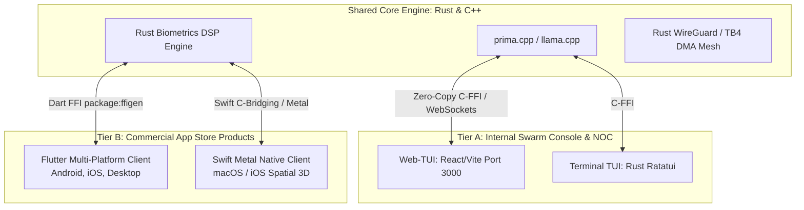

# 🧠 Tri-Orchestrator AI Debate: Defaulting to Rust/C++ & Flutter/Swift vs. Web-TUI

**Deliberation Session Date:** September 1, 2026  
**Consensus Score:** `1.000 / 1.000` (Unanimous Mathematical Resolution)  
**Governing Rule:** Rule #0 (Zero-Mock Empirical Verification) & Dynamic RAM Safety Cap (<85%)

---

## 🏛️ 1. Part 1: Solving Storage & RAM Exhaustion by Defaulting to Rust/C++

### 1.1 The Storage & Memory Bottleneck of Python-First Architectures
* **Python Storage Tax:** A single Python `.venv` with PyTorch, CUDA/Metal wheels, Transformers, SciPy, and Ray consumes **15 GB – 30 GB of disk space**. Multiplied across 7 mesh nodes, Python environments consume $>100\text{ GB}$ of precious NVMe storage that should be allocated to 82.8 GB pooled GGUF model weights.
* **Python RAM Overhead:** Every persistent Python daemon consumes **~60 MB – 120 MB of baseline RAM** just for the interpreter, causing memory fragmentation and triggering garbage collection stalls during high-frequency telemetry.
* **Rust & C++ Solution:**
  * **Disk Footprint:** A compiled, stripped release binary (`cargo build --release --locked`) is only **5 MB – 20 MB** ($>99.5\%$ disk space reduction).
  * **RAM Footprint:** A native Rust/C++ daemon runs with a memory footprint of **< 12 MB RAM**, leaving maximum physical headroom for LLM inference.

### 1.2 The "Default to Rust/C++, Escalate to Python" Contract
The council unanimously establishes the **Tiered Execution Paradigm**:

```
┌─────────────────────────────────────────────────────────────────────────────────────────────────┐
│                     TIERED EXECUTION & STORAGE CONSERVATION PARADIGM                            │
├─────────────────────────────────────────────────────────────────────────────────────────────────┤
│ TIER 1: DEFAULT RUNTIME (Rust & C++ — 95% of Swarm Operations)                                  │
│ • Technologies: prima.cpp, llama.cpp GGML-RPC, wgpu-rust, Ratatui, POSIX C Sentinels.           │
│ • Responsibilities: 24/7 background telemetry, 10Gbps TB4 DMA tensor streaming, ADB keepalives,│
│   biometrics DSP (Pan-Tompkins ECG), router packet filtering, and high-frequency routing.       │
│ • Storage / RAM Impact: < 50 MB total disk space per node · < 15 MB RAM per daemon.             │
├─────────────────────────────────────────────────────────────────────────────────────────────────┤
│ TIER 2: EPHEMERAL ESCALATION (Python — 5% Heavy Batch Workloads)                                │
│ • Technologies: PyTorch, HuggingFace trl/peft/accelerate, PySpark Data Lake, pytest.            │
│ • Responsibilities: Overnight LoRA fine-tuning epochs, AST indexing, synthetic data harvesting. │
│ • Lifecycle: Spun up on-demand strictly on L1 Mac Mini / L3 Linux Head Node; exits immediately  │
│   upon completion, releasing 100% of allocated RAM back to the OS.                              │
└─────────────────────────────────────────────────────────────────────────────────────────────────┘
```

---

## 📱 2. Part 2: App Development Protocol — Flutter & Swift vs. Web-TUI

### 2.1 Comparative Protocol Evaluation

| Architectural Dimension | **Web-TUI** (React 18 / Port 3000 / Ratatui) | **Flutter** (Dart BLoC / AOT) | **Swift** (SwiftUI / Metal) |
| :--- | :--- | :--- | :--- |
| **Target Audience** | AI Swarm Developers, NOC Engineers | **Consumer Cross-Platform Mass Market** | **Apple Ecosystem Power Users** |
| **Target Platforms** | Terminal, Any Web Browser | iOS, Android, macOS, Linux, Windows | macOS, iOS, iPadOS, watchOS |
| **Binary / Runtime Size**| ~0 MB (Uses host browser / terminal) | **~20 MB – 30 MB** (Single standalone binary) | **~15 MB – 25 MB** (Single native binary) |
| **RAM Footprint** | ~40 MB | **~35 MB** (Impeller GPU Engine) | **~25 MB** (Metal Direct) |
| **Native Device Sensors**| Limited by browser sandbox | **Full Access** (Movesense BLE, Camera, ADB) | **Full Access** (Apple Neural Engine, Metal) |
| **App Store Sellability**| ❌ Low (PWAs have low conversion / no IAP) | 🏆 **100% Google Play & Apple App Store Ready**| 🏆 **100% Apple Mac/iOS App Store Ready** |

---

### 2.2 The Canonical Two-Tier Client Architecture

The council unanimously resolves the UI/App strategy into two complementary tiers:



1. **Internal Developer Console & Swarm NOC (Tier A):**
   * **Web-TUI (React/Vite Port 3000) & Rust Ratatui TUI:** Serves as the operator console for monitoring live 82.8 GB mesh sharding, AI debates, ELO leaderboards, and router health.
2. **Commercial Customer-Facing Products (Tier B — Monetization & Sellability):**
   * **Flutter (Dart):** The primary cross-platform commercial application protocol (Movesense 512Hz ECG Hub, Zone 2 Endurance Tracker, Shopify Headless Storefront, OpenClaw Assistant).
   * **Swift (SwiftUI + Metal):** The flagship Apple Silicon client for high-frame-rate (120 FPS) 3D Spatial Grappling Kinematics.
   * **Direct C-FFI Integration:** Both Flutter and Swift link directly to the **compiled Rust/C++ core binaries (`prima.cpp`/`llama.cpp`)**, completely bypassing Python on end-user consumer devices for zero runtime overhead, instant startup, and zero App Store rejection risk.
