# 📡 Omni-Spectrum Mesh Transport & Layer-Specific Local AI Training Architecture

## 1. Executive Summary

This architecture establishes two foundational pillars for the Lauburu Ecosystem:
1. **Omni-Spectrum Multi-Transport Self-Healing Engine:** Opportunistically establishes, bonds, and hot-migrates connections across every available electromagnetic and physical channel—from Sub-1 GHz LoRa/HaLow to 6 GHz Wi-Fi 7 and 40 Gbps Thunderbolt DMA.
2. **Layer-Specific Local AI Training Matrix:** Trains dedicated Small Language Models (SLMs) and Frontier MoE shards tailored to the exact RAM, compute hardware (Metal, Tensor G5 TPU, Exynos, AMD Ryzen), and operational responsibilities of each of the 7 mesh layers.

---

## 2. The Multi-Spectrum Continuum: 1 GHz to 60 GHz + Wire

The system continuously probes and scores connections across 7 distinct electromagnetic and physical tiers:

```
┌─────────────────────────────────────────────────────────────────────────────┐
│                 OMNI-SPECTRUM CARRIER CONVERGENCE MATRIX                    │
├─────────────┬─────────────────────┬──────────────┬────────────┬─────────────┤
│ Spectrum    │ Physical Technology │ Real Range   │ Bandwidth  │ Role        │
├─────────────┼─────────────────────┼──────────────┼────────────┼─────────────┤
│ Sub-1 GHz   │ 802.11ah Wi-Fi      │ 1 km – 15 km │ 150 kbps – │ Emergency   │
│ (700-915MHz)│ HaLow / LoRa        │ (Wall Pen++) │ 15 Mbps    │ Heartbeat   │
├─────────────┼─────────────────────┼──────────────┼────────────┼─────────────┤
│ 2.4 GHz     │ Wi-Fi 4/6/7 &       │ 30m – 100m   │ 2 Mbps (BT)│ Biometrics, │
│ ISM Band    │ Bluetooth 5.1       │ (Wall Pen+)  │ 574 Mbps   │ RFCOMM PTY  │
├─────────────┼─────────────────────┼──────────────┼────────────┼─────────────┤
│ 3.5–3.8 GHz │ 5G Mid-Band (n78)   │ 500m – 2 km  │ 300–900    │ Mobile WAN  │
│ (CBRS / 5G) │ / felix cellular    │ (Mobile In)  │ Mbps       │ Ingress     │
├─────────────┼─────────────────────┼──────────────┼────────────┼─────────────┤
│ 5.0–5.9 GHz │ Wi-Fi 5/6/7 UNII-3  │ 15m – 30m    │ 1.2–2.4    │ Cluster P2P │
│             │ (160 MHz channels)  │ (Low Pen)    │ Gbps       │ Backhaul    │
├─────────────┼─────────────────────┼──────────────┼────────────┼─────────────┤
│ 6.0–7.1 GHz │ Wi-Fi 6E / Wi-Fi 7  │ 5m – 15m     │ 2.4–5.0+   │ Zero-Noise  │
│ (UNII-5..8) │ 320 MHz MLO         │ (LOS only)   │ Gbps       │ AI Streams  │
├─────────────┼─────────────────────┼──────────────┼────────────┼─────────────┤
│ Physical    │ Thunderbolt 4 DMA / │ 0.5m – 3m    │ 40,000     │ 56GB VRAM   │
│ Layer       │ 2.5GbE / USB CDC    │ (Zero RF)    │ Mbps       │ Tensor Ring │
└─────────────┴─────────────────────┴──────────────┴────────────┴─────────────┘
```

### 2.1 Autonomous Link Convergence Algorithm
The network prober calculates an empirical link score $S_{\text{link}}$ every 250ms:

$$S_{\text{link}} = \frac{\text{Throughput (Mbps)}}{\text{RTT (ms)} \times (1 + 10 \times \text{Packet Loss})}$$

* **Active Bonding (Multipath):** High-priority AI tensor shards and file transfers bond across all links where $S_{\text{link}} > 10$.
* **Instant Hot-Migration ($<50\text{ ms}$):** If Wi-Fi 7 disconnects or drops packets, the virtual PTY session and data stream immediately shift to USB CDC or Bluetooth BNEP/RFCOMM without dropping TCP or killing the active shell.

---

## 3. Layer-Specific Local AI Training Matrix (7 Physical Layers)

Instead of running a generic model on every device, each layer runs an SLM or MoE shard specifically fine-tuned for its hardware constraints and local daemons:

```mermaid
graph TD
    subgraph Layer 1: Mac Mini M4 Pro [Host & Memory Governor - 24GB]
        M1[Qwen 2.5 Coder 32B / 3.8 Max 27B]
        M1 -->|Role| R1[Master Orchestrator, LoRA Compiler, RAM Governor]
    end

    subgraph Layer 2: MacBook Pro 16 [Thunderbolt Vault & Metal GPU - 16GB]
        M2[DeepSeek Coder V2 Lite MoE 16B]
        M2 -->|Role| R2[40 Gbps TB4 Tensor Sharding, Weight Vault]
    end

    subgraph Layer 3: Dell Inspiron 15 [Linux Head Node - 16GB]
        M3[Qwen 2.5 7B Coder / C++ SLM 1.5B]
        M3 -->|Role| R3[ACPI Unthrottler, BlueZ BNEP/RFCOMM Gateway]
    end

    subgraph Layer 4: Bedside Tablet [Touch DSP & Biometrics - 8GB]
        M4[SmolLM2 1.7B / Qwen 3B Biometrics]
        M4 -->|Role| R4[512Hz Pan-Tompkins ECG, DFA-alpha1, Sleep Ops]
    end

    subgraph Layer 5: MacBook Air M4 [Secondary Metal Worker - 16GB]
        M5[MLX QLoRA Trainer - Qwen 14B]
        M5 -->|Role| R5[24/7 LoRA Distillation, JupyterLab Hub :8889]
    end

    subgraph Layer 6: Pixel 10 Pro XL [Tensor G5 Edge TPU - 16GB]
        M6[Qwen 2.5 VL 3B / SmolLM2 1.7B]
        M6 -->|Role| R6[8K Screen Lens OCR, VLA, 5G Hotspot Ingress]
    end

    subgraph Layer 7: Samsung Galaxy S20 [UI Automation - 12GB]
        M7[Llama 3.2 1B / SmolLM2 360M]
        M7 -->|Role| R7[ADB UI Automation, USB CDC Tethering Gateway]
    end
```



### 3.1 Layer-by-Layer Training Recipes

| Layer | Hardware Target | Base Model | Quantization / Engine | Training Dataset Filter | Target ELO |
| :--- | :--- | :--- | :--- | :--- | :---: |
| **L1 (Mac Mini)** | Apple M4 Pro (24 GB) | `Qwen/Qwen2.5-Coder-32B-Instruct` | `GGUF Q4_K_M` / Metal MPS | `TRACK_01_SWARM_ORCHESTRATION` | **2240** |
| **L2 (MBP 16")** | Intel i9 + AMD dGPU (16 GB) | `deepseek-ai/DeepSeek-Coder-V2-Lite` | `GGUF Q4_K_M` / llama-server | `TRACK_02_AST_REFACTORING` | **2190** |
| **L3 (Dell Linux)** | AMD Ryzen 7 5700U (16 GB) | `Qwen/Qwen2.5-7B-Instruct` | `GGUF Q4_K_M` / prima.cpp | `TRACK_03_SYSFS_KERNEL_GOVERNOR` | **2080** |
| **L4 (Linux Tablet)**| Debian Mobile (8 GB) | `HuggingFaceTB/SmolLM2-1.7B-Instruct` | `GGUF Q4_K_M` / llama-server | `TRACK_04_ECG_DSP_BIOMETRICS` | **1980** |
| **L5 (MBA M4)** | Apple M4 (16 GB) | `Qwen/Qwen2.5-Coder-14B-Instruct` | `MLX 4-bit` / mlx-lm | `TRACK_05_CONTINUOUS_QLORA` | **2120** |
| **L6 (Pixel 10)** | Google Tensor G5 (16 GB) | `Qwen/Qwen2.5-VL-3B-Instruct` | `LiteRT .tflite` / TPU Delegate | `TRACK_06_VLA_SCREEN_LENS` | **2060** |
| **L7 (Samsung S20)**| Exynos 990 (12 GB) | `meta-llama/Llama-3.2-1B-Instruct` | `GGUF Q4_K_M` / Termux C++ | `TRACK_07_ADB_AUTOMATION` | **1940** |

---

## 4. Execution & Overnight LoRA Distillation Protocol

To train these models continuously at **$0 cloud cost**:
1. **Instruction Harvesting:** All live debate consensus verdicts, terminal commands, sysfs unthrottling events, and ECG peaks are serialized to:
   `/Users/aaron/DFS_UNIFIED/lora_datasets/continuous_lora_dataset.jsonl`
2. **Overnight MLX Distillation on MacBook Air (L5):**
   ```bash
   python3 -m mlx_lm.lora \
     --model Qwen/Qwen2.5-Coder-14B-Instruct \
     --data /Users/aaron/DFS_UNIFIED/lora_datasets/ \
     --train \
     --iters 1000 \
     --batch-size 4 \
     --lora-layers 16
   ```
3. **Quantization & Deployment:** The resulting LoRA adapter is merged, quantized to `Q4_K_M` via `llama.cpp/quantize`, and pushed to the peripheral node via SeaweedFS (`http://100.101.39.98:8888`).
