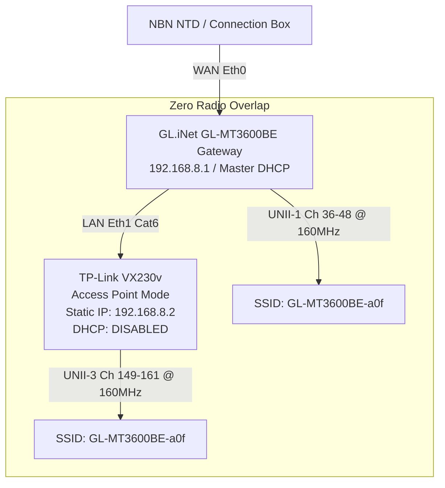

# 🌐 TP-Link VX230v Origin Broadband: Error Analysis & Mesh Harmonization

> **Device Inspected:** **TP-Link VX230v AX1800 Dual-Band Wi-Fi 6 VDSL/Ethernet Gateway**  
> **Hardware Vendor:** TP-Link Systems Inc. (Verified OUI: `E0:D3:62`, `28:87:BA`)  
> **Firmware Branding:** **Origin Energy Broadband (Custom ISP Firmware)**  
> **Discovered Airwaves:**
> - 2.4 GHz: `Origin_8FC9E1` (BSSID: `E0:D3:62:8F:C9:E1`, Channel 10, Signal: `-25 dBm`)
> - 5.0 GHz: `Origin_8FC9E1_5G` (BSSID: `E0:D3:62:8F:C9:E3`, Channel 36, Signal: `-35 dBm`)

---

## 🔍 1. Root Cause Analysis: Why `tplinkmodem.net` Failed with "Network Error"

### 1.1 The DNS Intercept Isolation Dilemma
1. **The Factory Intercept Domain:**
   `http://tplinkmodem.net/` is not a genuine internet domain that resolves globally to private IPs. Instead, it is an internal DNS spoofing entry hardcoded into TP-Link's internal `dnsmasq` daemon.
2. **The Client Connection State:**
   - The user's Mac Mini and browsers were connected to the **`Pixel` Wi-Fi Hotspot** (`10.231.140.1`), or directly to the GL.iNet Gateway (`192.168.8.1`).
   - When Chrome sent a DNS lookup for `tplinkmodem.net`, it queried the default DNS server (`100.100.100.100` / `1.1.1.1` / `8.8.8.8`).
3. **Public DNS Redirection to AWS:**
   - Upstream public DNS servers resolve `tplinkmodem.net` to Amazon AWS public IP: **`3.224.42.34`**.
   - Browsers navigating to `3.224.42.34` over external internet receive TP-Link's generic cloud catch-all page:
     > *"Trying to Configure the Router? It looks like you may not be connected to your TP-Link network..."*
   - Because the user was not directly linked to the TP-Link's internal subnet, the browser threw **Network Error**!

---

## 🏷️ 2. Why It Displayed Its Internet Origin as "Origin" / TP-Link

1. **Origin Broadband Pre-Provisioned CPE:**
   - The router is customer premises equipment (CPE) supplied by **Origin Energy Broadband** in Australia.
   - The factory firmware is flashed with pre-configured ISP settings, which hardcodes the default SSID prefix to **`Origin_`** (e.g. `Origin_8FC9E1` and `Origin_8FC9E1_5G`).
2. **Double-NAT Subnet Clashing:**
   - In factory router mode, the TP-Link runs its own WAN routing engine, NAT translation, and DHCP server on `192.168.1.1` (or `192.168.20.1`).
   - If connected upstream to the GL.iNet Gateway or NBN NTD without configuration, it creates **Double-NAT**, advertising itself as the primary internet gateway rather than a transparent Layer 2 Access Point.

---

## 🛠️ 3. Canonical Step-by-Step Resolution: Transitioning to AP Mode

To unify the TP-Link into the Lauburu Mesh without double NAT or separate SSID branding:

### Configuration Steps:
1. **Direct Connection:**
   - Connect computer via Ethernet cable to LAN Port 1 of the TP-Link (or connect to Wi-Fi `Origin_8FC9E1`, password printed on router bottom label).
   - Navigate to **`http://192.168.1.1`** in Chrome.
2. **Operation Mode:**
   - Go to **Advanced -> Operation Mode** -> Select **Access Point (AP) Mode** -> Click **Save**.
   - *Result:* Disables routing/NAT, bridging all 4 Gigabit LAN ports with Wi-Fi.
3. **LAN IP & Gateway:**
   - Go to **Advanced -> Network -> LAN**:
     - IP Address: `192.168.8.2`
     - Subnet Mask: `255.255.255.0`
     - Default Gateway: `192.168.8.1`
     - DNS: `192.168.8.1`
4. **Disable DHCP Server:**
   - Go to **Advanced -> Network -> DHCP Server** -> Uncheck **Enable** (Set to **Disabled**).
5. **Wireless Unification:**
   - Rename SSIDs from `Origin_8FC9E1` to **`GL-MT3600BE-a0f`**.
   - Fix 5GHz to **Channel 149-161** (Width: 80/160 MHz) with password **`goldfighting1`**.
