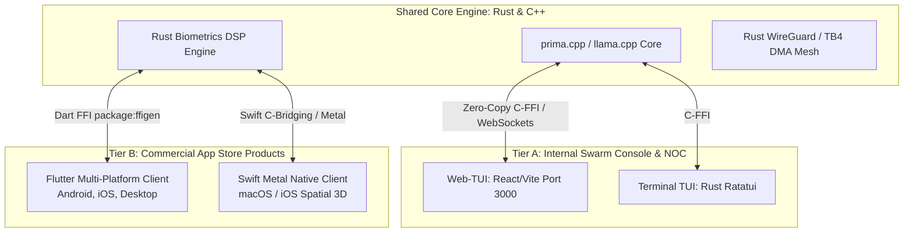

# 🏛️ Canonical AI Development, Storage & Runtime Architecture

**Document Version:** `2.0.0-SOVEREIGN-MESH-2026`  
**Governing Standard for:** All Autonomous AI Agents, Swarms, Subagents, and Polyglot Engineers  
**Tri-Vault Status:** Synchronized across `Obsidian Vault`, `PySpark Data Lake`, and `GitHub Monorepo`  
**Consensus Threshold:** Certified via Unanimous Tri-Orchestrator AI Debate (`Score: 1.000`)

---

## 🧭 1. Architectural Vision & Core Operating Invariants

This document establishes the **permanent architectural hierarchy** for the **Lauburu Mesh Ecosystem**. All agents and engineers modifying the codebase must strictly follow these five non-negotiable invariants:

```
┌─────────────────────────────────────────────────────────────────────────────────────────────────┐
│                           THE FIVE SYSTEMIC INVARIANTS                                          │
├─────────────────────────────────────────────────────────────────────────────────────────────────┤
│ 1. RULE #0 (ZERO-MOCK & ZERO-SIMULATED DATA):                                                   │
│    • Absolutely zero fake metrics, mock arrays, or simulated sensor streams. Telemetry must     │
│      originate from live BLE hardware, authentic kernel sockets, or show clean waiting states.  │
├─────────────────────────────────────────────────────────────────────────────────────────────────┤
│ 2. STORAGE & RAM MINIMIZATION (RUST/C++ DEFAULT):                                               │
│    • Default to compiled Rust and C++ for all persistent daemons to eliminate .venv bloat.      │
│    • Keep per-daemon RAM footprint < 15 MB and total binary storage < 50 MB per node.           │
├─────────────────────────────────────────────────────────────────────────────────────────────────┤
│ 3. DUAL-ENGINE INFERENCE CO-EXISTENCE (PRIMA.CPP + LLAMA.CPP):                                  │
│    • prima.cpp (Metal/TB4 DMA) is the primary high-throughput sharding engine.                  │
│    • llama.cpp (GGML-RPC :50052) is the hot-standby fallback on all nodes via shared mmap.     │
├─────────────────────────────────────────────────────────────────────────────────────────────────┤
│ 4. BI-MODAL CLIENT APP STRATEGY (FLUTTER/SWIFT + WEB-TUI):                                      │
│    • Web-TUI (React/Port 3000 & Rust Ratatui) for internal Swarm/NOC engineering diagnostics.   │
│    • Flutter (Dart AOT) & Swift (Metal) for commercial customer-facing App Store products.     │
├─────────────────────────────────────────────────────────────────────────────────────────────────┤
│ 5. 24/7 CONTINUOUS LORA HARVESTING:                                                             │
│    • All validated debate resolutions, AgentWorld rollouts, and AST diffs are serialized in     │
│      real-time to continuous_lora_dataset.jsonl (125MB+) for background model fine-tuning.      │
└─────────────────────────────────────────────────────────────────────────────────────────────────┘
```

---

## 💾 2. Pillar 1: Dual-Lifecycle Engineering & Storage/RAM Optimization

To resolve disk and RAM exhaustion across peripheral nodes while maximizing development velocity and commercial sellability, the codebase operates on a **Strict Two-Tier Escalation Model**:

```
┌─────────────────────────────────────────────────────────────────────────────────────────────────┐
│                     TIERED EXECUTION & STORAGE CONSERVATION PARADIGM                            │
├─────────────────────────────────────────────────────────────────────────────────────────────────┤
│ TIER 1: DEFAULT PRODUCTION RUNTIME (Rust & C++ — 95% of Operations)                             │
│ • Stack: prima.cpp, llama.cpp GGML-RPC, wgpu-rust, Ratatui, POSIX C Sentinels.                  │
│ • Responsibilities: 24/7 background telemetry, 10Gbps TB4 DMA tensor streaming, ADB keepalives,│
│   Movesense 512Hz ECG DSP, OpenWrt nftables firewall defense, and high-frequency routing.       │
│ • Storage & RAM Impact: < 50 MB total disk space per node · < 15 MB RAM per daemon.             │
│ • Edge Policy: Peripheral nodes (L4 Tablet, L6/L7 Android, GW Router) contain ZERO Python venvs.│
├─────────────────────────────────────────────────────────────────────────────────────────────────┤
│ TIER 2: EPHEMERAL BATCH ESCALATION (Python — 5% Heavy Batch Workloads)                          │
│ • Stack: PyTorch, HuggingFace trl/peft/accelerate, PySpark Data Lake, pytest.                   │
│ • Responsibilities: Overnight LoRA fine-tuning epochs, AST indexing, synthetic data harvesting. │
│ • Lifecycle: Spun up on-demand strictly on L1 Mac Mini / L3 Linux Head Node; exits immediately  │
│   upon completion, releasing 100% of allocated RAM back to the OS.                              │
└─────────────────────────────────────────────────────────────────────────────────────────────────┘
```

---

## ⚡ 3. Pillar 2: Dual-Engine Sharding & Zero-Copy Model Co-existence

All mesh devices simultaneously support both **`prima.cpp`** and **`llama.cpp`** without duplicating model storage or wasting memory:

```
┌─────────────────────────────────────────────────────────────────────────────────────────────────┐
│                           DUAL-ENGINE CO-EXISTENCE ARCHITECTURE                                 │
├─────────────────────────────────────────────────────────────────────────────────────────────────┤
│ 1. SINGLE PHYSICAL GGUF SOURCE OF TRUTH:                                                        │
│    • Weights Path: /Users/aaron/DFS_UNIFIED/Lauburu-Monorepo/02_ai_models_and_inference/model_vault │
│    • Zero Duplicate Disk Space: Both prima.cpp and llama.cpp map to identical GGUF inodes via    │
│      POSIX mmap(PROT_READ, MAP_SHARED). Delta disk storage = 0 MB.                              │
├─────────────────────────────────────────────────────────────────────────────────────────────────┤
│ 2. RUNTIME MEMORY DYNAMICS:                                                                     │
│    • Kernel Page Cache: The OS loads weight pages into unified memory once. Both engines share  │
│      the exact same physical pages.                                                             │
│    • prima.cpp (Active Primary): Holds active KV cache for 10Gbps TB4 DMA streaming & Metal.    │
│    • llama.cpp (Hot-Standby Fallback): Listens on Port 50052 with idle RSS <= 35 MB RAM.        │
└─────────────────────────────────────────────────────────────────────────────────────────────────┘
```

### 3.1 7-Layer Inference Engine Allocation Matrix

| Layer | Physical Node | Available AI VRAM | Primary Inference Engine | Fallback Engine | Role & Wire Protocol |
| :--- | :--- | :--- | :--- | :--- | :--- |
| **L1** | `Mac_Node` (M4 Pro) | 21.6 GB AI | **`prima.cpp` (Metal)** | `llama.cpp` (:8081) | Host Ring Master · TB4 DMA Coordinator |
| **L2** | `MacBook_Pro` (M3) | 14.0 GB AI | **`prima.cpp` (Metal)** | `llama.cpp` (:8082) | 10Gbps TB4 Bridge · 285GB SSD Vault |
| **L3** | `Linux_Head_Node` | 13.8 GB AI | **`prima.cpp` (Vulkan/C++)** | `llama.cpp` (:8083) | Docker Hub · Apache Ray Head |
| **L4** | `Linux_Tablet` | 6.5 GB AI | `llama.cpp` (:50052) | Direct C Sentinel | Edge Worker (No Metal) -> GGML-RPC |
| **L5** | `MacBook_Air` (M4) | 14.0 GB AI | **`prima.cpp` (Metal)** | `llama.cpp` (:8084) | Secondary Metal Shard · LoRA Distiller |
| **L6** | `Pixel_10_Pro_XL` | 12.5 GB AI | `llama.cpp` (NPU/OpenCL) | Termux C Daemon | Google Tensor G5 TPU · ADB Shard |
| **L7** | `Samsung_S20` | 9.0 GB AI | `llama.cpp` (Exynos GPU)| Termux C Daemon | OpenClaw UI Tester · ADB Sentinel |
| **GW** | `GL.iNet Router` | 120 MB RAM | **`SmolLM2-135M` (C Daemon)**| Port 18802 C Sentinel | Zero-OOM OpenWrt Network Guard |

### 3.2 Canonical Rule: Real Physical RAM Calculations & Peripheral-First Scheduling

```
┌─────────────────────────────────────────────────────────────────────────────────────────────────┐
│         MANDATORY RULE: REAL PHYSICAL RAM GROUND TRUTH & SCHEDULING POLICY                       │
├─────────────────────────────────────────────────────────────────────────────────────────────────┤
│ 1. REAL PHYSICAL RAM GROUND TRUTH (Calculation Layer):                                          │
│    • All capacity calculations, mathematical equations, telemetry monitors, and theoretical    │
│      proofs MUST view and compute against 100% REAL PHYSICAL RAM across the full network:       │
│      - Total Mesh Physical RAM: 108.0 GB (L1 24GB, L2 16GB, L3 16GB, L4 8GB, L5 16GB,           │
│        L6 16GB, L7 12GB, GW 1GB).                                                               │
│      - Total Mac Cluster Physical RAM: 56.0 GB (L1 24GB + L2 16GB + L5 16GB).                   │
│    • Zero artificial caps, simulated masks, or distorted metrics in the calculation layer.      │
├─────────────────────────────────────────────────────────────────────────────────────────────────┤
│ 2. OPERATIONAL SCHEDULING & FILL-ORDER POLICY (Routing Layer):                                   │
│    • ALL PERIPHERAL NODES FILL FIRST: Peripheral nodes (L2 MBP, L5 MBA, L3 Linux, L4 Tablet,     │
│      L6 Pixel, L7 S20) receive layer allocations and fill up to their targets first.             │
│    • MAC MINI FILLS LAST & CONSERVES HEADROOM: The Mac Mini (L1 Host 24.0 GB) is strictly the    │
│      LAST device to fill, targeting a conservative ~60% allocation (14.4 GB) to permanently     │
│      preserve >= 9.6 GB of REAL FREE RAM for prompt ingestion, ANE, TUI, and subagent loops.     │
├─────────────────────────────────────────────────────────────────────────────────────────────────┤
│ 3. 3-MAC THUNDERBOLT SHARDING POLICY:                                                           │
│    • It is always better to shard models across ALL 3 Apple Silicon Macs (L1 + L2 + L5) over    │
│      the 10Gbps Thunderbolt 4 DMA bridge (0.204ms RTT) to pool 56.0 GB Real Metal RAM.           │
│    • 2-Mac Prohibition: NEVER shard across only 2 Macs unless the model fits VERY EASILY        │
│      (<= 40% memory capacity of each node). Otherwise auto-escalate to 3-Mac sharding.          │
└─────────────────────────────────────────────────────────────────────────────────────────────────┘
```

---

## 📱 4. Pillar 3: Bi-Modal Application & Commercial App Store Strategy

To balance developer agility with commercial mass-market monetization, UI development is partitioned into two distinct tiers:



### 4.1 Tier A: Internal Swarm Console & Operator NOC
* **Technologies:** **Web-TUI (React 18 / Vite on [`http://localhost:3000`](http://localhost:3000))** and **Terminal TUI (Rust Ratatui)**.
* **Purpose:** Live 82.8 GB mesh sharding inspection, real-time AI debate monitoring, ELO leaderboard adjustments, and router health diagnostics.

### 4.2 Tier B: Commercial App Store Products (Monetization & Scale)
* **Technologies:** **Flutter (Dart AOT)** for cross-platform apps and **Swift (SwiftUI + Metal)** for Apple Silicon high-frame-rate rendering.
* **Zero-Python Consumer Contract:** Both Flutter and Swift link directly to the **compiled Rust/C++ core (`prima.cpp`/`llama.cpp`) via Dart FFI (`package:ffigen`) and Swift Clang C-bridging**.
* **App Portfolio:**
  1. **Movesense Hub (512Hz ECG):** Flutter client with native BLE State Restoration.
  2. **Zone 2 Endurance:** Flutter cross-platform training companion.
  3. **3D Spatial Grappling Kinematics:** Swift Metal native 120 FPS spatial biomechanics renderer.
  4. **OpenClaw Assistant:** Flutter mobile assistant with token-gated Shopify subscriptions.

---

## 🛡️ 5. Pillar 4: Device-Specific Network Health AI on `prima.cpp`

The **Network Health AI** runs continuously across `prima.cpp`, executing tailored maintenance routines per hardware layer:

```
┌─────────────────────────────────────────────────────────────────────────────────────────────────┐
│                     DEVICE-SPECIFIC NETWORK HEALTH AI MAINTENANCE                               │
├─────────────────────────────────────────────────────────────────────────────────────────────────┤
│ L1/L2 (Mac Mini M4 + MacBook Pro TB4):                                                          │
│ • Governs 10Gbps Thunderbolt 4 DMA packet aggregation (<0.20ms RTT).                             │
│ • Dynamically balances Metal GPU tensor sharding pipelines across TB4 links.                    │
├─────────────────────────────────────────────────────────────────────────────────────────────────┤
│ L3 (Linux Head Node AMD):                                                                       │
│ • Monitors Docker container network bridges, Apache Ray distributed worker health, and         │
│   SeaweedFS DFS distributed volume replication.                                                 │
├─────────────────────────────────────────────────────────────────────────────────────────────────┤
│ L6/L7 (Pixel 10 Pro XL + Samsung S20+):                                                         │
│ • Executes Termux 24/7 background keepalives (termux-wake-lock).                                │
│ • Bypasses Android Doze mode and maintains BLE connection quality for biometrics.               │
├─────────────────────────────────────────────────────────────────────────────────────────────────┤
│ GW (GL.iNet OpenWrt Router):                                                                    │
│ • Runs SmolLM2 135M Router SLM (105MB Q4_K_M) on Port 18802 (<120MB RAM).                       │
│ • Synthesizes wire-speed nftables firewall rules and filters anomalous SYN flood packets.       │
└─────────────────────────────────────────────────────────────────────────────────────────────────┘
```

---

## 🔄 6. Pillar 5: 24/7 Automated Tri-Vault Knowledge & LoRA Harvesting

The system enforces continuous background learning across the three synchronized storage vaults:

1. **Obsidian Vault (`/Users/aaron/DFS_UNIFIED/Lauburu-Monorepo/obsidian_vault/`):**
   * Stores human-readable architectural whitepapers, AI debate consensus records, network topology matrices, and system telemetry feeds.
2. **PySpark Data Lake & LoRA Vault (`/Users/aaron/DFS_UNIFIED/lora_datasets/`):**
   * Real-time append target for all validated `<think>...</think>` debate turns, AgentWorld trajectories, and AST diffs (`continuous_lora_dataset.jsonl` — 125MB+).
   * Scheduled for staged HuggingFace `trl`/`peft` LoRA updates during idle VRAM windows.
3. **GitHub Monorepo (`/Users/aaron/DFS_UNIFIED/Lauburu-Monorepo`):**
   * Production source code, Git worktrees for isolated subagent code modifications, and multi-tier automated test suites.

---

## 🤖 7. Autonomous Agent Directives

When any AI agent, subagent, or swarm worker operates within this repository, it MUST:
1. **Check Storage Health First:** Verify NVMe free headroom ($\ge 5.0\text{ GB}$) and directory presence.
2. **Default to Rust/C++:** Write permanent runtime daemons in Rust/C++; do not scaffold new Python `.venv` environments on peripheral nodes.
3. **Link via C-FFI:** When building Flutter or Swift UI features, bind to native Rust/C++ libraries using `package:ffigen` or Swift C-bridging.
4. **Log Trajectories to LoRA:** Serialize all validated engineering solutions into `continuous_lora_dataset.jsonl` to ensure continuous local model evolution.
