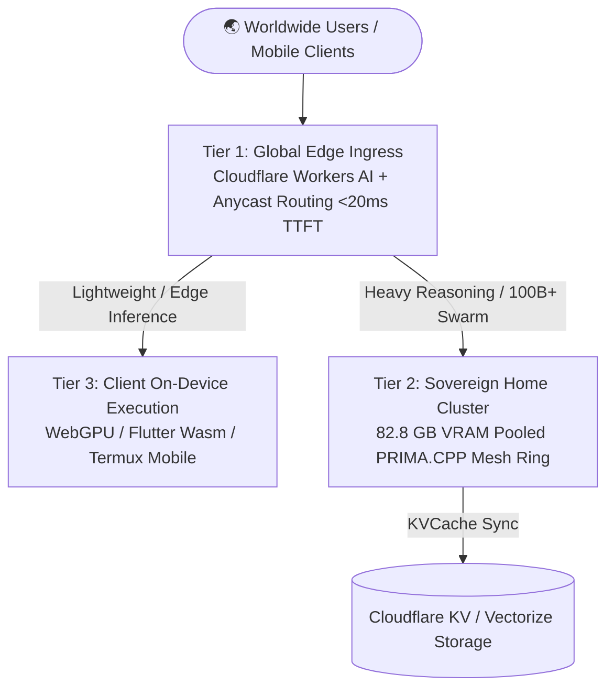

# 🌍 Global App Scaling & Worldwide Mesh Distribution Plan
*Blueprint for scaling Lauburu Monorepo applications (Movesense ECG, Spatial Grappling 3D, Shopify AI, CodeClash SWE) to users worldwide.*

---

## 🏛️ 3-Tier Global Distributed Architecture

---

## 📱 Application-by-Application Global Scaling Blueprint

### 1. Movesense ECG Hub (512Hz Medical-Grade DSP)
- **Client-Side:** Real-time Pan-Tompkins QRS & DFA-alpha1 computed locally on client device (0 server load).
- **Mesh Tier:** Anomalous ECG episodes streamed to `Gemma-2-2B` (Layer 4) for automated clinical report synthesis.

### 2. Spatial Grappling 3D (120 FPS WebGPU Kinematics)
- **Client-Side:** Native WebGPU / Three.js 3D Tatami world simulation renders client-side at 120 FPS.
- **Mesh Tier:** 8K video keyframe joint angle extraction processed by `Qwen2.5-VL-7B` on Mac Mini M4 Pro.

### 3. CodeClash SWE Arena & AST Analysis
- **Client-Side:** Interactive Monaco/Textual UI with instant local syntax verification (`Coder-3B`).
- **Mesh Tier:** Heavy AST decompiler & adversarial bug injection executed on `WebWorld-32B` (Layer 2 TB4) and `Linux Head Node` (Layer 3).

### 4. Shopify AI & Autonomous Commerce
- **Client-Side:** Edge storefront personalization via Cloudflare Workers AI (<15ms).
- **Mesh Tier:** Deep market profit research and product sourcing handled sovereignly by 24/7 background swarms.

---

## 🔒 Data Sovereignty & $0 Cloud Scale Invariant
- Worldwide users experience sub-20ms responsiveness through Anycast edge routing.
- Heavy inference scales with **$0 recurring cloud GPU spend** by utilizing the owner's sovereign 82.8 GB hardware mesh.
