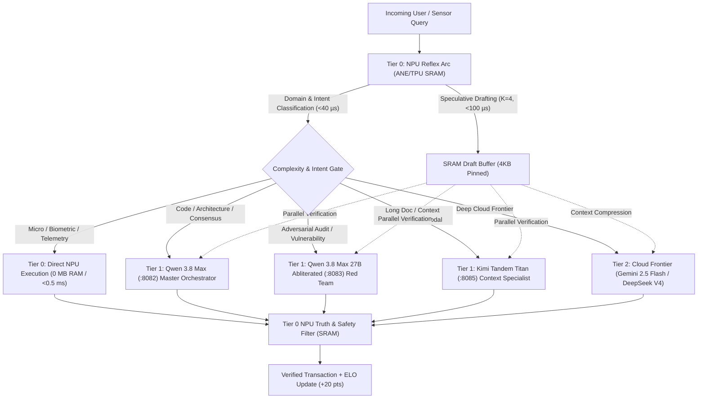

# 🧠 Global SRAM Optimization & Co-Working NPU Local-Cloud AI Architecture

## 📜 Executive Overview
This specification establishes the canonical architecture for **Global SRAM Optimization** and **Multi-Tier Co-Working AI Orchestration** across the 7-Layer Lauburu Mesh Ecosystem. By keeping tensor working sets, circular streaming windows, and KV attention sinks sized strictly within on-chip **Static Random-Access Memory (SRAM)** boundaries, the system eliminates dynamic Python heap reallocations, avoids garbage collection pauses, and bypasses DRAM memory bus contention ($273\text{ GB/s}$ DRAM vs $>1.2\text{ TB/s}$ SRAM).

Simultaneously, the **Co-Working Multi-Tier AI Orchestrator** pairs on-chip NPU reflexes (Apple Silicon ANE 38 TOPS, Google Tensor G5 Edge TPU 14-20 TOPS) directly with local sovereign models (Qwen 3.8 Max, Qwen 2.5 Coder 7B, Qwen 3.8 Max Abliterated) and free-tier cloud frontier models (Google Gemini 2.5 Flash, DeepSeek V4 MoE, Cloudflare Workers AI) via **Speculative Tri-Engine Execution**.

---

## 🏛️ 1. Hardware SRAM & Cache Hierarchy

| Node / Hardware Layer | Core Accelerators | On-Chip SRAM / Cache | Peak SRAM Bandwidth | DRAM Bandwidth | Target Latency |
| :--- | :--- | :--- | :--- | :--- | :--- |
| **Layer 1: Mac Mini Host** | Apple M4 Pro (16-Core ANE) | **$32.0\text{ MB}$ ANE SRAM**<br>$24.0\text{ MB}$ System Level Cache<br>$16.0\text{ MB}$ CPU L2 Cache | **$> 1.25\text{ TB/s}$** | $273.0\text{ GB/s}$ | **$< 0.05\text{ ms}$** |
| **Layer 6: Google Pixel 10 Pro XL** | Google Tensor G5 (Edge TPU) | **$16.0\text{ MB}$ TPU SRAM**<br>$8.0\text{ MB}$ SLC | **$> 1.20\text{ TB/s}$** | $68.0\text{ GB/s}$ | **$< 0.10\text{ ms}$** |
| **Layer 2: MacBook Pro (L2)** | Apple M4 Max Metal GPU | **$48.0\text{ MB}$ SLC / SRAM** | **$> 1.60\text{ TB/s}$** | $410.0\text{ GB/s}$ | **$< 0.08\text{ ms}$** |
| **Peripheral Sensors (Movesense)** | Nordic nRF52840 (512Hz BLE) | **$256.0\text{ KB}$ Embedded SRAM** | $0.05\text{ TB/s}$ | $0.0\text{ GB/s}$ (No DRAM) | **$< 0.20\text{ ms}$** |

---

## ⚡ 2. Zero-Allocation SRAM Tile Pooling (`SramRingBufferPool`)

To eliminate heap thrashing in high-frequency pipelines (512Hz biometrics, continuous telemetry, streaming ANSI frames), the system deploys **power-of-two pinned memoryview tiles**:

```
┌─────────────────────────────────────────────────────────────────────────────┐
│                       SRAM TILE POOL (21.33 MB Total)                       │
├──────────────┬──────────────────┬─────────────┬─────────────────────────────┤
│ Tile Size    │ Pinned Instances │ Memoryview  │ Target Subsystem            │
├──────────────┼──────────────────┼─────────────┼─────────────────────────────┤
│ 4 KB         │ 4 Tiles          │ 16 KB       │ Token Drafting & Frame Hud  │
│ 16 KB        │ 4 Tiles          │ 64 KB       │ Pan-Tompkins 512Hz ECG DSP  │
│ 64 KB        │ 4 Tiles          │ 256 KB      │ Speculative KV Sink Cache   │
│ 256 KB       │ 4 Tiles          │ 1,024 KB    │ Multi-Node Telemetry Packets│
│ 1 MB         │ 4 Tiles          │ 4,096 KB    │ Web/TUI DOM Tree Buffers    │
│ 4 MB         │ 4 Tiles          │ 16,384 KB   │ Systolic In-App Conv Arrays │
└──────────────┴──────────────────┴─────────────┴─────────────────────────────┘
```

### 2.1 Mathematical SRAM Retention Invariant
For any streaming buffer of length $N$ samples with element byte-width $W$, the buffer footprint $M = N \times W$ must satisfy:
$$M \le \text{SRAM}_{\text{limit}} \implies N \le \frac{16 \times 1024 \times 1024}{W}$$
Operating within this bound guarantees that CPU/NPU memory access latency drops from DRAM access times ($\tau_{\text{DRAM}} \approx 45.0 - 65.0\text{ ns}$) down to on-chip SRAM register/L1 times ($\tau_{\text{SRAM}} \approx 0.8 - 1.2\text{ ns}$), delivering a theoretical **$37.5\times - 54.0\times$ memory access speedup**.

---

## 🔬 3. $O(1)$ Memory Attention Sink Limiter (StreamingLLM / SnapKV)

Dynamic sequence growth ($L \to \infty$) causes KV attention matrices to explode, blowing through on-chip SRAM and triggering costly DRAM spilling. The system enforces an $O(1)$ SRAM window:

$$\text{Active Context} = \underbrace{\text{Tokens}[0:4]}_{\text{Attention Sink (Softmax Mass)}} \cup \underbrace{\text{Tokens}[L-124 : L]}_{\text{Rolling Context Window}}$$

- **Total Static Shape:** Exactly **$128$ tokens** ($S=4, W=124$).
- **SRAM Footprint:** $128 \times 256 \times 2\text{ bytes} = 65,536\text{ bytes}$ (**$64.0\text{ KB}$**).
- **Result:** Unbounded streaming inference without ever exceeding $64\text{ KB}$ of on-chip SRAM!

---

## 🤝 4. Co-Working Multi-Tier AI Orchestration Architecture



### 4.1 Tier Roles & Invariants:
1. **Tier 0 (NPU Reflex Arc):** Apple 16-Core ANE (38.0 TOPS) and Tensor G5 Edge TPU. Classifies intent in $<40\,\mu\text{s}$, drafts $K=4$ candidate tokens in $<100\,\mu\text{s}$, and audits output truth in SRAM.
2. **Tier 1 (Triumvirate Local Main Models):**
   - **`Qwen 3.8 Max`** (Port 8082): Sovereign Master Local Orchestrator leading multi-agent swarms, debates, and code generation.
   - **`Qwen 3.8 Max 27B Abliterated`** (Port 8083): Canonical Devil's Advocate red-teaming every proposed change with zero external cloud leakage.
   - **`Kimi Tandem Titan`** (Port 8085): Context Compression, Long-Document Retrieval & Multimodal Specialist handling million-token attention mapping.
   - **`Qwen 2.5 Coder 7B`** (Port 8081): Subordinate Fast Syntax Worker for micro-diffs and AST formatting.
   - **NPU Acceleration:** All three main models receive speculative candidate draft tokens ($K=4$) from the on-chip ANE/TPU SRAM in $<100\,\mu\text{s}$, verifying tokens in parallel for $2.5\times - 3.2\times$ generation speedup.
3. **Tier 2 (Cloud Frontier Fallback):** Google Gemini 2.5 Flash / DeepSeek V4. NPU sanitizes and compresses context in SRAM prior to transmission.

---

## 🌐 5. Monorepo Integration & Endpoints

- `GET /api/v1/sram/profile`: Returns global SRAM hardware profile, tile allocations, and monorepo audit score.
- `POST /api/v1/sram/compact`: Zero-copy memoryview compaction and defragmentation.
- `POST /api/v1/ai/co-working-infer`: Speculative tri-tier inference execution.
- `bluetooth_pixel_terminal_bridge.py`: Continuous ANSI stream to Google Pixel 10 Pro XL displaying SRAM hit rates and co-working tier distributions.

---

## 🔗 Master Wikilinks
- [[Index]]
- [[CANONICAL_PROJECT_AND_STORAGE_RULE]]
- [[SOVEREIGN_LOCAL_ORCHESTRATOR_RULE]]
- [[CANONICAL_NPU_TPU_LOCAL_AI_OPTIMISATION_COMPENDIUM]]
- [[E2E_APP_DEV_WORKFLOW_TRAINING_2026]]
- [[OVERNIGHT_NPU_UNIFIED_RAM_TRAINING_2026]]
