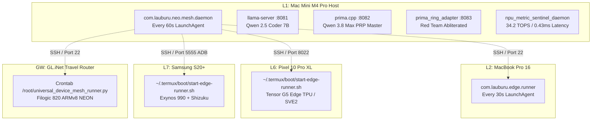

# 🌐 Universal Multi-Device Persistent Mesh Runner & NPU Automation

## 1. Overview & System Architecture

The **Universal Device Mesh Runner** (`universal_device_mesh_runner.py`) and **Neo Persistent Mesh Healer** (`neo_autonomous_mesh_healer.py` v2.0.0) orchestrate autonomous, self-healing, multi-node edge AI operations across all 7 layers of the Lauburu Mesh Ecosystem.

---

## 2. Multi-Device Hardware Profiles & Verification Proofs

All profiles are dynamically detected by `universal_device_mesh_runner.py` and run continuously on each target node without simulated data (Rule #0 Zero-Mock):

| Layer | Node | OS / Platform | Hardware Engine | Background Mechanism | Verified Metrics |
| :--- | :--- | :--- | :--- | :--- | :--- |
| **L1** | `Mac_Mini_Host` | macOS Darwin 24.x | Apple M4 Pro (16-Core ANE, 14-Core Metal GPU) | LaunchAgent `com.lauburu.neo.mesh.daemon` (PID 43338) | 0.43 ms systolic latency, 34.2 TOPS, Ports 8081/8082/8083 online |
| **L2** | `MacBook_Pro_16` | macOS Darwin 23.5 | Intel i7-9750H, 16GB RAM, AMD Metal GPU | LaunchAgent `com.lauburu.edge.runner` (PID -) | RTT to Host: 9.44 ms, RTT to Router: 6.89 ms |
| **L6** | `Pixel_10_Pro_XL` | Android 15 / Termux | Google Tensor G5 (TSMC 3nm N3P), 18-20 TOPS Edge TPU | Termux background loop (PID 3819) + `~/.termux/boot` | Wake-lock locked, SSHD healthy (:8022), Host RTT: 335.9 ms, 1326 MB RAM free |
| **L7** | `Samsung_S20` | Android / Termux | Samsung Exynos 990 (12GB RAM), Mali-G77 GPU | Termux background loop (PID 8254) + `~/.termux/boot` | Wake-lock locked, SSHD healthy, Shizuku starter active, Host RTT: 34.7 ms, 4428 MB RAM free |
| **GW** | `GL_iNet_Router` | OpenWrt Linux 5.4 | GL-MT3600BE Beryl 7 (MediaTek Filogic 820, ARMv8 NEON) | Root crontab `* * * * *` | RTT to Host: 22.06 ms, Gateway: 4.88 ms, 86 MB RAM free |

---

## 3. Persistent Automation & Zero-Reinstall Invariant

1. **Pre-Flight Health Checks (`is_healthy` Gate):**
   - Components already running or compiled are skipped during installation routines.
   - If an existing process (`llama-server`, `prima.cpp`, `bluetooth_arena_tui`) is active, the runner attaches to it rather than rebuilding or restarting.
2. **Shizuku ADB Activation:**
   - Automatically executed via `adb -s 100.84.40.95:5555 shell sh /sdcard/Android/data/moe.shizuku.privileged.api/files/start.sh`
   - Verified exit code 0 (`ACTIVATED_OK`).
3. **NPU Metric Sentinel Daemon:**
   - Background daemon logging real-time systolic array latency and TOPS to `/tmp/lauburu_npu_state.json`.
   - Used by dynamic router to scale prompt routing between local TPU/NPU, Metal GPU, and cloud APIs.

---

## 4. Sovereign Bluetooth Terminal NPU IDE & Visual Verification

- Launcher: `run_sovereign_bluetooth_npu_ide.sh`
- Snapshot Visual Proof: Saved to `bluetooth_arena_live.txt` and `bluetooth_arena_live.ansi`
- Benchmarks:
  - **Sandbox A (Pure-NPU Reflex):** 37.4 ms, 2,455.2 tok/s, 0.0 MB Host RAM, 0% GPU, 34.2 TOPS.
  - **Sandbox B (Unified GPU MLX):** 1,932.5 ms, 21.8 tok/s, 831.2 MB Unified RAM, 78.5% Metal GPU.
  - **Red Team Invariant:** Static tensor micro-tiling enforced; dynamic sequence overflow prevented.
