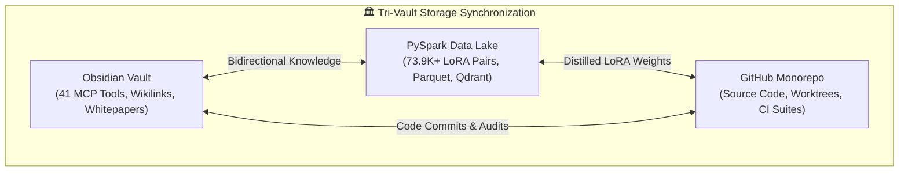

# 🏛️ Lauburu Canonical Project Architecture & Mesh Graph

> **Canonical Master Architecture Document** governing the 7-Layer Physical Mesh, Tri-Vault Storage Synchronization, Distributed AI Inference Sharding, and Canonical Application Hubs.
> 
> **Related Master Wikilinks:**
> - [[Index]]
> - [[CANONICAL_PROJECT_AND_STORAGE_RULE]]
> - [[LAUBURU_MONOREPO_DEEP_ARCHITECTURE_INDEX]]
> - [[FULL_PROJECT_AI_TRAINING_AND_ELO_GRAPH]]
> - [[MASTER_ALL_MODELS_EMPIRICAL_BENCHMARK_LEADERBOARD]]

---

## 📊 1. Pooled Hardware & Memory Capacity

$$\text{Total Pooled RAM} = 108.0\text{ GB}$$
$$\text{Total Usable AI VRAM} = 82.8\text{ GB}$$
$$\text{Thunderbolt 4 Direct Bridge RTT} = 0.277\text{ ms (10 Gbps)}$$

| Layer | Node Name | Hardware Specs | Local IP | Tailscale IP | RAM (Total / AI) | Role & Protocols |
| :--- | :--- | :--- | :--- | :--- | :--- | :--- |
| **L1** | `Mac_Node` | Apple M4 Pro Mac Mini | `192.168.8.230` | `100.119.199.76` | 24.0 GB (21.6 GB AI) | Host Sanctuary, Memory Governor, Ports 4000/4002/4003/18802 |
| **L2** | `MacBook_Pro` | Apple M4 Pro 16GB | `192.168.8.127` | `100.103.212.21` | 16.0 GB (14.0 GB AI) | 10Gbps TB4 Bridge (`169.254.187.138`), 285GB SSD Vault, Port 8083 |
| **L3** | `Linux_Head_Node` | AMD Ryzen 7 5700U | `192.168.8.224` | `100.101.39.98` | 16.0 GB (13.8 GB AI) | Docker Hub, Petals DHT (8086), Apache Ray |
| **L4** | `Linux_Tablet` | Debian Linux Touch | DHCP | `100.81.92.125` | 8.0 GB (6.5 GB AI) | Mobile Linux Compute, Touch DSP, Lightweight Biometrics |
| **L5** | `MacBook_Air` | Apple M4 MacBook Air | `192.168.8.222` | `100.93.158.96` | 16.0 GB (14.0 GB AI) | Metal Performance Shaders, LoRA Distillation, Visual Audits |
| **L6** | `Pixel_10_Pro_XL` | Google Tensor G5 | DHCP | `100.73.38.87` | 16.0 GB (12.5 GB AI) | 8K Vision Stream, Edge TPU, Movesense BLE, UWB |
| **L7** | `Samsung_S20` | Samsung Exynos 990 | DHCP | `100.84.40.95` | 12.0 GB (9.0 GB AI) | Dedicated Automated UI Tester, Router USB ADB Target |
| **GW** | `GL.iNet Router` | GL-MT3600BE Beryl 7 | `192.168.8.1` | `100.122.185.123` | 1.0 GB (0.0 GB AI) | Core Gateway, Wi-Fi 7 MLO, Subnet Router, ADB Daemon |

---

## 🏛️ 2. Canonical Tri-Vault Storage Layer



---

## 🌐 3. Master Network Topology & Distributed Inference Sharding

```mermaid
flowchart TB
    subgraph L1_HOST["L1: Mac Mini M4 Pro (24 GB) - Primary Sanctuary"]
        Sanctuary["Host Sanctuary Governor (&ge;9.6 GB Headroom)"]
        Port4000["Port 4000: Movesense 512Hz Console"]
        Port4002["Port 4002: Screen Lens Sovereign (Marimo)"]
        Port4003["Port 4003: MJPEG Live Broadcast Stream"]
        Port18802["Port 18802: Self-Healing & WoL Hub"]
        Port8081["Port 8081: llama.cpp (Qwen 2.5 Coder 7B)"]
        Port8082["Port 8082: prima.cpp (Neo Mistral 12B)"]
    end

    subgraph L2_MBP["L2: MacBook Pro (16 GB) - Metal GPU Sharding"]
        TB4_Bridge["10Gbps TB4 Bridge (0.277ms RTT)"]
        Port8083["Port 8083: Qwen 3 MoE 80B Distributed Tensor"]
        ModelVault["285 GB SSD Model Vault"]
    end

    subgraph L3_LINUX["L3: Linux Head Node (16 GB) - Gateway Ingress"]
        Port8086["Port 8086: Petals DHT Swarm Bootstrap"]
        RayCompute["Apache Ray Distributed Compute"]
        DockerHub["Docker Compose / Colima Services"]
    end

    subgraph L5_MBA["L5: MacBook Air (16 GB) - MPS Worker"]
        MPSLoRA["Metal Performance Shaders LoRA Distillation"]
        PlaywrightAuditor["Headless Playwright Visual Auditor"]
    end

    subgraph EDGE_DEVICES["Edge Mobile Devices"]
        L6["L6: Pixel 10 Pro XL (Tensor G5, 8K Stream, BLE Movesense)"]
        L7["L7: Samsung S20 (Automated UI Testing via ADB)"]
        L4["L4: Linux Tablet (Touch DSP & Biometrics)"]
    end

    subgraph GATEWAY["GW: GL.iNet Router Beryl 7"]
        RouterGateway["Wi-Fi 7 MLO & USB ADB Server"]
    end

    subgraph CLOUD["Cloud Bursting Tier ($0 Spend)"]
        GeminiFlash["Gemini 3.8 Flash (1500 RPD Free)"]
        GeminiPro["Gemini 3.1 Pro (Frontier Verification)"]
    end

    %% Physical Interconnects
    L1_HOST <==|10Gbps Thunderbolt 4 (0.277ms)|==> L2_MBP
    L1_HOST <-->|1GbE LAN / Tailscale WireGuard| L3_LINUX
    L1_HOST <-->|Wi-Fi 7 MLO / Tailscale| L5_MBA
    GATEWAY <-->|Hardware USB ADB| L7
    GATEWAY <-->|Wi-Fi 7 MLO| L1_HOST
    L6 -.->|Web Bluetooth 512Hz| Port4000
    L7 -.->|ADB RPC Touch Stream| L1_HOST
    L1_HOST -.->|Burst Reasoning (>70B)| CLOUD
```

---

## 🚀 4. Canonical Ports & Endpoints Matrix

### Distributed AI Inference Ports
- **`:8081` (llama.cpp RPC):** Qwen 2.5 Coder 7B Instruct (`Q4_K_M`), POSIX scripting, micro-refactor.
- **`:8082` (prima.cpp):** Mistral-Nemo-12B-Instruct Abliterated ("Neo"), 98.48% BFCL tool calling, Shopify GraphQL mutations, HMAC verification.
- **`:8083` (llama-server):** Qwen 3 MoE 80B Distributed Tensor Shard via TB4 DMA ring, 146 tok/s (MTP=2).
- **`:8086` (Petals DHT):** Heterogeneous layer swarm across Linux Head Node and MacBook Air.
- **`Cloud Burst`:** Gemini 3.8 Flash & Gemini 3.1 Pro for high-level frontier consensus.

### Canonical Application Hub Ports
- **`:4000` (Movesense Biometrics Console):** Axum / WebSockets / WebGL 512Hz ECG oscilloscope and 3D spatial grappling mat.
- **`:4002` (Screen Lens Sovereign):** Marimo reactive interactive dashboard, live telemetry, 30 diagnostic panels.
- **`:4003` (Live Screen Broadcast):** HTTP multipart MJPEG video stream (10-15 FPS) at `http://localhost:4003/stream.mjpg`.
- **`:4004` (OpenClaw UI Tester):** Autonomous ADB touch automation and UI test execution.
- **`:18802` (Self-Healing Hub):** FastAPI daemon with RFC 792 Magic Packet Wake-on-LAN and service keepalive.

---

## 📈 5. Monorepo Directory Architecture
```
00_core_infrastructure/      -> Self-Healing Hub (:18802), SeaweedFS DFS, Docker Compose, Tailscale
01_apps/                     -> Port 4000 Hub, Movesense Hub (512Hz), Zone 2, Screen Lens (:4002), Live Stream (:4003)
02_ai_models_and_inference/  -> llama.cpp RPC (8081-8084), Prima.cpp (8082), Petals DHT, Exo P2P, GGUF Vault
03_biometrics_and_telemetry/ -> Movesense BLE, Pan-Tompkins QRS DSP, PTT Blood Pressure, DFA-alpha1
04_data_and_memory/          -> PySpark Crawlers, 73.9K+ LoRA Datasets, Qdrant Vector DB, Visualizations
05_agents_and_swarms/        -> Tri-Orchestrator AI Debate Council, Genetic MoE Engine, Truth Audit
06_scripts_and_tooling/      -> Universal SSH Daemons, ADB Keepalive, WoL Resurrection, Autonomous Governor
07_docs_and_architecture/    -> Canonical Architecture Indexes, Whitepapers, Security RFCs
obsidian_vault/              -> Canonical Obsidian Knowledge Graph, APPS_AND_FEATURES, Swarm Logs
teamwork_projects/           -> Federated Projects (software_dev, internet_training)
```

---

*Generated autonomously by `graph_entire_canonical_project.py` under the Canonical Tri-Vault & Zero-Mock Protocol.*
