# 🧠 Neo: Sovereign Monorepo Project App Graph
*Autonomous Master Graph synthesized by Neo (Scribe AI & AST Knowledge Specialist) in compliance with [[CANONICAL_PROJECT_AND_STORAGE_RULE]] and [[01_zero_mock_truth_rule]].*

> **Live System Health & Hardware Bus:**
> • **Hardware Bus Link:** `USB 3.2 Gen 2 (10 Gbps)` — `AppleT8132 Type-C / USB 3 Bus`
> • **Movesense Placement:** `bicep_strap (Bicep ECG)` | Filter: `ENGAGED (20% median spike rejection)`
> • **Current Heart Rate:** `70.0 BPM` — `ZONE 1 (Warmup / Recovery)`
> • **Indexed Elements:** `44 Nodes` | `31 Edges` across 8 functional domains

---

## 🗺️ 1. Multi-Domain Architecture Graph

```mermaid
graph TD
    subgraph Physical_Mesh [7-Layer Physical Mesh Topology & Hardware Bus]
        node_l1_mac_mini["🖥️ Layer 1: Mac Mini M4 Pro (Host)"]
        node_l2_macbook_pro["🖥️ Layer 2: MacBook Pro M4"]
        node_l3_linux_head["🖥️ Layer 3: Linux Head Node"]
        node_l4_linux_tablet["🖥️ Layer 4: Linux Tablet"]
        node_l5_macbook_air["🖥️ Layer 5: MacBook Air M4"]
        node_l6_pixel10["🖥️ Layer 6: Pixel 10 Pro XL"]
        node_l7_samsung_s20["🖥️ Layer 7: Samsung S20"]
        node_gw_router["🖥️ Gateway: GL.iNet Router"]
    end
    subgraph Localhost_Apps [Localhost Web Apps & Port Microservices]
        app_canonical_port["🌐 Sovereign Front Dashboard & Chat :4000"]
        app_self_healing_hub["🌐 Self-Healing Hub :18802"]
        app_marimo_gate["🌐 Marimo Port 4002 Approval Gate :4002"]
        app_screen_lens_stream["🌐 Screen Lens MJPEG Stream :4003"]
        srv_llama_normal["🌐 Local Master Orchestrator (Qwen 7B) :8081"]
        srv_prima_abliterated["🌐 Devils Advocate (Huihui Qwen 27B) :8083"]
        srv_llama_math_edge["🌐 Edge Math SLM (Qwen 1.5B) :8087"]
        srv_seaweed_filer["🌐 SeaweedFS Filer REST API :8888"]
        srv_seaweed_webdav["🌐 SeaweedFS WebDAV Interface :7333"]
        srv_seaweed_master["🌐 SeaweedFS Master & Volume :9333"]
    end
    subgraph Terminal_TUIs [TUIs & Terminal Engines]
        tui_lauburu["📟 Lauburu TUI (Ratatui)"]
        tui_prima["📟 Prima Ring TUI"]
        tui_arena["📟 CodeClash Arena TUI"]
        tui_network["📟 Mesh Network Analyzer TUI"]
        tui_project_monitor["📟 Project Monitor TUI"]
        tui_swarm_trainer["📟 Swarm Training TUI"]
        tui_ai_training["📟 AI Training Loss TUI"]
        tui_omniterminal["📟 Omniterminal Sentinel"]
    end
    subgraph Biometrics_DSP [Movesense Bicep ECG Stream]
        sensor_movesense["❤️ Movesense 261030002013 (Bicep ECG)"]
    end
    subgraph Storage_Vault [SeaweedFS Tri-Vault & Lakehouse]
        vault_obsidian["💾 Obsidian Vault (Semantic Core)"]
        vault_pyspark["💾 PySpark & Big Data Lakehouse"]
        vault_seaweed_fuse["💾 SeaweedFS Unified FUSE Mount"]
    end
    subgraph Commerce_Cloud [Commerce & Cloud Escalation]
        comm_shopify["💳 Shopify Membership & Storefront"]
        comm_compute_ledger["💳 Contributed Compute Ledger"]
        cloud_gcp_pool["💳 Google Cloud $1,400 Credit Pool"]
    end
    node_l1_mac_mini -->|"Thunderbolt 4 DMA (bridge0)"| node_l2_macbook_pro
    node_l1_mac_mini -->|"1GbE Ethernet / Tailscale"| node_l3_linux_head
    node_l1_mac_mini -->|"USB 3.2 Gen 2 ADB"| node_l7_samsung_s20
    node_l1_mac_mini -->|"Ethernet / Wi-Fi 7 MLO"| node_gw_router
    node_gw_router -->|"USB Hardware Bridge (Port 5555)"| node_l7_samsung_s20
    node_l1_mac_mini -->|"Systolic Array DMA"| npu_apple_ane
    node_l1_mac_mini -->|"Unified Address Bus"| ram_apple_uma
    npu_apple_ane -->|"Zero-Copy mmap IPC"| app_canonical_port
    node_l1_mac_mini -->|"Bluetooth 5.3 GATT ACL"| bt_pixel_ide
    bt_pixel_ide -->|"Serial RFCOMM / Tailscale"| node_l6_pixel10
    sensor_movesense -->|"CoreBluetooth GATT (Bicep ECG)"| node_l1_mac_mini
    sensor_movesense -->|"Kamath 20% DSP Stream"| app_canonical_port
    node_l1_mac_mini -->|"Localhost Port 4000"| app_canonical_port
    app_canonical_port -->|"HTTP /chat/completions (:8081)"| srv_llama_normal
    app_canonical_port -->|"HTTP /chat/completions (:8083)"| srv_prima_abliterated
    srv_llama_normal -->|"llama.cpp RPC (:50052)"| node_l2_macbook_pro
    srv_llama_normal -->|"llama.cpp RPC (:50052)"| node_l3_linux_head
    srv_seaweed_filer -->|"POSIX FUSE Mount"| vault_seaweed_fuse
    app_canonical_port -->|"File I/O & Minidump"| vault_seaweed_fuse
    app_canonical_port -->|"Wikilink Graph Sync"| vault_obsidian
    app_canonical_port -->|"LoRA Dataset Ingestion"| vault_pyspark
    tui_lauburu -->|"TCP Socket (:8081)"| srv_llama_normal
    tui_lauburu -->|"TCP Socket (:8083)"| srv_prima_abliterated
    tui_network -->|"Mach Kernel Syscalls"| node_l1_mac_mini
    nb_mesh_console -->|"REST API v1"| app_canonical_port
```

---

## 📋 2. Functional Domains & Component Breakdown

### 2.1 Terminal TUIs (8 Apps)
| ID | Name | Engine | Status | Details / Path |
| :--- | :--- | :--- | :--- | :--- |
| `tui_lauburu` | **Lauburu TUI (Ratatui)** | `Rust / Ratatui 120 FPS` | `ONLINE` | `02_ai_models_and_inference/lauburu_tui` |
| `tui_prima` | **Prima Ring TUI** | `Rust / Crossterm` | `ONLINE` | `01_apps/prima_tui` |
| `tui_arena` | **CodeClash Arena TUI** | `Rust / Ratatui` | `STANDBY` | `01_apps/rust_arena_tui` |
| `tui_network` | **Mesh Network Analyzer TUI** | `Rust / Tokio` | `ONLINE` | `01_apps/rust_network_analyzer` |
| `tui_project_monitor` | **Project Monitor TUI** | `Rust` | `ONLINE` | `01_apps/rust_project_monitor` |
| `tui_swarm_trainer` | **Swarm Training TUI** | `Rust / Ratatui` | `ONLINE` | `01_apps/rust_swarm_training_tui` |
| `tui_ai_training` | **AI Training Loss TUI** | `Python Textual` | `ONLINE` | `01_apps/ai_training_tui` |
| `tui_omniterminal` | **Omniterminal Sentinel** | `Python CLI / Rich` | `ONLINE` | `~/.local/bin/omniterminal` |

### 2.2 Localhost Web Apps & Port Microservices (10 Services)
| ID | Service Name | Port | URL | Status | Engine / Architecture |
| :--- | :--- | :--- | :--- | :--- | :--- |
| `app_canonical_port` | **Sovereign Front Dashboard & Chat** | `:4000` | `http://localhost:4000` | `ONLINE` | `FastAPI + React 18 / Vite` |
| `app_self_healing_hub` | **Self-Healing Hub** | `:18802` | `http://localhost:18802` | `ONLINE` | `Python / FastAPI` |
| `app_marimo_gate` | **Marimo Port 4002 Approval Gate** | `:4002` | `http://localhost:4002` | `STANDBY` | `Marimo Reactive Notebook Server` |
| `app_screen_lens_stream` | **Screen Lens MJPEG Stream** | `:4003` | `http://localhost:4003/stream.mjpg` | `ONLINE` | `HTTP Multipart MJPEG` |
| `srv_llama_normal` | **Local Master Orchestrator (Qwen 7B)** | `:8081` | `http://127.0.0.1:8081` | `ONLINE` | `llama-server / Metal GPU` |
| `srv_prima_abliterated` | **Devils Advocate (Huihui Qwen 27B)** | `:8083` | `http://127.0.0.1:8083` | `ONLINE` | `prima_ring_adapter / llama-server` |
| `srv_llama_math_edge` | **Edge Math SLM (Qwen 1.5B)** | `:8087` | `http://127.0.0.1:8087` | `STANDBY` | `llama-server` |
| `srv_seaweed_filer` | **SeaweedFS Filer REST API** | `:8888` | `http://127.0.0.1:8888` | `ONLINE` | `weed filer (Go)` |
| `srv_seaweed_webdav` | **SeaweedFS WebDAV Interface** | `:7333` | `http://127.0.0.1:7333` | `ONLINE` | `weed webdav` |
| `srv_seaweed_master` | **SeaweedFS Master & Volume** | `:9333` | `http://127.0.0.1:9333` | `ONLINE` | `weed master (Port 9333/8080)` |

### 2.3 Interactive Notebooks (8 Notebooks)
| ID | Notebook Name | Engine | Path / Role |
| :--- | :--- | :--- | :--- |
| `nb_mesh_console` | **Master Mesh Console Notebook** | `Jupyter / Python 3.11` | `01_apps/notebooks/01_master_mesh_console_and_ports.ipynb` |
| `nb_spatial_grappling` | **Spatial Grappling 3D Kinematics** | `Jupyter / PyTorch 3D` | `01_apps/notebooks/05_spatial_grappling_3d_kinematics.ipynb` |
| `nb_prima_ai_lab` | **Full Network Prima AI Lab** | `Jupyter / prima.cpp` | `01_apps/notebooks/03_full_network_prima_ai_lab.ipynb` |
| `nb_genetic_scout` | **Genetic Project Scout & LoRA** | `Jupyter / Genetic MoE` | `01_apps/notebooks/06_genetic_project_scout_and_lora.ipynb` |
| `nb_omniterminal_console` | **Omniterminal Master Console** | `Jupyter / Rich Widgets` | `01_apps/omniterminal_notebook_plugin/omniterminal_master_console.ipynb` |
| `nb_screen_lens_hitl` | **Screen Lens HITL Trainer** | `Jupyter / Qwen-VL` | `01_apps/screen_lens/notebooks/screen_lens_human_in_the_loop_trainer.ipynb` |
| `nb_agentworld_flight` | **AgentWorld SWE-bench Flight Sim** | `Jupyter / sb-cli` | `02_ai_models_and_inference/notebooks/agentworld_webworld_swebench_flight_simulator.ipynb` |
| `nb_global_master` | **Global Master Project Notebook** | `Jupyter` | `01_apps/notebooks/00_lauburu_global_master_project.ipynb` |

### 2.4 7-Layer Physical Mesh Topology (8 Nodes)
| Layer / ID | Node Name | Network IP | Hardware Bus | RAM / AI Cap | Key Roles |
| :--- | :--- | :--- | :--- | :--- | :--- |
| `node_l1_mac_mini` | **Layer 1: Mac Mini M4 Pro (Host)** | `192.168.8.230` | `USB 3.2 Gen 2 (10 Gbps) + TB4 (40 Gbps)` | `24.0 GB (21.6 GB AI Cap)` | Prompt Ingestion, Memory Governor, Port 4000 Server, Movesense BLE Host |
| `node_l2_macbook_pro` | **Layer 2: MacBook Pro M4** | `192.168.8.127` | `Thunderbolt 4 DMA Bridge (0.277ms RTT)` | `16.0 GB (14.0 GB AI Cap)` | Metal GPU RPC Worker, 285 GB SSD Model Vault |
| `node_l3_linux_head` | **Layer 3: Linux Head Node** | `192.168.8.224` | `1GbE Ethernet` | `16.0 GB (13.8 GB AI Cap)` | AMD Ryzen 7 5700U, Docker Hub, RPC Worker (:50052), Petals DHT |
| `node_l4_linux_tablet` | **Layer 4: Linux Tablet** | `100.81.92.125` | `Wi-Fi 7` | `8.0 GB (6.5 GB AI Cap)` | Mobile Linux Compute, Touch DSP, Lightweight Biometrics |
| `node_l5_macbook_air` | **Layer 5: MacBook Air M4** | `192.168.8.222` | `Wi-Fi 7 / Thunderbolt` | `16.0 GB (14.0 GB AI Cap)` | Secondary Metal GPU Worker, LoRA Distillation, Playwright Runner |
| `node_l6_pixel10` | **Layer 6: Pixel 10 Pro XL** | `100.73.38.87` | `UWB / Wi-Fi 7` | `16.0 GB (12.5 GB AI Cap)` | Google Tensor G5, Edge TPU, 8K Digital PTZ Vision Stream |
| `node_l7_samsung_s20` | **Layer 7: Samsung S20** | `100.84.40.95:5555` | `USB 3 / ADB Bridge` | `12.0 GB (9.0 GB AI Cap)` | Router USB ADB Default Target for UI Testing & Termux Daemon |
| `node_gw_router` | **Gateway: GL.iNet Router** | `192.168.8.1` | `USB 3 Hub & Hardware Bus Bridge` | `--` | Core Gateway, Wi-Fi 7 MLO (GL-MT3600BE), ADB Keepalive Daemon |

### 2.5 Biometrics, Storage & Commerce Integrations
- **Apple Neural Engine (ANE):** 16-Core Systolic Array on M4 Pro delivering 38.0 TOPS peak compute with 0.0 MB extra RAM allocation via zero-copy UMA buffer mapping.
- **Apple Silicon Unified RAM:** 24.0 GB physical pool @ 273.0 GB/s bandwidth with zero-copy CPU ↔ GPU ↔ ANE pointer dispatch.
- **Pixel 10 Pro XL Bluetooth Link:** Connected via Bluetooth GATT ACL (`30:E0:44:6D:18:EC`) and Tailscale (`100.73.38.87`), streaming live telemetry and NPU trend analysis.
- **Bicep ECG Sensor:** `Movesense 261030002013` (UUID: `C1DB5043-8F89-88E8-46A3-BBD4ED83FC88`) streaming at `512Hz` upper-arm bicep placement with Kamath 20% clinical filtering.
- **SeaweedFS Tri-Vault:** Unified POSIX mount at `/Users/aaron/DFS_UNIFIED` + Filer REST (`:8888`) + WebDAV (`:7333`).
- **Shopify Membership:** 4 Tiers (Free Community, Athlete Starter $9 AUD, Athlete Pro $29 AUD, Sovereign Mesh Gym Master $99 AUD) offset by contributed mesh compute ($0.002 AUD/1k tokens).
- **Google Cloud Credit Pool:** $1,400.00 AUD pool completely preserved. Spot L4 micro-bursts capped at $2–$5 AUD with automatic `shutdown -h +45` circuit breaker.

---

*Related Master References:*
- [[Index]]
- [[CANONICAL_PROJECT_AND_STORAGE_RULE]]
- [[01_zero_mock_truth_rule]]
- [[NEO_CONTINUOUS_AI_TRAINING_CHRONICLE]]
- [[LOCAL_AI_TRAINING_MATRIX_LIVE]]
- [[OVERNIGHT_NPU_UNIFIED_RAM_TRAINING_2026]]
