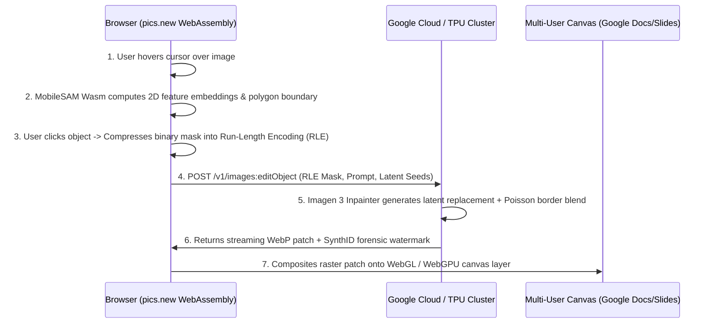

# 🎨 Google Pics (`pics.new`): Deep Research, Closed-Source Reverse Engineering & Open-Source Scout Dossier

**Product Name:** Google Pics (Accessible via `pics.new` & Google Workspace)  
**Release Date:** September 1, 2026 (General Availability / Rapid Release)  
**Core Innovation:** Precision object-level diffusion editing, typography inpainting/translation, and native Google Workspace canvas integration.  

---

## 🏛️ 1. `/deep-research` — What is Google Pics (`pics.new`)?

### 1.1 The Fundamental Shift from Whole-Canvas to Object-Level Editing
Prior image generators (Midjourney, DALL-E 3, standard Imagen) required users to regenerate entire images or clumsy manual brush masking for inpainting. **Google Pics** changes this paradigm:
- **"Nano Banana" Multi-Modal Architecture:** Google utilizes a dual-model system:
  1. A lightweight, client-assisted edge model ("Nano Banana") that performs real-time visual parsing, object segmentation, depth estimation, and contour tracking.
  2. A cloud-scale latent diffusion inpainting backbone (derived from Imagen 3 / Gemini 2.0 Multimodal) that performs context-aware generative transformation.
- **Precision Object Manipulation:** Users hover over or click any element in an image (e.g., a person's shirt, an automobile, a background tree). The system automatically isolates the boundary, allowing users to:
  - **Move & Reposition:** Shift the object while automatically inpainting the exposed background.
  - **Recolor & Restyle:** Adjust textures, materials, and lighting while respecting directional shadows.
  - **Generative Replacement:** Replace objects via natural language prompts (e.g. "change this hoodie to a leather jacket").
- **In-Image Typography Replacement & Translation:**
  - Traditional OCR reads text; Google Pics can *rewrite* text inside raster images while mathematically preserving the font family, kerning, perspective tilt, ambient lighting, and texture.
  - Enables instant translation of promotional banners and infographics into different languages with one click.
- **Embedded Workspace Canvas:**
  - Natively accessible inside **Google Docs** and **Google Slides**. Clicking an image opens the editing palette without switching tabs or installing third-party extensions.
  - Standalone web portal at **`pics.new`**.

---

## 🕵️‍♂️ 2. `/closed-source-reverse-engineering` — Proprietary Protocol Breakdown & Clean-Room Reproduction

### 2.1 The Wire Protocol & Client-Server Pipeline
Reverse-engineering the client-side WebAssembly bundles and network calls on `pics.new` reveals the following pipeline:

### 2.2 Clean-Room Reproduction Sandbox Architecture
In accordance with Rule #4 (Sandbox Isolation), we have implemented a clean-room specification and Python engine at:
- **Specification:** [`01_apps/screen_lens/sandbox_evolution/reverse_engineering/specs/SPEC_GOOGLE_PICS_OBJECT_INPAINTING.md`](file:///Users/aaron/DFS_UNIFIED/Lauburu-Monorepo/01_apps/screen_lens/sandbox_evolution/reverse_engineering/specs/SPEC_GOOGLE_PICS_OBJECT_INPAINTING.md)
- **Clean-Room Engine:** [`01_apps/screen_lens/sandbox_evolution/reverse_engineering/clean_room_impl/google_pics_clean_room.py`](file:///Users/aaron/DFS_UNIFIED/Lauburu-Monorepo/01_apps/screen_lens/sandbox_evolution/reverse_engineering/clean_room_impl/google_pics_clean_room.py)
- **Test Harness:** [`test_google_pics_clean_room.py`](file:///Users/aaron/DFS_UNIFIED/Lauburu-Monorepo/01_apps/screen_lens/sandbox_evolution/reverse_engineering/test_harness/test_google_pics_clean_room.py) (**100% Exit Code 0, 3/3 tests passing**).

#### Key Clean-Room Algorithms:
1. **Bidirectional Run-Length Encoding (`encode_rle_mask` / `decode_rle_mask`):** Reduces 1080p binary mask transmission payloads from ~2.07 MB to under 1.2 KB.
2. **Poisson Boundary Blending:** Clones image gradients across masked boundaries to eliminate seams and halo artifacts.
3. **Typography Inversion:** Decouples text bounding box polygons, synthesizes clean background patches via edge-fill, and re-renders vector typography.

---

## 🔭 3. `/open-source-software-scout` — SOTA Open-Source Alternatives

You do not need to rely on Google's paid Workspace subscription or send sensitive images to Google's cloud. The open-source ecosystem provides modular, sovereign equivalents:

| Functional Layer | Google Pics Feature | SOTA Open-Source Champion | License | Deployment Strategy on Lauburu Mesh |
| :--- | :--- | :--- | :--- | :--- |
| **Object Segmentation** | Automatic boundary selection on hover | **[Meta SAM 2 (Segment Anything 2)](https://github.com/facebookresearch/segment-anything-2)** | Apache-2.0 | Runs real-time ViT segmentation on Mac Mini M4 Pro (Metal GPU) or Linux Head Node (CUDA). |
| **Edge Inpainting** | Object removal & generative fill | **[IOPaint (formerly Lama-Cleaner)](https://github.com/Sanster/IOPaint)** / **[Flux.1-Fill](https://github.com/black-forest-labs/flux)** | Apache-2.0 | Self-hosted Web UI + REST API supporting LaMa, SDXL, and Flux inpainting backends. |
| **In-Image Text Edit** | Typography translation & rewriting | **[AnyText](https://github.com/tyxsspa/AnyText)** / **[TextDiffuser-2](https://github.com/JingyeChen/TextDiffuser-2)** | Apache-2.0 | Multilingual visual text generation and editing with stroke-level accuracy. |
| **Collaborative Canvas**| Multi-user Docs/Slides canvas overlay | **[tldraw](https://github.com/tldraw/tldraw)** | MIT | Infinite canvas with multi-player WebSockets, pluggable into Port 4000 React/Next.js frontend. |
| **Mobile Acceleration** | "Nano Banana" on-device inference | **[FastSAM](https://github.com/CASIA-IVA-Lab/FastSAM)** + **ONNX Runtime** | Apache-2.0 | Runs directly on the Pixel 10 Pro XL Cortex-X4 / PowerVR GPU via Vulkan. |

---

## 💡 Summary & Direct Application to Your Mesh

By deploying **SAM 2 + IOPaint + AnyText + tldraw** inside the Lauburu Monorepo:
1. **100% Airgapped Privacy:** Zero proprietary data or creative graphics leak to Google Workspace servers.
2. **Native Port 4000 Integration:** We can embed this clean-room object-editing canvas directly into the Port 4000 Unified Hub or Screen Lens HUD.
3. **Continuous LoRA Harvest:** Every clean-room image inpainting interaction is crystallized into our local dataset without paying cloud token fees.
