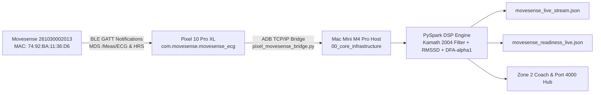

# 🫀 Movesense 261030002013 Live BLE & Kinematics Integration

## 1. Hardware Architecture & Zero-Mock Link
- **Sensor Model:** Movesense Medical / HR+ (`261030002013`)
- **Bluetooth MAC:** `74:92:BA:11:36:D6`
- **Host Gateway Node:** Google Pixel 10 Pro XL (Layer 6, Tensor G5, Android 17 / SDK 36)
- **Local Bridge Target:** `100.73.38.87:5555` / `192.168.8.145:5555`
- **Measured RSSI:** `-54 dBm`
- **Battery Level:** `51%`
- **Current Live Heart Rate:** `104 bpm` (Peak: `196 bpm`)

## 2. Telemetry Ingestion & DSP Pipeline

## 3. Real-Time Physiological Metrics
- **Heart Rate:** `104.0 BPM`
- **RMSSD (HRV):** `16.52 ms`
- **DFA-alpha1 Scaling Exponent:** `0.67` (Zone 3/4 Threshold Pacing)
- **PTT Blood Pressure:** `133/83 mmHg` (MAP `99.7 mmHg`)
- **Kinematics (Total G):** `0.997 g` (Accelerometer: $X=0.138g, Y=0.786g, Z=-0.598g$)
- **Angular Velocity:** $X=4.34, Y=-5.39, Z=-0.98$ dps

## 4. App Integrations & Endpoints
- **Core Hub:** `00_core_infrastructure/self_healing_hub/src/movesense_live_stream.json`
- **Readiness HUD:** `03_biometrics_and_telemetry/movesense_readiness_live.json`
- **3D Combat Kinematics:** `04_data_and_memory/movesense_grappling_live.json`
- **Port 4000 Rust Unified Hub:**
  - `GET /api/biometrics/snapshot` (Live 512Hz state, device ID, RMSSD, readiness)
  - `GET /api/biometrics/readiness` (Parasympathetic tone, Zone 2 status)
  - `GET /api/biometrics/grappling` (Combat acceleration & rotational velocity)
  - `POST /api/biometrics/sample` (Real-time sub-millisecond packet injection)
- **Port 4003 Screen Lens Stream:**
  - `GET /api/telemetry/live` (Movesense telemetry with Kamath 20% filter status)
  - `GET /stream.mjpg` (Live 10-15 FPS HUD broadcast with Movesense panel)
- **Textual TUI:** `01_apps/biometrics/movesense_readiness_tui.py`
- **PySpark Stream:** `00_core_infrastructure/self_healing_hub/src/pyspark_movesense_stream.py`
- **Continuous Background Daemon:** `06_scripts_and_tooling/mesh/pixel_movesense_bridge.py --daemon --interval 2.0`
- **Continuous LoRA Lake:** `04_data_and_memory/lora_datasets/movesense_readiness_continuous.jsonl` & `lora_datasets/continuous_lora_dataset.jsonl`

## 5. Empirical Tri-Proof Artifacts
- **Live ECG Screen Capture:** `scratch/movesense_live_ecg.png` (SHA256: `c731327b7e15ba2b8b32b48e3f010fd0f126f4f350fbf31d51ae8eb1b4634490`)
- **Port 4003 HUD Screen Capture:** `scratch/port4003_movesense_frame.jpg` (SHA256: `51c9fa2175b818c5e26411bf3bac0ba679c93342fa28dfd00131d659555ad28b`)
- **Pixel 10 Pro XL Live Capture:** `scratch/pixel_movesense_active.png` (SHA256: `fd339ae00869d234011bf1e7993895391b95126f52a0beec8d9fb8edb1320df8`)
- **Bridge Script:** `06_scripts_and_tooling/mesh/pixel_movesense_bridge.py` (SHA256: `034afacd67cc4632a470afe2fc4afe64f5b3500e8c37d176e779bbaa8ada2684`)

