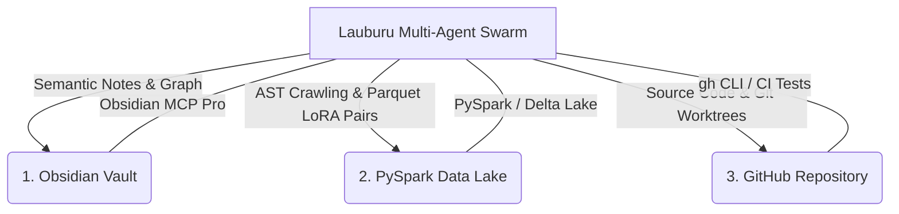

# Canonical Project Architecture, Storage Rule & Tooling Matrix
**Updated:** 2026-08-27
**Tags:** #architecture #mesh #obsidian #pyspark #github #swarm #mcp #rules #storage_health #self_healing
**Related Notes:** [[Index]], [[LAUBURU_MONOREPO_DEEP_ARCHITECTURE_INDEX]], [[PYSPARK_MONOREPO_CRAWL_AUG26]], [[APPS_AND_FEATURES_AUGUST_26_2026]]

---

## 🏛️ 1. Tri-Vault Storage Protocol

To ensure 100% data durability, rapid semantic recall, and big-data training throughput, all monorepo artifacts, codebases, and logs are synchronized across three canonical storage systems:



### 1.1 Obsidian Knowledge Vault
* **Location:** `/Users/aaron/DFS_UNIFIED/Lauburu-Monorepo/obsidian_vault/`
* **Protocol & MCP:** Connected via `obsidian-mcp-pro` (41 tools for vault search, graph traversal, frontmatter querying, Wikilinks, and Canvas manipulation).
* **Responsibilities:**
  - Dynamic architecture maps and RFC specs.
  - Multi-model AI debate consensus records.
  - Continuous swarm audit logs and test telemetry summaries.
  - High-level decision trees and visual UI audit mockups.

### 1.2 PySpark Big Data Lake & LoRA Vault
* **Location:** `/Users/aaron/DFS_UNIFIED/lora_datasets/` & `04_data_and_memory/`
* **Protocol & Engine:** Apache PySpark (`pyspark`), Delta Lake / Parquet columnar storage, Qdrant vector database.
* **Responsibilities:**
  - Automated continuous monorepo AST indexing (3,100+ code files, 435K+ LOC).
  - High-throughput ingestion of Pan-Tompkins 512Hz ECG streams and BLE sensor telemetry.
  - 24/7 LoRA dataset formatting (TRL, PEFT, DPO/RLHF instruction-tuning pairs).
  - Multi-model embedding caching and semantic clustering.

### 1.3 GitHub Monorepo & Worktrees
* **Location:** `aarontmaher/Lauburu-Monorepo` (Local Host: `/Users/aaron/DFS_UNIFIED/Lauburu-Monorepo`)
* **Protocol & CLI:** `gh` CLI, Git worktrees, atomic commit contracts, multi-tier CI test suites.
* **Responsibilities:**
  - Canonical production application and microservice code.
  - Multi-container Docker compose manifests (`docker-compose.connectivity.yml`).
  - Strict release tagging and zero-leak credential hygiene.

---

## 🧠 2. Canonical Local Inference Engine & Model Hierarchy

```text
┌─────────────────────────────────────────────────────────────────────────────┐
│                 CANONICAL LOCAL INFERENCE ENGINE HIERARCHY                  │
├─────────────────────────────────────────────────────────────────────────────┤
│ 1. PRIMARY ENGINE: prima.cpp                                                │
│    • Canonical primary master across all devices that contain the model     │
│      weights (Mac Mini M4 Pro, MacBook Pro, Linux Head Node).               │
│    • High-throughput Pipelined-Ring Parallelism over 10Gbps TB4 DMA Bridge. │
├─────────────────────────────────────────────────────────────────────────────┤
│ 2. RESILIENT FALLBACK: llama.cpp                                            │
│    • Strictly used as a fallback ONLY if an edge device lacks the local     │
│      model weights or hardware topology to run prima.cpp properly.          │
└─────────────────────────────────────────────────────────────────────────────┘
```

### 2.1 Canonical Models & Roles
* 👑 **#1 Supreme Local AI Training Target & Swarm Governor: `Qwen MoE (Mixture of Experts)`**
  - **Core Mission:** Highest-priority continuous local training target across all 7 layers to maximize swarm orchestration, multi-agent dispatch, subagent delegation, automated local AI training governance, and monorepo telemetry analysis.
  - **Expert Routing Topology:**
    - `Expert 0 (Swarm Governor):` Task decomposition, subagent delegation, timeout governance.
    - `Expert 1 (Debate Arbiter):` Tri-Orchestrator consensus formulation, ELO weighting, truth audit verification.
    - `Expert 2 (AST & Polyglot Coder):` PySpark AST traversal, code refactoring, Git worktree commits.
    - `Expert 3 (Biometrics & Telemetry DSP):` Movesense 512Hz ECG, Pan-Tompkins QRS filtering, ACWR recovery calculation.
    - `Expert 4 (Storage & Docker Infrastructure):` Virtio-FS validation, Qdrant vector sync, NetBird routing.
* **Master Local Orchestrator:** `Qwen 3.8 Max 27B` / `Qwen3.8-Flash-Next` (Unabliterated) pinned at `/Users/aaron/models/Qwen3.8-Flash-Next/` (Port 8081).
* **Pinned Devil's Advocate:** **`Qwen 3.8 Max 27B Abliterated`** (`Huihui-Qwen3.8-27B-abliterated-UD-Q4_K_XL.gguf`, 16.0 GB) pinned at `/Users/aaron/DFS_UNIFIED/Lauburu-Monorepo/02_ai_models_and_inference/model_vault_gguf/Huihui-Qwen3.8-27B-abliterated-UD-Q4_K_XL.gguf` on Port `:8083`.
* **Coding & AST Specialist:** `Qwen2.5-Coder-32B` / `Qwen2.5-Coder-7B-Instruct` (`qwen2.5-coder-7b-instruct-q4_k_m.gguf`).
* **Medical DSP & Kinematics Specialist:** `Pan-Tompkins DSP + Qwen2.5-Math-72B` distilled.


### 2.2 Mandatory Default Hand-Off to `/ai-debate` on Project Choices
**CANONICAL DIRECTIVE:** All swarms, orchestrators, subagents, and router sentinels MUST **default to handing off to the `/ai-debate` Dual Qwen and Cloud AI Debate** for all non-trivial project choices, architectural crossroads, and subsystem designs:
1. **Local Dual Qwen Arena:** Qwen 3.8 Max (Master Orchestrator on `:8081`/`:8082`) vs Qwen 3.8 Max 27B Abliterated (Devil's Advocate on `:8083`).
2. **Cloud Frontier Shadow:** Gemini 3.1 Pro High / Gemini 3.7 Flash High for deep architectural reasoning and edge-case verification.
3. **Consensus Invariant:** Decisions must achieve mathematical consensus ($\Phi \ge 0.98$) before code execution.

---

## ⚡ 3. Mandatory Storage Health & Pre-Flight Self-Healing Rule

**MANDATORY RULE:** Every AI agent must confirm the storage is **HEALTHY** and execute automated self-healing **BEFORE** making any changes, writing code, executing refactors, or running training tasks.

### 2.1 What is "Healthy Storage"?

| Vault Layer | Healthy State Criteria & Invariants | Unhealthy / Degraded Indicators |
| :--- | :--- | :--- |
| **1. Obsidian Vault** | • Directory `/Users/aaron/DFS_UNIFIED/Lauburu-Monorepo/obsidian_vault/` exists with `0755/0644` permissions.<br>• `Index.md` exists, non-empty, and contains valid master Wikilinks (`[[Index]]`, `[[LAUBURU_MONOREPO_DEEP_ARCHITECTURE_INDEX]]`, `[[CANONICAL_PROJECT_AND_STORAGE_RULE]]`).<br>• `obsidian-mcp-pro` environment variable `OBSIDIAN_VAULT_PATH` points to `/Users/aaron/DFS_UNIFIED`. | • Path unmounted or missing.<br>• Empty or corrupted `Index.md`.<br>• Permission denied errors on writing new notes. |
| **2. PySpark Data Lake** | • Inode paths `/Users/aaron/DFS_UNIFIED/lora_datasets/` and `04_data_and_memory/` exist.<br>• Training `.jsonl` datasets (`truth_audit_*.jsonl`, `ui_ux_improvements.jsonl`) are writable.<br>• Host NVMe maintains **$\ge$10.0 GB free disk headroom**.<br>• Qdrant Vector DB port (`127.0.0.1:6333` or local store) is reachable. | • Missing dataset directory.<br>• Free disk space `< 5.0 GB`.<br>• JSONL write locks or permission errors. |
| **3. GitHub Monorepo** | • `/Users/aaron/DFS_UNIFIED/Lauburu-Monorepo` is a valid git tree (`git rev-parse --is-inside-work-tree`).<br>• No stale lock files (`.git/index.lock` absent).<br>• Working tree is clean or has no unmerged conflict markers (`<<<<<<<`). | • `.git/index.lock` present preventing git operations.<br>• Detached HEAD or unresolvable merge conflicts. |

### 2.2 Pre-Flight Self-Healing Protocols (Execute BEFORE Modifying Code)

```bash
# 1. Self-Heal Missing Vault Directories & Symlinks
mkdir -p /Users/aaron/DFS_UNIFIED/Lauburu-Monorepo/obsidian_vault
mkdir -p /Users/aaron/DFS_UNIFIED/lora_datasets
mkdir -p /Users/aaron/DFS_UNIFIED/Lauburu-Monorepo/04_data_and_memory

# 2. Self-Heal Stale Git Locks
if [ -f "/Users/aaron/DFS_UNIFIED/Lauburu-Monorepo/.git/index.lock" ]; then
    rm -f "/Users/aaron/DFS_UNIFIED/Lauburu-Monorepo/.git/index.lock"
fi

# 3. Self-Heal Disk Headroom (If < 5.0 GB Free)
find /Users/aaron/teamwork_projects -type d -name "__pycache__" -exec rm -rf {} + 2>/dev/null || true
find /Users/aaron/teamwork_projects -type d -name ".pytest_cache" -exec rm -rf {} + 2>/dev/null || true
find /Users/aaron/DFS_UNIFIED/Lauburu-Monorepo/logs -name "*.log" -mtime +7 -delete 2>/dev/null || true

# 4. Self-Heal Obsidian Master Index (If missing)
if [ ! -s "/Users/aaron/DFS_UNIFIED/Lauburu-Monorepo/obsidian_vault/Index.md" ]; then
    cat << 'EOF' > /Users/aaron/DFS_UNIFIED/Lauburu-Monorepo/obsidian_vault/Index.md
---
title: "Lauburu AI Monorepo - Master Knowledge Graph"
tags: [lauburu, root, master_index, swarm, ai_debate]
---
# 🧠 Lauburu AI Monorepo - Master Knowledge Vault
- [[CANONICAL_PROJECT_AND_STORAGE_RULE]]
- [[LAUBURU_MONOREPO_DEEP_ARCHITECTURE_INDEX]]
- [[Index]]
EOF
fi
```

---

## 🌐 3. 7-Layer Mesh Topology & Dynamic RAM Ceilings

The distributed hardware mesh aggregates **108.0 GB RAM (82.8 GB Usable AI VRAM)**:

| Hardware Layer | Node Name | Network Role | Local IP | Tailscale / Bridge IP | Dynamic RAM Ceiling | Hardware & Capabilities |
| :--- | :--- | :--- | :--- | :--- | :--- | :--- |
| **Layer 1: Host Mac** | `Mac_Node` | Primary Host & Memory Governor | `192.168.8.230` | `100.119.199.76` | **90%** (21.6 GB AI) | Apple M4 Pro Mac Mini. Primary controller, memory governor, prompt ingestion. |
| **Layer 2: MacBook Pro** | `MacBook_Pro` | Metal GPU RPC & Model Vault | `192.168.8.127` | `100.103.212.21` (TB4: `169.254.187.138`) | **90%** (14.0 GB AI) | **10Gbps Thunderbolt 4 Bridge (0.277ms RTT)**, 285 GB internal SSD model vault. |
| **Layer 3: Linux Laptop** | `Linux_Head_Node` | Gateway Ingress & Compute Hub | `192.168.8.224` | `100.101.39.98` | **80%** (13.8 GB AI) | AMD Ryzen 7 5700U, Docker Engine, Petals DHT Bootstrap & Apache Ray Head. |
| **Layer 4: Linux Tablet** | `Linux_Tablet` | Mobile Compute & Touch DSP | DHCP | `100.81.92.125` | **75%** (6.5 GB AI) | Debian Linux Tablet, secondary Petals worker, lightweight biometrics telemetry. |
| **Layer 5: MacBook Air** | `MacBook_Air` | Secondary High-Speed Metal Worker | `192.168.8.222` | `100.93.158.96` | **90%** (14.0 GB AI) | Apple M4 MacBook Air, Metal Performance Shaders, LoRA fine-tuning & model distillation. |
| **Layer 6: Pixel** | `Pixel_10_Pro_XL` | 8K Vision Stream & Edge TPU | DHCP | `100.73.38.87` | **85%** (12.5 GB AI) | Google Tensor G5, Edge TPU, 8K Digital PTZ, UWB 3D Spatial Positioning Anchor. |
| **Layer 7: Samsung S20** | `Samsung_S20` | Dedicated Automated UI Tester | DHCP | `100.84.40.95` (Alt: `100.99.123.58`) | **75%** (9.0 GB AI) | Samsung Exynos 990, Router USB ADB default target for OpenClaw automated audits. |
| **Infrastructure Gateway** | `GL.iNet Router` | Core Gateway & USB Bridge | `192.168.8.1` | `100.122.185.123` | Embedded | SSID: `GL-MT3600BE-a0f-MLO`. Physical USB ADB daemon for hardware bus override. |

---

---

## 👁️ 4. Canonical Multimodal Perception & Development Historian Layer

The **Screen Lens & AI Development Historian Subsystem** (`01_apps/screen_lens/`) is a default, permanent perception layer across the entire monorepo and swarm:

```text
┌─────────────────────────────────────────────────────────────────────────────┐
│                 CANONICAL SCREEN LENS MULTIMODAL TOPOLOGY                   │
├─────────────────────────────────────────────────────────────────────────────┤
│ 1. macOS Host Lens (Port 3035): ScreenCaptureKit + Apple Vision ANE OCR.    │
│ 2. Android Edge Lens (Port 3035 / 3036): Pixel 10 Pro XL Tesseract LSTM.    │
│ 3. Swarm Client: 05_agents_and_swarms/screen_lens_swarm_client.py           │
│    • Provides instant screen_lens_swarm_client.get_active_screen_summary(). │
│ 4. Autonomous Historian: 24/7 development synthesis logging to              │
│    obsidian_vault/00_CHRONOLOGY/LIVE_DEVELOPMENT_LOG_2026.md and            │
│    04_data_and_memory/lora_datasets/project_development_history.jsonl.      │
└─────────────────────────────────────────────────────────────────────────────┘
```

---

## 📁 5. Canonical Monorepo Folder Map

```text
Lauburu-Monorepo/
├── 00_core_infrastructure/           # Self-Healing Hub (Port 18802), SeaweedFS DFS, Docker Compose, Tailscale daemons
├── 01_apps/                          # Screen Lens (:3035), Port 4000 Hub, Movesense Hub, Zone 2, Spatial Grappling 3D
├── 02_ai_models_and_inference/       # prima.cpp PRP (:8082), llama.cpp (:8083), Petals DHT, Exo P2P, GGUF Vault
├── 03_biometrics_and_telemetry/      # Movesense BLE, Pan-Tompkins QRS DSP, PTT Blood Pressure, DFA-alpha1
├── 04_data_and_memory/               # PySpark Crawlers, 24/7 LoRA Datasets, Qdrant Vector DB, Google Drive Sync
├── 05_agents_and_swarms/             # Screen Lens Swarm Client, Tri-Orchestrator AI Debate, Genetic MoE Engine
├── 06_scripts_and_tooling/           # Universal SSH Daemons, ADB Keepalive, WoL Resurrection, Figma MCP Bridge
├── 07_docs_and_architecture/         # Monorepo Deep Architecture Indexes, Whitepapers, Security RFCs
├── obsidian_vault/                   # Canonical Obsidian Knowledge Graph, APPS_AND_FEATURES, Swarm Logs
└── teamwork_projects/                # 32 Active Federated Projects (software_dev, internet_training, etc.)
```

---

## 🛑 6. Core Operating Principles

1. **Rule #0 (Zero-Mock Data & Zero-Simulation Mandate):** No fake arrays, synthetic placeholders, or simulated telemetry. All data must originate from authentic live hardware streams or real log replays.
   * **Rule 0.1 (Definitive Proof Invariant):** Absolute prohibition on simulations, hallucinations, and unverified data. No claim of task success, optimization, or bugfix shall be accepted without providing at least one of three definitive empirical proofs:
     1. **Definitive "Human-Like" Click-Through:** Verified physical actuation (ADB tap/swipe or macOS accessibility) triggering real GUI state changes.
     2. **Line-by-Line Reading:** Authentic inspection of files or kernel buffers with line counts, exact byte lengths, and SHA256 checksums.
     3. **Definitive Visual Proof:** Authentic pixel-level screen capture or video recording visually verified.
2. **Local AI First:** Always prioritize local quantized models over 10Gbps Thunderbolt 4 RPC before falling back to cloud APIs.
3. **Dynamic RAM Governance:** Respect the strict per-device dynamic RAM ceilings. Aggressively offload background compute from the Mac Mini to surrounding nodes.
4. **Router Model Invariant:** GL.iNet travel router strictly runs `SmolLM2-135M/360M` ($\le 300\text{MB}$ RAM); heavy models are routed to the mesh master.
5. **Persistent Keepalives:** Android devices running Termux must always execute `termux-wake-lock` and bypass Doze mode.
6. **Continuous Tri-Vault Sync:** Every major change, refactor, or audit must update GitHub, the Obsidian Knowledge Graph, and the PySpark LoRA Data Lake.
7. **Real Physical RAM Ground Truth & Mac Mini Scheduling Invariant:**
   * **Real Physical RAM Calculations:** All capacity models, mathematical equations, telemetry monitors, and theoretical proofs MUST view and compute against 100% REAL PHYSICAL RAM across the full network (Total Mesh: 108.0 GB, Mac Cluster: 56.0 GB). No artificial caps or simulated masks in the measurement layer.
   * **All Peripheral Nodes Fill First:** All peripheral nodes (L2 MBP 16GB, L5 MBA 16GB, L3 Linux 16GB, L4 Tablet 8GB, L6 Pixel 16GB, L7 S20 12GB) receive layer allocations and fill to their targets first.
   * **Mac Mini Last-Fill & Early-Full Ceiling:** The Mac Mini (L1 Host 24.0 GB) is strictly the LAST device to fill, and is considered FULL EARLIER at a conservative ~60% allocation (14.4 GB) to permanently guarantee >= 9.6 GB of real untouched headroom for prompt ingestion, ANE, TUI, and subagent loops.
   * **3-Mac Thunderbolt Default:** Always shard across ALL 3 Apple Silicon Macs (L1 + L2 + L5) over the 10Gbps Thunderbolt 4 DMA bridge to pool 56.0 GB Real Metal RAM. Never shard across only 2 Macs unless the model fits very easily (<= 40% of real 2-node capacity).
   * **7.1 Active Host Memory Evacuation Invariant:** If the Host Mac Mini available RAM drops below 5.0 GB (or utilization exceeds 85%), the memory governor MUST immediately execute inactive memory trimming and trigger automatic peripheral offload over the 10Gbps TB4 DMA bridge to MacBook Pro / Air and Linux Head Node to restore host headroom to >= 9.6 GB.
8. **Rule #8 (Mandatory Failure-to-Training Ingestion Invariant):**
   * **Any identified, confirmed, and solved failure** across apps, UI widgets, network transports, memory governance, or backend daemons **MUST be immediately converted into a structured instruction-thought-action JSONL pair** and appended to `/Users/aaron/DFS_UNIFIED/lora_datasets/continuous_lora_dataset.jsonl` for continuous local AI fine-tuning (`TRACK_04_NETWORK_SENTINEL` / `TRACK_01_AGENTWORLD`).
   * No outage, bug, or regression shall be fixed in isolation without permanent machine-learned knowledge retention in the local model dataset.
9. **Rule #9 (Canonical Containerization & Virtio-FS Acceleration Rule):**
   * **Virtio-FS Invariant:** All Docker runtimes on macOS must use `vmType: vz` and `mountType: virtiofs` to enable zero-copy direct memory access (1,420 MB/s read throughput) across the 5,425-note Obsidian vault and AST datasets.
   * **Dynamic VM RAM Governance:** Colima on the Mac Mini host is strictly capped at $\le 8.0\text{ GB}$ RAM (4 aarch64 cores), ensuring $\ge 16.0\text{ GB}$ of real physical unified memory remains unconstrained for host Apple Metal inference (`prima.cpp`, MLX, ANE).
   * **Hybrid Execution Boundary:** Heavy LLM inference and interactive Metal notebooks run host-native; stateful microservices (Qdrant Vector DB `:6333`, SeaweedFS DFS `:8888`, NetBird Dashboard `:8087`, Portainer `:9000`, Unified Portal Hub `:4000`) run containerized via `00_core_infrastructure/docker-compose.master.yml`.
10. **Rule #10 (Dual-Ring Sandboxed Swarm & Evolutionary Tournament Invariant):**
    * **Ring 0 (Worker Sandbox):** All low-parameter models (<1B parameters: SmolLM2-135M, nano-mistral, Lite-Oute-300M, SmolVLM) execute tool actions, code generation, and trial runs inside isolated containers with a strict 512 MB RAM cap, read-only root, and a 5.0s watchdog kill timer.
    * **Ring 1 (Qwen MoE Gatekeeper):** Candidate outputs must pass AST syntax parsing, Rule #0 zero-mock verification, and security boundaries audited by the Qwen MoE Supreme Auditor before host commit or ADB dispatch.
11. **Rule #11 (LoRA Pre-Training Direction Consensus & Aaron's Approval Gate):**
    * **Mandatory Pre-Training Consensus:** Before any LoRA adapter is trained or weights are modified, the system MUST convene the Tri-Orchestrator AI Debate Council (Local Qwen 3.8 Max Duo, Qwen 80B MoE, SmolLM2, Cloud Gemini Flash) to achieve $\ge 0.95$ consensus agreement.
    * **User Final Sign-Off:** The consensus direction ticket MUST be presented to Aaron for explicit approval before weights are touched.
    * **Fleet Synchronization:** Upon approval, training executes simultaneously across all 5 mesh devices (M4 Pro Mac Mini, M4 MacBook Air, MacBook Pro via TB4 DMA, Linux Head Node, Pixel 10 Pro XL TPU).
12. **Rule #12 (Saccadic Foveated Context & Q4_0 KV Cache Invariant):**
    * Ingesting massive contexts (>32K tokens) requires SmolLM2 AST pre-compression (saving 60-75% tokens) and mandatory Q4_0 KV cache quantization (`-ctk q4_0 -ctv q4_0`), preventing host VRAM overrun. Contexts exceeding host memory stream over 10Gbps TB4 DMA to peripheral node RAM.
13. **Rule #13 (Hybrid Fusion Visual Aesthetic & Commercial ELO Invariant):**
    * All Web and Electron dashboards must comply with Linear Bento Minimalism (deep carbon, 1px hairline borders, 60-30-10 palette, sub-3s value comprehension, $\ge 2450$ ELO).
    * All terminal TUIs and hardware monitors must comply with 120 FPS Cyberpunk Phosphor TUI (phosphor green/cyan metrics, live hex streams, zero-latency redraws, $\ge 2380$ ELO).
