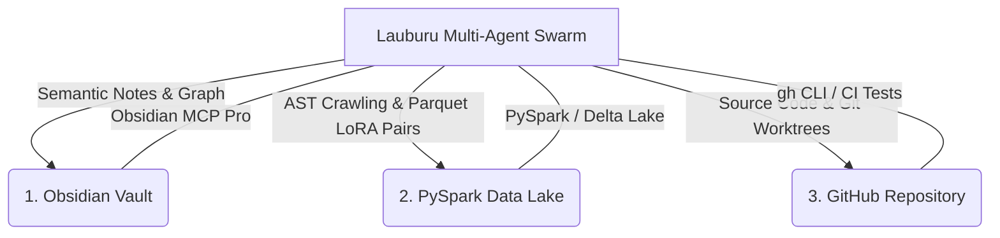

# Canonical Project Architecture, Storage Rule & Tooling Matrix
**Updated:** 2026-08-27
**Tags:** #architecture #mesh #obsidian #pyspark #github #swarm #mcp #rules #storage_health #self_healing
**Related Notes:** [[Index]], [[LAUBURU_MONOREPO_DEEP_ARCHITECTURE_INDEX]], [[PYSPARK_MONOREPO_CRAWL_AUG26]], [[APPS_AND_FEATURES_AUGUST_26_2026]]

---

## 🏛️ 1. Tri-Vault Storage Protocol

To ensure 100% data durability, rapid semantic recall, and big-data training throughput, all monorepo artifacts, codebases, and logs are synchronized across three canonical storage systems:



### 1.1 Obsidian Knowledge Vault
* **Location:** `/Users/aaron/DFS_UNIFIED/Lauburu-Monorepo/obsidian_vault/`
* **Protocol & MCP:** Connected via `obsidian-mcp-pro` (41 tools for vault search, graph traversal, frontmatter querying, Wikilinks, and Canvas manipulation).
* **Responsibilities:**
  - Dynamic architecture maps and RFC specs.
  - Multi-model AI debate consensus records.
  - Continuous swarm audit logs and test telemetry summaries.
  - High-level decision trees and visual UI audit mockups.

### 1.2 PySpark Big Data Lake & LoRA Vault
* **Location:** `/Users/aaron/DFS_UNIFIED/lora_datasets/` & `04_data_and_memory/`
* **Protocol & Engine:** Apache PySpark (`pyspark`), Delta Lake / Parquet columnar storage, Qdrant vector database.
* **Responsibilities:**
  - Automated continuous monorepo AST indexing (3,100+ code files, 435K+ LOC).
  - High-throughput ingestion of Pan-Tompkins 512Hz ECG streams and BLE sensor telemetry.
  - 24/7 LoRA dataset formatting (TRL, PEFT, DPO/RLHF instruction-tuning pairs).
  - Multi-model embedding caching and semantic clustering.

### 1.3 GitHub Monorepo & Worktrees
* **Location:** `aarontmaher/Lauburu-Monorepo` (Local Host: `/Users/aaron/DFS_UNIFIED/Lauburu-Monorepo`)
* **Protocol & CLI:** `gh` CLI, Git worktrees, atomic commit contracts, multi-tier CI test suites.
* **Responsibilities:**
  - Canonical production application and microservice code.
  - Multi-container Docker compose manifests (`docker-compose.connectivity.yml`).
  - Strict release tagging and zero-leak credential hygiene.

---

## ⚡ 2. Mandatory Storage Health & Pre-Flight Self-Healing Rule

**MANDATORY RULE:** Every AI agent must confirm the storage is **HEALTHY** and execute automated self-healing **BEFORE** making any changes, writing code, executing refactors, or running training tasks.

### 2.1 What is "Healthy Storage"?

| Vault Layer | Healthy State Criteria & Invariants | Unhealthy / Degraded Indicators |
| :--- | :--- | :--- |
| **1. Obsidian Vault** | • Directory `/Users/aaron/DFS_UNIFIED/Lauburu-Monorepo/obsidian_vault/` exists with `0755/0644` permissions.<br>• `Index.md` exists, non-empty, and contains valid master Wikilinks (`[[Index]]`, `[[LAUBURU_MONOREPO_DEEP_ARCHITECTURE_INDEX]]`, `[[CANONICAL_PROJECT_AND_STORAGE_RULE]]`).<br>• `obsidian-mcp-pro` environment variable `OBSIDIAN_VAULT_PATH` points to `/Users/aaron/DFS_UNIFIED`. | • Path unmounted or missing.<br>• Empty or corrupted `Index.md`.<br>• Permission denied errors on writing new notes. |
| **2. PySpark Data Lake** | • Inode paths `/Users/aaron/DFS_UNIFIED/lora_datasets/` and `04_data_and_memory/` exist.<br>• Training `.jsonl` datasets (`truth_audit_*.jsonl`, `ui_ux_improvements.jsonl`) are writable.<br>• Host NVMe maintains **$\ge$10.0 GB free disk headroom**.<br>• Qdrant Vector DB port (`127.0.0.1:6333` or local store) is reachable. | • Missing dataset directory.<br>• Free disk space `< 5.0 GB`.<br>• JSONL write locks or permission errors. |
| **3. GitHub Monorepo** | • `/Users/aaron/DFS_UNIFIED/Lauburu-Monorepo` is a valid git tree (`git rev-parse --is-inside-work-tree`).<br>• No stale lock files (`.git/index.lock` absent).<br>• Working tree is clean or has no unmerged conflict markers (`<<<<<<<`). | • `.git/index.lock` present preventing git operations.<br>• Detached HEAD or unresolvable merge conflicts. |

### 2.2 Pre-Flight Self-Healing Protocols (Execute BEFORE Modifying Code)

```bash
# 1. Self-Heal Missing Vault Directories & Symlinks
mkdir -p /Users/aaron/DFS_UNIFIED/Lauburu-Monorepo/obsidian_vault
mkdir -p /Users/aaron/DFS_UNIFIED/lora_datasets
mkdir -p /Users/aaron/DFS_UNIFIED/Lauburu-Monorepo/04_data_and_memory

# 2. Self-Heal Stale Git Locks
if [ -f "/Users/aaron/DFS_UNIFIED/Lauburu-Monorepo/.git/index.lock" ]; then
    rm -f "/Users/aaron/DFS_UNIFIED/Lauburu-Monorepo/.git/index.lock"
fi

# 3. Self-Heal Disk Headroom (If < 5.0 GB Free)
find /Users/aaron/teamwork_projects -type d -name "__pycache__" -exec rm -rf {} + 2>/dev/null || true
find /Users/aaron/teamwork_projects -type d -name ".pytest_cache" -exec rm -rf {} + 2>/dev/null || true
find /Users/aaron/DFS_UNIFIED/Lauburu-Monorepo/logs -name "*.log" -mtime +7 -delete 2>/dev/null || true

# 4. Self-Heal Obsidian Master Index (If missing)
if [ ! -s "/Users/aaron/DFS_UNIFIED/Lauburu-Monorepo/obsidian_vault/Index.md" ]; then
    cat << 'EOF' > /Users/aaron/DFS_UNIFIED/Lauburu-Monorepo/obsidian_vault/Index.md
---
title: "Lauburu AI Monorepo - Master Knowledge Graph"
tags: [lauburu, root, master_index, swarm, ai_debate]
---
# 🧠 Lauburu AI Monorepo - Master Knowledge Vault
- [[CANONICAL_PROJECT_AND_STORAGE_RULE]]
- [[LAUBURU_MONOREPO_DEEP_ARCHITECTURE_INDEX]]
- [[Index]]
EOF
fi
```

---

## 🌐 3. 7-Layer Mesh Topology & Dynamic RAM Ceilings

The distributed hardware mesh aggregates **108.0 GB RAM (82.8 GB Usable AI VRAM)**:

| Hardware Layer | Node Name | Network Role | Local IP | Tailscale / Bridge IP | Dynamic RAM Ceiling | Hardware & Capabilities |
| :--- | :--- | :--- | :--- | :--- | :--- | :--- |
| **Layer 1: Host Mac** | `Mac_Node` | Primary Host & Memory Governor | `192.168.8.230` | `100.119.199.76` | **90%** (21.6 GB AI) | Apple M4 Pro Mac Mini. Primary controller, memory governor, prompt ingestion. |
| **Layer 2: MacBook Pro** | `MacBook_Pro` | Metal GPU RPC & Model Vault | `192.168.8.127` | `100.103.212.21` (TB4: `169.254.187.138`) | **90%** (14.0 GB AI) | **10Gbps Thunderbolt 4 Bridge (0.277ms RTT)**, 285 GB internal SSD model vault. |
| **Layer 3: Linux Laptop** | `Linux_Head_Node` | Gateway Ingress & Compute Hub | `192.168.8.224` | `100.101.39.98` | **80%** (13.8 GB AI) | AMD Ryzen 7 5700U, Docker Engine, Petals DHT Bootstrap & Apache Ray Head. |
| **Layer 4: Linux Tablet** | `Linux_Tablet` | Mobile Compute & Touch DSP | DHCP | `100.81.92.125` | **75%** (6.5 GB AI) | Debian Linux Tablet, secondary Petals worker, lightweight biometrics telemetry. |
| **Layer 5: MacBook Air** | `MacBook_Air` | Secondary High-Speed Metal Worker | `192.168.8.222` | `100.93.158.96` | **90%** (14.0 GB AI) | Apple M4 MacBook Air, Metal Performance Shaders, LoRA fine-tuning & model distillation. |
| **Layer 6: Pixel** | `Pixel_10_Pro_XL` | 8K Vision Stream & Edge TPU | DHCP | `100.73.38.87` | **85%** (12.5 GB AI) | Google Tensor G5, Edge TPU, 8K Digital PTZ, UWB 3D Spatial Positioning Anchor. |
| **Layer 7: Samsung S20** | `Samsung_S20` | Dedicated Automated UI Tester | DHCP | `100.84.40.95` (Alt: `100.99.123.58`) | **75%** (9.0 GB AI) | Samsung Exynos 990, Router USB ADB default target for OpenClaw automated audits. |
| **Infrastructure Gateway** | `GL.iNet Router` | Core Gateway & USB Bridge | `192.168.8.1` | `100.122.185.123` | Embedded | SSID: `GL-MT3600BE-a0f-MLO`. Physical USB ADB daemon for hardware bus override. |

---

## 📁 4. Canonical Monorepo Folder Map

```text
Lauburu-Monorepo/
├── 00_core_infrastructure/           # Self-Healing Hub (Port 18802), SeaweedFS DFS, Docker Compose, Tailscale daemons
├── 01_apps/                          # Port 4000 Hub, Movesense Hub (512Hz ECG), Zone 2, Spatial Grappling 3D
├── 02_ai_models_and_inference/       # llama.cpp RPC Sharding (8081-8084), Petals DHT, Exo P2P, GGUF Vault
├── 03_biometrics_and_telemetry/      # Movesense BLE, Pan-Tompkins QRS DSP, PTT Blood Pressure, DFA-alpha1
├── 04_data_and_memory/               # PySpark Crawlers, 24/7 LoRA Datasets, Qdrant Vector DB, Google Drive Sync
├── 05_agents_and_swarms/             # Tri-Orchestrator AI Debate Council, Genetic MoE Engine, Truth Audit
├── 06_scripts_and_tooling/           # Universal SSH Daemons, ADB Keepalive, WoL Resurrection, Figma MCP Bridge
├── 07_docs_and_architecture/         # Monorepo Deep Architecture Indexes, Whitepapers, Security RFCs
├── obsidian_vault/                   # Canonical Obsidian Knowledge Graph, APPS_AND_FEATURES, Swarm Logs
└── teamwork_projects/                # 32 Active Federated Projects (software_dev, internet_training, etc.)
```

---

## 🛑 5. Core Operating Principles

1. **Rule #0 (Zero-Mock Data):** No fake arrays or simulated telemetry. All data must originate from authentic live hardware streams or real log replays.
2. **Local AI First:** Always prioritize local quantized models over 10Gbps Thunderbolt 4 RPC before falling back to cloud APIs.
3. **Dynamic RAM Governance:** Respect the strict per-device dynamic RAM ceilings. Aggressively offload background compute from the Mac Mini to surrounding nodes.
4. **Persistent Keepalives:** Android devices running Termux must always execute `termux-wake-lock` and bypass Doze mode.
5. **Continuous Tri-Vault Sync:** Every major change, refactor, or audit must update GitHub, the Obsidian Knowledge Graph, and the PySpark LoRA Data Lake.
