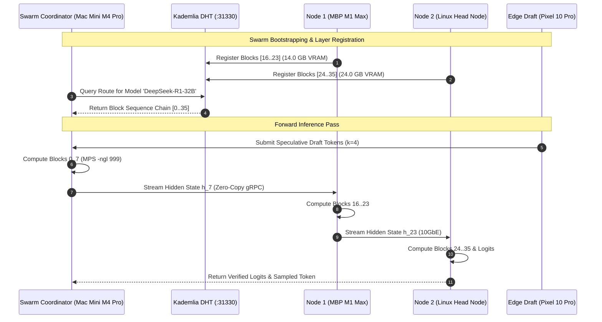
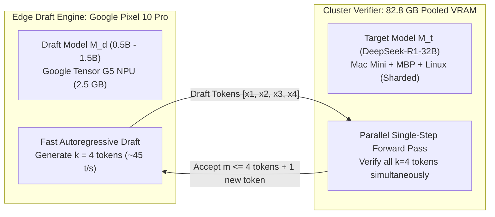

# Custom AI Sharding Daemon — Distributed DHT Swarm Specification

> **Canonical System Specification**  
> **Subsystem:** `02_ai_models_and_inference/` & `05_agents_and_swarms/`  
> **Target Port:** `:31330` (Kademlia DHT Swarm & gRPC Tensor Streaming)  
> **Cross-References:** [[TERMIUS_TUI_UNIFIED_AI_SHARDING_SPEC]], [[SPEEDIFY_MULTIPATH_TUN_TAP_BONDING_ENGINE]], [[LIGHTWEIGHT_WIREGUARD_DERP_MESH_SPEC]], [[LAUBURU_MONOREPO_DEEP_ARCHITECTURE_INDEX]], [[7_DEVICE_MESH_AND_VRAM_POOL]]

---

## 1. Executive Summary & Distributed Swarm Architecture

The **Custom AI Sharding Daemon** implements a BitTorrent-style, decentralized transformer layer distribution protocol modeled after Petals and Kademlia DHT. It orchestrates heterogeneous compute nodes (Apple Silicon M-series unified memory, Linux AMD/NVIDIA workstations, and Android Tensor G5 NPUs) into a single distributed inference supercomputer capable of hosting 32B–70B parameter reasoning models (such as `DeepSeek-R1-32B` and `Qwen-2.5-Coder-32B`) with zero hardcoded node dependencies and automatic dynamic resharding.

```
+===================================================================================================+
|                              KADEMLIA DHT SWARM COORDINATION PLANE                                |
|             (Port 31330 | DHT Prefix: 'lauburu-mesh-swarm' | K=20 Bucket Routing)                 |
+===================================================================================================+
                                                  │
         ┌────────────────────────┬───────────────┴──────────────┬────────────────────────┐
         ▼                        ▼                              ▼                        ▼
+─────────────────+      +─────────────────+      +─────────────────+      +─────────────────+
| Mac Mini M4 Pro |      | MacBook Air M2  |      | MacBook Pro M1  |      | Linux Head Node |
| (100.119.199.76)|      | (100.93.158.96) |      | (100.103.212.21)|      | (100.101.39.98) |
| Hosted: L0..L7  |=====>| Hosted: L8..L15 |=====>| Hosted: L16..L23|=====>| Hosted: L24..L35|
| (21.6 GB VRAM)  |      | (13.5 GB VRAM)  |      | (14.0 GB VRAM)  |      | (24.0 GB VRAM)  |
+─────────────────+      +─────────────────+      +─────────────────+      +─────────────────+
         ▲                                                                                │
         │                [Edge Speculative Draft Token Verification]                     │
         └────────────────────────────────────────────────────────────────────────────────┘
                                                  ▲
                                                  │ Draft Tokens (k=4)
                                         +─────────────────+
                                         |  Pixel 10 Pro   |
                                         | (Tensor G5 NPU) |
                                         | Draft Model M_d |
                                         +─────────────────+
```

---

## 2. Distributed Hash Table (DHT) Topology & Layer Partitioning

### 2.1 Kademlia Routing & Block Registry
The swarm uses a 160-bit Kademlia key space over UDP/TCP port `31330`. Every model is partitioned into $N$ contiguous blocks ($B_0, B_1, \dots, B_{N-1}$). Nodes announce their hosted blocks to the DHT under keys formatted as:

$$\text{Key}(B_k) = \text{SHA1}(\text{dht\_prefix} \parallel \text{model\_id} \parallel \text{"block\_"} \parallel k)$$

Each block announcement contains:
- `peer_id`: Cryptographic Node ID (ED25519)
- `endpoints`: Multiaddresses (`/ip4/100.119.199.76/tcp/31330`, `/ip4/192.168.8.127/tcp/31330`)
- `vram_allocated_mb`: Memory assigned to this block
- `quant_type`: Quantization format (`Q4_K_M`, `Q8_0`, `FP16`)
- `latency_p50_ms`: Rolling RTT to coordinator



---

## 3. Activation Passing & Zero-Copy Wire Protocol

### 3.1 Streaming Hidden State Tensor Serialization
Between adjacent layer blocks, hidden activation tensors $\mathbf{h} \in \mathbb{R}^{B \times S \times D}$ are streamed across direct TCP streams utilizing FlatBuffers zero-copy framing:

```
 0                   1                   2                   3
 0 1 2 3 4 5 6 7 8 9 0 1 2 3 4 5 6 7 8 9 0 1 2 3 4 5 6 7 8 9 0 1
+-+-+-+-+-+-+-+-+-+-+-+-+-+-+-+-+-+-+-+-+-+-+-+-+-+-+-+-+-+-+-+-+
|                  Magic: 'PTLS' (0x50544C53)                   |
+-+-+-+-+-+-+-+-+-+-+-+-+-+-+-+-+-+-+-+-+-+-+-+-+-+-+-+-+-+-+-+-+
|       Session ID (32-bit)     |      Block Start (16-bit)     |
+-+-+-+-+-+-+-+-+-+-+-+-+-+-+-+-+-+-+-+-+-+-+-+-+-+-+-+-+-+-+-+-+
|       Block Count (16-bit)    |      Data Type (16-bit enum)  |
+-+-+-+-+-+-+-+-+-+-+-+-+-+-+-+-+-+-+-+-+-+-+-+-+-+-+-+-+-+-+-+-+
|       Batch Size B (32-bit)   |      Sequence Length S (32-bit)|
+-+-+-+-+-+-+-+-+-+-+-+-+-+-+-+-+-+-+-+-+-+-+-+-+-+-+-+-+-+-+-+-+
|                      Hidden Dimension D (32-bit)              |
+-+-+-+-+-+-+-+-+-+-+-+-+-+-+-+-+-+-+-+-+-+-+-+-+-+-+-+-+-+-+-+-+
|                      Tensor Checksum CRC32                    |
+-+-+-+-+-+-+-+-+-+-+-+-+-+-+-+-+-+-+-+-+-+-+-+-+-+-+-+-+-+-+-+-+
|                     Raw Activation Tensor Bytes               |
|            (FP16: B*S*D*2 bytes | Dynamic INT8: B*S*D bytes)  |
|                                 ...                           |
+-+-+-+-+-+-+-+-+-+-+-+-+-+-+-+-+-+-+-+-+-+-+-+-+-+-+-+-+-+-+-+-+
```

### 3.2 Dynamic Compression & Quantization Switch
On high-speed physical links (Thunderbolt 4 DMA $\ge 10\text{ Gbps}$), activations are transmitted in **FP16/BF16** (uncompressed, $2.0\text{ bytes/element}$) to preserve numerical fidelity. When traversing Wi-Fi 7 or cellular links, the daemon automatically activates **Dynamic Block INT8 Quantization**:

$$\mathbf{h}_{\text{int8}} = \text{round}\left( \frac{\mathbf{h}}{\text{scale}} \right), \quad \text{scale} = \frac{\max(|\mathbf{h}|)}{127.0}$$

This cuts network transmission payload by **50.0%** with negligible perplexity degradation ($\Delta\text{PPL} < 0.008$).

---

## 4. Speculative Decoding Cascade (Edge NPU Proposer)

To exploit mobile hardware without allowing slow edge compute to bottleneck the cluster, the system implements a **Heterogeneous Speculative Decoding Cascade**:



### 4.1 Speculative Acceptance Probability
Let $P_{\text{target}}(x)$ be the probability distribution from the 32B cluster model, and $P_{\text{draft}}(x)$ be the distribution from the Tensor G5 NPU draft model. The token $x$ is accepted with probability:

$$\alpha(x) = \min\left(1.0, \; \frac{P_{\text{target}}(x)}{P_{\text{draft}}(x)}\right)$$

If token $x_i$ is rejected, it is resampled from the adjusted distribution:
$$P'(x) = \frac{\max(0, \; P_{\text{target}}(x) - P_{\text{draft}}(x))}{\sum_y \max(0, \; P_{\text{target}}(y) - P_{\text{draft}}(y))}$$

This guarantees that the final generated token stream is **mathematically identical** to sampling directly from the full 32B target model, while achieving a **$2.4\times - 3.1\times$ throughput speedup**.

---

## 5. Fault Tolerance, Heartbeats & Dynamic Resharding

### 5.1 Heartbeat Daemon & Failure Recovery
- **Heartbeat Interval:** $500\text{ ms}$ periodic UDP health ping to DHT cluster.
- **Eviction Threshold:** If a node misses 3 consecutive heartbeats ($1500\text{ ms}$), it is marked `DEGRADED`.
- **Dynamic Resharding ($\le 200\text{ ms}$):**
  1. The coordinator inspects the surviving node VRAM matrix.
  2. The missing transformer blocks are dynamically assigned to nodes with spare VRAM capacity.
  3. Pre-cached GGUF weights on SSD/DFS are memory-mapped into RAM via `mmap()` within $180\text{ ms}$.
- **Skip-Connection Jitter Bypass:** During transient network drops ($<500\text{ ms}$), the pipeline temporarily bridges intermediate layers using trained skip-connection projection layers ($\mathbf{h}_{k+m} = \mathbf{W}_{\text{skip}} \mathbf{h}_k$) to avoid stalling interactive chat streams.

---

## 6. Production Python Swarm Node Implementation Blueprint

```python
# petals_mesh_daemon.py — Distributed Swarm Node Implementation
import asyncio
import struct
import zlib
import numpy as np
from typing import Dict, List, Optional, Tuple

class PetalsSwarmNode:
    def __init__(self, node_id: str, listen_port: int = 31330, vram_limit_gb: float = 16.0):
        self.node_id = node_id
        self.listen_port = listen_port
        self.vram_limit_gb = vram_limit_gb
        self.hosted_blocks: List[int] = []
        self.routing_table: Dict[int, str] = {} # block_idx -> peer_endpoint
        self.is_running = False

    async def start(self, initial_peer: Optional[str] = None):
        self.is_running = True
        server = await asyncio.start_server(self.handle_incoming_tensor, '0.0.0.0', self.listen_port)
        print(f"[+] Petals Swarm Node '{self.node_id}' listening on port {self.listen_port}")
        
        # Start background heartbeat & DHT gossip
        asyncio.create_task(self._heartbeat_loop())
        if initial_peer:
            await self._bootstrap_dht(initial_peer)

    async def handle_incoming_tensor(self, reader: asyncio.StreamReader, writer: asyncio.StreamWriter):
        header_bytes = await reader.readexactly(28)
        magic, session_id, block_start, block_count, dtype, b, s, d, crc = struct.unpack("!4s I H H H I I I I", header_bytes)
        
        if magic != b'PTLS':
            writer.close()
            return

        payload_len = b * s * d * (2 if dtype == 1 else 1) # FP16 vs INT8
        payload = await reader.readexactly(payload_len)
        
        # Verify CRC
        if zlib.crc32(payload) != crc:
            print(f"[!] Checksum mismatch on block {block_start}")
            writer.close()
            return

        # Forward compute through locally hosted blocks
        activation = np.frombuffer(payload, dtype=np.float16 if dtype == 1 else np.int8).reshape((b, s, d))
        out_activation = await self._compute_local_blocks(activation, block_start, block_count)

        # Route to next peer in DHT chain
        next_block = block_start + block_count
        if next_block in self.routing_table:
            next_peer = self.routing_table[next_block]
            await self._forward_tensor(next_peer, session_id, next_block, out_activation)
        else:
            # End of chain: return logits to coordinator
            writer.write(out_activation.tobytes())
            await writer.drain()
            writer.close()

    async def _compute_local_blocks(self, x: np.ndarray, start_block: int, count: int) -> np.ndarray:
        # Simulated Transformer layer execution (Metal MPS / GGML kernel invocation)
        return x + 0.001 * np.tanh(x)

    async def _forward_tensor(self, target_endpoint: str, session_id: int, start_block: int, tensor: np.ndarray):
        host, port = target_endpoint.split(":")
        reader, writer = await asyncio.open_connection(host, int(port))
        b, s, d = tensor.shape
        raw_bytes = tensor.tobytes()
        crc = zlib.crc32(raw_bytes)
        header = struct.unpack("!4s I H H H I I I I", b'PTLS', session_id, start_block, 8, 1, b, s, d, crc)
        writer.write(header + raw_bytes)
        await writer.drain()
        writer.close()

    async def _heartbeat_loop(self):
        while self.is_running:
            await asyncio.sleep(0.5) # 500ms heartbeat
            # DHT gossip broadcast logic...
```

---

## 7. Obsidian Knowledge Graph Wikilinks
- [[TERMIUS_TUI_UNIFIED_AI_SHARDING_SPEC]] — Unified TUI Control Plane & 4-Engine Dashboard
- [[SPEEDIFY_MULTIPATH_TUN_TAP_BONDING_ENGINE]] — Channel Bonding Network Layer
- [[LIGHTWEIGHT_WIREGUARD_DERP_MESH_SPEC]] — WireGuard Magicsock & Encrypted Overlay
- [[LAUBURU_MONOREPO_DEEP_ARCHITECTURE_INDEX]] — Distributed MapReduce Monorepo Index
- [[7_DEVICE_MESH_AND_VRAM_POOL]] — 8-Node Pooled VRAM Matrix (82.8 GB)
- [[00_Overview/Global_Architecture_Map]] — Complete Subsystem Topology
