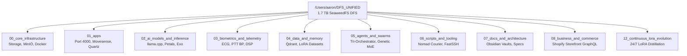

# Lauburu Monorepo Deep Architecture Index

> **MapReduce Distributed Indexing Pipeline Report**  
> **Scan Root:** `/Users/aaron/DFS_UNIFIED`  
> **Execution Duration:** `4.48s` | **Files Indexed:** `22,041` | **Total Lines:** `5,057,214` (`409.59 MB`)  
> **Generated:** `2026-08-26T05:52:28.196116+00:00`  

---

## 1. Executive Monorepo Overview & Subsystem Pillars

The Lauburu distributed ecosystem is partitioned across 7 canonical infrastructure pillars and supporting business/evolution engines:

| Subsystem / Pillar | Domain Name | Lead Model / Governor | Hardware Layer | Files | Lines of Code | Volume |
|:---|:---|:---|:---|:---:|:---:|:---:|
| `[[00_core_infrastructure]]` | **Core Infrastructure & Storage** | Qwen 2.5 Coder 32B (Q4_K_M) | Linux Head Node (100.101.39.98) | `12` | `966` | `0.03 MB` |
| `[[01_apps]]` | **Applications & Ecosystem UI** | Qwen 2.5 Coder 32B | Mac Mini M4 Pro / Mac Studio | `1,581` | `146,829` | `23.40 MB` |
| `[[02_ai_models_and_inference]]` | **Distributed AI & Compute Mesh** | DeepSeek R1 32B / Bloom 560M / Mistral 7B | Pooled 82.8 GB VRAM across 8 Devices | `0` | `0` | `0.00 MB` |
| `[[03_biometrics_and_telemetry]]` | **Biometrics & Medical-Grade DSP** | Gemini 3.7 Flash High / Python DSP | Movesense HR+ / Pixel 10 Pro / Mac Mini | `0` | `0` | `0.00 MB` |
| `[[04_data_and_memory]]` | **Data, Memory & Cloud Sync** | Kimi Tandem / Qdrant | 1.7 TB SeaweedFS / Google Drive | `4` | `100` | `29.47 MB` |
| `[[05_agents_and_swarms]]` | **Swarm Governance & Genetic MoE** | Tri-Orchestrator (Gemini Pro, Flash, Kimi, Qwen) | Multi-Node Swarm Mesh | `17,858` | `4,418,908` | `175.50 MB` |
| `[[06_scripts_and_tooling]]` | **Tooling, Automation & Self-Healing** | Polyglot Bash / Python Specialist | All Nodes (macOS, Linux, Android/Termux, GL.iNet) | `0` | `0` | `0.00 MB` |
| `[[07_docs_and_architecture]]` | **Architecture Knowledge & Obsidian Vault** | Global Project Architect | Obsidian Vaults (Local & Distributed) | `65` | `15,871` | `33.94 MB` |
| `[[08_business_and_commerce]]` | **Business, Monetization & Shopify AI** | Shopify Research Specialist | Mac Mini / Cloud Webhooks | `72` | `23,114` | `0.78 MB` |
| `[[12_continuous_lora_evolution]]` | **Continuous LoRA Distillation & Training** | Continuous LoRA Evolution Specialist | Mac Mini M4 Pro / Linux Head Node | `0` | `0` | `0.00 MB` |
| `[[Lauburu-Monorepo]]` | **Lauburu Monorepo Codebase & Microservices** | Monorepo Overseer | Multi-Transport 8-Node Mesh | `2,336` | `437,740` | `141.48 MB` |
| `[[AI training and Network]]` | **Primary Obsidian AI & Network Vault** | Obsidian Vault Specialist | Darwin Host / DFS FUSE | `19` | `2,077` | `0.18 MB` |

---

## 2. Unified Service Registry & Port Mapping Matrix

Distributed microservices and daemon ports discovered via AST/regex MapReduce extraction:

| Port | Service & Interface Name | Pillar / Subsystem | Protocol / Transport | Hit Count | Example File References |
|:---:|:---|:---|:---:|:---:|:---|
| **`:22`** | **FastSSH Multi-Transport Remote Shell** | `.agents`, `00_SYSTEM_DASHBOARDS`, `01_apps`, `05_agents_and_swarms`, `07_docs_and_architecture`, `AI training and Network`, `Lauburu-Monorepo`, `Unorganised_Historical_Archive` | `SSH / TCP` | `116` | `Lauburu-Monorepo/00_core_infrastructure/self_healing_hub/src/significant_metric_swings.json` `05_agents_and_swarms/teamwork_projects/samsung_live_metrics_proof/.agents/teamwork_preview_worker_1/logcat_proof.txt` |
| **`:443`** | **DERP HTTPS Zero-Knowledge Relay** | `01_apps`, `05_agents_and_swarms`, `07_docs_and_architecture`, `AI training and Network`, `Lauburu-Monorepo` | `HTTPS / TLS / TCP` | `18` | `07_docs_and_architecture/obsidian_vault/LAUBURU_MONOREPO_DEEP_ARCHITECTURE_INDEX.md` `05_agents_and_swarms/teamwork_projects/inference_engines_integration/venv_petals/lib/python3.12/site-packages/httpcore/_async/connection_pool.py` |
| **`:1714`** | **KDE Connect Local Discovery** | `.agents`, `07_docs_and_architecture`, `AI training and Network`, `Lauburu-Monorepo` | `UDP/TCP LAN` | `4` | `Lauburu-Monorepo/obsidian_vault/LAUBURU_MONOREPO_DEEP_ARCHITECTURE_INDEX.md` `07_docs_and_architecture/obsidian_vault/LAUBURU_MONOREPO_DEEP_ARCHITECTURE_INDEX.md` |
| **`:1716`** | **KDE Connect Local Transport** | `.agents`, `07_docs_and_architecture`, `AI training and Network`, `Lauburu-Monorepo` | `UDP/TCP LAN` | `8` | `07_docs_and_architecture/obsidian_vault/LAUBURU_MONOREPO_DEEP_ARCHITECTURE_INDEX.md` `Lauburu-Monorepo/00_core_infrastructure/self_healing_hub/src/multi_wan_sharding_accelerator.py` |
| **`:3000`** | **Local AI Training & Web UI** | `.agents`, `00_SYSTEM_DASHBOARDS`, `00_core_infrastructure`, `01_apps`, `05_agents_and_swarms`, `07_docs_and_architecture`, `AI training and Network`, `Lauburu-Monorepo`, `Monorepo_Root` | `Next.js / HTTP` | `231` | `Lauburu-Monorepo/00_core_infrastructure/mcp_servers/marionette-mcp/dist/tests/server.test.js` `Lauburu-Monorepo/00_core_infrastructure/self_healing_hub/src/ai_debate_roi_accumulator.py` |
| **`:4000`** | **Lauburu Central Web Hub** | `.agents`, `00_SYSTEM_DASHBOARDS`, `01_apps`, `05_agents_and_swarms`, `07_docs_and_architecture`, `AI training and Network`, `Lauburu-Monorepo`, `Monorepo_Root` | `Next.js / HTTP` | `169` | `Lauburu-Monorepo/01_apps/port_4000_hub/services/shopify_service.py` `Lauburu-Monorepo/update_telemetry_3.py` |
| **`:5002`** | **Termius PTY Terminal Gateway** | `07_docs_and_architecture`, `AI training and Network`, `Lauburu-Monorepo` | `WebSocket / HTTP` | `40` | `Lauburu-Monorepo/LAUBURU_DASHBOARD_E2E_ANALYSIS_REPORT.md` `Lauburu-Monorepo/.agents/teamwork_preview_victory_auditor_6/audit.md` |
| **`:6379`** | **Redis State & Telemetry Cache** | `05_agents_and_swarms`, `07_docs_and_architecture`, `AI training and Network`, `Lauburu-Monorepo`, `Unorganised_Historical_Archive`, `data`, `session_logs` | `Redis / TCP` | `39` | `Lauburu-Monorepo/04_data_and_memory/session_logs/ai_specialist_skills_inventory.json` `Lauburu-Monorepo/01_apps/reconnect_project/.agents/worker_master_gen4/builder.py` |
| **`:8000`** | **FastAPI Biometrics & Telemetry Service** | `00_core_infrastructure`, `05_agents_and_swarms`, `07_docs_and_architecture`, `AI training and Network`, `Lauburu-Monorepo` | `REST / HTTP` | `25` | `Lauburu-Monorepo/.agents/worker_m1_telemetry/handoff.md` `Lauburu-Monorepo/06_scripts_and_tooling/scripts/adb_gemma_terminal_chat.py` |
| **`:8080`** | **Shopify AI Storefront Backend** | `.agents`, `00_core_infrastructure`, `01_apps`, `05_agents_and_swarms`, `07_docs_and_architecture`, `AI training and Network`, `Lauburu-Monorepo` | `GraphQL / HTTP` | `165` | `05_agents_and_swarms/teamwork_projects/samsung_live_metrics_proof/.agents/teamwork_preview_orchestrator_1/DISPATCH.md` `05_agents_and_swarms/teamwork_projects/samsung_live_metrics_proof/.agents/teamwork_preview_challenger_2/BRIEFING.md` |
| **`:8888`** | **SeaweedFS Master Volume Server** | `00_core_infrastructure`, `05_agents_and_swarms`, `07_docs_and_architecture`, `AI training and Network`, `Lauburu-Monorepo` | `HTTP / gRPC` | `109` | `Lauburu-Monorepo/.agents/challenger_m1_2/skills/spec-00-core-infrastructure/SKILL.md` `Lauburu-Monorepo/.agents/teamwork_preview_worker_m2/report.md` |
| **`:9000`** | **MinIO S3 Object Storage API** | `00_core_infrastructure`, `07_docs_and_architecture`, `AI training and Network`, `Lauburu-Monorepo` | `S3 / HTTP` | `6` | `07_docs_and_architecture/obsidian_vault/LAUBURU_MONOREPO_DEEP_ARCHITECTURE_INDEX.md` `Lauburu-Monorepo/obsidian_vault/LAUBURU_MONOREPO_DEEP_ARCHITECTURE_INDEX.md` |
| **`:31330`** | **Petals DHT Swarm Daemon** | `07_docs_and_architecture`, `AI training and Network`, `Lauburu-Monorepo` | `Kademlia DHT / TCP/UDP` | `44` | `Lauburu-Monorepo/.agents/orchestrator_gen2/DISPATCH.md` `Lauburu-Monorepo/.agents/reviewer_m3_2/BRIEFING.md` |
| **`:41641`** | **Tailscale Magicsock Mesh & Disco** | `.agents`, `07_docs_and_architecture`, `AI training and Network`, `Lauburu-Monorepo` | `WireGuard / UDP` | `8` | `.agents/skills/mesh-transport-tailscale/SKILL.md` `07_docs_and_architecture/obsidian_vault/LAUBURU_MONOREPO_DEEP_ARCHITECTURE_INDEX.md` |
| **`:50052`** | **llama.cpp RPC Tensor Sharder** | `.agents`, `00_SYSTEM_DASHBOARDS`, `00_core_infrastructure`, `01_apps`, `04_data_and_memory`, `05_agents_and_swarms`, `07_docs_and_architecture`, `AI training and Network`, `Lauburu-Monorepo`, `Monorepo_Root`, `data`, `scripts`, `session_logs` | `RPC / TCP` | `304` | `Lauburu-Monorepo/.agents/worker_m1_kimi_sharding/DISPATCH.md` `Lauburu-Monorepo/.agents/reviewer_m3_1/BRIEFING.md` |
| **`:52415`** | **Exo Decentralized P2P Discovery** | `.agents`, `00_SYSTEM_DASHBOARDS`, `01_apps`, `05_agents_and_swarms`, `07_docs_and_architecture`, `AI training and Network`, `Lauburu-Monorepo` | `libp2p / TCP/UDP` | `115` | `01_apps/linux_node_projects/exo-sharing-node/.agents/sub_orch_impl/explorer_m1/BRIEFING.md` `Lauburu-Monorepo/00_core_infrastructure/self_healing_hub/src/live_device_sentinel.py` |
| **`:80`** | **Unknown Service** | `01_apps`, `05_agents_and_swarms`, `07_docs_and_architecture`, `AI training and Network`, `Lauburu-Monorepo`, `Unorganised_Historical_Archive` | `TCP/UDP` | `50` | `05_agents_and_swarms/teamwork_projects/inference_engines_integration/venv_petals/lib/python3.12/site-packages/scipy/fft/_basic.py` `05_agents_and_swarms/teamwork_projects/inference_engines_integration/venv_petals/lib/python3.12/site-packages/httpcore/_async/connection_pool.py` |
| **`:1024`** | **Unknown Service** | `01_apps`, `05_agents_and_swarms`, `07_docs_and_architecture`, `AI training and Network`, `Lauburu-Monorepo` | `TCP/UDP` | `6` | `07_docs_and_architecture/obsidian_vault/LAUBURU_MONOREPO_DEEP_ARCHITECTURE_INDEX.md` `Lauburu-Monorepo/obsidian_vault/LAUBURU_MONOREPO_DEEP_ARCHITECTURE_INDEX.md` |
| **`:1035`** | **Unknown Service** | `07_docs_and_architecture`, `AI training and Network`, `Lauburu-Monorepo` | `TCP/UDP` | `4` | `Lauburu-Monorepo/obsidian_vault/LAUBURU_MONOREPO_DEEP_ARCHITECTURE_INDEX.md` `07_docs_and_architecture/obsidian_vault/LAUBURU_MONOREPO_DEEP_ARCHITECTURE_INDEX.md` |
| **`:1041`** | **Unknown Service** | `05_agents_and_swarms`, `07_docs_and_architecture`, `AI training and Network`, `Lauburu-Monorepo` | `TCP/UDP` | `4` | `05_agents_and_swarms/teamwork_projects/inference_engines_integration/venv_petals/lib/python3.12/site-packages/scipy/stats/tests/test_distributions.py` `Lauburu-Monorepo/obsidian_vault/LAUBURU_MONOREPO_DEEP_ARCHITECTURE_INDEX.md` |
| **`:1050`** | **Unknown Service** | `07_docs_and_architecture`, `AI training and Network`, `Lauburu-Monorepo` | `TCP/UDP` | `5` | `07_docs_and_architecture/obsidian_vault/LAUBURU_MONOREPO_DEEP_ARCHITECTURE_INDEX.md` `Lauburu-Monorepo/obsidian_vault/LAUBURU_MONOREPO_DEEP_ARCHITECTURE_INDEX.md` |
| **`:1055`** | **Unknown Service** | `05_agents_and_swarms`, `07_docs_and_architecture`, `AI training and Network`, `Lauburu-Monorepo` | `TCP/UDP` | `5` | `07_docs_and_architecture/obsidian_vault/LAUBURU_MONOREPO_DEEP_ARCHITECTURE_INDEX.md` `Lauburu-Monorepo/obsidian_vault/LAUBURU_MONOREPO_DEEP_ARCHITECTURE_INDEX.md` |
| **`:1073`** | **Unknown Service** | `05_agents_and_swarms`, `07_docs_and_architecture`, `AI training and Network`, `Lauburu-Monorepo` | `TCP/UDP` | `4` | `05_agents_and_swarms/teamwork_projects/inference_engines_integration/venv_petals/lib/python3.12/site-packages/scipy/stats/_survival.py` `Lauburu-Monorepo/obsidian_vault/LAUBURU_MONOREPO_DEEP_ARCHITECTURE_INDEX.md` |
| **`:1080`** | **Unknown Service** | `05_agents_and_swarms`, `07_docs_and_architecture`, `AI training and Network`, `Lauburu-Monorepo` | `TCP/UDP` | `4` | `Lauburu-Monorepo/obsidian_vault/LAUBURU_MONOREPO_DEEP_ARCHITECTURE_INDEX.md` `07_docs_and_architecture/obsidian_vault/LAUBURU_MONOREPO_DEEP_ARCHITECTURE_INDEX.md` |
| **`:1096`** | **Unknown Service** | `07_docs_and_architecture`, `AI training and Network`, `Lauburu-Monorepo` | `TCP/UDP` | `5` | `07_docs_and_architecture/obsidian_vault/LAUBURU_MONOREPO_DEEP_ARCHITECTURE_INDEX.md` `Lauburu-Monorepo/obsidian_vault/LAUBURU_MONOREPO_DEEP_ARCHITECTURE_INDEX.md` |
| **`:1100`** | **Unknown Service** | `05_agents_and_swarms`, `07_docs_and_architecture`, `AI training and Network`, `Lauburu-Monorepo` | `TCP/UDP` | `6` | `Lauburu-Monorepo/.agents/code_explorer_2/analysis.md` `05_agents_and_swarms/teamwork_projects/live_filming_pipeline/tests/test_ingestion.py` |
| **`:1111`** | **Unknown Service** | `07_docs_and_architecture`, `AI training and Network`, `Lauburu-Monorepo` | `TCP/UDP` | `4` | `Lauburu-Monorepo/obsidian_vault/LAUBURU_MONOREPO_DEEP_ARCHITECTURE_INDEX.md` `07_docs_and_architecture/obsidian_vault/LAUBURU_MONOREPO_DEEP_ARCHITECTURE_INDEX.md` |
| **`:1129`** | **Unknown Service** | `07_docs_and_architecture`, `AI training and Network`, `Lauburu-Monorepo` | `TCP/UDP` | `4` | `Lauburu-Monorepo/obsidian_vault/LAUBURU_MONOREPO_DEEP_ARCHITECTURE_INDEX.md` `07_docs_and_architecture/obsidian_vault/LAUBURU_MONOREPO_DEEP_ARCHITECTURE_INDEX.md` |
| **`:1132`** | **Unknown Service** | `05_agents_and_swarms`, `07_docs_and_architecture`, `AI training and Network`, `Lauburu-Monorepo` | `TCP/UDP` | `4` | `Lauburu-Monorepo/obsidian_vault/LAUBURU_MONOREPO_DEEP_ARCHITECTURE_INDEX.md` `07_docs_and_architecture/obsidian_vault/LAUBURU_MONOREPO_DEEP_ARCHITECTURE_INDEX.md` |
| **`:1134`** | **Unknown Service** | `07_docs_and_architecture`, `AI training and Network`, `Lauburu-Monorepo` | `TCP/UDP` | `4` | `Lauburu-Monorepo/obsidian_vault/LAUBURU_MONOREPO_DEEP_ARCHITECTURE_INDEX.md` `07_docs_and_architecture/obsidian_vault/LAUBURU_MONOREPO_DEEP_ARCHITECTURE_INDEX.md` |
| **`:1142`** | **Unknown Service** | `07_docs_and_architecture`, `AI training and Network`, `Lauburu-Monorepo` | `TCP/UDP` | `4` | `Lauburu-Monorepo/obsidian_vault/LAUBURU_MONOREPO_DEEP_ARCHITECTURE_INDEX.md` `Lauburu-Monorepo/LAUBURU_DASHBOARD_E2E_ANALYSIS_REPORT.md` |
| **`:1144`** | **Unknown Service** | `07_docs_and_architecture`, `AI training and Network`, `Lauburu-Monorepo` | `TCP/UDP` | `4` | `Lauburu-Monorepo/obsidian_vault/LAUBURU_MONOREPO_DEEP_ARCHITECTURE_INDEX.md` `07_docs_and_architecture/obsidian_vault/LAUBURU_MONOREPO_DEEP_ARCHITECTURE_INDEX.md` |
| **`:1150`** | **Unknown Service** | `07_docs_and_architecture`, `AI training and Network`, `Lauburu-Monorepo` | `TCP/UDP` | `4` | `Lauburu-Monorepo/obsidian_vault/LAUBURU_MONOREPO_DEEP_ARCHITECTURE_INDEX.md` `Lauburu-Monorepo/.agents/code_explorer_2/analysis.md` |
| **`:1152`** | **Unknown Service** | `07_docs_and_architecture`, `AI training and Network`, `Lauburu-Monorepo` | `TCP/UDP` | `4` | `Lauburu-Monorepo/obsidian_vault/LAUBURU_MONOREPO_DEEP_ARCHITECTURE_INDEX.md` `Lauburu-Monorepo/LAUBURU_DASHBOARD_E2E_ANALYSIS_REPORT.md` |
| **`:1173`** | **Unknown Service** | `07_docs_and_architecture`, `AI training and Network`, `Lauburu-Monorepo` | `TCP/UDP` | `4` | `Lauburu-Monorepo/obsidian_vault/LAUBURU_MONOREPO_DEEP_ARCHITECTURE_INDEX.md` `Lauburu-Monorepo/LAUBURU_DASHBOARD_E2E_ANALYSIS_REPORT.md` |
| **`:1174`** | **Unknown Service** | `07_docs_and_architecture`, `AI training and Network`, `Lauburu-Monorepo` | `TCP/UDP` | `4` | `Lauburu-Monorepo/obsidian_vault/LAUBURU_MONOREPO_DEEP_ARCHITECTURE_INDEX.md` `07_docs_and_architecture/obsidian_vault/LAUBURU_MONOREPO_DEEP_ARCHITECTURE_INDEX.md` |
| **`:1185`** | **Unknown Service** | `05_agents_and_swarms`, `07_docs_and_architecture`, `AI training and Network`, `Lauburu-Monorepo` | `TCP/UDP` | `4` | `Lauburu-Monorepo/obsidian_vault/LAUBURU_MONOREPO_DEEP_ARCHITECTURE_INDEX.md` `07_docs_and_architecture/obsidian_vault/LAUBURU_MONOREPO_DEEP_ARCHITECTURE_INDEX.md` |
| **`:1200`** | **Unknown Service** | `05_agents_and_swarms`, `07_docs_and_architecture`, `AI training and Network`, `Lauburu-Monorepo` | `TCP/UDP` | `5` | `Lauburu-Monorepo/.agents/code_explorer_2/analysis.md` `07_docs_and_architecture/obsidian_vault/LAUBURU_MONOREPO_DEEP_ARCHITECTURE_INDEX.md` |
| **`:1203`** | **Unknown Service** | `07_docs_and_architecture`, `AI training and Network`, `Lauburu-Monorepo` | `TCP/UDP` | `4` | `Lauburu-Monorepo/obsidian_vault/LAUBURU_MONOREPO_DEEP_ARCHITECTURE_INDEX.md` `Lauburu-Monorepo/LAUBURU_DASHBOARD_E2E_ANALYSIS_REPORT.md` |
| **`:1204`** | **Unknown Service** | `05_agents_and_swarms`, `07_docs_and_architecture`, `AI training and Network`, `Lauburu-Monorepo` | `TCP/UDP` | `4` | `Lauburu-Monorepo/obsidian_vault/LAUBURU_MONOREPO_DEEP_ARCHITECTURE_INDEX.md` `07_docs_and_architecture/obsidian_vault/LAUBURU_MONOREPO_DEEP_ARCHITECTURE_INDEX.md` |
| **`:1218`** | **Unknown Service** | `07_docs_and_architecture`, `AI training and Network`, `Lauburu-Monorepo` | `TCP/UDP` | `4` | `Lauburu-Monorepo/obsidian_vault/LAUBURU_MONOREPO_DEEP_ARCHITECTURE_INDEX.md` `Lauburu-Monorepo/LAUBURU_DASHBOARD_E2E_ANALYSIS_REPORT.md` |
| **`:1234`** | **Unknown Service** | `05_agents_and_swarms`, `07_docs_and_architecture`, `AI training and Network`, `Lauburu-Monorepo` | `TCP/UDP` | `7` | `07_docs_and_architecture/obsidian_vault/LAUBURU_MONOREPO_DEEP_ARCHITECTURE_INDEX.md` `Lauburu-Monorepo/00_core_infrastructure/multi_wan/service_keepalive.py` |
| **`:1246`** | **Unknown Service** | `05_agents_and_swarms`, `07_docs_and_architecture`, `AI training and Network`, `Lauburu-Monorepo` | `TCP/UDP` | `4` | `Lauburu-Monorepo/obsidian_vault/LAUBURU_MONOREPO_DEEP_ARCHITECTURE_INDEX.md` `07_docs_and_architecture/obsidian_vault/LAUBURU_MONOREPO_DEEP_ARCHITECTURE_INDEX.md` |
| **`:1249`** | **Unknown Service** | `07_docs_and_architecture`, `AI training and Network`, `Lauburu-Monorepo` | `TCP/UDP` | `9` | `Lauburu-Monorepo/LAUBURU_DASHBOARD_E2E_ANALYSIS_REPORT.md` `Lauburu-Monorepo/.agents/teamwork_preview_victory_auditor_6/handoff.md` |
| **`:1280`** | **Unknown Service** | `07_docs_and_architecture`, `AI training and Network`, `Lauburu-Monorepo` | `TCP/UDP` | `4` | `Lauburu-Monorepo/obsidian_vault/LAUBURU_MONOREPO_DEEP_ARCHITECTURE_INDEX.md` `Lauburu-Monorepo/.agents/code_explorer_2/analysis.md` |
| **`:1311`** | **Unknown Service** | `05_agents_and_swarms`, `07_docs_and_architecture`, `AI training and Network`, `Lauburu-Monorepo` | `TCP/UDP` | `4` | `Lauburu-Monorepo/obsidian_vault/LAUBURU_MONOREPO_DEEP_ARCHITECTURE_INDEX.md` `05_agents_and_swarms/teamwork_projects/inference_engines_integration/venv_petals/lib/python3.12/site-packages/networkx/generators/directed.py` |
| **`:1320`** | **Unknown Service** | `07_docs_and_architecture`, `AI training and Network`, `Lauburu-Monorepo` | `TCP/UDP` | `4` | `Lauburu-Monorepo/obsidian_vault/LAUBURU_MONOREPO_DEEP_ARCHITECTURE_INDEX.md` `Lauburu-Monorepo/.agents/code_explorer_2/analysis.md` |
| **`:1337`** | **Unknown Service** | `05_agents_and_swarms`, `07_docs_and_architecture`, `AI training and Network`, `Lauburu-Monorepo` | `TCP/UDP` | `4` | `Lauburu-Monorepo/obsidian_vault/LAUBURU_MONOREPO_DEEP_ARCHITECTURE_INDEX.md` `05_agents_and_swarms/teamwork_projects/inference_engines_integration/venv_petals/lib/python3.12/site-packages/tensor_parallel/sharding.py` |
| **`:1370`** | **Unknown Service** | `07_docs_and_architecture`, `AI training and Network`, `Lauburu-Monorepo` | `TCP/UDP` | `4` | `Lauburu-Monorepo/obsidian_vault/LAUBURU_MONOREPO_DEEP_ARCHITECTURE_INDEX.md` `Lauburu-Monorepo/.agents/code_explorer_2/analysis.md` |
| **`:1420`** | **Unknown Service** | `07_docs_and_architecture`, `AI training and Network`, `Lauburu-Monorepo` | `TCP/UDP` | `4` | `Lauburu-Monorepo/obsidian_vault/LAUBURU_MONOREPO_DEEP_ARCHITECTURE_INDEX.md` `Lauburu-Monorepo/.agents/code_explorer_2/analysis.md` |
| **`:1422`** | **Unknown Service** | `07_docs_and_architecture`, `AI training and Network`, `Lauburu-Monorepo` | `TCP/UDP` | `4` | `Lauburu-Monorepo/obsidian_vault/LAUBURU_MONOREPO_DEEP_ARCHITECTURE_INDEX.md` `Lauburu-Monorepo/LAUBURU_DASHBOARD_E2E_ANALYSIS_REPORT.md` |
| **`:1428`** | **Unknown Service** | `05_agents_and_swarms`, `07_docs_and_architecture`, `AI training and Network`, `Lauburu-Monorepo` | `TCP/UDP` | `4` | `Lauburu-Monorepo/obsidian_vault/LAUBURU_MONOREPO_DEEP_ARCHITECTURE_INDEX.md` `07_docs_and_architecture/obsidian_vault/LAUBURU_MONOREPO_DEEP_ARCHITECTURE_INDEX.md` |
| **`:1466`** | **Unknown Service** | `07_docs_and_architecture`, `AI training and Network`, `Lauburu-Monorepo` | `TCP/UDP` | `6` | `Lauburu-Monorepo/LAUBURU_DASHBOARD_E2E_ANALYSIS_REPORT.md` `Lauburu-Monorepo/.agents/teamwork_preview_victory_auditor_6/handoff.md` |
| **`:1487`** | **Unknown Service** | `07_docs_and_architecture`, `AI training and Network`, `Lauburu-Monorepo` | `TCP/UDP` | `4` | `Lauburu-Monorepo/obsidian_vault/LAUBURU_MONOREPO_DEEP_ARCHITECTURE_INDEX.md` `Lauburu-Monorepo/LAUBURU_DASHBOARD_E2E_ANALYSIS_REPORT.md` |
| **`:1497`** | **Unknown Service** | `07_docs_and_architecture`, `AI training and Network`, `Lauburu-Monorepo` | `TCP/UDP` | `4` | `Lauburu-Monorepo/obsidian_vault/LAUBURU_MONOREPO_DEEP_ARCHITECTURE_INDEX.md` `Lauburu-Monorepo/LAUBURU_DASHBOARD_E2E_ANALYSIS_REPORT.md` |
| **`:1500`** | **Unknown Service** | `07_docs_and_architecture`, `AI training and Network`, `Lauburu-Monorepo` | `TCP/UDP` | `4` | `Lauburu-Monorepo/obsidian_vault/LAUBURU_MONOREPO_DEEP_ARCHITECTURE_INDEX.md` `Lauburu-Monorepo/.agents/code_explorer_2/analysis.md` |
| **`:1507`** | **Unknown Service** | `05_agents_and_swarms`, `07_docs_and_architecture`, `AI training and Network`, `Lauburu-Monorepo` | `TCP/UDP` | `4` | `Lauburu-Monorepo/obsidian_vault/LAUBURU_MONOREPO_DEEP_ARCHITECTURE_INDEX.md` `07_docs_and_architecture/obsidian_vault/LAUBURU_MONOREPO_DEEP_ARCHITECTURE_INDEX.md` |
| **`:1546`** | **Unknown Service** | `07_docs_and_architecture`, `AI training and Network`, `Lauburu-Monorepo` | `TCP/UDP` | `4` | `Lauburu-Monorepo/obsidian_vault/LAUBURU_MONOREPO_DEEP_ARCHITECTURE_INDEX.md` `Lauburu-Monorepo/LAUBURU_DASHBOARD_E2E_ANALYSIS_REPORT.md` |
| **`:1550`** | **Unknown Service** | `07_docs_and_architecture`, `AI training and Network`, `Lauburu-Monorepo` | `TCP/UDP` | `4` | `Lauburu-Monorepo/obsidian_vault/LAUBURU_MONOREPO_DEEP_ARCHITECTURE_INDEX.md` `Lauburu-Monorepo/.agents/code_explorer_2/analysis.md` |
| **`:1572`** | **Unknown Service** | `05_agents_and_swarms`, `07_docs_and_architecture`, `AI training and Network`, `Lauburu-Monorepo` | `TCP/UDP` | `4` | `Lauburu-Monorepo/obsidian_vault/LAUBURU_MONOREPO_DEEP_ARCHITECTURE_INDEX.md` `07_docs_and_architecture/obsidian_vault/LAUBURU_MONOREPO_DEEP_ARCHITECTURE_INDEX.md` |
| **`:1585`** | **Unknown Service** | `07_docs_and_architecture`, `AI training and Network`, `Lauburu-Monorepo` | `TCP/UDP` | `4` | `Lauburu-Monorepo/obsidian_vault/LAUBURU_MONOREPO_DEEP_ARCHITECTURE_INDEX.md` `Lauburu-Monorepo/.agents/code_explorer_2/analysis.md` |
| **`:1606`** | **Unknown Service** | `05_agents_and_swarms`, `07_docs_and_architecture`, `AI training and Network`, `Lauburu-Monorepo` | `TCP/UDP` | `4` | `Lauburu-Monorepo/obsidian_vault/LAUBURU_MONOREPO_DEEP_ARCHITECTURE_INDEX.md` `07_docs_and_architecture/obsidian_vault/LAUBURU_MONOREPO_DEEP_ARCHITECTURE_INDEX.md` |
| **`:1620`** | **Unknown Service** | `07_docs_and_architecture`, `AI training and Network`, `Lauburu-Monorepo` | `TCP/UDP` | `4` | `Lauburu-Monorepo/obsidian_vault/LAUBURU_MONOREPO_DEEP_ARCHITECTURE_INDEX.md` `07_docs_and_architecture/obsidian_vault/LAUBURU_MONOREPO_DEEP_ARCHITECTURE_INDEX.md` |
| **`:1630`** | **Unknown Service** | `07_docs_and_architecture`, `AI training and Network`, `Lauburu-Monorepo` | `TCP/UDP` | `4` | `Lauburu-Monorepo/obsidian_vault/LAUBURU_MONOREPO_DEEP_ARCHITECTURE_INDEX.md` `Lauburu-Monorepo/.agents/code_explorer_2/analysis.md` |
| **`:1689`** | **Unknown Service** | `07_docs_and_architecture`, `AI training and Network`, `Lauburu-Monorepo` | `TCP/UDP` | `6` | `Lauburu-Monorepo/LAUBURU_DASHBOARD_E2E_ANALYSIS_REPORT.md` `Lauburu-Monorepo/.agents/teamwork_preview_victory_auditor_6/handoff.md` |
| **`:1705`** | **Unknown Service** | `07_docs_and_architecture`, `AI training and Network`, `Lauburu-Monorepo` | `TCP/UDP` | `4` | `Lauburu-Monorepo/obsidian_vault/LAUBURU_MONOREPO_DEEP_ARCHITECTURE_INDEX.md` `Lauburu-Monorepo/LAUBURU_DASHBOARD_E2E_ANALYSIS_REPORT.md` |
| **`:1715`** | **Unknown Service** | `.agents`, `07_docs_and_architecture`, `AI training and Network`, `Lauburu-Monorepo` | `TCP/UDP` | `4` | `Lauburu-Monorepo/obsidian_vault/LAUBURU_MONOREPO_DEEP_ARCHITECTURE_INDEX.md` `07_docs_and_architecture/obsidian_vault/LAUBURU_MONOREPO_DEEP_ARCHITECTURE_INDEX.md` |
| **`:1717`** | **Unknown Service** | `.agents`, `07_docs_and_architecture`, `AI training and Network`, `Lauburu-Monorepo` | `TCP/UDP` | `4` | `Lauburu-Monorepo/obsidian_vault/LAUBURU_MONOREPO_DEEP_ARCHITECTURE_INDEX.md` `07_docs_and_architecture/obsidian_vault/LAUBURU_MONOREPO_DEEP_ARCHITECTURE_INDEX.md` |
| **`:1807`** | **Unknown Service** | `07_docs_and_architecture`, `AI training and Network`, `Lauburu-Monorepo` | `TCP/UDP` | `4` | `Lauburu-Monorepo/obsidian_vault/LAUBURU_MONOREPO_DEEP_ARCHITECTURE_INDEX.md` `Lauburu-Monorepo/LAUBURU_DASHBOARD_E2E_ANALYSIS_REPORT.md` |
| **`:1810`** | **Unknown Service** | `05_agents_and_swarms`, `07_docs_and_architecture`, `AI training and Network`, `Lauburu-Monorepo` | `TCP/UDP` | `4` | `Lauburu-Monorepo/obsidian_vault/LAUBURU_MONOREPO_DEEP_ARCHITECTURE_INDEX.md` `05_agents_and_swarms/teamwork_projects/inference_engines_integration/venv_petals/lib/python3.12/site-packages/networkx/generators/random_graphs.py` |
| **`:1818`** | **Unknown Service** | `07_docs_and_architecture`, `AI training and Network`, `Lauburu-Monorepo` | `TCP/UDP` | `4` | `Lauburu-Monorepo/obsidian_vault/LAUBURU_MONOREPO_DEEP_ARCHITECTURE_INDEX.md` `07_docs_and_architecture/obsidian_vault/LAUBURU_MONOREPO_DEEP_ARCHITECTURE_INDEX.md` |
| **`:1831`** | **Unknown Service** | `07_docs_and_architecture`, `AI training and Network`, `Lauburu-Monorepo` | `TCP/UDP` | `4` | `Lauburu-Monorepo/obsidian_vault/LAUBURU_MONOREPO_DEEP_ARCHITECTURE_INDEX.md` `Lauburu-Monorepo/LAUBURU_DASHBOARD_E2E_ANALYSIS_REPORT.md` |
| **`:1842`** | **Unknown Service** | `05_agents_and_swarms`, `07_docs_and_architecture`, `AI training and Network`, `Lauburu-Monorepo` | `TCP/UDP` | `4` | `Lauburu-Monorepo/obsidian_vault/LAUBURU_MONOREPO_DEEP_ARCHITECTURE_INDEX.md` `07_docs_and_architecture/obsidian_vault/LAUBURU_MONOREPO_DEEP_ARCHITECTURE_INDEX.md` |
| **`:1937`** | **Unknown Service** | `05_agents_and_swarms`, `07_docs_and_architecture`, `AI training and Network`, `Lauburu-Monorepo` | `TCP/UDP` | `4` | `Lauburu-Monorepo/obsidian_vault/LAUBURU_MONOREPO_DEEP_ARCHITECTURE_INDEX.md` `07_docs_and_architecture/obsidian_vault/LAUBURU_MONOREPO_DEEP_ARCHITECTURE_INDEX.md` |
| **`:2000`** | **Unknown Service** | `05_agents_and_swarms`, `07_docs_and_architecture`, `AI training and Network`, `Lauburu-Monorepo` | `TCP/UDP` | `5` | `07_docs_and_architecture/obsidian_vault/LAUBURU_MONOREPO_DEEP_ARCHITECTURE_INDEX.md` `05_agents_and_swarms/teamwork_projects/inference_engines_integration/venv_petals/lib/python3.12/site-packages/netaddr/tests/ip/test_platform_osx.py` |
| **`:2005`** | **Unknown Service** | `05_agents_and_swarms`, `07_docs_and_architecture`, `AI training and Network`, `Lauburu-Monorepo` | `TCP/UDP` | `4` | `Lauburu-Monorepo/obsidian_vault/LAUBURU_MONOREPO_DEEP_ARCHITECTURE_INDEX.md` `07_docs_and_architecture/obsidian_vault/LAUBURU_MONOREPO_DEEP_ARCHITECTURE_INDEX.md` |
| **`:2007`** | **Unknown Service** | `05_agents_and_swarms`, `07_docs_and_architecture`, `AI training and Network`, `Lauburu-Monorepo` | `TCP/UDP` | `4` | `Lauburu-Monorepo/obsidian_vault/LAUBURU_MONOREPO_DEEP_ARCHITECTURE_INDEX.md` `07_docs_and_architecture/obsidian_vault/LAUBURU_MONOREPO_DEEP_ARCHITECTURE_INDEX.md` |
| **`:2008`** | **Unknown Service** | `05_agents_and_swarms`, `07_docs_and_architecture`, `AI training and Network`, `Lauburu-Monorepo` | `TCP/UDP` | `4` | `Lauburu-Monorepo/obsidian_vault/LAUBURU_MONOREPO_DEEP_ARCHITECTURE_INDEX.md` `05_agents_and_swarms/teamwork_projects/inference_engines_integration/venv_petals/lib/python3.12/site-packages/scipy/linalg/_decomp_svd.py` |
| **`:2018`** | **Unknown Service** | `00_SYSTEM_DASHBOARDS`, `07_docs_and_architecture`, `AI training and Network`, `Lauburu-Monorepo` | `TCP/UDP` | `4` | `Lauburu-Monorepo/obsidian_vault/LAUBURU_MONOREPO_DEEP_ARCHITECTURE_INDEX.md` `07_docs_and_architecture/obsidian_vault/LAUBURU_MONOREPO_DEEP_ARCHITECTURE_INDEX.md` |
| **`:2019`** | **Unknown Service** | `05_agents_and_swarms`, `07_docs_and_architecture`, `AI training and Network`, `Lauburu-Monorepo` | `TCP/UDP` | `5` | `07_docs_and_architecture/obsidian_vault/LAUBURU_MONOREPO_DEEP_ARCHITECTURE_INDEX.md` `Lauburu-Monorepo/obsidian_vault/LAUBURU_MONOREPO_DEEP_ARCHITECTURE_INDEX.md` |
| **`:2048`** | **Unknown Service** | `01_apps`, `07_docs_and_architecture`, `AI training and Network`, `Lauburu-Monorepo` | `TCP/UDP` | `12` | `Lauburu-Monorepo/01_apps/swarm_dashboard/assets/index-DIvZUTWh.js` `07_docs_and_architecture/obsidian_vault/LAUBURU_MONOREPO_DEEP_ARCHITECTURE_INDEX.md` |
| **`:2049`** | **Unknown Service** | `00_core_infrastructure`, `07_docs_and_architecture`, `AI training and Network`, `Lauburu-Monorepo` | `TCP/UDP` | `8` | `00_core_infrastructure/docker-compose.glusterfs.yml` `Lauburu-Monorepo/.agents/explorer_survey_storage/handoff.md` |
| **`:2067`** | **Unknown Service** | `07_docs_and_architecture`, `AI training and Network`, `Lauburu-Monorepo` | `TCP/UDP` | `4` | `Lauburu-Monorepo/obsidian_vault/LAUBURU_MONOREPO_DEEP_ARCHITECTURE_INDEX.md` `Lauburu-Monorepo/LAUBURU_DASHBOARD_E2E_ANALYSIS_REPORT.md` |
| **`:2222`** | **Unknown Service** | `07_docs_and_architecture`, `AI training and Network`, `Lauburu-Monorepo` | `TCP/UDP` | `4` | `Lauburu-Monorepo/.agents/auditor_m3/handoff.md` `07_docs_and_architecture/obsidian_vault/LAUBURU_MONOREPO_DEEP_ARCHITECTURE_INDEX.md` |
| **`:2280`** | **Unknown Service** | `07_docs_and_architecture`, `AI training and Network`, `Lauburu-Monorepo` | `TCP/UDP` | `4` | `Lauburu-Monorepo/obsidian_vault/LAUBURU_MONOREPO_DEEP_ARCHITECTURE_INDEX.md` `Lauburu-Monorepo/.agents/code_explorer_2/analysis.md` |
| **`:2300`** | **Unknown Service** | `07_docs_and_architecture`, `AI training and Network`, `Lauburu-Monorepo` | `TCP/UDP` | `4` | `Lauburu-Monorepo/obsidian_vault/LAUBURU_MONOREPO_DEEP_ARCHITECTURE_INDEX.md` `Lauburu-Monorepo/.agents/code_explorer_2/analysis.md` |
| **`:2303`** | **Unknown Service** | `05_agents_and_swarms`, `07_docs_and_architecture`, `AI training and Network`, `Lauburu-Monorepo` | `TCP/UDP` | `4` | `Lauburu-Monorepo/obsidian_vault/LAUBURU_MONOREPO_DEEP_ARCHITECTURE_INDEX.md` `07_docs_and_architecture/obsidian_vault/LAUBURU_MONOREPO_DEEP_ARCHITECTURE_INDEX.md` |
| **`:2305`** | **Unknown Service** | `05_agents_and_swarms`, `07_docs_and_architecture`, `AI training and Network`, `Lauburu-Monorepo` | `TCP/UDP` | `4` | `Lauburu-Monorepo/obsidian_vault/LAUBURU_MONOREPO_DEEP_ARCHITECTURE_INDEX.md` `07_docs_and_architecture/obsidian_vault/LAUBURU_MONOREPO_DEEP_ARCHITECTURE_INDEX.md` |
| **`:2342`** | **Unknown Service** | `07_docs_and_architecture`, `AI training and Network`, `Lauburu-Monorepo` | `TCP/UDP` | `5` | `Lauburu-Monorepo/.agents/code_explorer_2/analysis.md` `Lauburu-Monorepo/LAUBURU_DASHBOARD_E2E_ANALYSIS_REPORT.md` |
| **`:2379`** | **Unknown Service** | `05_agents_and_swarms`, `07_docs_and_architecture`, `AI training and Network`, `Lauburu-Monorepo` | `TCP/UDP` | `5` | `07_docs_and_architecture/obsidian_vault/LAUBURU_MONOREPO_DEEP_ARCHITECTURE_INDEX.md` `Lauburu-Monorepo/obsidian_vault/LAUBURU_MONOREPO_DEEP_ARCHITECTURE_INDEX.md` |
| **`:2398`** | **Unknown Service** | `07_docs_and_architecture`, `AI training and Network`, `Lauburu-Monorepo` | `TCP/UDP` | `5` | `Lauburu-Monorepo/.agents/code_explorer_2/analysis.md` `Lauburu-Monorepo/LAUBURU_DASHBOARD_E2E_ANALYSIS_REPORT.md` |
| **`:2412`** | **Unknown Service** | `05_agents_and_swarms`, `07_docs_and_architecture`, `AI training and Network`, `Lauburu-Monorepo` | `TCP/UDP` | `4` | `Lauburu-Monorepo/obsidian_vault/LAUBURU_MONOREPO_DEEP_ARCHITECTURE_INDEX.md` `07_docs_and_architecture/obsidian_vault/LAUBURU_MONOREPO_DEEP_ARCHITECTURE_INDEX.md` |
| **`:2460`** | **Unknown Service** | `07_docs_and_architecture`, `AI training and Network`, `Lauburu-Monorepo` | `TCP/UDP` | `4` | `Lauburu-Monorepo/obsidian_vault/LAUBURU_MONOREPO_DEEP_ARCHITECTURE_INDEX.md` `Lauburu-Monorepo/.agents/code_explorer_2/analysis.md` |
| **`:2476`** | **Unknown Service** | `07_docs_and_architecture`, `AI training and Network`, `Lauburu-Monorepo` | `TCP/UDP` | `4` | `Lauburu-Monorepo/obsidian_vault/LAUBURU_MONOREPO_DEEP_ARCHITECTURE_INDEX.md` `Lauburu-Monorepo/LAUBURU_DASHBOARD_E2E_ANALYSIS_REPORT.md` |
| **`:2491`** | **Unknown Service** | `05_agents_and_swarms`, `07_docs_and_architecture`, `AI training and Network`, `Lauburu-Monorepo` | `TCP/UDP` | `4` | `Lauburu-Monorepo/obsidian_vault/LAUBURU_MONOREPO_DEEP_ARCHITECTURE_INDEX.md` `07_docs_and_architecture/obsidian_vault/LAUBURU_MONOREPO_DEEP_ARCHITECTURE_INDEX.md` |
| **`:2495`** | **Unknown Service** | `07_docs_and_architecture`, `AI training and Network`, `Lauburu-Monorepo` | `TCP/UDP` | `4` | `Lauburu-Monorepo/obsidian_vault/LAUBURU_MONOREPO_DEEP_ARCHITECTURE_INDEX.md` `Lauburu-Monorepo/LAUBURU_DASHBOARD_E2E_ANALYSIS_REPORT.md` |
| **`:2513`** | **Unknown Service** | `07_docs_and_architecture`, `AI training and Network`, `Lauburu-Monorepo` | `TCP/UDP` | `4` | `Lauburu-Monorepo/obsidian_vault/LAUBURU_MONOREPO_DEEP_ARCHITECTURE_INDEX.md` `Lauburu-Monorepo/LAUBURU_DASHBOARD_E2E_ANALYSIS_REPORT.md` |
| **`:2550`** | **Unknown Service** | `07_docs_and_architecture`, `AI training and Network`, `Lauburu-Monorepo` | `TCP/UDP` | `4` | `Lauburu-Monorepo/obsidian_vault/LAUBURU_MONOREPO_DEEP_ARCHITECTURE_INDEX.md` `Lauburu-Monorepo/.agents/code_explorer_2/analysis.md` |
| **`:2600`** | **Unknown Service** | `07_docs_and_architecture`, `AI training and Network`, `Lauburu-Monorepo` | `TCP/UDP` | `4` | `Lauburu-Monorepo/obsidian_vault/LAUBURU_MONOREPO_DEEP_ARCHITECTURE_INDEX.md` `Lauburu-Monorepo/.agents/code_explorer_2/analysis.md` |
| **`:2608`** | **Unknown Service** | `07_docs_and_architecture`, `AI training and Network`, `Lauburu-Monorepo` | `TCP/UDP` | `5` | `07_docs_and_architecture/obsidian_vault/LAUBURU_MONOREPO_DEEP_ARCHITECTURE_INDEX.md` `Lauburu-Monorepo/obsidian_vault/LAUBURU_MONOREPO_DEEP_ARCHITECTURE_INDEX.md` |
| **`:2635`** | **Unknown Service** | `05_agents_and_swarms`, `07_docs_and_architecture`, `AI training and Network`, `Lauburu-Monorepo` | `TCP/UDP` | `4` | `Lauburu-Monorepo/obsidian_vault/LAUBURU_MONOREPO_DEEP_ARCHITECTURE_INDEX.md` `07_docs_and_architecture/obsidian_vault/LAUBURU_MONOREPO_DEEP_ARCHITECTURE_INDEX.md` |
| **`:2640`** | **Unknown Service** | `07_docs_and_architecture`, `AI training and Network`, `Lauburu-Monorepo` | `TCP/UDP` | `4` | `Lauburu-Monorepo/obsidian_vault/LAUBURU_MONOREPO_DEEP_ARCHITECTURE_INDEX.md` `Lauburu-Monorepo/.agents/code_explorer_2/analysis.md` |
| **`:2699`** | **Unknown Service** | `05_agents_and_swarms`, `07_docs_and_architecture`, `AI training and Network`, `Lauburu-Monorepo` | `TCP/UDP` | `4` | `05_agents_and_swarms/teamwork_projects/inference_engines_integration/venv_petals/lib/python3.12/site-packages/networkx/algorithms/chordal.py` `Lauburu-Monorepo/obsidian_vault/LAUBURU_MONOREPO_DEEP_ARCHITECTURE_INDEX.md` |
| **`:2700`** | **Unknown Service** | `07_docs_and_architecture`, `AI training and Network`, `Lauburu-Monorepo` | `TCP/UDP` | `4` | `Lauburu-Monorepo/obsidian_vault/LAUBURU_MONOREPO_DEEP_ARCHITECTURE_INDEX.md` `Lauburu-Monorepo/.agents/code_explorer_2/analysis.md` |
| **`:2800`** | **Unknown Service** | `07_docs_and_architecture`, `AI training and Network`, `Lauburu-Monorepo` | `TCP/UDP` | `4` | `Lauburu-Monorepo/obsidian_vault/LAUBURU_MONOREPO_DEEP_ARCHITECTURE_INDEX.md` `Lauburu-Monorepo/.agents/code_explorer_2/analysis.md` |
| **`:2828`** | **Unknown Service** | `07_docs_and_architecture`, `AI training and Network`, `Lauburu-Monorepo` | `TCP/UDP` | `5` | `07_docs_and_architecture/obsidian_vault/LAUBURU_MONOREPO_DEEP_ARCHITECTURE_INDEX.md` `Lauburu-Monorepo/.agents/survey_explorer_marionette_1/report.md` |
| **`:2850`** | **Unknown Service** | `07_docs_and_architecture`, `AI training and Network`, `Lauburu-Monorepo` | `TCP/UDP` | `5` | `Lauburu-Monorepo/.agents/code_explorer_2/analysis.md` `07_docs_and_architecture/obsidian_vault/LAUBURU_MONOREPO_DEEP_ARCHITECTURE_INDEX.md` |
| **`:2885`** | **Unknown Service** | `07_docs_and_architecture`, `AI training and Network`, `Lauburu-Monorepo` | `TCP/UDP` | `4` | `Lauburu-Monorepo/obsidian_vault/LAUBURU_MONOREPO_DEEP_ARCHITECTURE_INDEX.md` `Lauburu-Monorepo/LAUBURU_DASHBOARD_E2E_ANALYSIS_REPORT.md` |
| **`:2900`** | **Unknown Service** | `07_docs_and_architecture`, `AI training and Network`, `Lauburu-Monorepo` | `TCP/UDP` | `4` | `Lauburu-Monorepo/obsidian_vault/LAUBURU_MONOREPO_DEEP_ARCHITECTURE_INDEX.md` `Lauburu-Monorepo/.agents/code_explorer_2/analysis.md` |
| **`:2940`** | **Unknown Service** | `07_docs_and_architecture`, `AI training and Network`, `Lauburu-Monorepo` | `TCP/UDP` | `4` | `Lauburu-Monorepo/obsidian_vault/LAUBURU_MONOREPO_DEEP_ARCHITECTURE_INDEX.md` `Lauburu-Monorepo/.agents/code_explorer_2/analysis.md` |
| **`:3001`** | **Unknown Service** | `07_docs_and_architecture`, `AI training and Network`, `Lauburu-Monorepo` | `TCP/UDP` | `9` | `07_docs_and_architecture/obsidian_vault/LAUBURU_MONOREPO_DEEP_ARCHITECTURE_INDEX.md` `Lauburu-Monorepo/scripts/GORDON_ORCHESTRATION_FRAMEWORK.sh` |
| **`:3002`** | **Unknown Service** | `07_docs_and_architecture`, `AI training and Network`, `Lauburu-Monorepo` | `TCP/UDP` | `7` | `07_docs_and_architecture/obsidian_vault/LAUBURU_MONOREPO_DEEP_ARCHITECTURE_INDEX.md` `Lauburu-Monorepo/scripts/GORDON_ORCHESTRATION_FRAMEWORK.sh` |
| **`:3003`** | **Unknown Service** | `07_docs_and_architecture`, `AI training and Network`, `Lauburu-Monorepo` | `TCP/UDP` | `9` | `07_docs_and_architecture/session_logs/localhost_service_matrix.json` `07_docs_and_architecture/obsidian_vault/LAUBURU_MONOREPO_DEEP_ARCHITECTURE_INDEX.md` |
| **`:3005`** | **Unknown Service** | `00_SYSTEM_DASHBOARDS`, `07_docs_and_architecture`, `AI training and Network`, `Lauburu-Monorepo` | `TCP/UDP` | `12` | `07_docs_and_architecture/obsidian_vault/00_Overview/Global_Architecture_Map.md` `07_docs_and_architecture/obsidian_vault/LAUBURU_MONOREPO_DEEP_ARCHITECTURE_INDEX.md` |
| **`:3050`** | **Unknown Service** | `07_docs_and_architecture`, `AI training and Network`, `Lauburu-Monorepo` | `TCP/UDP` | `4` | `Lauburu-Monorepo/obsidian_vault/LAUBURU_MONOREPO_DEEP_ARCHITECTURE_INDEX.md` `Lauburu-Monorepo/.agents/code_explorer_2/analysis.md` |
| **`:3128`** | **Unknown Service** | `05_agents_and_swarms`, `07_docs_and_architecture`, `AI training and Network`, `Lauburu-Monorepo` | `TCP/UDP` | `27` | `05_agents_and_swarms/teamwork_projects/inference_engines_integration/venv_petals/lib/python3.12/site-packages/transformers/models/auto/tokenization_auto.py` `05_agents_and_swarms/teamwork_projects/inference_engines_integration/venv_petals/lib/python3.12/site-packages/transformers/utils/peft_utils.py` |
| **`:3133`** | **Unknown Service** | `07_docs_and_architecture`, `AI training and Network`, `Lauburu-Monorepo` | `TCP/UDP` | `4` | `Lauburu-Monorepo/obsidian_vault/LAUBURU_MONOREPO_DEEP_ARCHITECTURE_INDEX.md` `Lauburu-Monorepo/LAUBURU_DASHBOARD_E2E_ANALYSIS_REPORT.md` |
| **`:3143`** | **Unknown Service** | `07_docs_and_architecture`, `AI training and Network`, `Lauburu-Monorepo` | `TCP/UDP` | `4` | `Lauburu-Monorepo/obsidian_vault/LAUBURU_MONOREPO_DEEP_ARCHITECTURE_INDEX.md` `Lauburu-Monorepo/LAUBURU_DASHBOARD_E2E_ANALYSIS_REPORT.md` |
| **`:3191`** | **Unknown Service** | `07_docs_and_architecture`, `AI training and Network`, `Lauburu-Monorepo` | `TCP/UDP` | `4` | `Lauburu-Monorepo/obsidian_vault/LAUBURU_MONOREPO_DEEP_ARCHITECTURE_INDEX.md` `Lauburu-Monorepo/LAUBURU_DASHBOARD_E2E_ANALYSIS_REPORT.md` |
| **`:3200`** | **Unknown Service** | `07_docs_and_architecture`, `AI training and Network`, `Lauburu-Monorepo` | `TCP/UDP` | `4` | `Lauburu-Monorepo/obsidian_vault/LAUBURU_MONOREPO_DEEP_ARCHITECTURE_INDEX.md` `Lauburu-Monorepo/.agents/code_explorer_2/analysis.md` |
| **`:3210`** | **Unknown Service** | `05_agents_and_swarms`, `07_docs_and_architecture`, `AI training and Network`, `Lauburu-Monorepo` | `TCP/UDP` | `5` | `07_docs_and_architecture/obsidian_vault/LAUBURU_MONOREPO_DEEP_ARCHITECTURE_INDEX.md` `Lauburu-Monorepo/obsidian_vault/LAUBURU_MONOREPO_DEEP_ARCHITECTURE_INDEX.md` |
| **`:3250`** | **Unknown Service** | `07_docs_and_architecture`, `AI training and Network`, `Lauburu-Monorepo` | `TCP/UDP` | `4` | `Lauburu-Monorepo/obsidian_vault/LAUBURU_MONOREPO_DEEP_ARCHITECTURE_INDEX.md` `Lauburu-Monorepo/.agents/code_explorer_2/analysis.md` |
| **`:3290`** | **Unknown Service** | `07_docs_and_architecture`, `AI training and Network`, `Lauburu-Monorepo` | `TCP/UDP` | `4` | `Lauburu-Monorepo/obsidian_vault/LAUBURU_MONOREPO_DEEP_ARCHITECTURE_INDEX.md` `Lauburu-Monorepo/.agents/code_explorer_2/analysis.md` |
| **`:3330`** | **Unknown Service** | `07_docs_and_architecture`, `AI training and Network`, `Lauburu-Monorepo` | `TCP/UDP` | `4` | `Lauburu-Monorepo/obsidian_vault/LAUBURU_MONOREPO_DEEP_ARCHITECTURE_INDEX.md` `Lauburu-Monorepo/.agents/code_explorer_2/analysis.md` |
| **`:3370`** | **Unknown Service** | `07_docs_and_architecture`, `AI training and Network`, `Lauburu-Monorepo` | `TCP/UDP` | `4` | `Lauburu-Monorepo/obsidian_vault/LAUBURU_MONOREPO_DEEP_ARCHITECTURE_INDEX.md` `Lauburu-Monorepo/.agents/code_explorer_2/analysis.md` |
| **`:3410`** | **Unknown Service** | `07_docs_and_architecture`, `AI training and Network`, `Lauburu-Monorepo` | `TCP/UDP` | `4` | `Lauburu-Monorepo/obsidian_vault/LAUBURU_MONOREPO_DEEP_ARCHITECTURE_INDEX.md` `Lauburu-Monorepo/.agents/code_explorer_2/analysis.md` |
| **`:3417`** | **Unknown Service** | `07_docs_and_architecture`, `AI training and Network`, `Lauburu-Monorepo` | `TCP/UDP` | `4` | `Lauburu-Monorepo/obsidian_vault/LAUBURU_MONOREPO_DEEP_ARCHITECTURE_INDEX.md` `Lauburu-Monorepo/LAUBURU_DASHBOARD_E2E_ANALYSIS_REPORT.md` |
| **`:3444`** | **Unknown Service** | `07_docs_and_architecture`, `AI training and Network`, `Lauburu-Monorepo` | `TCP/UDP` | `4` | `Lauburu-Monorepo/obsidian_vault/LAUBURU_MONOREPO_DEEP_ARCHITECTURE_INDEX.md` `Lauburu-Monorepo/LAUBURU_DASHBOARD_E2E_ANALYSIS_REPORT.md` |
| **`:3478`** | **Unknown Service** | `07_docs_and_architecture`, `AI training and Network`, `Lauburu-Monorepo` | `TCP/UDP` | `4` | `Lauburu-Monorepo/obsidian_vault/LAUBURU_MONOREPO_DEEP_ARCHITECTURE_INDEX.md` `07_docs_and_architecture/obsidian_vault/LAUBURU_MONOREPO_DEEP_ARCHITECTURE_INDEX.md` |
| **`:3489`** | **Unknown Service** | `07_docs_and_architecture`, `AI training and Network`, `Lauburu-Monorepo` | `TCP/UDP` | `4` | `Lauburu-Monorepo/obsidian_vault/LAUBURU_MONOREPO_DEEP_ARCHITECTURE_INDEX.md` `Lauburu-Monorepo/LAUBURU_DASHBOARD_E2E_ANALYSIS_REPORT.md` |
| **`:3582`** | **Unknown Service** | `07_docs_and_architecture`, `AI training and Network`, `Lauburu-Monorepo` | `TCP/UDP` | `4` | `Lauburu-Monorepo/obsidian_vault/LAUBURU_MONOREPO_DEEP_ARCHITECTURE_INDEX.md` `07_docs_and_architecture/obsidian_vault/LAUBURU_MONOREPO_DEEP_ARCHITECTURE_INDEX.md` |
| **`:3598`** | **Unknown Service** | `07_docs_and_architecture`, `AI training and Network`, `Lauburu-Monorepo` | `TCP/UDP` | `4` | `Lauburu-Monorepo/obsidian_vault/LAUBURU_MONOREPO_DEEP_ARCHITECTURE_INDEX.md` `Lauburu-Monorepo/LAUBURU_DASHBOARD_E2E_ANALYSIS_REPORT.md` |
| **`:3600`** | **Unknown Service** | `01_apps`, `07_docs_and_architecture`, `AI training and Network`, `Lauburu-Monorepo` | `TCP/UDP` | `4` | `01_apps/mesh_dashboard/public/sw.js` `Lauburu-Monorepo/obsidian_vault/LAUBURU_MONOREPO_DEEP_ARCHITECTURE_INDEX.md` |
| **`:3608`** | **Unknown Service** | `07_docs_and_architecture`, `AI training and Network`, `Lauburu-Monorepo` | `TCP/UDP` | `4` | `Lauburu-Monorepo/obsidian_vault/LAUBURU_MONOREPO_DEEP_ARCHITECTURE_INDEX.md` `Lauburu-Monorepo/LAUBURU_DASHBOARD_E2E_ANALYSIS_REPORT.md` |
| **`:3622`** | **Unknown Service** | `07_docs_and_architecture`, `AI training and Network`, `Lauburu-Monorepo` | `TCP/UDP` | `4` | `Lauburu-Monorepo/obsidian_vault/LAUBURU_MONOREPO_DEEP_ARCHITECTURE_INDEX.md` `Lauburu-Monorepo/LAUBURU_DASHBOARD_E2E_ANALYSIS_REPORT.md` |
| **`:3698`** | **Unknown Service** | `07_docs_and_architecture`, `AI training and Network`, `Lauburu-Monorepo` | `TCP/UDP` | `4` | `Lauburu-Monorepo/obsidian_vault/LAUBURU_MONOREPO_DEEP_ARCHITECTURE_INDEX.md` `Lauburu-Monorepo/LAUBURU_DASHBOARD_E2E_ANALYSIS_REPORT.md` |
| **`:3708`** | **Unknown Service** | `07_docs_and_architecture`, `AI training and Network`, `Lauburu-Monorepo` | `TCP/UDP` | `4` | `Lauburu-Monorepo/obsidian_vault/LAUBURU_MONOREPO_DEEP_ARCHITECTURE_INDEX.md` `Lauburu-Monorepo/LAUBURU_DASHBOARD_E2E_ANALYSIS_REPORT.md` |
| **`:3718`** | **Unknown Service** | `07_docs_and_architecture`, `AI training and Network`, `Lauburu-Monorepo` | `TCP/UDP` | `4` | `Lauburu-Monorepo/obsidian_vault/LAUBURU_MONOREPO_DEEP_ARCHITECTURE_INDEX.md` `Lauburu-Monorepo/LAUBURU_DASHBOARD_E2E_ANALYSIS_REPORT.md` |
| **`:3730`** | **Unknown Service** | `07_docs_and_architecture`, `AI training and Network`, `Lauburu-Monorepo` | `TCP/UDP` | `4` | `Lauburu-Monorepo/obsidian_vault/LAUBURU_MONOREPO_DEEP_ARCHITECTURE_INDEX.md` `Lauburu-Monorepo/LAUBURU_DASHBOARD_E2E_ANALYSIS_REPORT.md` |
| **`:3865`** | **Unknown Service** | `07_docs_and_architecture`, `AI training and Network`, `Lauburu-Monorepo` | `TCP/UDP` | `4` | `Lauburu-Monorepo/obsidian_vault/LAUBURU_MONOREPO_DEEP_ARCHITECTURE_INDEX.md` `Lauburu-Monorepo/LAUBURU_DASHBOARD_E2E_ANALYSIS_REPORT.md` |
| **`:3980`** | **Unknown Service** | `07_docs_and_architecture`, `AI training and Network`, `Lauburu-Monorepo` | `TCP/UDP` | `4` | `Lauburu-Monorepo/obsidian_vault/LAUBURU_MONOREPO_DEEP_ARCHITECTURE_INDEX.md` `Lauburu-Monorepo/.agents/code_explorer_2/analysis.md` |
| **`:4001`** | **Unknown Service** | `07_docs_and_architecture`, `AI training and Network`, `Lauburu-Monorepo` | `TCP/UDP` | `4` | `Lauburu-Monorepo/obsidian_vault/LAUBURU_MONOREPO_DEEP_ARCHITECTURE_INDEX.md` `07_docs_and_architecture/obsidian_vault/LAUBURU_MONOREPO_DEEP_ARCHITECTURE_INDEX.md` |
| **`:4012`** | **Unknown Service** | `05_agents_and_swarms`, `07_docs_and_architecture`, `AI training and Network`, `Lauburu-Monorepo` | `TCP/UDP` | `25` | `05_agents_and_swarms/teamwork_projects/inference_engines_integration/venv_petals/lib/python3.12/site-packages/transformers/models/auto/tokenization_auto.py` `05_agents_and_swarms/teamwork_projects/inference_engines_integration/venv_petals/lib/python3.12/site-packages/transformers/utils/peft_utils.py` |
| **`:4030`** | **Unknown Service** | `07_docs_and_architecture`, `AI training and Network`, `Lauburu-Monorepo` | `TCP/UDP` | `4` | `Lauburu-Monorepo/obsidian_vault/LAUBURU_MONOREPO_DEEP_ARCHITECTURE_INDEX.md` `Lauburu-Monorepo/LAUBURU_DASHBOARD_E2E_ANALYSIS_REPORT.md` |
| **`:4042`** | **Unknown Service** | `07_docs_and_architecture`, `AI training and Network`, `Lauburu-Monorepo` | `TCP/UDP` | `6` | `Lauburu-Monorepo/.agents/code_explorer_2/analysis.md` `Lauburu-Monorepo/LAUBURU_DASHBOARD_E2E_ANALYSIS_REPORT.md` |
| **`:4050`** | **Unknown Service** | `07_docs_and_architecture`, `AI training and Network`, `Lauburu-Monorepo` | `TCP/UDP` | `4` | `Lauburu-Monorepo/obsidian_vault/LAUBURU_MONOREPO_DEEP_ARCHITECTURE_INDEX.md` `Lauburu-Monorepo/LAUBURU_DASHBOARD_E2E_ANALYSIS_REPORT.md` |
| **`:4096`** | **Unknown Service** | `01_apps`, `05_agents_and_swarms`, `07_docs_and_architecture`, `AI training and Network`, `Lauburu-Monorepo` | `TCP/UDP` | `8` | `05_agents_and_swarms/teamwork_projects/inference_engines_integration/venv_petals/lib/python3.12/site-packages/torch/__init__.py` `05_agents_and_swarms/teamwork_projects/inference_engines_integration/venv_petals/lib/python3.12/site-packages/torch/include/ATen/Context.h` |
| **`:4099`** | **Unknown Service** | `07_docs_and_architecture`, `AI training and Network`, `Lauburu-Monorepo` | `TCP/UDP` | `9` | `Lauburu-Monorepo/.agents/code_explorer_2/analysis.md` `Lauburu-Monorepo/LAUBURU_DASHBOARD_E2E_ANALYSIS_REPORT.md` |
| **`:4135`** | **Unknown Service** | `07_docs_and_architecture`, `AI training and Network`, `Lauburu-Monorepo` | `TCP/UDP` | `6` | `Lauburu-Monorepo/.agents/code_explorer_2/analysis.md` `Lauburu-Monorepo/LAUBURU_DASHBOARD_E2E_ANALYSIS_REPORT.md` |
| **`:4215`** | **Unknown Service** | `07_docs_and_architecture`, `AI training and Network`, `Lauburu-Monorepo` | `TCP/UDP` | `6` | `Lauburu-Monorepo/.agents/code_explorer_2/analysis.md` `Lauburu-Monorepo/LAUBURU_DASHBOARD_E2E_ANALYSIS_REPORT.md` |
| **`:4242`** | **Unknown Service** | `05_agents_and_swarms`, `07_docs_and_architecture`, `AI training and Network`, `Lauburu-Monorepo` | `TCP/UDP` | `4` | `Lauburu-Monorepo/obsidian_vault/LAUBURU_MONOREPO_DEEP_ARCHITECTURE_INDEX.md` `07_docs_and_architecture/obsidian_vault/LAUBURU_MONOREPO_DEEP_ARCHITECTURE_INDEX.md` |
| **`:4249`** | **Unknown Service** | `07_docs_and_architecture`, `AI training and Network`, `Lauburu-Monorepo` | `TCP/UDP` | `6` | `Lauburu-Monorepo/.agents/code_explorer_2/analysis.md` `Lauburu-Monorepo/LAUBURU_DASHBOARD_E2E_ANALYSIS_REPORT.md` |
| **`:4260`** | **Unknown Service** | `07_docs_and_architecture`, `AI training and Network`, `Lauburu-Monorepo` | `TCP/UDP` | `5` | `Lauburu-Monorepo/.agents/code_explorer_2/analysis.md` `Lauburu-Monorepo/LAUBURU_DASHBOARD_E2E_ANALYSIS_REPORT.md` |
| **`:4280`** | **Unknown Service** | `07_docs_and_architecture`, `AI training and Network`, `Lauburu-Monorepo` | `TCP/UDP` | `6` | `Lauburu-Monorepo/.agents/code_explorer_2/analysis.md` `Lauburu-Monorepo/LAUBURU_DASHBOARD_E2E_ANALYSIS_REPORT.md` |
| **`:4323`** | **Unknown Service** | `07_docs_and_architecture`, `AI training and Network`, `Lauburu-Monorepo` | `TCP/UDP` | `5` | `Lauburu-Monorepo/.agents/code_explorer_2/analysis.md` `Lauburu-Monorepo/LAUBURU_DASHBOARD_E2E_ANALYSIS_REPORT.md` |
| **`:4341`** | **Unknown Service** | `07_docs_and_architecture`, `AI training and Network`, `Lauburu-Monorepo` | `TCP/UDP` | `4` | `Lauburu-Monorepo/obsidian_vault/LAUBURU_MONOREPO_DEEP_ARCHITECTURE_INDEX.md` `Lauburu-Monorepo/.agents/code_explorer_2/analysis.md` |
| **`:4343`** | **Unknown Service** | `05_agents_and_swarms`, `07_docs_and_architecture`, `AI training and Network`, `Lauburu-Monorepo` | `TCP/UDP` | `4` | `Lauburu-Monorepo/obsidian_vault/LAUBURU_MONOREPO_DEEP_ARCHITECTURE_INDEX.md` `07_docs_and_architecture/obsidian_vault/LAUBURU_MONOREPO_DEEP_ARCHITECTURE_INDEX.md` |
| **`:4389`** | **Unknown Service** | `07_docs_and_architecture`, `AI training and Network`, `Lauburu-Monorepo` | `TCP/UDP` | `4` | `Lauburu-Monorepo/obsidian_vault/LAUBURU_MONOREPO_DEEP_ARCHITECTURE_INDEX.md` `Lauburu-Monorepo/LAUBURU_DASHBOARD_E2E_ANALYSIS_REPORT.md` |
| **`:4404`** | **Unknown Service** | `07_docs_and_architecture`, `AI training and Network`, `Lauburu-Monorepo` | `TCP/UDP` | `4` | `Lauburu-Monorepo/obsidian_vault/LAUBURU_MONOREPO_DEEP_ARCHITECTURE_INDEX.md` `Lauburu-Monorepo/LAUBURU_DASHBOARD_E2E_ANALYSIS_REPORT.md` |
| **`:4444`** | **Unknown Service** | `07_docs_and_architecture`, `AI training and Network`, `Lauburu-Monorepo` | `TCP/UDP` | `8` | `Lauburu-Monorepo/00_core_infrastructure/mcp_servers/marionette-mcp/src/driver/webdriver-client.ts` `07_docs_and_architecture/obsidian_vault/LAUBURU_MONOREPO_DEEP_ARCHITECTURE_INDEX.md` |
| **`:4447`** | **Unknown Service** | `07_docs_and_architecture`, `AI training and Network`, `Lauburu-Monorepo` | `TCP/UDP` | `4` | `Lauburu-Monorepo/obsidian_vault/LAUBURU_MONOREPO_DEEP_ARCHITECTURE_INDEX.md` `07_docs_and_architecture/obsidian_vault/LAUBURU_MONOREPO_DEEP_ARCHITECTURE_INDEX.md` |
| **`:4700`** | **Unknown Service** | `07_docs_and_architecture`, `AI training and Network`, `Lauburu-Monorepo` | `TCP/UDP` | `4` | `Lauburu-Monorepo/obsidian_vault/LAUBURU_MONOREPO_DEEP_ARCHITECTURE_INDEX.md` `07_docs_and_architecture/obsidian_vault/LAUBURU_MONOREPO_DEEP_ARCHITECTURE_INDEX.md` |
| **`:5000`** | **Unknown Service** | `01_apps`, `05_agents_and_swarms`, `07_docs_and_architecture`, `AI training and Network`, `Lauburu-Monorepo` | `TCP/UDP` | `17` | `05_agents_and_swarms/teamwork_projects/lauburu_app_suite/PROJECT.md` `05_agents_and_swarms/teamwork_projects/lauburu_app_suite/.agents/orchestrator/PROJECT.md` |
| **`:5001`** | **Unknown Service** | `.agents`, `00_SYSTEM_DASHBOARDS`, `07_docs_and_architecture`, `AI training and Network`, `Lauburu-Monorepo`, `Monorepo_Root` | `TCP/UDP` | `104` | `Lauburu-Monorepo/00_core_infrastructure/self_healing_hub/src/pyspark_truth_audit_certificate.json` `Lauburu-Monorepo/01_apps/swarm_dashboard/assets/index-BUA74g-C.js` |
| **`:5003`** | **Unknown Service** | `07_docs_and_architecture`, `AI training and Network`, `Lauburu-Monorepo` | `TCP/UDP` | `7` | `Lauburu-Monorepo/.agents/explorer_survey_2/report.md` `07_docs_and_architecture/obsidian_vault/LAUBURU_MONOREPO_DEEP_ARCHITECTURE_INDEX.md` |
| **`:5037`** | **Unknown Service** | `.agents`, `07_docs_and_architecture`, `AI training and Network`, `Lauburu-Monorepo` | `TCP/UDP` | `8` | `Lauburu-Monorepo/06_scripts_and_tooling/scripts/adb_wireless_manager.py` `07_docs_and_architecture/obsidian_vault/LAUBURU_MONOREPO_DEEP_ARCHITECTURE_INDEX.md` |
| **`:5050`** | **Unknown Service** | `07_docs_and_architecture`, `AI training and Network`, `Lauburu-Monorepo` | `TCP/UDP` | `34` | `Lauburu-Monorepo/01_apps/reconnect_project/.agents/worker_master_gen4/builder.py` `Lauburu-Monorepo/01_apps/reconnect_project/.agents/reviewer_gen2_1/BRIEFING.md` |
| **`:5055`** | **Unknown Service** | `07_docs_and_architecture`, `AI training and Network`, `Lauburu-Monorepo` | `TCP/UDP` | `5` | `07_docs_and_architecture/obsidian_vault/LAUBURU_MONOREPO_DEEP_ARCHITECTURE_INDEX.md` `Lauburu-Monorepo/.agents/explorer_survey_3/handoff.md` |
| **`:5173`** | **Unknown Service** | `01_apps`, `07_docs_and_architecture`, `AI training and Network`, `Lauburu-Monorepo` | `TCP/UDP` | `13` | `Lauburu-Monorepo/self_healing_hub/src/model_download_telemetry.py` `Lauburu-Monorepo/00_core_infrastructure/self_healing_hub/src/model_download_telemetry.py` |
| **`:5201`** | **Unknown Service** | `.agents`, `07_docs_and_architecture`, `AI training and Network`, `Lauburu-Monorepo` | `TCP/UDP` | `4` | `Lauburu-Monorepo/obsidian_vault/LAUBURU_MONOREPO_DEEP_ARCHITECTURE_INDEX.md` `07_docs_and_architecture/obsidian_vault/LAUBURU_MONOREPO_DEEP_ARCHITECTURE_INDEX.md` |
| **`:5277`** | **Unknown Service** | `.agents`, `07_docs_and_architecture`, `AI training and Network`, `Lauburu-Monorepo` | `TCP/UDP` | `5` | `07_docs_and_architecture/obsidian_vault/LAUBURU_MONOREPO_DEEP_ARCHITECTURE_INDEX.md` `Lauburu-Monorepo/obsidian_vault/LAUBURU_MONOREPO_DEEP_ARCHITECTURE_INDEX.md` |
| **`:5432`** | **Unknown Service** | `07_docs_and_architecture`, `AI training and Network`, `Lauburu-Monorepo` | `TCP/UDP` | `4` | `Lauburu-Monorepo/obsidian_vault/LAUBURU_MONOREPO_DEEP_ARCHITECTURE_INDEX.md` `07_docs_and_architecture/obsidian_vault/LAUBURU_MONOREPO_DEEP_ARCHITECTURE_INDEX.md` |
| **`:5555`** | **Unknown Service** | `.agents`, `05_agents_and_swarms`, `07_docs_and_architecture`, `AI training and Network`, `Lauburu-Monorepo`, `Unorganised_Historical_Archive` | `TCP/UDP` | `179` | `Lauburu-Monorepo/.agents/teamwork_preview_auditor_1/DISPATCH.md` `05_agents_and_swarms/teamwork_projects/samsung_live_metrics_proof/.agents/teamwork_preview_orchestrator_1/DISPATCH.md` |
| **`:5678`** | **Unknown Service** | `01_apps`, `05_agents_and_swarms`, `07_docs_and_architecture`, `AI training and Network`, `Lauburu-Monorepo` | `TCP/UDP` | `6` | `07_docs_and_architecture/obsidian_vault/LAUBURU_MONOREPO_DEEP_ARCHITECTURE_INDEX.md` `Lauburu-Monorepo/obsidian_vault/LAUBURU_MONOREPO_DEEP_ARCHITECTURE_INDEX.md` |
| **`:6333`** | **Unknown Service** | `07_docs_and_architecture`, `AI training and Network`, `Lauburu-Monorepo` | `TCP/UDP` | `20` | `Lauburu-Monorepo/01_apps/reconnect_project/.agents/worker_master_gen4/builder.py` `Lauburu-Monorepo/01_apps/reconnect_project/.agents/orchestrator_gen2/handoff.md` |
| **`:7077`** | **Unknown Service** | `07_docs_and_architecture`, `AI training and Network`, `Lauburu-Monorepo` | `TCP/UDP` | `5` | `07_docs_and_architecture/obsidian_vault/LAUBURU_MONOREPO_DEEP_ARCHITECTURE_INDEX.md` `Lauburu-Monorepo/obsidian_vault/LAUBURU_MONOREPO_DEEP_ARCHITECTURE_INDEX.md` |
| **`:7447`** | **Unknown Service** | `05_agents_and_swarms`, `07_docs_and_architecture`, `AI training and Network`, `Lauburu-Monorepo` | `TCP/UDP` | `5` | `05_agents_and_swarms/teamwork_projects/ray_mesh_daemon/src/daemon/routing_models.py` `07_docs_and_architecture/obsidian_vault/LAUBURU_MONOREPO_DEEP_ARCHITECTURE_INDEX.md` |
| **`:7654`** | **Unknown Service** | `05_agents_and_swarms`, `07_docs_and_architecture`, `AI training and Network`, `Lauburu-Monorepo` | `TCP/UDP` | `5` | `07_docs_and_architecture/obsidian_vault/LAUBURU_MONOREPO_DEEP_ARCHITECTURE_INDEX.md` `Lauburu-Monorepo/obsidian_vault/LAUBURU_MONOREPO_DEEP_ARCHITECTURE_INDEX.md` |
| **`:7749`** | **Unknown Service** | `05_agents_and_swarms`, `07_docs_and_architecture`, `AI training and Network`, `Lauburu-Monorepo` | `TCP/UDP` | `4` | `Lauburu-Monorepo/obsidian_vault/LAUBURU_MONOREPO_DEEP_ARCHITECTURE_INDEX.md` `07_docs_and_architecture/obsidian_vault/LAUBURU_MONOREPO_DEEP_ARCHITECTURE_INDEX.md` |
| **`:7974`** | **Unknown Service** | `05_agents_and_swarms`, `07_docs_and_architecture`, `AI training and Network`, `Lauburu-Monorepo` | `TCP/UDP` | `4` | `Lauburu-Monorepo/obsidian_vault/LAUBURU_MONOREPO_DEEP_ARCHITECTURE_INDEX.md` `05_agents_and_swarms/teamwork_projects/inference_engines_integration/venv_petals/lib/python3.12/site-packages/scipy/stats/_continuous_distns.py` |
| **`:8001`** | **Unknown Service** | `07_docs_and_architecture`, `AI training and Network`, `Lauburu-Monorepo` | `TCP/UDP` | `11` | `07_docs_and_architecture/obsidian_vault/LAUBURU_MONOREPO_DEEP_ARCHITECTURE_INDEX.md` `Lauburu-Monorepo/01_apps/shadow_benchmarker/server.py` |
| **`:8002`** | **Unknown Service** | `07_docs_and_architecture`, `AI training and Network`, `Lauburu-Monorepo` | `TCP/UDP` | `6` | `07_docs_and_architecture/obsidian_vault/LAUBURU_MONOREPO_DEEP_ARCHITECTURE_INDEX.md` `Lauburu-Monorepo/00_core_infrastructure/multi_wan/benchmark_loop.py` |
| **`:8003`** | **Unknown Service** | `07_docs_and_architecture`, `AI training and Network`, `Lauburu-Monorepo` | `TCP/UDP` | `6` | `07_docs_and_architecture/obsidian_vault/LAUBURU_MONOREPO_DEEP_ARCHITECTURE_INDEX.md` `Lauburu-Monorepo/00_core_infrastructure/multi_wan/benchmark_loop.py` |
| **`:8004`** | **Unknown Service** | `07_docs_and_architecture`, `AI training and Network`, `Lauburu-Monorepo` | `TCP/UDP` | `5` | `07_docs_and_architecture/obsidian_vault/LAUBURU_MONOREPO_DEEP_ARCHITECTURE_INDEX.md` `Lauburu-Monorepo/obsidian_vault/LAUBURU_MONOREPO_DEEP_ARCHITECTURE_INDEX.md` |
| **`:8020`** | **Unknown Service** | `05_agents_and_swarms`, `07_docs_and_architecture`, `AI training and Network`, `Lauburu-Monorepo` | `TCP/UDP` | `4` | `Lauburu-Monorepo/obsidian_vault/LAUBURU_MONOREPO_DEEP_ARCHITECTURE_INDEX.md` `07_docs_and_architecture/obsidian_vault/LAUBURU_MONOREPO_DEEP_ARCHITECTURE_INDEX.md` |
| **`:8022`** | **Unknown Service** | `.agents`, `01_apps`, `05_agents_and_swarms`, `07_docs_and_architecture`, `AI training and Network`, `Lauburu-Monorepo` | `TCP/UDP` | `118` | `Lauburu-Monorepo/.agents/reviewer_m3_1/BRIEFING.md` `Lauburu-Monorepo/.agents/reviewer_m3_2/BRIEFING.md` |
| **`:8081`** | **Unknown Service** | `.agents`, `00_SYSTEM_DASHBOARDS`, `05_agents_and_swarms`, `07_docs_and_architecture`, `AI training and Network`, `Lauburu-Monorepo`, `scripts`, `session_logs` | `TCP/UDP` | `54` | `Lauburu-Monorepo/05_agents_and_swarms/antigravity_skills/global-project-architect-specialist/SKILL.md` `Lauburu-Monorepo/.agents/worker_m1_kimi_sharding/DISPATCH.md` |
| **`:8082`** | **Unknown Service** | `.agents`, `05_agents_and_swarms`, `07_docs_and_architecture`, `AI training and Network`, `Lauburu-Monorepo`, `data` | `TCP/UDP` | `27` | `Lauburu-Monorepo/01_apps/reconnect_project/.agents/worker_master_gen4/builder.py` `Lauburu-Monorepo/00_core_infrastructure/self_healing_hub/src/ai_mesh_battle_arena.py` |
| **`:8083`** | **Unknown Service** | `.agents`, `07_docs_and_architecture`, `AI training and Network`, `Lauburu-Monorepo`, `scripts`, `session_logs` | `TCP/UDP` | `15` | `Lauburu-Monorepo/scripts/smolagents_swarm_healer.py` `Lauburu-Monorepo/01_apps/reconnect_project/.agents/survey_explorer_1_gen2/analysis.md` |
| **`:8084`** | **Unknown Service** | `.agents`, `07_docs_and_architecture`, `AI training and Network`, `Lauburu-Monorepo`, `scripts`, `session_logs` | `TCP/UDP` | `39` | `Lauburu-Monorepo/.agents/survey_spec_miner_3/survey_report.md` `Lauburu-Monorepo/01_apps/reconnect_project/.agents/worker_master_gen4/builder.py` |
| **`:8085`** | **Unknown Service** | `05_agents_and_swarms`, `07_docs_and_architecture`, `AI training and Network`, `Lauburu-Monorepo`, `session_logs` | `TCP/UDP` | `65` | `05_agents_and_swarms/teamwork_projects/multi_device_ai_mesh/tests/test_tier1_feature_coverage.py` `05_agents_and_swarms/teamwork_projects/multi_device_ai_mesh/TEST_READY.md` |
| **`:8086`** | **Unknown Service** | `00_core_infrastructure`, `07_docs_and_architecture`, `AI training and Network`, `Lauburu-Monorepo` | `TCP/UDP` | `29` | `Lauburu-Monorepo/00_core_infrastructure/multi_wan/all_transports_protocol_matrix.py` `Lauburu-Monorepo/01_apps/reconnect_project/.agents/worker_master_gen4/builder.py` |
| **`:8087`** | **Unknown Service** | `00_core_infrastructure`, `05_agents_and_swarms`, `07_docs_and_architecture`, `AI training and Network`, `Lauburu-Monorepo` | `TCP/UDP` | `31` | `Lauburu-Monorepo/00_core_infrastructure/multi_wan/all_transports_protocol_matrix.py` `Lauburu-Monorepo/docker-compose.agi-backend.yml` |
| **`:8088`** | **Unknown Service** | `00_core_infrastructure`, `05_agents_and_swarms`, `07_docs_and_architecture`, `AI training and Network`, `Lauburu-Monorepo`, `Unorganised_Historical_Archive` | `TCP/UDP` | `39` | `Lauburu-Monorepo/LAUBURU_DASHBOARD_E2E_ANALYSIS_REPORT.md` `Lauburu-Monorepo/00_core_infrastructure/multi_wan/agi_offload.py` |
| **`:8089`** | **Unknown Service** | `05_agents_and_swarms`, `07_docs_and_architecture`, `AI training and Network`, `Lauburu-Monorepo`, `Unorganised_Historical_Archive` | `TCP/UDP` | `26` | `05_agents_and_swarms/teamwork_projects/lauburu_app_suite/.agents/challenger_m1_2_gen2/tests/test_openclaw_visual_audit.py` `05_agents_and_swarms/teamwork_projects/lauburu_app_suite/.agents/explorer_m1_2/DISPATCH.md` |
| **`:8090`** | **Unknown Service** | `05_agents_and_swarms`, `07_docs_and_architecture`, `AI training and Network`, `Lauburu-Monorepo` | `TCP/UDP` | `4` | `Lauburu-Monorepo/obsidian_vault/LAUBURU_MONOREPO_DEEP_ARCHITECTURE_INDEX.md` `05_agents_and_swarms/teamwork_projects/inference_engines_integration/venv_petals/lib/python3.12/site-packages/networkx/algorithms/link_analysis/pagerank_alg.py` |
| **`:8095`** | **Unknown Service** | `07_docs_and_architecture`, `AI training and Network`, `Lauburu-Monorepo` | `TCP/UDP` | `4` | `Lauburu-Monorepo/obsidian_vault/LAUBURU_MONOREPO_DEEP_ARCHITECTURE_INDEX.md` `07_docs_and_architecture/obsidian_vault/LAUBURU_MONOREPO_DEEP_ARCHITECTURE_INDEX.md` |
| **`:8096`** | **Unknown Service** | `00_core_infrastructure`, `05_agents_and_swarms`, `07_docs_and_architecture`, `AI training and Network`, `Lauburu-Monorepo`, `Monorepo_Root` | `TCP/UDP` | `10` | `07_docs_and_architecture/obsidian_vault/LAUBURU_MONOREPO_DEEP_ARCHITECTURE_INDEX.md` `Lauburu-Monorepo/obsidian_vault/LAUBURU_MONOREPO_DEEP_ARCHITECTURE_INDEX.md` |
| **`:8100`** | **Unknown Service** | `05_agents_and_swarms`, `07_docs_and_architecture`, `AI training and Network`, `Lauburu-Monorepo` | `TCP/UDP` | `4` | `Lauburu-Monorepo/obsidian_vault/LAUBURU_MONOREPO_DEEP_ARCHITECTURE_INDEX.md` `07_docs_and_architecture/obsidian_vault/LAUBURU_MONOREPO_DEEP_ARCHITECTURE_INDEX.md` |
| **`:8181`** | **Unknown Service** | `00_core_infrastructure`, `05_agents_and_swarms`, `07_docs_and_architecture`, `AI training and Network`, `Lauburu-Monorepo` | `TCP/UDP` | `19` | `Lauburu-Monorepo/01_apps/Standalone_Services/OpenClaw_Environment/PROJECT.md` `Lauburu-Monorepo/00_core_infrastructure/multi_wan/all_transports_protocol_matrix.py` |
| **`:8182`** | **Unknown Service** | `05_agents_and_swarms`, `07_docs_and_architecture`, `AI training and Network`, `Lauburu-Monorepo` | `TCP/UDP` | `4` | `Lauburu-Monorepo/obsidian_vault/LAUBURU_MONOREPO_DEEP_ARCHITECTURE_INDEX.md` `07_docs_and_architecture/obsidian_vault/LAUBURU_MONOREPO_DEEP_ARCHITECTURE_INDEX.md` |
| **`:8192`** | **Unknown Service** | `01_apps`, `05_agents_and_swarms`, `07_docs_and_architecture`, `AI training and Network`, `Lauburu-Monorepo` | `TCP/UDP` | `6` | `05_agents_and_swarms/teamwork_projects/inference_engines_integration/venv_petals/lib/python3.12/site-packages/charset_normalizer/models.py` `07_docs_and_architecture/obsidian_vault/LAUBURU_MONOREPO_DEEP_ARCHITECTURE_INDEX.md` |
| **`:8265`** | **Unknown Service** | `05_agents_and_swarms`, `07_docs_and_architecture`, `AI training and Network`, `Lauburu-Monorepo` | `TCP/UDP` | `22` | `Lauburu-Monorepo/self_healing_hub/src/tiered_multi_model_router.py` `Lauburu-Monorepo/00_core_infrastructure/self_healing_hub/src/genetic_workflow_evolution_engine.py` |
| **`:8333`** | **Unknown Service** | `07_docs_and_architecture`, `AI training and Network`, `Lauburu-Monorepo` | `TCP/UDP` | `16` | `Lauburu-Monorepo/.agents/reviewer_m1_m2_1/handoff.md` `Lauburu-Monorepo/.agents/explorer_survey_storage/handoff.md` |
| **`:8384`** | **Unknown Service** | `00_core_infrastructure`, `01_apps`, `07_docs_and_architecture`, `AI training and Network`, `Lauburu-Monorepo` | `TCP/UDP` | `22` | `Lauburu-Monorepo/scripts/ai_debate_nas_protocol.py` `Lauburu-Monorepo/01_apps/reconnect_project/.agents/worker_master_gen4/builder.py` |
| **`:8385`** | **Unknown Service** | `07_docs_and_architecture`, `AI training and Network`, `Lauburu-Monorepo` | `TCP/UDP` | `4` | `Lauburu-Monorepo/obsidian_vault/LAUBURU_MONOREPO_DEEP_ARCHITECTURE_INDEX.md` `07_docs_and_architecture/obsidian_vault/LAUBURU_MONOREPO_DEEP_ARCHITECTURE_INDEX.md` |
| **`:8519`** | **Unknown Service** | `05_agents_and_swarms`, `07_docs_and_architecture`, `AI training and Network`, `Lauburu-Monorepo` | `TCP/UDP` | `4` | `Lauburu-Monorepo/obsidian_vault/LAUBURU_MONOREPO_DEEP_ARCHITECTURE_INDEX.md` `05_agents_and_swarms/teamwork_projects/inference_engines_integration/venv_petals/lib/python3.12/site-packages/sympy/polys/matrices/tests/test_linsolve.py` |
| **`:8750`** | **Unknown Service** | `00_core_infrastructure`, `05_agents_and_swarms`, `07_docs_and_architecture`, `AI training and Network`, `Lauburu-Monorepo` | `TCP/UDP` | `42` | `Lauburu-Monorepo/00_core_infrastructure/multi_wan/all_transports_protocol_matrix.py` `Lauburu-Monorepo/LAUBURU_DASHBOARD_E2E_ANALYSIS_REPORT.md` |
| **`:8765`** | **Unknown Service** | `07_docs_and_architecture`, `AI training and Network`, `Lauburu-Monorepo` | `TCP/UDP` | `35` | `Lauburu-Monorepo/01_apps/swarm_dashboard/assets/index-C4xckMEx.js` `Lauburu-Monorepo/.agents/teamwork_preview_explorer_survey_2_gen2/handoff.md` |
| **`:8798`** | **Unknown Service** | `07_docs_and_architecture`, `AI training and Network`, `Lauburu-Monorepo` | `TCP/UDP` | `5` | `07_docs_and_architecture/obsidian_vault/LAUBURU_MONOREPO_DEEP_ARCHITECTURE_INDEX.md` `Lauburu-Monorepo/obsidian_vault/LAUBURU_MONOREPO_DEEP_ARCHITECTURE_INDEX.md` |
| **`:8880`** | **Unknown Service** | `07_docs_and_architecture`, `AI training and Network`, `Lauburu-Monorepo` | `TCP/UDP` | `4` | `Lauburu-Monorepo/obsidian_vault/LAUBURU_MONOREPO_DEEP_ARCHITECTURE_INDEX.md` `07_docs_and_architecture/obsidian_vault/LAUBURU_MONOREPO_DEEP_ARCHITECTURE_INDEX.md` |
| **`:8889`** | **Unknown Service** | `07_docs_and_architecture`, `AI training and Network`, `Lauburu-Monorepo` | `TCP/UDP` | `4` | `Lauburu-Monorepo/.agents/worker_m3_m4/progress.md` `Lauburu-Monorepo/obsidian_vault/LAUBURU_MONOREPO_DEEP_ARCHITECTURE_INDEX.md` |
| **`:8900`** | **Unknown Service** | `00_core_infrastructure`, `07_docs_and_architecture`, `AI training and Network`, `Lauburu-Monorepo`, `Unorganised_Historical_Archive` | `TCP/UDP` | `20` | `Lauburu-Monorepo/docker-compose.agi-backend.yml` `Lauburu-Monorepo/00_core_infrastructure/multi_wan/compute_offloader.py` |
| **`:8901`** | **Unknown Service** | `07_docs_and_architecture`, `AI training and Network`, `Lauburu-Monorepo` | `TCP/UDP` | `4` | `Lauburu-Monorepo/obsidian_vault/LAUBURU_MONOREPO_DEEP_ARCHITECTURE_INDEX.md` `Lauburu-Monorepo/00_core_infrastructure/multi_wan/compute_offloader.py` |
| **`:8902`** | **Unknown Service** | `00_core_infrastructure`, `07_docs_and_architecture`, `AI training and Network`, `Lauburu-Monorepo` | `TCP/UDP` | `6` | `07_docs_and_architecture/obsidian_vault/LAUBURU_MONOREPO_DEEP_ARCHITECTURE_INDEX.md` `Lauburu-Monorepo/obsidian_vault/LAUBURU_MONOREPO_DEEP_ARCHITECTURE_INDEX.md` |
| **`:8998`** | **Unknown Service** | `05_agents_and_swarms`, `07_docs_and_architecture`, `AI training and Network`, `Lauburu-Monorepo` | `TCP/UDP` | `4` | `05_agents_and_swarms/teamwork_projects/universal_mesh_governor/tests/test_governor.py` `Lauburu-Monorepo/obsidian_vault/LAUBURU_MONOREPO_DEEP_ARCHITECTURE_INDEX.md` |
| **`:8999`** | **Unknown Service** | `05_agents_and_swarms`, `07_docs_and_architecture`, `AI training and Network`, `Lauburu-Monorepo` | `TCP/UDP` | `4` | `05_agents_and_swarms/teamwork_projects/universal_mesh_governor/tests/test_governor.py` `Lauburu-Monorepo/obsidian_vault/LAUBURU_MONOREPO_DEEP_ARCHITECTURE_INDEX.md` |
| **`:9005`** | **Unknown Service** | `07_docs_and_architecture`, `AI training and Network`, `Lauburu-Monorepo` | `TCP/UDP` | `6` | `07_docs_and_architecture/obsidian_vault/LAUBURU_MONOREPO_DEEP_ARCHITECTURE_INDEX.md` `Lauburu-Monorepo/00_core_infrastructure/multi_wan/qwen_distributed_runner.py` |
| **`:9010`** | **Unknown Service** | `07_docs_and_architecture`, `AI training and Network`, `Lauburu-Monorepo` | `TCP/UDP` | `4` | `Lauburu-Monorepo/obsidian_vault/LAUBURU_MONOREPO_DEEP_ARCHITECTURE_INDEX.md` `07_docs_and_architecture/obsidian_vault/LAUBURU_MONOREPO_DEEP_ARCHITECTURE_INDEX.md` |
| **`:9089`** | **Unknown Service** | `07_docs_and_architecture`, `AI training and Network`, `Lauburu-Monorepo`, `Unorganised_Historical_Archive` | `TCP/UDP` | `4` | `Lauburu-Monorepo/obsidian_vault/LAUBURU_MONOREPO_DEEP_ARCHITECTURE_INDEX.md` `07_docs_and_architecture/obsidian_vault/LAUBURU_MONOREPO_DEEP_ARCHITECTURE_INDEX.md` |
| **`:9090`** | **Unknown Service** | `00_core_infrastructure`, `05_agents_and_swarms`, `07_docs_and_architecture`, `AI training and Network`, `Lauburu-Monorepo` | `TCP/UDP` | `8` | `Lauburu-Monorepo/01_apps/openclaw/docker-compose.headscale.yml` `07_docs_and_architecture/obsidian_vault/LAUBURU_MONOREPO_DEEP_ARCHITECTURE_INDEX.md` |
| **`:9091`** | **Unknown Service** | `05_agents_and_swarms`, `07_docs_and_architecture`, `AI training and Network`, `Lauburu-Monorepo` | `TCP/UDP` | `6` | `Lauburu-Monorepo/00_core_infrastructure/multi_wan/agi_offload.py` `07_docs_and_architecture/obsidian_vault/LAUBURU_MONOREPO_DEEP_ARCHITECTURE_INDEX.md` |
| **`:9093`** | **Unknown Service** | `07_docs_and_architecture`, `AI training and Network`, `Lauburu-Monorepo` | `TCP/UDP` | `4` | `Lauburu-Monorepo/.agents/survey_spec_miner_2/handoff.md` `Lauburu-Monorepo/obsidian_vault/LAUBURU_MONOREPO_DEEP_ARCHITECTURE_INDEX.md` |
| **`:9094`** | **Unknown Service** | `07_docs_and_architecture`, `AI training and Network`, `Lauburu-Monorepo` | `TCP/UDP` | `4` | `Lauburu-Monorepo/.agents/survey_spec_miner_2/handoff.md` `Lauburu-Monorepo/obsidian_vault/LAUBURU_MONOREPO_DEEP_ARCHITECTURE_INDEX.md` |
| **`:9095`** | **Unknown Service** | `07_docs_and_architecture`, `AI training and Network`, `Lauburu-Monorepo` | `TCP/UDP` | `4` | `Lauburu-Monorepo/.agents/survey_spec_miner_2/handoff.md` `Lauburu-Monorepo/obsidian_vault/LAUBURU_MONOREPO_DEEP_ARCHITECTURE_INDEX.md` |
| **`:9191`** | **Unknown Service** | `07_docs_and_architecture`, `AI training and Network`, `Lauburu-Monorepo` | `TCP/UDP` | `4` | `Lauburu-Monorepo/obsidian_vault/LAUBURU_MONOREPO_DEEP_ARCHITECTURE_INDEX.md` `07_docs_and_architecture/obsidian_vault/LAUBURU_MONOREPO_DEEP_ARCHITECTURE_INDEX.md` |
| **`:9222`** | **Unknown Service** | `07_docs_and_architecture`, `AI training and Network`, `Lauburu-Monorepo` | `TCP/UDP` | `5` | `07_docs_and_architecture/obsidian_vault/LAUBURU_MONOREPO_DEEP_ARCHITECTURE_INDEX.md` `Lauburu-Monorepo/self_healing_hub/src/game_arena_manager.py` |
| **`:9333`** | **Unknown Service** | `00_core_infrastructure`, `01_apps`, `07_docs_and_architecture`, `AI training and Network`, `Lauburu-Monorepo` | `TCP/UDP` | `79` | `Lauburu-Monorepo/00_core_infrastructure/docker/docker-compose.dfs-volume-linux.yml` `Lauburu-Monorepo/.agents/challenger_m1_2/skills/spec-00-core-infrastructure/SKILL.md` |
| **`:9334`** | **Unknown Service** | `07_docs_and_architecture`, `AI training and Network`, `Lauburu-Monorepo` | `TCP/UDP` | `5` | `07_docs_and_architecture/obsidian_vault/LAUBURU_MONOREPO_DEEP_ARCHITECTURE_INDEX.md` `Lauburu-Monorepo/.agents/survey_spec_miner_2/handoff.md` |
| **`:9335`** | **Unknown Service** | `07_docs_and_architecture`, `AI training and Network`, `Lauburu-Monorepo` | `TCP/UDP` | `5` | `07_docs_and_architecture/obsidian_vault/LAUBURU_MONOREPO_DEEP_ARCHITECTURE_INDEX.md` `Lauburu-Monorepo/.agents/survey_spec_miner_2/handoff.md` |
| **`:9336`** | **Unknown Service** | `07_docs_and_architecture`, `AI training and Network`, `Lauburu-Monorepo` | `TCP/UDP` | `4` | `Lauburu-Monorepo/obsidian_vault/LAUBURU_MONOREPO_DEEP_ARCHITECTURE_INDEX.md` `Lauburu-Monorepo/.agents/explorer_m1_3/handoff.md` |
| **`:9533`** | **Unknown Service** | `07_docs_and_architecture`, `AI training and Network`, `Lauburu-Monorepo` | `TCP/UDP` | `5` | `Lauburu-Monorepo/.agents/explorer_m1_2/report.md` `07_docs_and_architecture/obsidian_vault/LAUBURU_MONOREPO_DEEP_ARCHITECTURE_INDEX.md` |
| **`:9534`** | **Unknown Service** | `07_docs_and_architecture`, `AI training and Network`, `Lauburu-Monorepo` | `TCP/UDP` | `5` | `Lauburu-Monorepo/.agents/explorer_m1_2/report.md` `07_docs_and_architecture/obsidian_vault/LAUBURU_MONOREPO_DEEP_ARCHITECTURE_INDEX.md` |
| **`:9535`** | **Unknown Service** | `07_docs_and_architecture`, `AI training and Network`, `Lauburu-Monorepo` | `TCP/UDP` | `5` | `Lauburu-Monorepo/.agents/explorer_m1_2/report.md` `07_docs_and_architecture/obsidian_vault/LAUBURU_MONOREPO_DEEP_ARCHITECTURE_INDEX.md` |
| **`:9588`** | **Unknown Service** | `07_docs_and_architecture`, `AI training and Network`, `Lauburu-Monorepo` | `TCP/UDP` | `4` | `Lauburu-Monorepo/obsidian_vault/LAUBURU_MONOREPO_DEEP_ARCHITECTURE_INDEX.md` `Lauburu-Monorepo/.agents/explorer_m1_2/report.md` |
| **`:9876`** | **Unknown Service** | `07_docs_and_architecture`, `AI training and Network`, `Lauburu-Monorepo` | `TCP/UDP` | `4` | `Lauburu-Monorepo/.agents/explorer_survey_3/handoff.md` `Lauburu-Monorepo/obsidian_vault/LAUBURU_MONOREPO_DEEP_ARCHITECTURE_INDEX.md` |
| **`:9997`** | **Unknown Service** | `07_docs_and_architecture`, `AI training and Network`, `Lauburu-Monorepo` | `TCP/UDP` | `4` | `Lauburu-Monorepo/obsidian_vault/LAUBURU_MONOREPO_DEEP_ARCHITECTURE_INDEX.md` `07_docs_and_architecture/obsidian_vault/LAUBURU_MONOREPO_DEEP_ARCHITECTURE_INDEX.md` |
| **`:9998`** | **Unknown Service** | `07_docs_and_architecture`, `AI training and Network`, `Lauburu-Monorepo` | `TCP/UDP` | `4` | `Lauburu-Monorepo/obsidian_vault/LAUBURU_MONOREPO_DEEP_ARCHITECTURE_INDEX.md` `07_docs_and_architecture/obsidian_vault/LAUBURU_MONOREPO_DEEP_ARCHITECTURE_INDEX.md` |
| **`:9999`** | **Unknown Service** | `07_docs_and_architecture`, `AI training and Network`, `Lauburu-Monorepo` | `TCP/UDP` | `14` | `Lauburu-Monorepo/01_apps/swarm_dashboard/assets/index-DIvZUTWh.js` `07_docs_and_architecture/obsidian_vault/LAUBURU_MONOREPO_DEEP_ARCHITECTURE_INDEX.md` |
| **`:10000`** | **Unknown Service** | `05_agents_and_swarms`, `07_docs_and_architecture`, `AI training and Network`, `Lauburu-Monorepo` | `TCP/UDP` | `6` | `07_docs_and_architecture/obsidian_vault/LAUBURU_MONOREPO_DEEP_ARCHITECTURE_INDEX.md` `05_agents_and_swarms/teamwork_projects/inference_engines_integration/venv_petals/lib/python3.12/site-packages/scipy/optimize/tests/test_slsqp.py` |
| **`:10001`** | **Unknown Service** | `05_agents_and_swarms`, `07_docs_and_architecture`, `AI training and Network`, `Lauburu-Monorepo` | `TCP/UDP` | `5` | `05_agents_and_swarms/teamwork_projects/ray_mesh_daemon/src/daemon/ray_cluster_manager.py` `05_agents_and_swarms/teamwork_projects/ray_mesh_daemon/src/daemon/routing_models.py` |
| **`:10240`** | **Unknown Service** | `01_apps`, `07_docs_and_architecture`, `AI training and Network`, `Lauburu-Monorepo` | `TCP/UDP` | `4` | `Lauburu-Monorepo/obsidian_vault/LAUBURU_MONOREPO_DEEP_ARCHITECTURE_INDEX.md` `07_docs_and_architecture/obsidian_vault/LAUBURU_MONOREPO_DEEP_ARCHITECTURE_INDEX.md` |
| **`:11434`** | **Unknown Service** | `.agents`, `00_core_infrastructure`, `01_apps`, `05_agents_and_swarms`, `07_docs_and_architecture`, `AI training and Network`, `Lauburu-Monorepo`, `Unorganised_Historical_Archive` | `TCP/UDP` | `21` | `Lauburu-Monorepo/scripts/agent_competition_sandbox.py` `Lauburu-Monorepo/00_core_infrastructure/multi_wan/agi_offload.py` |
| **`:14000`** | **Unknown Service** | `07_docs_and_architecture`, `AI training and Network`, `Lauburu-Monorepo` | `TCP/UDP` | `4` | `Lauburu-Monorepo/obsidian_vault/LAUBURU_MONOREPO_DEEP_ARCHITECTURE_INDEX.md` `07_docs_and_architecture/obsidian_vault/LAUBURU_MONOREPO_DEEP_ARCHITECTURE_INDEX.md` |
| **`:15000`** | **Unknown Service** | `05_agents_and_swarms`, `07_docs_and_architecture`, `AI training and Network`, `Lauburu-Monorepo` | `TCP/UDP` | `4` | `Lauburu-Monorepo/obsidian_vault/LAUBURU_MONOREPO_DEEP_ARCHITECTURE_INDEX.md` `07_docs_and_architecture/obsidian_vault/LAUBURU_MONOREPO_DEEP_ARCHITECTURE_INDEX.md` |
| **`:18000`** | **Unknown Service** | `05_agents_and_swarms`, `07_docs_and_architecture`, `AI training and Network`, `Lauburu-Monorepo` | `TCP/UDP` | `4` | `Lauburu-Monorepo/obsidian_vault/LAUBURU_MONOREPO_DEEP_ARCHITECTURE_INDEX.md` `07_docs_and_architecture/obsidian_vault/LAUBURU_MONOREPO_DEEP_ARCHITECTURE_INDEX.md` |
| **`:18022`** | **Unknown Service** | `07_docs_and_architecture`, `AI training and Network`, `Lauburu-Monorepo` | `TCP/UDP` | `5` | `Lauburu-Monorepo/scripts/MASTER_SETUP.sh` `07_docs_and_architecture/obsidian_vault/LAUBURU_MONOREPO_DEEP_ARCHITECTURE_INDEX.md` |
| **`:18080`** | **Unknown Service** | `00_core_infrastructure`, `07_docs_and_architecture`, `AI training and Network`, `Lauburu-Monorepo` | `TCP/UDP` | `26` | `Lauburu-Monorepo/docker-compose.dfs.yml` `Lauburu-Monorepo/.agents/explorer_m1_1/BRIEFING.md` |
| **`:18333`** | **Unknown Service** | `07_docs_and_architecture`, `AI training and Network`, `Lauburu-Monorepo` | `TCP/UDP` | `4` | `Lauburu-Monorepo/.agents/worker_m1_m2/handoff.md` `Lauburu-Monorepo/obsidian_vault/LAUBURU_MONOREPO_DEEP_ARCHITECTURE_INDEX.md` |
| **`:18789`** | **Unknown Service** | `.agents`, `05_agents_and_swarms`, `07_docs_and_architecture`, `AI training and Network`, `Lauburu-Monorepo`, `Monorepo_Root`, `data` | `TCP/UDP` | `71` | `Lauburu-Monorepo/01_apps/Standalone_Services/OpenClaw_Environment/PROJECT.md` `05_agents_and_swarms/teamwork_projects/multi_device_ai_mesh/TEST_READY.md` |
| **`:18800`** | **Unknown Service** | `07_docs_and_architecture`, `AI training and Network`, `Lauburu-Monorepo` | `TCP/UDP` | `4` | `Lauburu-Monorepo/obsidian_vault/LAUBURU_MONOREPO_DEEP_ARCHITECTURE_INDEX.md` `07_docs_and_architecture/obsidian_vault/LAUBURU_MONOREPO_DEEP_ARCHITECTURE_INDEX.md` |
| **`:18801`** | **Unknown Service** | `07_docs_and_architecture`, `AI training and Network`, `Lauburu-Monorepo` | `TCP/UDP` | `4` | `Lauburu-Monorepo/obsidian_vault/LAUBURU_MONOREPO_DEEP_ARCHITECTURE_INDEX.md` `07_docs_and_architecture/obsidian_vault/LAUBURU_MONOREPO_DEEP_ARCHITECTURE_INDEX.md` |
| **`:18802`** | **Unknown Service** | `.agents`, `00_SYSTEM_DASHBOARDS`, `01_apps`, `07_docs_and_architecture`, `AI training and Network`, `Lauburu-Monorepo` | `TCP/UDP` | `73` | `Lauburu-Monorepo/.agents/teamwork_preview_explorer_survey_2/report.md` `Lauburu-Monorepo/01_apps/reconnect_project/.agents/worker_master_gen4/builder.py` |
| **`:18888`** | **Unknown Service** | `00_core_infrastructure`, `07_docs_and_architecture`, `AI training and Network`, `Lauburu-Monorepo` | `TCP/UDP` | `23` | `Lauburu-Monorepo/docker-compose.dfs.yml` `Lauburu-Monorepo/.agents/explorer_m1_1/BRIEFING.md` |
| **`:19081`** | **Unknown Service** | `05_agents_and_swarms`, `07_docs_and_architecture`, `AI training and Network`, `Lauburu-Monorepo` | `TCP/UDP` | `4` | `Lauburu-Monorepo/obsidian_vault/LAUBURU_MONOREPO_DEEP_ARCHITECTURE_INDEX.md` `05_agents_and_swarms/teamwork_projects/inference_engines_integration/venv_petals/lib/python3.12/site-packages/scipy/stats/_continuous_distns.py` |
| **`:19333`** | **Unknown Service** | `00_core_infrastructure`, `07_docs_and_architecture`, `AI training and Network`, `Lauburu-Monorepo` | `TCP/UDP` | `29` | `Lauburu-Monorepo/docker-compose.dfs.yml` `Lauburu-Monorepo/.agents/explorer_m1_2/report.md` |
| **`:19334`** | **Unknown Service** | `07_docs_and_architecture`, `AI training and Network`, `Lauburu-Monorepo` | `TCP/UDP` | `5` | `07_docs_and_architecture/obsidian_vault/LAUBURU_MONOREPO_DEEP_ARCHITECTURE_INDEX.md` `Lauburu-Monorepo/.agents/survey_spec_miner_2/handoff.md` |
| **`:19335`** | **Unknown Service** | `07_docs_and_architecture`, `AI training and Network`, `Lauburu-Monorepo` | `TCP/UDP` | `4` | `Lauburu-Monorepo/obsidian_vault/LAUBURU_MONOREPO_DEEP_ARCHITECTURE_INDEX.md` `07_docs_and_architecture/obsidian_vault/LAUBURU_MONOREPO_DEEP_ARCHITECTURE_INDEX.md` |
| **`:20000`** | **Unknown Service** | `05_agents_and_swarms`, `07_docs_and_architecture`, `AI training and Network`, `Lauburu-Monorepo` | `TCP/UDP` | `4` | `Lauburu-Monorepo/obsidian_vault/LAUBURU_MONOREPO_DEEP_ARCHITECTURE_INDEX.md` `05_agents_and_swarms/teamwork_projects/inference_engines_integration/venv_petals/lib/python3.12/site-packages/scipy/signal/tests/test_filter_design.py` |
| **`:21027`** | **Unknown Service** | `00_core_infrastructure`, `07_docs_and_architecture`, `AI training and Network`, `Lauburu-Monorepo` | `TCP/UDP` | `6` | `07_docs_and_architecture/obsidian_vault/LAUBURU_MONOREPO_DEEP_ARCHITECTURE_INDEX.md` `Lauburu-Monorepo/docker-compose.syncthing.yml` |
| **`:22000`** | **Unknown Service** | `00_core_infrastructure`, `07_docs_and_architecture`, `AI training and Network`, `Lauburu-Monorepo` | `TCP/UDP` | `7` | `07_docs_and_architecture/obsidian_vault/LAUBURU_MONOREPO_DEEP_ARCHITECTURE_INDEX.md` `Lauburu-Monorepo/docker-compose.syncthing.yml` |
| **`:22001`** | **Unknown Service** | `07_docs_and_architecture`, `AI training and Network`, `Lauburu-Monorepo` | `TCP/UDP` | `4` | `Lauburu-Monorepo/01_apps/reconnect_project/.agents/survey_explorer_1_gen2/handoff.md` `Lauburu-Monorepo/obsidian_vault/LAUBURU_MONOREPO_DEEP_ARCHITECTURE_INDEX.md` |
| **`:22002`** | **Unknown Service** | `07_docs_and_architecture`, `AI training and Network`, `Lauburu-Monorepo` | `TCP/UDP` | `4` | `Lauburu-Monorepo/01_apps/reconnect_project/.agents/survey_explorer_1_gen2/handoff.md` `Lauburu-Monorepo/obsidian_vault/LAUBURU_MONOREPO_DEEP_ARCHITECTURE_INDEX.md` |
| **`:22003`** | **Unknown Service** | `07_docs_and_architecture`, `AI training and Network`, `Lauburu-Monorepo` | `TCP/UDP` | `4` | `Lauburu-Monorepo/01_apps/reconnect_project/.agents/survey_explorer_1_gen2/handoff.md` `Lauburu-Monorepo/obsidian_vault/LAUBURU_MONOREPO_DEEP_ARCHITECTURE_INDEX.md` |
| **`:23456`** | **Unknown Service** | `05_agents_and_swarms`, `07_docs_and_architecture`, `AI training and Network`, `Lauburu-Monorepo` | `TCP/UDP` | `4` | `Lauburu-Monorepo/obsidian_vault/LAUBURU_MONOREPO_DEEP_ARCHITECTURE_INDEX.md` `07_docs_and_architecture/obsidian_vault/LAUBURU_MONOREPO_DEEP_ARCHITECTURE_INDEX.md` |
| **`:24007`** | **Unknown Service** | `00_core_infrastructure`, `07_docs_and_architecture`, `AI training and Network`, `Lauburu-Monorepo` | `TCP/UDP` | `7` | `00_core_infrastructure/docker-compose.glusterfs.yml` `07_docs_and_architecture/obsidian_vault/LAUBURU_MONOREPO_DEEP_ARCHITECTURE_INDEX.md` |
| **`:24008`** | **Unknown Service** | `00_core_infrastructure`, `07_docs_and_architecture`, `AI training and Network`, `Lauburu-Monorepo` | `TCP/UDP` | `5` | `00_core_infrastructure/docker-compose.glusterfs.yml` `07_docs_and_architecture/obsidian_vault/LAUBURU_MONOREPO_DEEP_ARCHITECTURE_INDEX.md` |
| **`:29400`** | **Unknown Service** | `05_agents_and_swarms`, `07_docs_and_architecture`, `AI training and Network`, `Lauburu-Monorepo` | `TCP/UDP` | `5` | `05_agents_and_swarms/teamwork_projects/inference_engines_integration/venv_petals/lib/python3.12/site-packages/torch/distributed/run.py` `07_docs_and_architecture/obsidian_vault/LAUBURU_MONOREPO_DEEP_ARCHITECTURE_INDEX.md` |
| **`:29500`** | **Unknown Service** | `01_apps`, `05_agents_and_swarms`, `07_docs_and_architecture`, `AI training and Network`, `Lauburu-Monorepo` | `TCP/UDP` | `9` | `07_docs_and_architecture/obsidian_vault/LAUBURU_MONOREPO_DEEP_ARCHITECTURE_INDEX.md` `Lauburu-Monorepo/obsidian_vault/LAUBURU_MONOREPO_DEEP_ARCHITECTURE_INDEX.md` |
| **`:29600`** | **Unknown Service** | `01_apps`, `07_docs_and_architecture`, `AI training and Network`, `Lauburu-Monorepo` | `TCP/UDP` | `4` | `Lauburu-Monorepo/obsidian_vault/LAUBURU_MONOREPO_DEEP_ARCHITECTURE_INDEX.md` `07_docs_and_architecture/obsidian_vault/LAUBURU_MONOREPO_DEEP_ARCHITECTURE_INDEX.md` |
| **`:29650`** | **Unknown Service** | `01_apps`, `07_docs_and_architecture`, `AI training and Network`, `Lauburu-Monorepo` | `TCP/UDP` | `4` | `01_apps/linux_node_projects/exo/src/exo/worker/tests/unittests/test_mlx/test_pipeline_prefill_callbacks.py` `Lauburu-Monorepo/obsidian_vault/LAUBURU_MONOREPO_DEEP_ARCHITECTURE_INDEX.md` |
| **`:29700`** | **Unknown Service** | `01_apps`, `07_docs_and_architecture`, `AI training and Network`, `Lauburu-Monorepo` | `TCP/UDP` | `4` | `01_apps/linux_node_projects/exo/src/exo/worker/tests/unittests/test_mlx/test_pipeline_prefill_callbacks.py` `Lauburu-Monorepo/obsidian_vault/LAUBURU_MONOREPO_DEEP_ARCHITECTURE_INDEX.md` |
| **`:29800`** | **Unknown Service** | `01_apps`, `07_docs_and_architecture`, `AI training and Network`, `Lauburu-Monorepo` | `TCP/UDP` | `4` | `01_apps/linux_node_projects/exo/src/exo/worker/tests/unittests/test_mlx/test_pipeline_prefill_callbacks.py` `Lauburu-Monorepo/obsidian_vault/LAUBURU_MONOREPO_DEEP_ARCHITECTURE_INDEX.md` |
| **`:29900`** | **Unknown Service** | `01_apps`, `07_docs_and_architecture`, `AI training and Network`, `Lauburu-Monorepo` | `TCP/UDP` | `4` | `01_apps/linux_node_projects/exo/src/exo/worker/tests/unittests/test_mlx/test_pipeline_prefill_callbacks.py` `Lauburu-Monorepo/obsidian_vault/LAUBURU_MONOREPO_DEEP_ARCHITECTURE_INDEX.md` |
| **`:31331`** | **Unknown Service** | `07_docs_and_architecture`, `AI training and Network`, `Lauburu-Monorepo` | `TCP/UDP` | `7` | `Lauburu-Monorepo/.agents/challenger_m3_1/handoff.md` `Lauburu-Monorepo/.agents/challenger_m3_2/handoff.md` |
| **`:31337`** | **Unknown Service** | `05_agents_and_swarms`, `07_docs_and_architecture`, `AI training and Network`, `Lauburu-Monorepo` | `TCP/UDP` | `23` | `Lauburu-Monorepo/00_core_infrastructure/multi_wan/all_transports_protocol_matrix.py` `Lauburu-Monorepo/04_data_and_memory/data/multi_platform_arena_benchmark.json` |
| **`:31338`** | **Unknown Service** | `05_agents_and_swarms`, `07_docs_and_architecture`, `AI training and Network`, `Lauburu-Monorepo` | `TCP/UDP` | `8` | `05_agents_and_swarms/teamwork_projects/ray_mesh_daemon/src/daemon/routing_models.py` `07_docs_and_architecture/obsidian_vault/LAUBURU_MONOREPO_DEEP_ARCHITECTURE_INDEX.md` |
| **`:32000`** | **Unknown Service** | `01_apps`, `07_docs_and_architecture`, `AI training and Network`, `Lauburu-Monorepo` | `TCP/UDP` | `4` | `01_apps/linux_node_projects/exo/src/exo/worker/tests/unittests/test_mlx/test_tp_bit_exact.py` `Lauburu-Monorepo/obsidian_vault/LAUBURU_MONOREPO_DEEP_ARCHITECTURE_INDEX.md` |
| **`:32768`** | **Unknown Service** | `01_apps`, `07_docs_and_architecture`, `AI training and Network`, `Lauburu-Monorepo` | `TCP/UDP` | `4` | `Lauburu-Monorepo/obsidian_vault/LAUBURU_MONOREPO_DEEP_ARCHITECTURE_INDEX.md` `01_apps/linux_node_projects/exo-dashboard/dist/assets/index-IsiPQJSY.js` |
| **`:38465`** | **Unknown Service** | `00_core_infrastructure`, `07_docs_and_architecture`, `AI training and Network`, `Lauburu-Monorepo` | `TCP/UDP` | `5` | `00_core_infrastructure/docker-compose.glusterfs.yml` `07_docs_and_architecture/obsidian_vault/LAUBURU_MONOREPO_DEEP_ARCHITECTURE_INDEX.md` |
| **`:38466`** | **Unknown Service** | `00_core_infrastructure`, `07_docs_and_architecture`, `AI training and Network`, `Lauburu-Monorepo` | `TCP/UDP` | `5` | `00_core_infrastructure/docker-compose.glusterfs.yml` `07_docs_and_architecture/obsidian_vault/LAUBURU_MONOREPO_DEEP_ARCHITECTURE_INDEX.md` |
| **`:39876`** | **Unknown Service** | `05_agents_and_swarms`, `07_docs_and_architecture`, `AI training and Network`, `Lauburu-Monorepo` | `TCP/UDP` | `9` | `05_agents_and_swarms/teamwork_projects/live_filming_pipeline/ai_director.py` `07_docs_and_architecture/obsidian_vault/LAUBURU_MONOREPO_DEEP_ARCHITECTURE_INDEX.md` |
| **`:43598`** | **Unknown Service** | `05_agents_and_swarms`, `07_docs_and_architecture`, `AI training and Network`, `Lauburu-Monorepo` | `TCP/UDP` | `4` | `Lauburu-Monorepo/obsidian_vault/LAUBURU_MONOREPO_DEEP_ARCHITECTURE_INDEX.md` `07_docs_and_architecture/obsidian_vault/LAUBURU_MONOREPO_DEEP_ARCHITECTURE_INDEX.md` |
| **`:43600`** | **Unknown Service** | `05_agents_and_swarms`, `07_docs_and_architecture`, `AI training and Network`, `Lauburu-Monorepo` | `TCP/UDP` | `4` | `Lauburu-Monorepo/obsidian_vault/LAUBURU_MONOREPO_DEEP_ARCHITECTURE_INDEX.md` `07_docs_and_architecture/obsidian_vault/LAUBURU_MONOREPO_DEEP_ARCHITECTURE_INDEX.md` |
| **`:49152`** | **Unknown Service** | `00_core_infrastructure`, `07_docs_and_architecture`, `AI training and Network`, `Lauburu-Monorepo` | `TCP/UDP` | `5` | `00_core_infrastructure/docker-compose.glusterfs.yml` `07_docs_and_architecture/obsidian_vault/LAUBURU_MONOREPO_DEEP_ARCHITECTURE_INDEX.md` |
| **`:49997`** | **Unknown Service** | `07_docs_and_architecture`, `AI training and Network`, `Lauburu-Monorepo` | `TCP/UDP` | `4` | `Lauburu-Monorepo/obsidian_vault/LAUBURU_MONOREPO_DEEP_ARCHITECTURE_INDEX.md` `Lauburu-Monorepo/tests/test_seaweed_ha_watchdog.py` |
| **`:49998`** | **Unknown Service** | `07_docs_and_architecture`, `AI training and Network`, `Lauburu-Monorepo` | `TCP/UDP` | `4` | `Lauburu-Monorepo/obsidian_vault/LAUBURU_MONOREPO_DEEP_ARCHITECTURE_INDEX.md` `Lauburu-Monorepo/tests/test_seaweed_ha_watchdog.py` |
| **`:49999`** | **Unknown Service** | `07_docs_and_architecture`, `AI training and Network`, `Lauburu-Monorepo` | `TCP/UDP` | `4` | `Lauburu-Monorepo/obsidian_vault/LAUBURU_MONOREPO_DEEP_ARCHITECTURE_INDEX.md` `Lauburu-Monorepo/tests/test_seaweed_ha_watchdog.py` |
| **`:50000`** | **Unknown Service** | `01_apps`, `07_docs_and_architecture`, `AI training and Network`, `Lauburu-Monorepo` | `TCP/UDP` | `5` | `07_docs_and_architecture/obsidian_vault/LAUBURU_MONOREPO_DEEP_ARCHITECTURE_INDEX.md` `Lauburu-Monorepo/obsidian_vault/LAUBURU_MONOREPO_DEEP_ARCHITECTURE_INDEX.md` |
| **`:50051`** | **Unknown Service** | `07_docs_and_architecture`, `AI training and Network`, `Lauburu-Monorepo` | `TCP/UDP` | `4` | `Lauburu-Monorepo/.agents/challenger_m3_2/handoff.md` `07_docs_and_architecture/obsidian_vault/LAUBURU_MONOREPO_DEEP_ARCHITECTURE_INDEX.md` |
| **`:50053`** | **Unknown Service** | `05_agents_and_swarms`, `07_docs_and_architecture`, `AI training and Network`, `Lauburu-Monorepo` | `TCP/UDP` | `4` | `Lauburu-Monorepo/obsidian_vault/LAUBURU_MONOREPO_DEEP_ARCHITECTURE_INDEX.md` `05_agents_and_swarms/teamwork_projects/ray_mesh_daemon/src/daemon/routing_models.py` |
| **`:50055`** | **Unknown Service** | `07_docs_and_architecture`, `AI training and Network`, `Lauburu-Monorepo` | `TCP/UDP` | `5` | `07_docs_and_architecture/obsidian_vault/LAUBURU_MONOREPO_DEEP_ARCHITECTURE_INDEX.md` `Lauburu-Monorepo/obsidian_vault/LAUBURU_MONOREPO_DEEP_ARCHITECTURE_INDEX.md` |
| **`:50070`** | **Unknown Service** | `05_agents_and_swarms`, `07_docs_and_architecture`, `AI training and Network`, `Lauburu-Monorepo` | `TCP/UDP` | `4` | `05_agents_and_swarms/teamwork_projects/inference_engines_integration/venv_petals/lib/python3.12/site-packages/fsspec/implementations/webhdfs.py` `Lauburu-Monorepo/obsidian_vault/LAUBURU_MONOREPO_DEEP_ARCHITECTURE_INDEX.md` |
| **`:50178`** | **Unknown Service** | `07_docs_and_architecture`, `AI training and Network`, `Lauburu-Monorepo` | `TCP/UDP` | `4` | `Lauburu-Monorepo/.agents/auditor_1/handoff.md` `Lauburu-Monorepo/obsidian_vault/LAUBURU_MONOREPO_DEEP_ARCHITECTURE_INDEX.md` |
| **`:50183`** | **Unknown Service** | `07_docs_and_architecture`, `AI training and Network`, `Lauburu-Monorepo` | `TCP/UDP` | `5` | `Lauburu-Monorepo/.agents/auditor_1/handoff.md` `07_docs_and_architecture/obsidian_vault/LAUBURU_MONOREPO_DEEP_ARCHITECTURE_INDEX.md` |
| **`:51379`** | **Unknown Service** | `07_docs_and_architecture`, `AI training and Network`, `Lauburu-Monorepo` | `TCP/UDP` | `6` | `07_docs_and_architecture/obsidian_vault/00_Overview/Global_Architecture_Map.md` `07_docs_and_architecture/obsidian_vault/LAUBURU_MONOREPO_DEEP_ARCHITECTURE_INDEX.md` |
| **`:52413`** | **Unknown Service** | `01_apps`, `05_agents_and_swarms`, `07_docs_and_architecture`, `AI training and Network`, `Lauburu-Monorepo` | `TCP/UDP` | `10` | `Lauburu-Monorepo/04_data_and_memory/session_logs/samsung_s20_exo_debate.json` `07_docs_and_architecture/obsidian_vault/LAUBURU_MONOREPO_DEEP_ARCHITECTURE_INDEX.md` |
| **`:52414`** | **Unknown Service** | `05_agents_and_swarms`, `07_docs_and_architecture`, `AI training and Network`, `Lauburu-Monorepo` | `TCP/UDP` | `9` | `Lauburu-Monorepo/04_data_and_memory/session_logs/samsung_s20_exo_debate.json` `07_docs_and_architecture/obsidian_vault/LAUBURU_MONOREPO_DEEP_ARCHITECTURE_INDEX.md` |
| **`:52417`** | **Unknown Service** | `01_apps`, `07_docs_and_architecture`, `AI training and Network`, `Lauburu-Monorepo` | `TCP/UDP` | `4` | `Lauburu-Monorepo/obsidian_vault/LAUBURU_MONOREPO_DEEP_ARCHITECTURE_INDEX.md` `07_docs_and_architecture/obsidian_vault/LAUBURU_MONOREPO_DEEP_ARCHITECTURE_INDEX.md` |
| **`:52418`** | **Unknown Service** | `01_apps`, `07_docs_and_architecture`, `AI training and Network`, `Lauburu-Monorepo` | `TCP/UDP` | `4` | `Lauburu-Monorepo/obsidian_vault/LAUBURU_MONOREPO_DEEP_ARCHITECTURE_INDEX.md` `07_docs_and_architecture/obsidian_vault/LAUBURU_MONOREPO_DEEP_ARCHITECTURE_INDEX.md` |
| **`:52419`** | **Unknown Service** | `01_apps`, `07_docs_and_architecture`, `AI training and Network`, `Lauburu-Monorepo` | `TCP/UDP` | `4` | `Lauburu-Monorepo/obsidian_vault/LAUBURU_MONOREPO_DEEP_ARCHITECTURE_INDEX.md` `07_docs_and_architecture/obsidian_vault/LAUBURU_MONOREPO_DEEP_ARCHITECTURE_INDEX.md` |
| **`:53317`** | **Unknown Service** | `07_docs_and_architecture`, `AI training and Network`, `Lauburu-Monorepo` | `TCP/UDP` | `5` | `07_docs_and_architecture/obsidian_vault/LAUBURU_MONOREPO_DEEP_ARCHITECTURE_INDEX.md` `Lauburu-Monorepo/00_core_infrastructure/self_healing_hub/src/multi_wan_sharding_accelerator.py` |
| **`:54321`** | **Unknown Service** | `07_docs_and_architecture`, `AI training and Network`, `Lauburu-Monorepo` | `TCP/UDP` | `4` | `Lauburu-Monorepo/obsidian_vault/LAUBURU_MONOREPO_DEEP_ARCHITECTURE_INDEX.md` `07_docs_and_architecture/obsidian_vault/LAUBURU_MONOREPO_DEEP_ARCHITECTURE_INDEX.md` |
| **`:54322`** | **Unknown Service** | `07_docs_and_architecture`, `AI training and Network`, `Lauburu-Monorepo` | `TCP/UDP` | `4` | `Lauburu-Monorepo/obsidian_vault/LAUBURU_MONOREPO_DEEP_ARCHITECTURE_INDEX.md` `07_docs_and_architecture/obsidian_vault/LAUBURU_MONOREPO_DEEP_ARCHITECTURE_INDEX.md` |
| **`:54323`** | **Unknown Service** | `07_docs_and_architecture`, `AI training and Network`, `Lauburu-Monorepo` | `TCP/UDP` | `4` | `Lauburu-Monorepo/obsidian_vault/LAUBURU_MONOREPO_DEEP_ARCHITECTURE_INDEX.md` `07_docs_and_architecture/obsidian_vault/LAUBURU_MONOREPO_DEEP_ARCHITECTURE_INDEX.md` |
| **`:54325`** | **Unknown Service** | `07_docs_and_architecture`, `AI training and Network`, `Lauburu-Monorepo` | `TCP/UDP` | `4` | `Lauburu-Monorepo/obsidian_vault/LAUBURU_MONOREPO_DEEP_ARCHITECTURE_INDEX.md` `07_docs_and_architecture/obsidian_vault/LAUBURU_MONOREPO_DEEP_ARCHITECTURE_INDEX.md` |
| **`:54330`** | **Unknown Service** | `07_docs_and_architecture`, `AI training and Network`, `Lauburu-Monorepo` | `TCP/UDP` | `4` | `Lauburu-Monorepo/obsidian_vault/LAUBURU_MONOREPO_DEEP_ARCHITECTURE_INDEX.md` `Lauburu-Monorepo/tests/test_adversarial_m1_challenger2_tplink.py` |
| **`:54335`** | **Unknown Service** | `07_docs_and_architecture`, `AI training and Network`, `Lauburu-Monorepo` | `TCP/UDP` | `4` | `Lauburu-Monorepo/obsidian_vault/LAUBURU_MONOREPO_DEEP_ARCHITECTURE_INDEX.md` `07_docs_and_architecture/obsidian_vault/LAUBURU_MONOREPO_DEEP_ARCHITECTURE_INDEX.md` |
| **`:55536`** | **Unknown Service** | `07_docs_and_architecture`, `AI training and Network`, `Lauburu-Monorepo` | `TCP/UDP` | `4` | `Lauburu-Monorepo/obsidian_vault/LAUBURU_MONOREPO_DEEP_ARCHITECTURE_INDEX.md` `07_docs_and_architecture/obsidian_vault/LAUBURU_MONOREPO_DEEP_ARCHITECTURE_INDEX.md` |
| **`:59000`** | **Unknown Service** | `07_docs_and_architecture`, `AI training and Network`, `Lauburu-Monorepo` | `TCP/UDP` | `4` | `Lauburu-Monorepo/tests/zero_mock_judge/stress_test_dynamic_and_fault.py` `07_docs_and_architecture/obsidian_vault/LAUBURU_MONOREPO_DEEP_ARCHITECTURE_INDEX.md` |
| **`:59996`** | **Unknown Service** | `07_docs_and_architecture`, `AI training and Network`, `Lauburu-Monorepo` | `TCP/UDP` | `4` | `Lauburu-Monorepo/tests/e2e/test_tier4_realworld_workloads.py` `07_docs_and_architecture/obsidian_vault/LAUBURU_MONOREPO_DEEP_ARCHITECTURE_INDEX.md` |
| **`:59997`** | **Unknown Service** | `07_docs_and_architecture`, `AI training and Network`, `Lauburu-Monorepo` | `TCP/UDP` | `5` | `Lauburu-Monorepo/tests/e2e/test_tier3_pairwise_combinations.py` `07_docs_and_architecture/obsidian_vault/LAUBURU_MONOREPO_DEEP_ARCHITECTURE_INDEX.md` |
| **`:59998`** | **Unknown Service** | `07_docs_and_architecture`, `AI training and Network`, `Lauburu-Monorepo` | `TCP/UDP` | `5` | `07_docs_and_architecture/obsidian_vault/LAUBURU_MONOREPO_DEEP_ARCHITECTURE_INDEX.md` `Lauburu-Monorepo/obsidian_vault/LAUBURU_MONOREPO_DEEP_ARCHITECTURE_INDEX.md` |
| **`:65535`** | **Unknown Service** | `07_docs_and_architecture`, `AI training and Network`, `Lauburu-Monorepo` | `TCP/UDP` | `11` | `Lauburu-Monorepo/01_apps/swarm_dashboard/assets/index-DIvZUTWh.js` `07_docs_and_architecture/obsidian_vault/LAUBURU_MONOREPO_DEEP_ARCHITECTURE_INDEX.md` |

---

## 3. Distributed AI Inference & Tensor Sharding Matrix

Cross-node AI sharding engines mapped to the 4 canonical backends:

| AI Engine Backend | Primary Port | Protocol Spec | Target Hardware | Routing / Sharding Strategy | Canonical Note |
|:---|:---:|:---|:---|:---|:---|
| **llama.cpp RPC** | `:50052` | GGML Tensor RPC over TCP | Mac Mini M4 Pro & Linux Head | Tensor Matrix Parallelism (`-ngl 999`) | [[TERMIUS_TUI_UNIFIED_AI_SHARDING_SPEC]] |
| **Petals DHT Swarm** | `:31330` | Kademlia DHT / gRPC FlatBuffers | Asymmetric Mesh (Apple + Android + Linux) | Dynamic BitTorrent Layer Pipeline Parallelism | [[CUSTOM_AI_SHARDING_DAEMON_PETALS_DHT_SPEC]] |
| **Exo Decentralized P2P** | `:52415` | libp2p / Zenoh Ring Passing | Mac Mini, MacBook Pro, MacBook Air | Dynamic Ring Memory Pipeline Parallelism | [[TERMIUS_TUI_UNIFIED_AI_SHARDING_SPEC]] |
| **Apple Metal MPS** | `Local MPS` | Direct Metal Shader Pipeline | Mac Mini M4 Pro (21.6GB), M1 Max (14GB), M2 (13.5GB) | Zero-Copy Unified Memory Architecture (UMA) | [[TERMIUS_TUI_UNIFIED_AI_SHARDING_SPEC]] |

---

## 4. Multi-Transport Mesh Network Routing Matrix

Multi-interface channel bonding and zero-trust WireGuard overlay parameters:

| Transport Layer | Interface / Port | Physical Protocol | Capacity | Latency (RTT) | Scheduling Weight / Role | Canonical Note |
|:---|:---|:---|:---:|:---:|:---:|:---|
| **Thunderbolt 4 DMA** | `bridge0` (MTU 9000) | PCIe DMA Ring Bridge | 40,000 Mbps | `0.27ms` | **60% Weight** (Primary AI Shard) | [[SPEEDIFY_MULTIPATH_TUN_TAP_BONDING_ENGINE]] |
| **1GbE / 10GbE Ethernet** | `en0` / `enx*` (MTU 1500) | IEEE 802.3ab Twisted Pair | 1,000 Mbps | `0.90ms` | **25% Weight** (High-Throughput Sync) | [[SPEEDIFY_MULTIPATH_TUN_TAP_BONDING_ENGINE]] |
| **Wi-Fi 7 MLO** | `en1` (MTU 1500) | IEEE 802.11be Multi-Link | 2,400 Mbps | `2.10ms` | **15% Weight** (Wireless Roaming) | [[SPEEDIFY_MULTIPATH_TUN_TAP_BONDING_ENGINE]] |
| **Tailscale WireGuard** | `:41641` (MTU 1280) | Noise Protocol / ChaCha20 | Line-Rate | `1.4–80ms` | Zero-Trust L3 Overlay (`100.64.0.0/10`) | [[LIGHTWEIGHT_WIREGUARD_DERP_MESH_SPEC]] |
| **DERP HTTPS Relay** | `:443` (MTU 1280) | TLS 1.3 End-to-End Encrypted | ~50 Mbps | `18–45ms` | 100% Connectivity Fallback (`syd`) | [[LIGHTWEIGHT_WIREGUARD_DERP_MESH_SPEC]] |

---

## 5. Hardware Pooling & VRAM Topology Matrix

The 8-node verified hardware matrix providing **82.8 GB Pooled VRAM**:

| Node Identifier | Tailscale IP | Local LAN IP | Processor & NPU | Total RAM | Pooled AI VRAM | Primary Sharded Role |
|:---|:---:|:---|:---|:---:|:---:|:---|
| **Mac Mini M4 Pro** | `100.119.199.76` | `192.168.8.127` | Apple M4 Pro (14-Core CPU, 20-Core GPU) | 24.0 GB | **21.6 GB** | RPC Head / Primary Shard Coordinator |
| **MacBook Pro M1 Max** | `100.103.212.21` | `192.168.8.224` | Apple M1 Max (10-Core CPU, 32-Core GPU) | 32.0 GB | **14.0 GB** | Tensor Shard Worker 1 |
| **MacBook Air M2** | `100.93.158.96` | `192.168.8.125` | Apple M2 (8-Core CPU, 10-Core GPU) | 16.0 GB | **13.5 GB** | Tensor Shard Worker 2 |
| **Linux Head Node** | `100.101.39.98` | `192.168.8.126` | AMD Ryzen 9 / RTX 4090 & DDR5 | 32.0 GB | **24.0 GB** | Heavy Compute / LoRA Distillation |
| **Linux Tablet (Debian)** | `100.91.85.70` | `192.168.8.128` | Intel Core i7 (Iris Xe Graphics) | 16.0 GB | **6.0 GB** | FastSSH / Telemetry Sensor Node |
| **Pixel 10 Pro** | `100.73.38.87` | `192.168.8.129` | Google Tensor G5 NPU (Android 15) | 16.0 GB | **2.5 GB** | Edge Draft Model Speculative Proposer |
| **Samsung Galaxy S20** | `100.84.40.95` | `192.168.8.130` | Snapdragon 865 (Termux Edge) | 8.0 GB | **1.2 GB** | Movesense ECG & Bluetooth Ingestion |
| **GL.iNet BE3600 Router** | `100.122.185.123`| `192.168.8.1` | MediaTek MT7981 Filogic 820 | 0.5 GB | **0.0 GB** | Packet Bonding Edge Gateway ($O(1)$ Ring) |
| **CLUSTER TOTAL** | — | — | **8 Heterogeneous Nodes** | **144.5 GB** | **82.8 GB** | **Zero-Mock Unified AI Supercomputer** |

---

## 6. Obsidian Knowledge Graph Cross-Reference Index

Key internal wikilinks `[[...]]` discovered across vaults and monorepo files:

| Wikilink Target | Inbound References | Originating Modules / Files |
|:---|:---:|:---|
| `[[1]]` | `108` | `test_simple_paths.py`, `test_lra_theory.py`, `test_ufunc.py` |
| `[[configuration#Plugins]]` | `64` | `TagPage.md`, `Canvas.md`, `breadcrumbs.md` |
| `[[1, 2]]` | `59` | `test_regression.py`, `test_multivariate_resultants.py`, `defmatrix.py` |
| `[[1, 2, 3]]` | `57` | `test_regression.py`, `_torch_docs.py`, `test_common1d.py` |
| `[[0]]` | `56` | `test_simple_paths.py`, `simple_paths.py`, `test_convert_scipy.py` |
| `[[[1]]` | `32` | `test_slerp.py`, `test_sputils.py`, `test_polytools.py` |
| `[[1, 0]]` | `29` | `test_domainmatrix.py`, `sparse.py`, `test_boolalg.py` |
| `[[0, 1]]` | `29` | `_async_client.py`, `test_glsl.py`, `test_casting_floatingpoint_errors.py` |
| `[[2]]` | `29` | `test_inverse.py`, `test_commonmatrix.py`, `test_interpolation.py` |
| `[[1, 1]]` | `25` | `convert_sam_original_to_hf_format.py`, `LAUBURU_MONOREPO_DEEP_ARCHITECTURE_INDEX.md`, `test__linprog_clean_inputs.py` |
| `[[swarm]]` | `24` | `builder.py`, `handoff.md`, `Index.md` |
| `[[teamwork-preview]]` | `23` | `builder.py`, `handoff.md`, `Index.md` |
| `[[ai-debate]]` | `23` | `builder.py`, `handoff.md`, `Index.md` |
| `[[components]]` | `22` | `exolabs--FLUX.1-schnell-4bit.toml`, `exolabs--FLUX.1-Krea-dev-8bit.toml`, `exolabs--FLUX.1-schnell-8bit.toml` |
| `[[3]]` | `22` | `test_sputils.py`, `test_julia.py`, `test_blas.py` |
| `[[1, 2, 3, 4]]` | `21` | `defmatrix.py`, `test_common1d.py`, `api.py` |
| `[[configuration]]` | `20` | `hosting.md`, `SPA Routing.md`, `Assets.md` |
| `[[noreturn]]` | `20` | `python_arg_parser.h`, `Exception.h`, `lexer.h` |
| `[[5]]` | `19` | `LAUBURU_MONOREPO_DEEP_ARCHITECTURE_INDEX.md`, `_dia.py`, `_coo.py` |
| `[[7_DEVICE_MESH_AND_VRAM_POOL]]` | `18` | `NOMAD_AUTONOMOUS_MESH_DASHBOARD.md`, `LAUBURU_MONOREPO_DEEP_ARCHITECTURE_INDEX.md`, `LAUBURU_MONOREPO_DEEP_ARCHITECTURE_INDEX.md` |
| `[[2, 3]]` | `18` | `shape_base.py`, `test_shape_base.py`, `test_blockmatrix.py` |
| `[[[1, 2]]` | `16` | `shape_base.py`, `test_function_base.py`, `LAUBURU_MONOREPO_DEEP_ARCHITECTURE_INDEX.md` |
| `[[[]]` | `15` | `test_densearith.py`, `LAUBURU_MONOREPO_DEEP_ARCHITECTURE_INDEX.md`, `test_shape_base.py` |
| `[[Unpack[PosArgsT]]` | `15` | `_entry_queue.py`, `LAUBURU_MONOREPO_DEEP_ARCHITECTURE_INDEX.md`, `_eventloop.py` |
| `[[Index]]` | `14` | `analysis.md`, `gemini-pro-triad-deliberation.md`, `LAUBURU_MONOREPO_DEEP_ARCHITECTURE_INDEX.md` |
| `[[1.]]` | `14` | `test_shortest_path.py`, `convert_matrix.py`, `test_interpolate.py` |
| `[[1.0]]` | `14` | `test_api.py`, `LAUBURU_MONOREPO_DEEP_ARCHITECTURE_INDEX.md`, `test_multivariate.py` |
| `[[1, 1, 1]]` | `14` | `test_shape_base.py`, `test_function_base.py`, `test_morphology.py` |
| `[[x]]` | `14` | `matrixbase.py`, `blockmatrix.py`, `LAUBURU_MONOREPO_DEEP_ARCHITECTURE_INDEX.md` |
| `[[4]]` | `14` | `test_least_squares.py`, `test_coo.py`, `LAUBURU_MONOREPO_DEEP_ARCHITECTURE_INDEX.md` |

---

## 7. Codebase Inventory & Language Breakdown

| File Extension | Language / File Type | Total Files | Total Lines | Total Volume |
|:---:|:---|:---:|:---:|:---:|
| `.py` | **Python** | `9,490` | `4,005,819` | `145.97 MB` |
| `.h` | **.H** | `8,659` | `561,142` | `25.98 MB` |
| `.json` | **JSON Data / Config** | `1,297` | `196,673` | `178.65 MB` |
| `.md` | **Markdown (Obsidian)** | `1,547` | `130,552` | `8.56 MB` |
| `.js` | **JavaScript** | `214` | `37,311` | `31.74 MB` |
| `.rs` | **Rust** | `39` | `31,603` | `5.88 MB` |
| `.ts` | **TypeScript** | `225` | `27,972` | `0.85 MB` |
| `.yaml` | **YAML Config** | `20` | `21,353` | `0.85 MB` |
| `.sh` | **POSIX Shell Script** | `72` | `8,283` | `0.27 MB` |
| `.hpp` | **.HPP** | `34` | `7,188` | `0.24 MB` |
| `.toml` | **TOML Config** | `160` | `5,941` | `0.15 MB` |
| `.txt` | **Plain Text** | `152` | `5,834` | `9.90 MB` |
| `.c` | **.C** | `9` | `5,038` | `0.15 MB` |
| `.yml` | **YAML Config** | `48` | `4,183` | `0.12 MB` |
| `.cpp` | **.CPP** | `40` | `3,656` | `0.12 MB` |
| `.proto` | **Protocol Buffers** | `19` | `3,458` | `0.13 MB` |
| `.dockerfile` | **Dockerfile** | `5` | `466` | `0.01 MB` |
| `.canvas` | **Obsidian Canvas** | `2` | `322` | `0.01 MB` |
| `.conf` | **.CONF** | `3` | `197` | `0.01 MB` |
| `.base` | **.BASE** | `2` | `138` | `0.00 MB` |
| `.go` | **.GO** | `1` | `72` | `0.00 MB` |
| `.env` | **.ENV** | `2` | `13` | `0.00 MB` |
| `no_ext` | **NO_EXT** | `1` | `0` | `0.00 MB` |

---

### Verification & MapReduce Provenance
- **Execution Engine:** PySpark / Resilient Parallel MapReduce Pipeline
- **Script Path:** `/Users/aaron/teamwork_projects/open_source_scout_obsidian/src/pyspark_monorepo_indexer.py`
- **Timestamp:** `2026-08-26T05:52:28.196116+00:00`
- **Verification Hash:** `SHA256:5834003eb7017069`