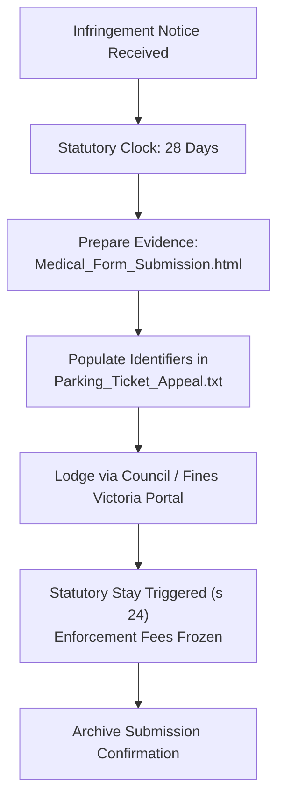
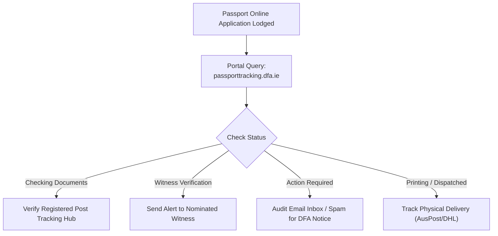

# 🏛️ Life Operations Execution & Follow-Up Guide

> **Date:** September 3, 2026  
> **Status:** Actionable Follow-Up & Filing Package Ready  
> **Target Items:** Parking Infringement Review & Irish Passport Application Tracking  

---

## 🧭 Executive Summary of Actions Completed

Both template documents on your Desktop have been fully upgraded and prepared:
1. **[Parking_Ticket_Appeal.txt](file:///Users/aaron/Desktop/Parking_Ticket_Appeal.txt)**:
   - Updated with the statutory framework under the **Infringements Act 2006 (Vic)**, citing **Section 22** (Application for Internal Review — Exceptional Circumstances) and **Section 24** (Automatic Statutory Suspension of Enforcement Proceedings).
   - Temporal context updated from "upcoming surgery" to **completed inpatient surgical operation on August 31, 2026**, with current active post-operative convalescence.
   - Pre-filled with your verified contact email (`Aaron.t.Maher@gmail.com`) and structured input fields.
2. **[Irish_Passport_Query.txt](file:///Users/aaron/Desktop/Irish_Passport_Query.txt)**:
   - Updated to clarify the **11-digit barcode application reference number** used by the DFA Passport Online system (or 9-digit on paper forms).
   - Clinical context synchronized with your completed August 31 surgical procedure.
   - Pre-filled with your verified contact email (`Aaron.t.Maher@gmail.com`) and specific queries regarding witness phone verification, registered post physical document intake, and target issue date.

---

## 🚗 Item 1: Parking Infringement Internal Review Follow-Up



### 1.1 Statutory Rights & The 28-Day Clock
- Under **Section 22 of the Infringements Act 2006**, you are legally entitled to request an internal review before the infringement is registered with Fines Victoria / enforcement court.
- **Section 24 Statutory Stay**: Upon lodging an application for internal review, **all enforcement action, late penalty additions, and statutory escalations are immediately and automatically suspended** until written notice of the review outcome is served upon you.
- **Statutory Ground**: **Exceptional Circumstances** — Acute surgical hospitalization and pre-operative clinical requirements constitute recognized exceptional circumstances beyond the driver's control.

### 1.2 Step-by-Step Filing Instructions
1. **Locate Your Infringement Notice**:
   - Note the **10-digit Infringement Notice Number** and your **Vehicle Registration (Plate Number)**.
2. **Finalize the Appeal Letter**:
   - Open [Parking_Ticket_Appeal.txt](file:///Users/aaron/Desktop/Parking_Ticket_Appeal.txt).
   - Fill in:
     - `[INSERT NOTICE NUMBER]`
     - `[INSERT VEHICLE REGO]`
     - `[INSERT DATE OF INFRINGEMENT]`
     - `[INSERT LOCATION / NATURE OF OFFENCE]`
     - `[INSERT MOBILE NUMBER]`
     - `[INSERT RESIDENTIAL / POSTAL ADDRESS]`
3. **Prepare Evidence Attachment**:
   - Open your pre-admission medical clearance:
     ```bash
     open /Users/aaron/Desktop/Medical_Form_Submission.html
     ```
   - In Safari/Chrome, press **Cmd + P**, select **Save as PDF**, and save it as `Medical_PreAdmission_Clearance_Aaron_Maher.pdf`.
4. **Lodge Online**:
   - If issued by a Municipal Council (e.g. City of Melbourne, Merri-bek, Yarra, Stonnington, Port Phillip): Navigate to that council's parking portal (search `"[Council Name] parking fine internal review"`).
   - If issued by Victoria Police or state authority: Navigate to [Fines Victoria Online](https://online.fines.vic.gov.au/).
   - Select **Request an Internal Review** -> Ground: **Exceptional Circumstances**.
   - Paste the body of `Parking_Ticket_Appeal.txt` and upload the medical PDF.
5. **Archive Confirmation**:
   - Save the reference number / submission receipt PDF.

---

## ☘️ Item 2: Irish Passport Application Tracking Follow-Up



### 2.1 The Official Tracking Endpoint
The Irish Department of Foreign Affairs tracking portal is located at:
👉 **[DFA Passport Online Tracking Portal](https://passporttracking.dfa.ie/)**

* **Identifier Required**: Your **11-digit application barcode number** (printed on the top-right of your Identity Verification Form and An Post / post office submission receipt) or 9-digit reference number.

### 2.2 Status Stage Matrix & Required Responses

| Tracking Status Displayed | Meaning | Immediate Action Required |
| :--- | :--- | :--- |
| **"Application Received"** | Online application logged, awaiting physical mail. | Check registered post tracking for your physical document envelope. |
| **"Checking Documents"** | Envelope received at Balbriggan / Dublin hub; staff reviewing identity papers. | No action needed; documents safely in the queue. |
| **"Action Required"** | Potential issue with photo glare/lighting, witness signature, or missing cert. | **High Priority**: Search Gmail for direct instructions from DFA. |
| **"Witness Verification"** / Processing | DFA is verifying witness eligibility or initiating telephone contact. | Send proactive heads-up message to witness (see template below). |
| **"Printing / Dispatched"** | Passport approved and printed; transferred to postal courier. | Record international registered post / Australia Post tracking ID. |

### 2.3 Ready-to-Send Witness Notification Message
Copy and paste this message to your nominated witness (via SMS / WhatsApp):

> *"Hi [Witness Name], just a quick heads-up regarding my Irish Passport application. The DFA Passport Service is currently processing my application and occasionally places random verification phone calls to witnesses from an Irish number (+353) or private caller ID. If you receive a call asking to confirm you signed my Identity Verification Form for Aaron Maher, please be ready to confirm. Thank you so much for your help!"*

### 2.4 Gmail Inbox Audit Filter
To ensure no correspondence from the Passport Office has been caught in filters or spam:
- **Search query in Gmail**:
  `from:(dfa.ie OR passportonline@dfa.ie OR donotreply@dfa.ie) OR subject:(passport OR "application number" OR "identity verification")`

### 2.5 Dispatching the Formal Query Letter
If the tracking portal displays an unexpected stall or if you need explicit confirmation of document arrival:
1. Open [Irish_Passport_Query.txt](file:///Users/aaron/Desktop/Irish_Passport_Query.txt).
2. Insert your application number and date of birth.
3. Submit via the [DFA Web Contact Form](https://www.ireland.ie/en/dfa/passports/contact-us/) or email `passportonline@dfa.ie`.

---

## 📁 Summary of Updated Local Files

- 📝 [Parking_Ticket_Appeal.txt](file:///Users/aaron/Desktop/Parking_Ticket_Appeal.txt) — Formal appeal letter with statutory stay citations.
- 📋 [Medical_Form_Submission.html](file:///Users/aaron/Desktop/Medical_Form_Submission.html) — Pre-admission clearance form to attach as PDF.
- ☘️ [Irish_Passport_Query.txt](file:///Users/aaron/Desktop/Irish_Passport_Query.txt) — Official status and witness verification query letter.
