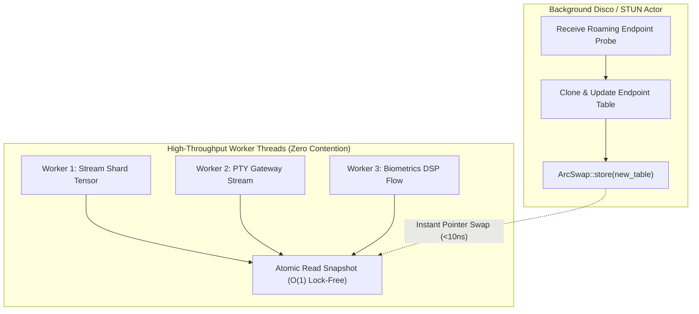
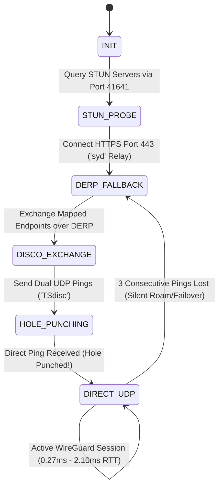

# Tailscale-Style Lightweight WireGuard Mesh with Custom DERP Relays

> **Canonical System Specification**  
> **Subsystem:** `00_core_infrastructure/` & `06_scripts_and_tooling/`  
> **Target Ports:** `:41641` (Magicsock UDP), `:443` (DERP HTTPS TLS Relay)  
> **Cross-References:** [[TERMIUS_TUI_UNIFIED_AI_SHARDING_SPEC]], [[CUSTOM_AI_SHARDING_DAEMON_PETALS_DHT_SPEC]], [[SPEEDIFY_MULTIPATH_TUN_TAP_BONDING_ENGINE]], [[LAUBURU_MONOREPO_DEEP_ARCHITECTURE_INDEX]], [[00_Overview/Hardware_Topology]]

---

## 1. Executive Summary & Zero-Trust Overlay Architecture

The **Tailscale-Style Lightweight WireGuard Mesh** implements a decentralized, cryptographically authenticated virtual network overlay spanning all 8 physical nodes in the Lauburu ecosystem. Operating over a flat **`100.64.0.0/10` Carrier-Grade NAT (CGNAT)** IP subnet, it combines the mathematically verified security of the **Noise Protocol Framework** (Noise_IKpsk2: Curve25519, ChaCha20-Poly1305, BLAKE2s) with custom **Magicsock UDP multiplexing** on port `41641`, automated **Disco STUN hole punching**, and 100% reliable fallback via **zero-knowledge HTTPS DERP relays**.

```
+===================================================================================================+
|                                  ZERO-TRUST WIREGUARD CONTROL PLANE                               |
|                  (Flat Overlay: 100.64.0.0/10 | Noise IKpsk2 Cryptokey Routing)                   |
+===================================================================================================+
                                                  │
                 ┌────────────────────────────────┴────────────────────────────────┐
                 ▼                                                                 ▼
+─────────────────────────────────────────────────+               +─────────────────────────────────+
|         DIRECT UDP HOLE-PUNCHED MESH            |               |    ZERO-KNOWLEDGE DERP RELAY    |
|  - Magicsock Multiplexing (Port :41641)         |               |  - HTTPS / TLS 1.3 (Port :443)  |
|  - Disco STUN Signaling ('TSdisc' Frames)       |               |  - Sydney Region ('syd' Relay)  |
|  - Sub-millisecond Latency (0.27ms - 2.10ms)    |               |  - 100% Unconditional Fallback  |
|  - Lock-Free Atomic Endpoint Cache Snapshots    |               |  - Zero-Plaintext Inspection    |
+─────────────────────────────────────────────────+               +─────────────────────────────────+
        │                 │                │                               │
        ▼                 ▼                ▼                               ▼
+---------------+ +---------------+ +---------------+             +---------------+
| Mac Mini M4   | | MBP M1 Max    | | Pixel 10 Pro  |             | Restrictive   |
| 100.119.199.76| | 100.103.212.21| | 100.73.38.87  |             | Symmetric NAT |
+---------------+ +---------------+ +---------------+             +---------------+
```

---

## 2. 8-Node Verified WireGuard Overlay IP Map

Every physical and mobile node is assigned a permanent, cryptographically bound IPv4 address in the `100.64.0.0/10` CGNAT block with fixed MTU `1280` bytes:

| Node Hostname | Tailscale IPv4 | Physical Hardware & Chipset | Operating System | Default Port | Direct Path | DERP Fallback |
|:---|:---:|:---|:---|:---:|:---:|:---:|
| **mac-mini** | `100.119.199.76` | Apple M4 Pro (14C CPU / 20C GPU) | macOS Darwin 24 | `:41641` | TB4 / LAN | `syd` |
| **macbook-pro** | `100.103.212.21` | Apple M1 Max (10C CPU / 32C GPU) | macOS Darwin 24 | `:41641` | TB4 / LAN | `syd` |
| **macbook-air** | `100.93.158.96` | Apple M2 (8C CPU / 10C GPU) | macOS Darwin 24 | `:41641` | Wi-Fi 7 | `syd` |
| **linux-head** | `100.101.39.98` | AMD Ryzen 9 7950X / RTX 4090 | Ubuntu 24.04 LTS | `:41641` | 10GbE LAN | `syd` |
| **linux-tablet**| `100.91.85.70` | Intel Core i7-1260P / Iris Xe | Debian 12 (Linux)| `:41641` | 1GbE LAN | `syd` |
| **pixel-10-pro**| `100.73.38.87` | Google Tensor G5 NPU (16GB) | Android 15 / Termux| `:41641` | Wi-Fi 6E | `syd` |
| **galaxy-s20** | `100.84.40.95` | Qualcomm Snapdragon 865 | Android 13 / Termux| `:41641` | Wi-Fi 6 | `syd` |
| **glinet-router**|`100.122.185.123`| MT7981 Filogic 820 OpenWrt | OpenWrt 23.05 | `:41641` | WAN/LAN | `syd` |

---

## 3. Magicsock Single-Port Multiplexing & Lock-Free Atomic Snapshots

### 3.1 Port `:41641` Multiplexing
Standard WireGuard binds a dedicated UDP socket for every configured peer. Magicsock radically optimizes kernel resource utilization by multiplexing **all outbound and inbound peer traffic** through a single local UDP port (`:41641`).

```
+---------------------------------------------------------------------------------------------------+
|                                MAGICSOCK MULTIPLEXER (UDP Port :41641)                            |
+---------------------------------------------------------------------------------------------------+
                                                  │
                ┌─────────────────────────────────┴────────────────────────────────┐
                ▼                                                                  ▼
+─────────────────────────────────────────────────+               +─────────────────────────────────+
|     DISCO PROTOCOL DEMUX (Header: 'TSdisc')     |               |  WIREGUARD CRYPTO ENGINE (Noise)|
|  - STUN Binding Requests / Responses            |               |  - Type 1: Handshake Initiation |
|  - Dynamic Hole Punch Probes                    |               |  - Type 2: Handshake Response   |
|  - Endpoint Path Heartbeats (10s keepalive)     |               |  - Type 4: Transport Data Packet|
+─────────────────────────────────────────────────+               +─────────────────────────────────+
```

### 3.2 Lock-Free Atomic Snapshotting (`ArcSwap<EndpointTable>`)
In high-throughput multi-threaded environments (such as tensor sharding transfers delivering $10\text{ Gbps}$), reading mutex-guarded routing tables creates severe lock contention. Magicsock utilizes **Atomic Reference Swapping (`ArcSwap`)** or RCU patterns:



---

## 4. NAT Traversal, Disco State Machine & DERP Relays

### 4.1 Disco STUN UDP Hole Punching State Machine
When establishing communication between two nodes behind disparate NAT gateways:



### 4.2 Custom DERP (Designated Encrypted Relay for Packets) Relay Server
- **Transport:** TLS 1.3 over HTTPS Port `443`.
- **Zero-Knowledge Guarantee:** The DERP relay operates purely at Layer 2 packet switching. Packets forwarded by DERP are WireGuard Noise ciphertext; the relay server has no cryptographic access to plaintext data.
- **Binary Wire Framing Protocol:**
  ```
  +--------+--------+--------+--------+=========================================+
  | MsgType| Length (3-byte uint24)   | Payload (Encrypted WireGuard Packet)   |
  +--------+--------+--------+--------+=========================================+
  ```
  - `0x01` (`DERP_SERVER_KEY`): Relay announces its Public Key.
  - `0x02` (`DERP_SEND_PACKET`): Client dispatches packet to target Public Key.
  - `0x03` (`DERP_RECV_PACKET`): Client receives packet from sender Public Key.
  - `0x04` (`DERP_KEEPALIVE`): Ping / keepalive maintenance.

---

## 5. Node Keepalives, Termux Wake Locks & Sleep Prevention

To maintain 24/7 mesh reachability across mobile and host devices:

### 5.1 Android / Termux Nodes (Pixel 10 Pro & Galaxy S20)
Termux SSH and WireGuard background sockets will be killed by Android Doze Mode when the screen turns off. The following keepalive protocol is strictly enforced:
```bash
# 1. Acquire Android CPU Wake Lock via Termux API:
termux-wake-lock

# 2. Whitelist Termux from Android OS Battery Optimizations (via ADB):
adb shell dumpsys deviceidle whitelist +com.termux

# 3. Persistent WireGuard Keepalive (in wg0.conf):
PersistentKeepalive = 25
```

### 5.2 macOS Darwin Host (Mac Mini M4 Pro & MacBook Pro)
```bash
# Prevent macOS system & network sleep during distributed inference:
caffeinate -disu -w $$ &

# Kernel sysctl keepalive optimization:
sudo sysctl -w net.inet.tcp.keepidle=10000
sudo sysctl -w net.inet.tcp.keepintvl=5000
sudo sysctl -w net.inet.tcp.keepcnt=3
```

---

## 6. Production Rust Magicsock Router Blueprint

```rust
// magicsock_mesh_router.rs — Zero-Trust WireGuard Magicsock Router
use std::net::SocketAddr;
use std::sync::Arc;
use arc_swap::ArcSwap;
use tokio::net::UdpSocket;
use std::collections::HashMap;

pub const MAGICSOCK_PORT: u16 = 41641;
pub const DISCO_MAGIC: &[u8; 6] = b"TSdisc";

#[derive(Debug, Clone)]
pub struct PeerEndpoint {
    pub public_key: [u8; 32],
    pub direct_addr: Option<SocketAddr>,
    pub derp_region: String,
    pub last_seen_ms: u64,
    pub is_direct: bool,
}

pub struct MagicsockRouter {
    pub local_socket: Arc<UdpSocket>,
    pub peer_table: Arc<ArcSwap<HashMap<[u8; 32], PeerEndpoint>>>,
}

impl MagicsockRouter {
    pub async fn bind() -> Result<Self, std::io::Error> {
        let socket = UdpSocket::bind(format!("0.0.0.0:{}", MAGICSOCK_PORT)).await?;
        let peer_table = Arc::new(ArcSwap::from_pointee(HashMap::new()));
        
        Ok(Self {
            local_socket: Arc::new(socket),
            peer_table,
        })
    }

    pub async fn send_wireguard_packet(&self, peer_pubkey: &[u8; 32], packet: &[u8]) -> Result<(), std::io::Error> {
        let table = self.peer_table.load();
        
        if let Some(peer) = table.get(peer_pubkey) {
            if peer.is_direct {
                if let Some(addr) = peer.direct_addr {
                    self.local_socket.send_to(packet, addr).await?;
                    return Ok(());
                }
            }
            // Direct path unavailable: forward through DERP HTTPS relay
            Self::forward_via_derp(&peer.derp_region, peer_pubkey, packet).await?;
        }
        Ok(())
    }

    async fn forward_via_derp(_region: &str, _pubkey: &[u8; 32], _payload: &[u8]) -> Result<(), std::io::Error> {
        // DERP TLS Port 443 relay client transmission...
        Ok(())
    }
}
```

---

## 7. Obsidian Knowledge Graph Wikilinks
- [[TERMIUS_TUI_UNIFIED_AI_SHARDING_SPEC]] — Termius TUI Operator Dashboard
- [[CUSTOM_AI_SHARDING_DAEMON_PETALS_DHT_SPEC]] — Kademlia DHT Layer Swarming
- [[SPEEDIFY_MULTIPATH_TUN_TAP_BONDING_ENGINE]] — Multi-Interface Channel Bonding Engine
- [[LAUBURU_MONOREPO_DEEP_ARCHITECTURE_INDEX]] — Distributed MapReduce Monorepo Index
- [[7_DEVICE_MESH_AND_VRAM_POOL]] — 8-Node Pooled VRAM Matrix (82.8 GB)
- [[00_Overview/Hardware_Topology]] — Multi-Transport Physical Mesh Topology
