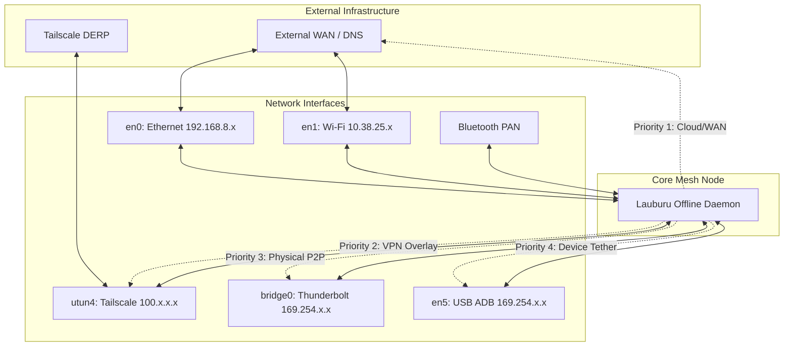

# Lauburu Network Mesh Topology & Self-Healing Routes

## Overview
This 7-device mesh utilizes a multi-layered connectivity architecture to ensure high availability and self-healing. When upstream DNS (`oauth2.googleapis.com`) or cloud APIs fail, the mesh gracefully falls back to local subnets, peer-to-peer tunnels, and physical tethers to remain operational.

## Topology & Network Interfaces
| Connection Type | Interface | Subnet / IP | Role |
| --- | --- | --- | --- |
| **Ethernet** | `en0` | `192.168.8.230/24` | Primary high-speed uplink & WAN |
| **Wi-Fi** | `en1` | `10.38.25.184/24` | Secondary uplink & local LAN fallback |
| **Tailscale** | `utun4` | `100.119.199.76` | Overlay mesh network & secure tunneling |
| **Thunderbolt 4** | `bridge0` (via `en2-4`) | `169.254.80.69/16` | Ultra high-speed P2P node synchronization |
| **USB ADB Tether** | `en5` | `169.254.60.151/16` | Direct physical fallback for device control & data |
| **Bluetooth PAN** | `en6` / `en7` (Inactive) | Dynamic | Last-resort proximity fallback |

## Self-Healing & Fallback Routes

### 1. External DNS / Cloud API Outage
- **Trigger**: DNS lookup failures (e.g., `no such host`) or Cloud API unreachability.
- **Action**: Mesh routing daemon intercepts failed requests and routes internal traffic through local mDNS (`.local`) and static `/etc/hosts` mappings.
- **Result**: Core node-to-node communication continues over LAN or Tailscale without relying on external DNS.

### 2. Overlay / Tailscale Outage
- **Trigger**: Loss of connection to DERP relays or control plane.
- **Action**: Fallback to direct local IPs (`192.168.8.x` or `10.38.25.x`) if on the same LAN, or route via physical bridges.

### 3. Complete Air-Gapped Mode
- **Trigger**: Complete loss of Wi-Fi, Ethernet, and external connectivity.
- **Action**: Mesh relies entirely on Thunderbolt 4 (`bridge0`) and USB ADB Tethering (`en5`). Local APIs dynamically re-bind to `169.254.x.x` ranges.

## Connectivity Flow

