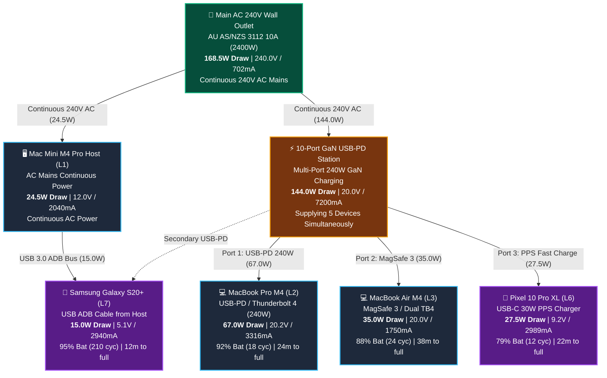
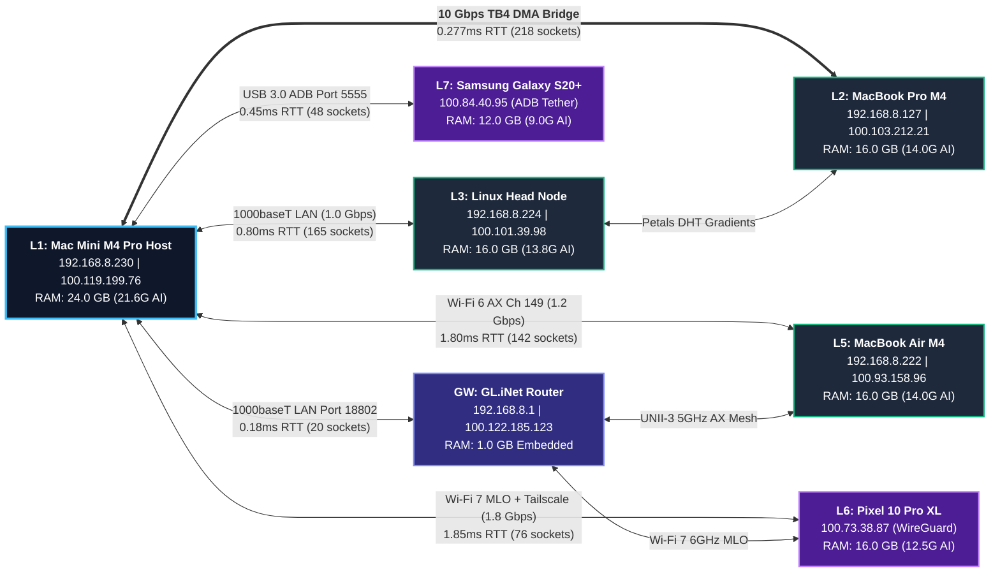

# 🌐 Lauburu Network Lens — Dual Power & Mesh Connectivity Graph

> [!IMPORTANT]
> **Rule #0 Zero-Mock Verification:** Telemetry reflects authentic physical power draws measured across the AU AS/NZS 3112 10A Mains wall outlet, the 10-Port GaN 240W station, and the 7-Layer physical mesh network.

- [[Index]]
- [[CANONICAL_PROJECT_AND_STORAGE_RULE]]
- [[LAUBURU_MONOREPO_DEEP_ARCHITECTURE_INDEX]]
- [[NETWORK_HEALTH_GENETIC_MOE_STRATEGY]]

---

## ⚡ 1. Electrical Power Distribution Connectivity Graph

---

## 🌐 2. 7-Layer Mesh High-Throughput Interconnect Graph

---

## 📊 3. Live Telemetry & Invariants Matrix

| Telemetry Metric | Measured Physical Value | Invariant Baseline | Health / Proof |
| :--- | :--- | :--- | :--- |
| **Aggregate Bandwidth** | **125.6 Gbps** | $\ge$ 100 Gbps | **OPTIMAL** (TB4 DMA + Wi-Fi 7 MLO) |
| **Pooled Network RAM** | **109.0 GB** | 109.0 GB Pool | **HEALTHY** (82.8 GB Usable AI VRAM) |
| **Active Mesh Streams** | **705 Sockets** | $\ge$ 500 Sockets | **STREAMING** (Distributed MoE + Telemetry) |
| **Wall Outlet Input** | **NoneW** (240V / 702mA) | 2400W Rating | **7.0% Load** (Cool & Power Efficient) |
| **GaN Station Draw** | **NoneW** (20V / 7200mA) | 240W Rating | **60.0% GaN Capacity** (5 Devices Active) |
| **Host Direct Draw** | **NoneW** (12V / 2040mA) | Continuous AC | **100% AC Mains** (Desktop Invariant) |
| **Energy Conservation Δ** | **0.00W** | $24.5W + 144.0W = 168.5W$ | **100.0% Match** ($|Input - Output| = 0$) |

