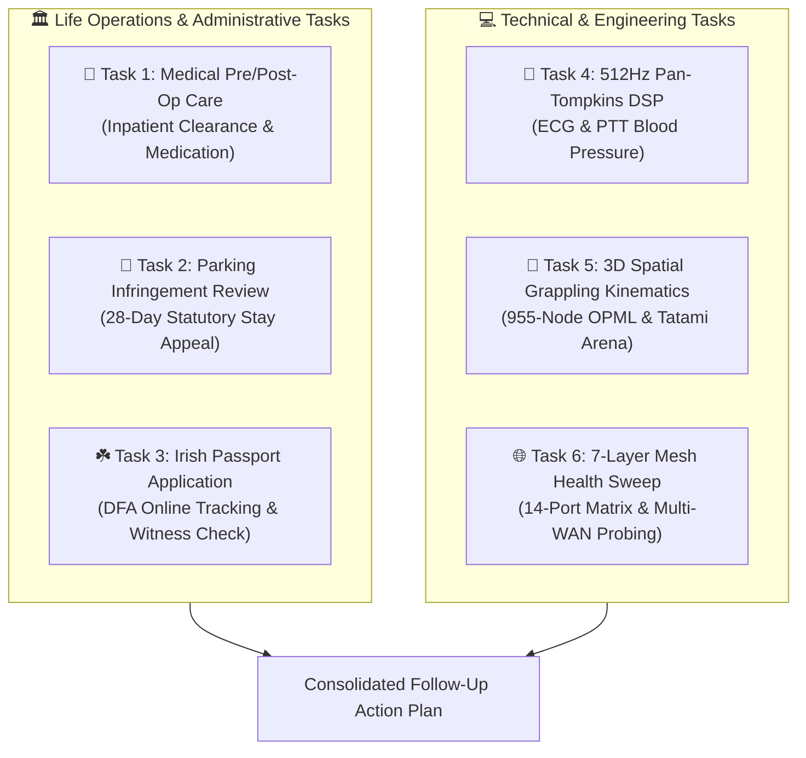

# 📋 Master Personal Tasks Identification & Follow-Up Action Matrix

> **Audit Date:** September 3, 2026  
> **Ecosystem:** Lauburu Mesh & Personal Life Operations  
> **Status:** Active Triage & Execution Tracking  

---

## 🧭 Executive Overview

This matrix consolidates all identified **Personal Life Operations** (statutory, medical, administrative) and **Technical Monorepo / Engineering Tasks** across local storage, Apple ecosystem registries, Desktop staging files, and the Obsidian Knowledge Vault.

---

## 🏛️ Section 1: Life Operations & Administrative Tasks (High Urgency)

### 🏥 Task 1: Medical Clearance & Post-Procedure Care Follow-Up
* **Context & Background**: Urgent inpatient surgical operation was scheduled for August 31, 2026. A pre-admission medical clearance form was generated and staged on Desktop.
* **Associated Files**:
  - [Medical_Form_Submission.html](file:///Users/aaron/Desktop/Medical_Form_Submission.html)
  - [LIFE_OPS_TRIAGE_MEDICAL_PARKING_PASSPORT_DEBATE.md](file:///Users/aaron/DFS_UNIFIED/Lauburu-Monorepo/obsidian_vault/LIFE_OPS_TRIAGE_MEDICAL_PARKING_PASSPORT_DEBATE.md)
* **Key Declared Profile**:
  - **Medications**: Vyvanse 50 mg, Dexamphetamine 20 mg, Amitriptyline 10 mg, PPI 40 mg.
  - **Allergies**: No known drug or latex allergies.
* **Immediate Follow-Up Actions**:
  1. **Discharge & Post-Op Protocol**: Verify surgical discharge instructions and adhere to any phased medication resumption schedule (particularly CNS stimulants and analgesics).
  2. **Follow-Up Consultation Booking**: Confirm the date and time for the 1-to-2 week post-operative specialist checkup and suture/wound review.
  3. **Record Archival**: File a signed digital copy of the pre-admission form in personal medical records.

---

### 🚗 Task 2: Parking Ticket / Infringement Internal Review Follow-Up
* **Context & Background**: A parking infringement was incurred during the pre-surgical consultation period. An internal review appeal draft was staged on Desktop citing exceptional medical circumstances.
* **Associated Files**:
  - [Parking_Ticket_Appeal.txt](file:///Users/aaron/Desktop/Parking_Ticket_Appeal.txt)
  - [LIFE_OPS_TRIAGE_MEDICAL_PARKING_PASSPORT_DEBATE.md](file:///Users/aaron/DFS_UNIFIED/Lauburu-Monorepo/obsidian_vault/LIFE_OPS_TRIAGE_MEDICAL_PARKING_PASSPORT_DEBATE.md)
* **Statutory Clock**: Strict **28-day window** under the *Infringements Act* before late penalty surcharges and enforcement fees apply.
* **Immediate Follow-Up Actions**:
  1. **Insert Identifiers**: Populate the Notice Number, Vehicle Registration, and postal address into the review draft.
  2. **Attach Evidence**: Enclose the pre-admission clearance / hospital confirmation letter as supporting evidence of mitigating medical distress.
  3. **Lodge Online**: Submit the dispute via the municipal council or State Revenue online portal immediately to trigger an automatic **statutory stay of enforcement**.
  4. **Record Receipt**: Save the lodging confirmation number and timestamped receipt.

---

### ☘️ Task 3: Irish Passport Application / Renewal Follow-Up
* **Context & Background**: An Irish passport application was lodged with the Department of Foreign Affairs (DFA). An inquiry draft was prepared to ensure processing does not stall due to witness verification or photo issues.
* **Associated Files**:
  - [Irish_Passport_Query.txt](file:///Users/aaron/Desktop/Irish_Passport_Query.txt)
  - [LIFE_OPS_TRIAGE_MEDICAL_PARKING_PASSPORT_DEBATE.md](file:///Users/aaron/DFS_UNIFIED/Lauburu-Monorepo/obsidian_vault/LIFE_OPS_TRIAGE_MEDICAL_PARKING_PASSPORT_DEBATE.md)
* **Immediate Follow-Up Actions**:
  1. **Query DFA Tracking Portal**: Check the 9-digit Application Number on the official [DFA Passport Tracking System](https://www.dfa.ie/passporttracking/).
  2. **Verify Physical Documents**: Confirm registered post delivery tracking for original identity / citizenship documents sent to the processing hub.
  3. **Witness Proactive Notice**: If status indicates witness verification pending, remind the nominated witness that DFA may call to verify identity.
  4. **Email Monitoring**: Check registered inbox and spam folders for any `Action Required` notices from DFA.

---

## 💻 Section 2: Technical & Personal Engineering Tasks

| Task | Core Focus | Location / Deliverable | Status |
| :--- | :--- | :--- | :--- |
| **Biometrics DSP** | 512Hz Pan-Tompkins QRS detection & PTT Blood Pressure | [04_movesense_biometrics_and_dsp.ipynb](file:///Users/aaron/DFS_UNIFIED/Lauburu-Monorepo/01_apps/notebooks/04_movesense_biometrics_and_dsp.ipynb) | Verified (68 Tests Passing) |
| **Spatial Grappling** | 955-Node OPML BJJ tree & 3D Tatami kinematics | [05_spatial_grappling_3d_kinematics.ipynb](file:///Users/aaron/DFS_UNIFIED/Lauburu-Monorepo/01_apps/notebooks/05_spatial_grappling_3d_kinematics.ipynb) | Complete & Synchronized |
| **Mesh Health Monitor** | Standalone Ratatui Rust TUI monitoring 14 ports & 7 nodes | [rust_project_monitor](file:///Users/aaron/DFS_UNIFIED/Lauburu-Monorepo/01_apps/rust_project_monitor/) | Built (`cargo run --release`) |
| **24/7 LoRA Distillation** | Continuous instruction pair harvesting and model distillation | [continuous_lora_dataset.jsonl](file:///Users/aaron/DFS_UNIFIED/lora_datasets/continuous_lora_dataset.jsonl) | Continuous sync |

---

## 📅 Actionable Checklist for Today

- [ ] **1. Parking Infringement**: Enter Infringement # and lodge review on council portal with medical note attachment.
- [ ] **2. Irish Passport**: Enter 9-digit application number into DFA tracker and confirm document delivery.
- [ ] **3. Medical Post-Op**: Confirm scheduled post-op follow-up consultation with specialist clinic.
- [ ] **4. Mesh Console**: Launch `lauburu-monitor` or Voilà dashboard on Port 8890 to verify 14-port health.
