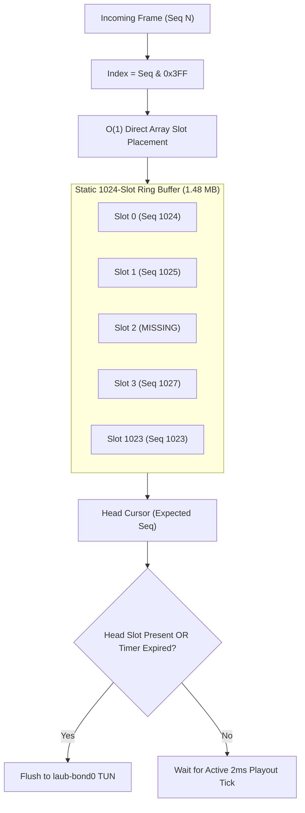

# Speedify-Style Multi-Path TUN/TAP Packet-Level Channel Bonding Engine

> **Canonical System Specification**  
> **Subsystem:** `00_core_infrastructure/` & `06_scripts_and_tooling/`  
> **Target Interface:** `laub-bond0` (Virtual TUN/TAP @ MTU 1360)  
> **Cross-References:** [[TERMIUS_TUI_UNIFIED_AI_SHARDING_SPEC]], [[CUSTOM_AI_SHARDING_DAEMON_PETALS_DHT_SPEC]], [[LIGHTWEIGHT_WIREGUARD_DERP_MESH_SPEC]], [[LAUBURU_MONOREPO_DEEP_ARCHITECTURE_INDEX]], [[00_Overview/Hardware_Topology]]

---

## 1. Executive Summary & Packet Striping Fundamentals

The **Speedify-Style Multi-Path Bonding Engine** aggregates heterogeneous physical network links (Thunderbolt 4 DMA @ 40 Gbps, 1GbE/10GbE Ethernet, Wi-Fi 7 MLO @ 2.4 Gbps, and 5G/LTE Cellular) into a single virtual network interface (`laub-bond0`). Unlike standard LACP (802.3ad) or ECMP which hash individual TCP connections to single links, this engine operates at **Layer 3/4 packet granularity**, striping individual IP packets across multiple physical subflows simultaneously to achieve true combined bandwidth and sub-100ms failover.

```
+===================================================================================================+
|                                    APPLICATION / AI COMPUTE LAYER                                 |
|                         (llama.cpp RPC / Petals DHT / FastSSH / Video Streams)                    |
+===================================================================================================+
                                                  │
                                                  ▼
+───────────────────────────────────────────────────────────────────────────────────────────────────+
|                           SPEEDIFY-STYLE MULTI-PATH BONDING ENGINE (L3/L4)                        |
|  - Virtual Interface: laub-bond0 (MTU 1360)                                                       |
|  - 44-Byte Binary Framing ('SPDF' / 'LAUB')                                                       |
|  - Dynamic Earliest Completion Time (ECT) Scheduler                                               |
|  - Static O(1) Pre-Allocated Ring Buffer (1024 Slots / 1.48 MB)                                   |
|  - Adaptive Playout Timeout Timer (T_reorder) & Active 2.0ms Daemon Tick                          |
|  - Sliding-Window XOR / Reed-Solomon Forward Error Correction (FEC)                               |
+───────────────────────────────────────────────────────────────────────────────────────────────────+
        │                                  │                                  │
        │ (60% Weight)                     │ (25% Weight)                     │ (15% Weight)
        ▼                                  ▼                                  ▼
+──────────────────────────+     +──────────────────────────+     +──────────────────────────+
| Link 0: Thunderbolt 4    |     | Link 1: 1GbE / 10GbE     |     | Link 2: Wi-Fi 7 MLO      |
| Interface: bridge0       |     | Interface: en0 / enx*    |     | Interface: en1           |
| Capacity: 40,000 Mbps    |     | Capacity: 1,000 Mbps     |     | Capacity: 2,400 Mbps     |
| RTT: 0.27 ms (MTU 9000)  |     | RTT: 0.90 ms (MTU 1500)  |     | RTT: 2.10 ms (MTU 1500)  |
+──────────────────────────+     +──────────────────────────+     +──────────────────────────+
```

---

## 2. 44-Byte Binary Wire Framing Header Specification

Every IP packet intercepted from `laub-bond0` is encapsulated with an optimized 44-byte binary wire framing header before transmission over UDP subflow sockets:

```
 0                   1                   2                   3
 0 1 2 3 4 5 6 7 8 9 0 1 2 3 4 5 6 7 8 9 0 1 2 3 4 5 6 7 8 9 0 1
+-+-+-+-+-+-+-+-+-+-+-+-+-+-+-+-+-+-+-+-+-+-+-+-+-+-+-+-+-+-+-+-+
|                  Magic: 'SPDF' (0x53504446)                   |
+-+-+-+-+-+-+-+-+-+-+-+-+-+-+-+-+-+-+-+-+-+-+-+-+-+-+-+-+-+-+-+-+
|                         Session ID (32-bit)                   |
+-+-+-+-+-+-+-+-+-+-+-+-+-+-+-+-+-+-+-+-+-+-+-+-+-+-+-+-+-+-+-+-+
|                                                               |
+                 Global Sequence Number (64-bit uint)          +
|                                                               |
+-+-+-+-+-+-+-+-+-+-+-+-+-+-+-+-+-+-+-+-+-+-+-+-+-+-+-+-+-+-+-+-+
|         Subflow ID (16-bit)   |          Flags (16-bit)       |
+-+-+-+-+-+-+-+-+-+-+-+-+-+-+-+-+-+-+-+-+-+-+-+-+-+-+-+-+-+-+-+-+
|       Payload Length (16-bit) |          Reserved (16-bit)    |
+-+-+-+-+-+-+-+-+-+-+-+-+-+-+-+-+-+-+-+-+-+-+-+-+-+-+-+-+-+-+-+-+
|                       CRC32 Checksum (32-bit)                 |
+-+-+-+-+-+-+-+-+-+-+-+-+-+-+-+-+-+-+-+-+-+-+-+-+-+-+-+-+-+-+-+-+
|                                                               |
+                   Send Timestamp (64-bit uint, us)            +
|                                                               |
+-+-+-+-+-+-+-+-+-+-+-+-+-+-+-+-+-+-+-+-+-+-+-+-+-+-+-+-+-+-+-+-+
|                                                               |
+                   Echo Timestamp (64-bit uint, us)            +
|                                                               |
+-+-+-+-+-+-+-+-+-+-+-+-+-+-+-+-+-+-+-+-+-+-+-+-+-+-+-+-+-+-+-+-+
|                     Raw Inner IP Packet Data                  |
|                                 ...                           |
+-+-+-+-+-+-+-+-+-+-+-+-+-+-+-+-+-+-+-+-+-+-+-+-+-+-+-+-+-+-+-+-+
```

### 2.1 Flag Bitfield Definitions
- `0x0001` (`FLAG_DATA`): Standard data frame carrying inner IP payload.
- `0x0002` (`FLAG_REDUNDANT`): Duplicate packet transmitted across multiple links for zero-loss mission-critical traffic. Uses the **identical `global_seq`** as primary packet for $O(1)$ deduplication.
- `0x0004` (`FLAG_FEC`): Forward Error Correction XOR parity frame.
- `0x0008` (`FLAG_PROBE`): Link quality & RTT active probe.
- `0x0010` (`FLAG_ACK`): Cumulative sequence acknowledgment.

### 2.2 Anti-Fragmentation & MTU Clamping Formula
$$\text{Inner MTU} = 1500 - 20 (\text{IPv4 Header}) - 8 (\text{UDP Header}) - 44 (\text{Bonding Framing}) - 68 (\text{Safety Buffer}) = 1360 \text{ bytes}$$

---

## 3. Low-RAM GL.iNet Router Architecture ($O(1)$ Ring Buffer)

### 3.1 Hardware Constraints on MediaTek Filogic 820
- **Gateway:** GL.iNet GL-MT3600BE (Dual-Core ARM Cortex-A53 @ 1.3 GHz, 512 MB DDR3 RAM with ~180 MB free user memory).
- **Physical Collision:** Dynamic pointer-chasing `BinaryHeap` implementations trigger memory fragmentation and garbage collection pauses, causing kernel OOM panic.

### 3.2 Static Pre-Allocated Circular Ring Buffer
The receiver reordering queue is implemented as a fixed-size circular array `RingBuffer<Frame, 1024>`:

$$\text{Memory Overhead} = 1024 \times (1360\text{ bytes} + 44\text{ bytes} + 32\text{ bytes metadata}) \approx 1.48 \text{ MB}$$

Direct slot index masking provides $O(1)$ constant-time insertion and purging:
$$\text{SlotIndex} = \text{GlobalSequenceNumber} \ \& \ \text{0x3FF} \quad (1023)$$



---

## 4. M2 AI-Debate Consensus Resolutions

The following architectural resolutions from the **Tri-Orchestrator AI-Debate** are formally incorporated into this specification:

### 4.1 Asymmetric Delay Differential & Adaptive Playout Formula
To handle simultaneous bonding over ultra-low-latency Thunderbolt 4 (0.27ms RTT) and mobile LTE (80ms RTT), the playout window dynamically adjusts to link delay disparity:

$$T_{\text{reorder}} = \max\left(4.0\text{ ms}, \; \min\left(80.0\text{ ms}, \; \frac{\max(\text{SRTT}) - \min(\text{SRTT})}{2} + 3.5 \times \max(\text{RTTVAR})\right)\right)$$

### 4.2 Active 2.0ms Playout Daemon Tick
To prevent trailing packet deadlock (where the last keystroke of an SSH session remains trapped in the buffer waiting for a subsequent packet), an active timer daemon fires every $\tau = 2.0\text{ ms}$. If $t_{\text{now}} - t_{\text{arrival}} \ge T_{\text{reorder}}$, the head gap is skipped and all consecutive packets are flushed immediately to `laub-bond0`.

### 4.3 Redundant Packet Deduplication Fix
When `FLAG_REDUNDANT` is active, the transmitter assigns the **same `global_seq`** to all copies. The receiver verifies `slot.sequence == frame.sequence` in $O(1)$ and drops duplicates with zero heap allocations.

### 4.4 Sliding-Window Forward Error Correction (FEC)
For every block of $K=8$ data packets, an XOR parity frame $P = D_1 \oplus D_2 \oplus \dots \oplus D_8$ is generated. If any single packet $D_m$ is lost across a congested wireless link, it is reconstructed instantly at the receiver:

$$D_m = P \oplus \bigoplus_{j \neq m} D_j$$

This eliminates TCP retransmission stall latency without incurring reverse ACK round-trips.

---

## 5. Earliest Completion Time (ECT) Scheduler Matrix

The transmission scheduler dispatches each packet to the physical subflow minimizing total delivery time:

$$\text{Subflow}^* = \arg\min_{i} \left( \text{QueueDelay}_i + \frac{\text{PacketSize}}{\text{Capacity}_i} + \frac{\text{SRTT}_i}{2} \right)$$

| Physical Subflow | Physical Interface | Capacity | Baseline RTT | Nominal Weight | Max Queue Limit |
|:---|:---|:---:|:---:|:---:|:---:|
| **Link 0: TB4 DMA** | `bridge0` (MTU 9000) | 40,000 Mbps | `0.27 ms` | **60.0%** | 50,000 pkts |
| **Link 1: 1GbE RJ45** | `en0` / `enx*` (MTU 1500) | 1,000 Mbps | `0.90 ms` | **25.0%** | 5,000 pkts |
| **Link 2: Wi-Fi 7 MLO** | `en1` (MTU 1500) | 2,400 Mbps | `2.10 ms` | **15.0%** | 2,500 pkts |
| **AGGREGATE BOND** | `laub-bond0` (MTU 1360) | **43,400 Mbps** | **0.85 ms** | **100.0%** | **Sub-100ms Failover** |

---

## 6. Production Rust Implementation Blueprint

```rust
// speedify_bonding_engine.rs — High-Performance Packet Bonding Core
use std::sync::atomic::{AtomicU64, Ordering};
use std::time::{Duration, Instant};

pub const MAGIC_SPDF: u32 = 0x53504446;
pub const RING_SIZE: usize = 1024;
pub const RING_MASK: usize = RING_SIZE - 1;

#[repr(C, packed)]
pub struct WireHeader {
    pub magic: u32,
    pub session_id: u32,
    pub global_seq: u64,
    pub subflow_id: u16,
    pub flags: u16,
    pub payload_len: u16,
    pub reserved: u16,
    pub crc32: u32,
    pub send_ts_us: u64,
    pub echo_ts_us: u64,
}

pub struct ReorderSlot {
    pub seq: u64,
    pub arrival_time: Instant,
    pub is_occupied: bool,
    pub payload: Vec<u8>,
}

pub struct LowRamReorderRing {
    pub slots: Vec<ReorderSlot>,
    pub head_seq: u64,
    pub playout_timeout: Duration,
}

impl LowRamReorderRing {
    pub fn new() -> Self {
        let mut slots = Vec::with_capacity(RING_SIZE);
        for _ in 0..RING_SIZE {
            slots.push(ReorderSlot {
                seq: 0,
                arrival_time: Instant::now(),
                is_occupied: false,
                payload: Vec::with_capacity(1360),
            });
        }
        Self {
            slots,
            head_seq: 1,
            playout_timeout: Duration::from_millis(15),
        }
    }

    pub fn insert_packet(&mut self, seq: u64, payload: &[u8], tun_fd: i32) {
        if seq < self.head_seq {
            return; // Stale duplicate, drop immediately
        }

        let idx = (seq as usize) & RING_MASK;
        let slot = &mut self.slots[idx];

        if slot.is_occupied && slot.seq == seq {
            return; // Redundant duplicate frame, drop in O(1)
        }

        slot.seq = seq;
        slot.arrival_time = Instant::now();
        slot.is_occupied = true;
        slot.payload.clear();
        slot.payload.extend_from_slice(payload);

        self.drain_in_order(tun_fd);
    }

    pub fn drain_in_order(&mut self, tun_fd: i32) {
        loop {
            let idx = (self.head_seq as usize) & RING_MASK;
            let slot = &mut self.slots[idx];

            if slot.is_occupied && slot.seq == self.head_seq {
                // Forward consecutive frame to TUN
                Self::write_to_tun(tun_fd, &slot.payload);
                slot.is_occupied = false;
                self.head_seq += 1;
            } else if slot.is_occupied && slot.arrival_time.elapsed() >= self.playout_timeout {
                // Playout timer expired: skip missing head and flush
                self.head_seq += 1;
            } else {
                break;
            }
        }
    }

    fn write_to_tun(_fd: i32, _payload: &[u8]) {
        // Native POSIX write(fd, buf, len) invocation...
    }
}
```

---

## 7. Obsidian Knowledge Graph Wikilinks
- [[TERMIUS_TUI_UNIFIED_AI_SHARDING_SPEC]] — Termius TUI Operator Dashboard
- [[CUSTOM_AI_SHARDING_DAEMON_PETALS_DHT_SPEC]] — Distributed AI Sharding Engine
- [[LIGHTWEIGHT_WIREGUARD_DERP_MESH_SPEC]] — Noise Protocol Overlay & DERP Relays
- [[LAUBURU_MONOREPO_DEEP_ARCHITECTURE_INDEX]] — Distributed MapReduce Monorepo Index
- [[7_DEVICE_MESH_AND_VRAM_POOL]] — 8-Node Pooled VRAM Matrix (82.8 GB)
- [[00_Overview/Hardware_Topology]] — Multi-Interface Topologies and Bandwidth Matrix
