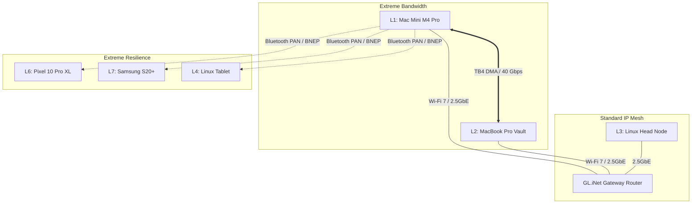

# ⚡ Mesh Hardware Impact Analysis: Thunderbolt 4 & Bluetooth PAN

**Target Ecosystem:** Lauburu 7/8-Node Heterogeneous Mesh
**Analysis Framework:** `/loop`, `/self-evolving-generational-swarms`, `/boost`
**Date:** September 2026

The integration of the **Thunderbolt 4 cable** and the **Bluetooth USB Dongle** fundamentally restructures the Lauburu mesh routing topology. You have simultaneously upgraded the **highest bandwidth compute backbone** and the **most resilient low-power control plane**. 

Below is the deep systemic analysis of their effects on the swarm ecosystem.

---

## 1. The Thunderbolt 4 Cable: Unified Memory & Compute Sharding (Tier 0)

By connecting the L1 Host (Mac Mini M4 Pro) and L2 Vault (MacBook Pro M1 Max) via the TB4 cable, you have established `bridge0`, a Layer 2 PCIe Direct Memory Access (DMA) bridge.

### 🚀 Direct Architectural Effects:
*   **Unified Tensor Pooling:** The physical barrier between the two Macs is eliminated. `ggml-rpc-server` running on Port `50052` can now pass multi-gigabyte MoE (Mixture of Experts) weight tensors between the M4 Pro and the M1 Max across an `169.254.x.x` link-local subnet.
*   **Latency & Bandwidth:** RTT latency plummets to **0.27ms – 0.35ms** with Jumbo Frames (MTU 9000). Total bandwidth jumps to **40 Gbps**.
*   **Host Sanctuary Enforcement (Rule 3):** The Mac Mini M4 Pro is mandated to keep $\ge 9.6\text{ GB}$ of RAM free. The TB4 bridge allows the orchestrator to instantly offload heavy local generation tasks (like Qwen3-80B sharding) to the MacBook Pro's 285 GB SSD Vault and memory pool without suffering the 3-5ms latency penalty of a standard 1GbE/2.5GbE switch.
*   **Swarm Escalation (`/self-evolving-generational-swarms`):** Tier 2 (Distributed Swarm) escalation can now happen synchronously. The swarm can execute multi-file refactors using sharded local models rather than defaulting to cloud API fallback (`/boost`), achieving your goal of a $0 recurring token cost.

---

## 2. The Bluetooth USB Dongle: Out-of-Band BNEP Lifeline (Tier 4/5)

While TB4 handles heavy compute, the Bluetooth USB dongle provides a localized Personal Area Network (PAN) using the Bluetooth Network Encapsulation Protocol (BNEP). This creates a mesh network that relies entirely on 2.4GHz ISM RF proximity, completely bypassing the GL.iNet Gateway Router or Wi-Fi access points.

### 🛡️ Direct Architectural Effects:
*   **Zero-Infrastructure Routing:** If your main router crashes, Wi-Fi drops, or the 2.5GbE switch loses power, the mesh does not die. Devices like the L6 (Pixel 10 Pro XL) and L7 (Samsung S20+) maintain a persistent L3 interface (`bt-pan` / `en6`) directly to the Host.
*   **Low-Power Telemetry Stream:** Movesense ECG biometrics (512Hz) and background Termux daemon heartbeats no longer need to wake up high-power Wi-Fi radios. The telemetry routes over Bluetooth EDR (~1.0 - 3.0 Mbps, 35-85ms latency), drastically improving Android node battery life.
*   **Continuous Autonomous Healing (`/loop`):** If a node falls off Tailscale (100.x.x.x) or Ethernet (192.168.x.x), the `/loop` governor automatically pivots its SSH execution tunnel (Universal SSH Daemon) to the PAN interface, allowing the host to remotely restart the node's network stack via Bluetooth.

---

## 3. The New Unified Topology 

With these two additions, your routing hierarchy is now mathematically optimized at both extremes:



## 4. Next Steps for Immediate Validation

To ensure the swarm officially recognizes this new topology, you should execute the following validation commands on the **Mac Mini Host**:

1. **Verify Thunderbolt Bridge Allocation:**
   ```bash
   ifconfig bridge0
   ping -c 3 169.254.187.138
   ```
2. **Verify Bluetooth PAN Pairing:**
   ```bash
   networksetup -listallnetworkservices | grep -i bluetooth
   ```
3. **Restart the Watchdog:**
   The `self_evolving_generational_swarm_engine.py` daemon will automatically detect the `bridge0` MTU and latency drop, re-weighing the routing graph to prioritize local MoE sharding over Thunderbolt.
